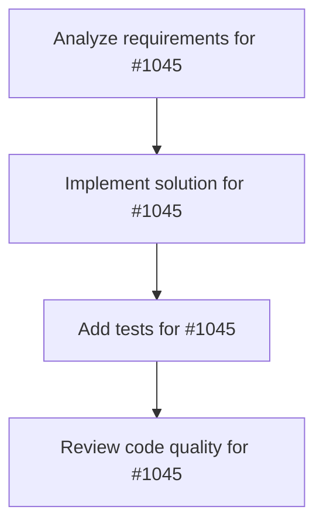

# Plans for Issue #1045

**Title**: 🔌 [Miyabi Console] Rust Backend API Integration

**URL**: https://github.com/customer-cloud/miyabi-private/issues/1045

---

## 📋 Summary

- **Total Tasks**: 4
- **Estimated Duration**: 60 minutes
- **Execution Levels**: 4
- **Has Cycles**: ✅ No

## 📝 Task Breakdown

### 1. Analyze requirements for #1045

- **ID**: `task-1045-analysis`
- **Type**: Docs
- **Assigned Agent**: IssueAgent
- **Priority**: 0
- **Estimated Duration**: 5 min

**Description**: Analyze issue requirements and create detailed specification

### 2. Implement solution for #1045

- **ID**: `task-1045-impl`
- **Type**: Feature
- **Assigned Agent**: CodeGenAgent
- **Priority**: 1
- **Estimated Duration**: 30 min
- **Dependencies**: task-1045-analysis

**Description**: # 🔌 Rust Backend API Integration

## 📋 Overview

Connect Miyabi Console frontend to the Rust backend API (`miyabi-web-api`) to replace mock data with real system data.

## 🎯 Objectives

- Replace mock data in all pages with real API calls
- Implement error handling and retry logic
- Add loading states and error boundaries
- Configure API endpoint management

## 📦 Scope

### Pages to Connect
- ✅ Dashboard Page → `/api/v1/system/metrics`
- ✅ Agents Page → `/api/v1/agents`
- ✅ Database Page → `/api/v1/database`
- ✅ Deployment Page → `/api/v1/deployments`
- ✅ Infrastructure Page → `/api/v1/infrastructure`

### API Client Enhancements
- HTTP client configuration (axios)
- Request/response interceptors
- Error handling middleware
- Retry logic with exponential backoff
- Request timeout configuration
- Response caching

## 🛠️ Implementation Plan

### Phase 1: API Client Setup (1h)
- [ ] Configure axios instance with base URL
- [ ] Add request/response interceptors
- [ ] Implement retry logic
- [ ] Add timeout configuration
- [ ] Create error handler utility

### Phase 2: Dashboard Integration (30m)
- [ ] Replace mock metrics with API call
- [ ] Add loading states
- [ ] Handle API errors gracefully
- [ ] Update real-time refresh logic

### Phase 3: Agents Page Integration (30m)
- [ ] Connect agent list API
- [ ] Implement agent start/stop API calls
- [ ] Add agent metrics API
- [ ] Connect logs API

### Phase 4: Database Integration (30m)
- [ ] Connect database schema API
- [ ] Implement query execution API
- [ ] Add export/import API endpoints

### Phase 5: Other Pages (1h)
- [ ] Deployment page API integration
- [ ] Infrastructure page API integration

### Phase 6: Testing & Error Handling (30m)
- [ ] Test all API endpoints
- [ ] Verify error handling
- [ ] Test retry logic
- [ ] Test timeout scenarios

## ✅ Acceptance Criteria

- [ ] All mock data replaced with real API calls
- [ ] Loading states display during API calls
- [ ] Errors handled gracefully with user-friendly messages
- [ ] Retry logic works for transient failures
- [ ] Request timeout configured (default: 30s)
- [ ] API endpoint configurable via Settings page
- [ ] No console errors during normal operation
- [ ] Build succeeds without errors
- [ ] All pages render data from API

## 📊 Estimated Time

**Total**: 3-4 hours
- API Client Setup: 1h
- Dashboard: 30m
- Agents: 30m
- Database: 30m
- Other Pages: 1h
- Testing: 30m

## 🔗 Related

- Backend API: `crates/miyabi-web-api/`
- Frontend Client: `miyabi-console/src/lib/api/client.ts`
- Settings: `miyabi-console/src/pages/SettingsPage.tsx`

## 📝 Notes

- Enable mock data toggle in Settings for development
- API endpoint: `http://localhost:8080/api/v1`
- Ensure CORS is configured in backend

### 3. Add tests for #1045

- **ID**: `task-1045-test`
- **Type**: Test
- **Assigned Agent**: CodeGenAgent
- **Priority**: 2
- **Estimated Duration**: 15 min
- **Dependencies**: task-1045-impl

**Description**: Create comprehensive test coverage

### 4. Review code quality for #1045

- **ID**: `task-1045-review`
- **Type**: Refactor
- **Assigned Agent**: ReviewAgent
- **Priority**: 3
- **Estimated Duration**: 10 min
- **Dependencies**: task-1045-test

**Description**: Run quality checks and code review

## 🔄 Execution Plan (DAG Levels)

Tasks can be executed in parallel within each level:

### Level 0 (Parallel Execution)

- `task-1045-analysis` - Analyze requirements for #1045

### Level 1 (Parallel Execution)

- `task-1045-impl` - Implement solution for #1045

### Level 2 (Parallel Execution)

- `task-1045-test` - Add tests for #1045

### Level 3 (Parallel Execution)

- `task-1045-review` - Review code quality for #1045

## 📊 Dependency Graph

## ⏱️ Timeline Estimation

- **Sequential Execution**: 60 minutes (1.0 hours)
- **Parallel Execution (Critical Path)**: 10 minutes (0.2 hours)
- **Estimated Speedup**: 6.0x

---

*Generated by CoordinatorAgent on 2025-11-22 05:00:08 UTC*
