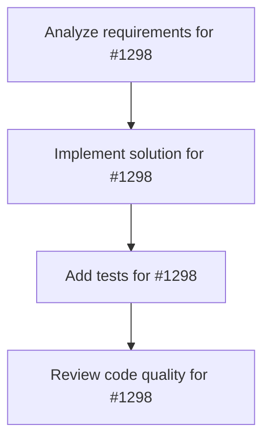

# Plans for Issue #1298

**Title**: feat(api): Implement REST API endpoints for course management

**URL**: https://github.com/ShunsukeHayashi/miyabi-private/issues/1298

---

## 📋 Summary

- **Total Tasks**: 4
- **Estimated Duration**: 60 minutes
- **Execution Levels**: 4
- **Has Cycles**: ✅ No

## 📝 Task Breakdown

### 1. Analyze requirements for #1298

- **ID**: `task-1298-analysis`
- **Type**: Docs
- **Assigned Agent**: IssueAgent
- **Priority**: 0
- **Estimated Duration**: 5 min

**Description**: Analyze issue requirements and create detailed specification

### 2. Implement solution for #1298

- **ID**: `task-1298-impl`
- **Type**: Feature
- **Assigned Agent**: CodeGenAgent
- **Priority**: 1
- **Estimated Duration**: 30 min
- **Dependencies**: task-1298-analysis

**Description**: # Core API Endpoints for Course Management

## Objective
Develop comprehensive REST API endpoints for course management operations in the Miyabi Dashboard, providing full CRUD functionality for courses, lessons, and user progress tracking.

## Priority: P0 Critical
Essential backend API infrastructure required for frontend integration and course management operations.

## Detailed Requirements

### 1. Course Management Endpoints

#### GET /api/courses
- **Purpose**: List all courses with filtering and pagination
- **Query Parameters**:
  - `page` (number, default: 1)
  - `limit` (number, default: 20, max: 100)
  - `status` (string: draft|published|archived)
  - `difficulty` (string: beginner|intermediate|advanced)
  - `category` (UUID)
  - `search` (string, searches title and description)
- **Response**: Paginated course list with metadata
- **Status Codes**: 200, 400 (invalid params), 500

#### GET /api/courses/:courseId
- **Purpose**: Get single course details including lessons
- **Path Parameters**: `courseId` (UUID)
- **Response**: Complete course object with nested lessons
- **Status Codes**: 200, 404 (not found), 500

#### POST /api/courses
- **Purpose**: Create new course
- **Authentication**: Required (instructor/admin role)
- **Request Body**: Course creation payload
- **Validation**: Title required, valid enum values
- **Response**: Created course object
- **Status Codes**: 201, 400 (validation error), 401, 403, 500

#### PUT /api/courses/:courseId
- **Purpose**: Update existing course
- **Authentication**: Required (course owner or admin)
- **Request Body**: Course update payload
- **Response**: Updated course object
- **Status Codes**: 200, 400, 401, 403, 404, 500

#### DELETE /api/courses/:courseId
- **Purpose**: Soft delete course (set status to archived)
- **Authentication**: Required (course owner or admin)
- **Status Codes**: 204, 401, 403, 404, 500

### 2. Lesson Management Endpoints

#### GET /api/courses/:courseId/lessons
- **Purpose**: List lessons for a specific course
- **Path Parameters**: `courseId` (UUID)
- **Query Parameters**: `include_content` (boolean, default: false)
- **Response**: Array of lessons in order
- **Status Codes**: 200, 404, 500

#### GET /api/lessons/:lessonId
- **Purpose**: Get single lesson with full content
- **Path Parameters**: `lessonId` (UUID)
- **Authentication**: Required (enrolled user or instructor)
- **Response**: Complete lesson object
- **Status Codes**: 200, 401, 403, 404, 500

#### POST /api/courses/:courseId/lessons
- **Purpose**: Create new lesson
- **Authentication**: Required (instructor/admin role)
- **Request Body**: Lesson creation payload
- **Response**: Created lesson object
- **Status Codes**: 201, 400, 401, 403, 500

#### PUT /api/lessons/:lessonId
- **Purpose**: Update existing lesson
- **Authentication**: Required (course owner or admin)
- **Response**: Updated lesson object
- **Status Codes**: 200, 400, 401, 403, 404, 500

#### DELETE /api/lessons/:lessonId
- **Purpose**: Delete lesson
- **Authentication**: Required (course owner or admin)
- **Status Codes**: 204, 401, 403, 404, 500

### 3. User Progress Endpoints

#### GET /api/users/:userId/progress
- **Purpose**: Get user's progress across all courses
- **Authentication**: Required (self or admin)
- **Response**: Array of progress objects
- **Status Codes**: 200, 401, 403, 500

#### GET /api/users/:userId/courses/:courseId/progress
- **Purpose**: Get user's progress for specific course
- **Authentication**: Required (self or admin)
- **Response**: Detailed course progress with lesson breakdown
- **Status Codes**: 200, 401, 403, 404, 500

#### POST /api/users/:userId/courses/:courseId/enroll
- **Purpose**: Enroll user in course
- **Authentication**: Required (self or admin)
- **Response**: Enrollment confirmation
- **Status Codes**: 201, 400, 401, 403, 409 (already enrolled), 500

#### PUT /api/users/:userId/lessons/:lessonId/progress
- **Purpose**: Update lesson completion progress
- **Authentication**: Required (self or admin)
- **Request Body**: completion percentage data
- **Response**: Updated progress object
- **Status Codes**: 200, 400, 401, 403, 404, 500

### 4. Assessment Endpoints

#### GET /api/courses/:courseId/assessments
- **Purpose**: List assessments for course
- **Authentication**: Required (enrolled user or instructor)
- **Response**: Array of assessment objects
- **Status Codes**: 200, 401, 403, 404, 500

#### POST /api/assessments/:assessmentId/submit
- **Purpose**: Submit assessment answers
- **Authentication**: Required (enrolled user)
- **Request Body**: Assessment submission payload
- **Response**: Scoring results and feedback
- **Status Codes**: 200, 400, 401, 403, 404, 500

## Implementation Tasks
- [ ] Set up API routing structure with Express.js
- [ ] Implement request/response middleware
- [ ] Create validation schemas with Joi or Zod
- [ ] Implement authentication middleware
- [ ] Create role-based authorization middleware
- [ ] Implement error handling middleware
- [ ] Create database service layer with Prisma
- [ ] Implement caching layer (Redis optional)
- [ ] Add API rate limiting
- [ ] Create comprehensive API tests
- [ ] Generate OpenAPI/Swagger documentation
- [ ] Implement API versioning strategy

## Technical Specifications
- **Framework**: Express.js with TypeScript
- **Validation**: Zod for request/response validation
- **Authentication**: JWT-based with role verification
- **Database**: Prisma ORM with PostgreSQL
- **Error Handling**: Standardized error responses
- **Documentation**: OpenAPI 3.0 specification
- **Testing**: Jest with supertest for API testing

## Error Response Format
```json
{
  "error": {
    "code": "VALIDATION_ERROR",
    "message": "Invalid request data",
    "details": ["title is required"],
    "timestamp": "2025-01-03T06:00:00.000Z"
  }
}
```

## Acceptance Criteria
✅ All CRUD endpoints implemented and tested
✅ Proper authentication and authorization
✅ Input validation on all endpoints
✅ Consistent error handling
✅ API documentation generated
✅ Comprehensive test coverage (>80%)
✅ Performance optimized queries
✅ Rate limiting implemented

## Dependencies
- Issue #1297 (Database Schema) must be completed first
- Existing Miyabi authentication system
- Express.js framework setup

## Estimated Time: 12-16 hours

## Security Considerations
- Input sanitization to prevent SQL injection
- Rate limiting to prevent abuse
- Proper CORS configuration
- Sensitive data filtering in responses
- Audit logging for data modifications

## Related Issues
- Depends on Issue #1297 (Database Schema)
- Enables Issue #1303 (UI Components)
- Required for Issue #1304 (Authentication Integration)

### 3. Add tests for #1298

- **ID**: `task-1298-test`
- **Type**: Test
- **Assigned Agent**: CodeGenAgent
- **Priority**: 2
- **Estimated Duration**: 15 min
- **Dependencies**: task-1298-impl

**Description**: Create comprehensive test coverage

### 4. Review code quality for #1298

- **ID**: `task-1298-review`
- **Type**: Refactor
- **Assigned Agent**: ReviewAgent
- **Priority**: 3
- **Estimated Duration**: 10 min
- **Dependencies**: task-1298-test

**Description**: Run quality checks and code review

## 🔄 Execution Plan (DAG Levels)

Tasks can be executed in parallel within each level:

### Level 0 (Parallel Execution)

- `task-1298-analysis` - Analyze requirements for #1298

### Level 1 (Parallel Execution)

- `task-1298-impl` - Implement solution for #1298

### Level 2 (Parallel Execution)

- `task-1298-test` - Add tests for #1298

### Level 3 (Parallel Execution)

- `task-1298-review` - Review code quality for #1298

## 📊 Dependency Graph



## ⏱️ Timeline Estimation

- **Sequential Execution**: 60 minutes (1.0 hours)
- **Parallel Execution (Critical Path)**: 10 minutes (0.2 hours)
- **Estimated Speedup**: 6.0x

---

*Generated by CoordinatorAgent on 2026-01-06 23:08:40 UTC*
