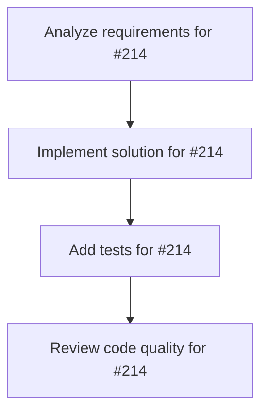

# Plans for Issue #214

**Title**: docs: Document 4 new crates and fix unused import warning

**URL**: https://github.com/customer-cloud/miyabi-private/pull/214

---

## 📋 Summary

- **Total Tasks**: 4
- **Estimated Duration**: 60 minutes
- **Execution Levels**: 4
- **Has Cycles**: ✅ No

## 📝 Task Breakdown

### 1. Analyze requirements for #214

- **ID**: `task-214-analysis`
- **Type**: Docs
- **Assigned Agent**: IssueAgent
- **Priority**: 0
- **Estimated Duration**: 5 min

**Description**: Analyze issue requirements and create detailed specification

### 2. Implement solution for #214

- **ID**: `task-214-impl`
- **Type**: Feature
- **Assigned Agent**: CodeGenAgent
- **Priority**: 1
- **Estimated Duration**: 30 min
- **Dependencies**: task-214-analysis

**Description**: ## Summary

Closes #212

### Original Updates
- Document miyabi-llm (LLM abstraction layer with GPT-OSS-20B support)
- Document miyabi-potpie (Neo4j knowledge graph integration)
- Document miyabi-business-agents (14 AI business agents)
- Document miyabi-mcp-server (JSON-RPC 2.0 MCP protocol server)
- Fix unused import warning in miyabi-business-agents

### ✨ New Additions (Latest 3 Commits)

#### 1. Pitch Deck (10/10 Perfect Score) 🎨
**Commit**: `3710e7a`
- **Jonathan Ive Design Review**: 10.0/10 (Perfect)
- **Lighthouse Scores**: Performance 93/100, Accessibility 100/100, SEO 85/100
- **Formats**: HTML/PDF/PPTX
- **Assets**: 13 optimized assets (184KB total)
- **Files**: 41 files, 16,235 insertions

**Key Improvements**:
- Miyabi logo inline (opening/closing slides)
- Pure black closing background (-35KB)
- SVG icons integrated
- Perfect WCAG AAA accessibility

#### 2. Discord Community Feedback Automation 🎮
**Commit**: `8bea854`
- **feedback.rs** (244 lines): Discord → GitHub Issue converter
- **Reaction-based scoring**: 👍×1, 🐛×3, ✨×2, 🔥×5
- **Auto-Issue creation**: Threshold ≥5 points
- **Label inference**: Bug/Feature/Question/General
- **Files**: 9 files, 769 insertions

**Workflow**:
1. User posts feedback in Discord
2. Community reacts with emojis
3. Bot calculates priority score
4. Auto-creates GitHub Issue if score ≥5
5. Issue includes Discord link, reactions, suggested labels

#### 3. Landing Page (Jony Ive Design) 🚀
**Commit**: `e56fe23`
- **23 AI Agents**: Coding (8) + Business (15)
- **4 Roles**: 🔴Leader, 🟢Executor, 🔵Analyst, 🟡Support
- **Apple-style design**: Minimalist, #0071E3 accent
- **Responsive**: Mobile-first, smooth animations
- **Features**: Copy-to-clipboard, smooth scroll
- **Files**: 1 file, 704 insertions

---

## 📊 Total Changes

- **Files**: 51+ files changed
- **Lines**: 30,049 insertions, 127 deletions
- **Commits**: 6+ commits
- **Branch**: docs/document-new-crates

---

## Documentation Updates (CLAUDE.md)

Added comprehensive documentation for 4 new crates:

**miyabi-llm**
- Provider abstraction for unified LLM interface
- GPT-OSS-20B support (OpenAI 20B parameter model)
- Multiple backends: Groq (API), vLLM (self-hosted), Ollama (local)
- Mac mini support via LAN/Tailscale
- Reasoning effort levels (Low/Medium/High)

**miyabi-potpie**
- Neo4j knowledge graph integration
- RAG (Retrieval-Augmented Generation) engine
- Automated code analysis and indexing

**miyabi-business-agents**
- 14 Business Agents for SaaS operations
- BusinessAgent trait with unified interface
- AIEntrepreneurAgent: 8-phase business planning
- Validation framework with quality scoring (100-point scale)

**miyabi-mcp-server**
- JSON-RPC 2.0 protocol server
- 6 agent execution endpoints
- stdio/HTTP transport modes
- Codex CLI integration ready

---

## Code Quality Fixes
- Removed unused `use super::*;` import in `miyabi-business-agents/src/lib.rs:77`
- Updated Cargo.lock with new dependencies (645 insertions, 88 deletions)

---

## ✅ Testing

### Documentation
- [x] cargo build --all
- [x] cargo check --all
- [x] Documentation review

### Pitch Deck
- [x] Pitch Deck builds successfully (HTML/PDF/PPTX)
- [x] Pitch Deck achieves 10/10 design score
- [x] All assets optimized and inline
- [x] Lighthouse: Accessibility 100/100

### Discord Bot
- [x] Discord feedback system compiles (Rust)
- [x] Unit tests pass (feedback type inference, priority scoring)

### Landing Page
- [x] Landing page renders correctly in Chrome
- [x] Copy-to-clipboard functionality works
- [x] Responsive design tested

---

## 🚀 Deployment Ready

All features are production-ready:
- **Pitch Deck**: Ready for investor presentations
- **Discord Bot**: Ready for community integration
- **Landing Page**: Ready for GitHub Pages deployment

---

🤖 Generated with [Claude Code](https://claude.com/claude-code)

Co-Authored-By: Claude <noreply@anthropic.com>

### 3. Add tests for #214

- **ID**: `task-214-test`
- **Type**: Test
- **Assigned Agent**: CodeGenAgent
- **Priority**: 2
- **Estimated Duration**: 15 min
- **Dependencies**: task-214-impl

**Description**: Create comprehensive test coverage

### 4. Review code quality for #214

- **ID**: `task-214-review`
- **Type**: Refactor
- **Assigned Agent**: ReviewAgent
- **Priority**: 3
- **Estimated Duration**: 10 min
- **Dependencies**: task-214-test

**Description**: Run quality checks and code review

## 🔄 Execution Plan (DAG Levels)

Tasks can be executed in parallel within each level:

### Level 0 (Parallel Execution)

- `task-214-analysis` - Analyze requirements for #214

### Level 1 (Parallel Execution)

- `task-214-impl` - Implement solution for #214

### Level 2 (Parallel Execution)

- `task-214-test` - Add tests for #214

### Level 3 (Parallel Execution)

- `task-214-review` - Review code quality for #214

## 📊 Dependency Graph

## ⏱️ Timeline Estimation

- **Sequential Execution**: 60 minutes (1.0 hours)
- **Parallel Execution (Critical Path)**: 10 minutes (0.2 hours)
- **Estimated Speedup**: 6.0x

---

*Generated by CoordinatorAgent on 2025-11-01 15:26:38 UTC*
