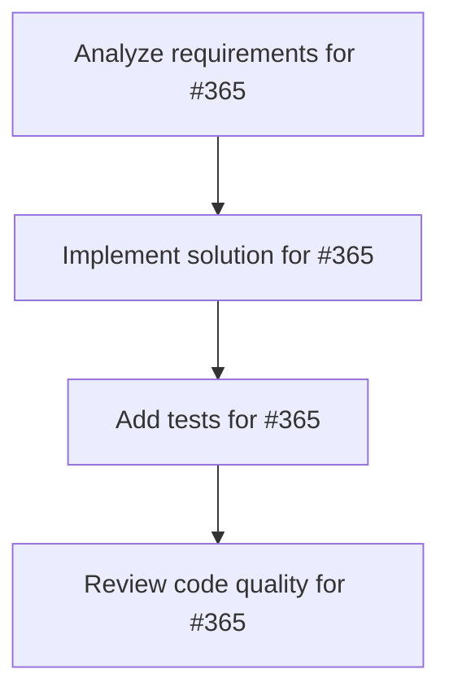

# Plans for Issue #365

**Title**: 💳 Phase 4: Stripe決済統合 - オンライン/オフライン決済フロー実装

**URL**: https://github.com/customer-cloud/miyabi-private/issues/365

---

## 📋 Summary

- **Total Tasks**: 4
- **Estimated Duration**: 60 minutes
- **Execution Levels**: 4
- **Has Cycles**: ✅ No

## 📝 Task Breakdown

### 1. Analyze requirements for #365

- **ID**: `task-365-analysis`
- **Type**: Docs
- **Assigned Agent**: IssueAgent
- **Priority**: 0
- **Estimated Duration**: 5 min

**Description**: Analyze issue requirements and create detailed specification

### 2. Implement solution for #365

- **ID**: `task-365-impl`
- **Type**: Deployment
- **Assigned Agent**: CodeGenAgent
- **Priority**: 1
- **Estimated Duration**: 30 min
- **Dependencies**: task-365-analysis

**Description**: ## 📋 概要

BytePlus Video API BootcampランディングページにStripe Checkout決済を統合し、オンライン（¥29,800）/オフライン（¥39,800）の決済フローを実装します。

**親Issue**: #361
**マイルストーン**: Milestone 32
**依存**: #362, #363

---

## 🎯 目標

Stripe Checkoutで2つの料金プランの決済を実装

---

## ✅ タスク

### Task 4.1: Stripe Account設定

1. Stripeアカウント作成
2. Publishable Key取得
3. 2つのPrice Object作成：
   - オンライン参加: ¥29,800
   - オフライン参加: ¥39,800

### Task 4.2: script.js修正

**実装箇所**: `script.js` L300付近

```javascript
const stripe = Stripe('pk_test_XXXXXXXXXX'); // Publishable Key

async function handleFormSubmit(formData) {
    const priceId = formData.plan === 'online' 
        ? 'price_online_XXXXXXXXXX'
        : 'price_offline_XXXXXXXXXX';

    const { error } = await stripe.redirectToCheckout({
        lineItems: [{ price: priceId, quantity: 1 }],
        mode: 'payment',
        successUrl: window.location.origin + '/success.html',
        cancelUrl: window.location.origin + '/cancel.html',
        customerEmail: formData.email
    });

    if (error) {
        console.error('Stripe error:', error);
    }
}
```

### Task 4.3: Success/Cancelページ作成

- [ ] `success.html` - 決済完了ページ
- [ ] `cancel.html` - 決済キャンセルページ

---

## 📦 成果物

- [ ] Stripe統合完了
- [ ] テスト決済が成功する
- [ ] Success/Cancelページ実装
- [ ] エラーハンドリング実装

---

## ⏱️ 推定工数

**6時間** - Stripe設定 + 実装 + テスト

---

🤖 Generated with [Claude Code](https://claude.com/claude-code)

### 3. Add tests for #365

- **ID**: `task-365-test`
- **Type**: Test
- **Assigned Agent**: CodeGenAgent
- **Priority**: 2
- **Estimated Duration**: 15 min
- **Dependencies**: task-365-impl

**Description**: Create comprehensive test coverage

### 4. Review code quality for #365

- **ID**: `task-365-review`
- **Type**: Refactor
- **Assigned Agent**: ReviewAgent
- **Priority**: 3
- **Estimated Duration**: 10 min
- **Dependencies**: task-365-test

**Description**: Run quality checks and code review

## 🔄 Execution Plan (DAG Levels)

Tasks can be executed in parallel within each level:

### Level 0 (Parallel Execution)

- `task-365-analysis` - Analyze requirements for #365

### Level 1 (Parallel Execution)

- `task-365-impl` - Implement solution for #365

### Level 2 (Parallel Execution)

- `task-365-test` - Add tests for #365

### Level 3 (Parallel Execution)

- `task-365-review` - Review code quality for #365

## 📊 Dependency Graph



## ⏱️ Timeline Estimation

- **Sequential Execution**: 60 minutes (1.0 hours)
- **Parallel Execution (Critical Path)**: 10 minutes (0.2 hours)
- **Estimated Speedup**: 6.0x

---

*Generated by CoordinatorAgent on 2025-10-30 17:47:00 UTC*
