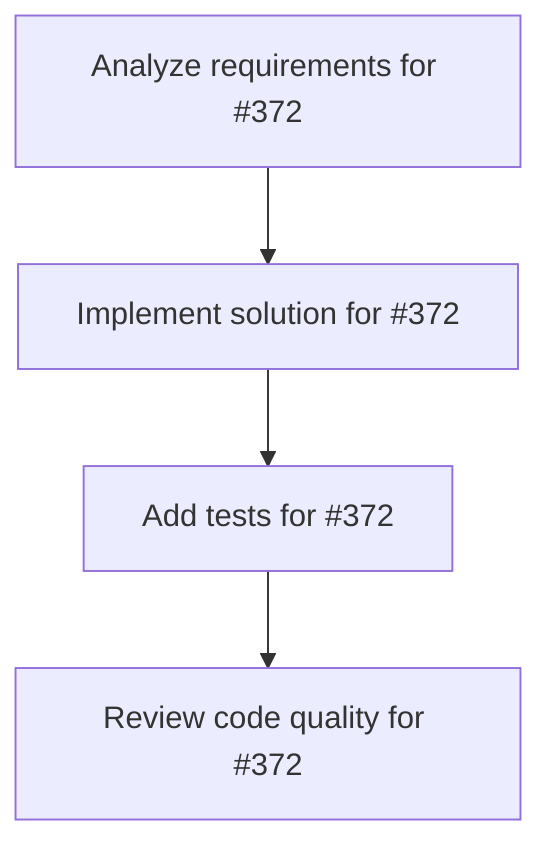

# Plans for Issue #372

**Title**: 🧪 Phase 6: A/Bテスト実装 - CVR最適化のための3つのテスト

**URL**: https://github.com/customer-cloud/miyabi-private/issues/372

---

## 📋 Summary

- **Total Tasks**: 4
- **Estimated Duration**: 60 minutes
- **Execution Levels**: 4
- **Has Cycles**: ✅ No

## 📝 Task Breakdown

### 1. Analyze requirements for #372

- **ID**: `task-372-analysis`
- **Type**: Docs
- **Assigned Agent**: IssueAgent
- **Priority**: 0
- **Estimated Duration**: 5 min

**Description**: Analyze issue requirements and create detailed specification

### 2. Implement solution for #372

- **ID**: `task-372-impl`
- **Type**: Feature
- **Assigned Agent**: CodeGenAgent
- **Priority**: 1
- **Estimated Duration**: 30 min
- **Dependencies**: task-372-analysis

**Description**: ## 📋 概要

BytePlus Video API BootcampランディングページにA/Bテストを実装し、CVRを最適化します。

**親Issue**: #361
**マイルストーン**: Milestone 32
**依存**: #362, #364 (GA4統合)

---

## 🎯 目標

3つのA/Bテストを実施し、CVR向上を図る

---

## ✅ テスト項目

### Test 1: ヘッドラインコピー

- **Variant A**: "3時間で習得 次世代動画生成API実装完全マスター"
- **Variant B**: "動画制作コストを70%削減 3時間で学ぶAPI実装"

### Test 2: CTAボタンカラー

- **Variant A**: オレンジ（#FF6B00）
- **Variant B**: ダークレッド（#E55E00）

### Test 3: 料金表示順序

- **Variant A**: オンライン → オフライン
- **Variant B**: オフライン → オンライン

---

## 🛠️ 実装

### script.js修正

```javascript
function initABTesting() {
    const variant = Math.random() < 0.5 ? 'A' : 'B';
    sessionStorage.setItem('ab_variant', variant);

    if (variant === 'B') {
        document.querySelector('.hero-title-large').textContent = 
            '動画制作コストを70%削減 3時間で学ぶAPI実装';
        document.querySelector('.cta-button').style.background = '#E55E00';
    }

    gtag('event', 'experiment_impression', {
        experiment_id: 'headline_test',
        variant_id: variant
    });
}
```

---

## 📊 成功基準

- [ ] A/Bテストが正常に動作
- [ ] GA4でバリアント計測
- [ ] CVRの有意差確認（1000サンプル以上）

---

## ⏱️ 推定工数

**4時間** - 実装 + GA4統合

---

🤖 Generated with [Claude Code](https://claude.com/claude-code)

### 3. Add tests for #372

- **ID**: `task-372-test`
- **Type**: Test
- **Assigned Agent**: CodeGenAgent
- **Priority**: 2
- **Estimated Duration**: 15 min
- **Dependencies**: task-372-impl

**Description**: Create comprehensive test coverage

### 4. Review code quality for #372

- **ID**: `task-372-review`
- **Type**: Refactor
- **Assigned Agent**: ReviewAgent
- **Priority**: 3
- **Estimated Duration**: 10 min
- **Dependencies**: task-372-test

**Description**: Run quality checks and code review

## 🔄 Execution Plan (DAG Levels)

Tasks can be executed in parallel within each level:

### Level 0 (Parallel Execution)

- `task-372-analysis` - Analyze requirements for #372

### Level 1 (Parallel Execution)

- `task-372-impl` - Implement solution for #372

### Level 2 (Parallel Execution)

- `task-372-test` - Add tests for #372

### Level 3 (Parallel Execution)

- `task-372-review` - Review code quality for #372

## 📊 Dependency Graph



## ⏱️ Timeline Estimation

- **Sequential Execution**: 60 minutes (1.0 hours)
- **Parallel Execution (Critical Path)**: 10 minutes (0.2 hours)
- **Estimated Speedup**: 6.0x

---

*Generated by CoordinatorAgent on 2025-10-30 17:47:08 UTC*
