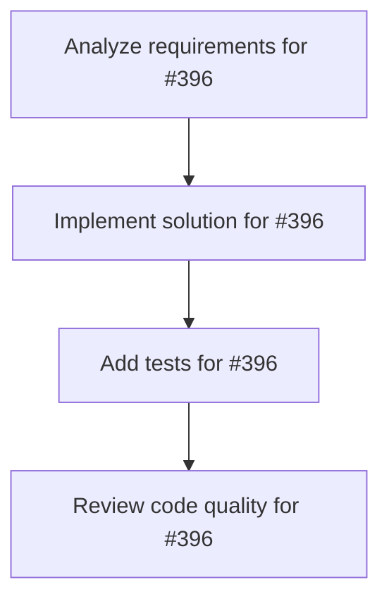

# Plans for Issue #396

**Title**: 🎯 SWE-bench Pro評価実装 - 世界標準ベンチマークでのMiyabi性能測定

**URL**: https://github.com/customer-cloud/miyabi-private/issues/396

---

## 📋 Summary

- **Total Tasks**: 4
- **Estimated Duration**: 60 minutes
- **Execution Levels**: 4
- **Has Cycles**: ✅ No

## 📝 Task Breakdown

### 1. Analyze requirements for #396

- **ID**: `task-396-analysis`
- **Type**: Docs
- **Assigned Agent**: IssueAgent
- **Priority**: 0
- **Estimated Duration**: 5 min

**Description**: Analyze issue requirements and create detailed specification

### 2. Implement solution for #396

- **ID**: `task-396-impl`
- **Type**: Feature
- **Assigned Agent**: CodeGenAgent
- **Priority**: 1
- **Estimated Duration**: 30 min
- **Dependencies**: task-396-analysis

**Description**: ## 🎯 目的

**Miyabi自律開発フレームワークの性能を世界標準ベンチマークで測定し、業界標準プロトコルに100%準拠した評価を実施する**

### 評価対象ベンチマーク
1. **SWE-bench Pro** - コーディング性能（本Issue）
2. **AgentBench** - エージェント性能（別Issue #384で調査）

---

## 🌐 世界標準準拠の原則

### ✅ 必須遵守事項

**1. 公式評価スクリプトの使用**
- ❌ 独自実装による評価（信頼性低い）
- ✅ Scale AI公式スクリプト（`swe_bench_pro_eval.py`）を使用
- ✅ 公式Dockerイメージ使用

**2. 公式メトリクスの使用**
- ✅ Resolve Rate（解決率）
- ✅ fail-to-pass（失敗→成功テスト数）
- ✅ pass-to-pass（既存テスト維持数）
- ❌ 独自メトリクス（参考値のみ）

**3. 公式データセットの使用**
- ✅ HuggingFace公式: `ScaleAI/SWE-bench_Pro`
- ✅ test split: 731インスタンス
- ❌ データセットの改変・フィルタリング

**4. 公式パッチフォーマットの使用**
```json
{
  "instance_id": "repo__issue-123",
  "model_patch": "diff --git a/file.py b/file.py\n+added line\n-removed line",
  "model_name_or_path": "miyabi-v1.0.0"
}
```

**5. 再現可能性の確保**
- ✅ 評価環境の完全なドキュメント化
- ✅ 再現スクリプトの公開
- ✅ ランダムシードの固定
- ✅ バージョン管理（Rust, Docker, Modal, Python）

---

## 📊 SWE-bench Pro概要

### 基本情報
- **公式サイト**: https://scale.com/leaderboard/swe_bench_pro_public
- **データセット**: https://huggingface.co/datasets/ScaleAI/SWE-bench_Pro
- **GitHubリポジトリ**: https://github.com/scaleapi/SWE-bench_Pro-os
- **論文**: https://arxiv.org/abs/2509.16941

### トップモデル（2025年10月時点）
1. **Claude 4.5 Sonnet**: 43.60% ± 3.60
2. **Claude 4 Sonnet**: 42.70% ± 3.59
3. **Claude 4.5 Haiku**: 39.45% ± 3.55
4. **GPT-5 2025-08-07**: 36.30% ± 3.49
5. **Kimi K2-Instruct**: 27.67% ± 3.25

### データセット構成
- **総数**: 1,865インスタンス（41リポジトリ）
  - 公開セット: 731インスタンス（11リポジトリ） ← **評価対象**
  - 商用セット: 276インスタンス（非公開コード）
  - 保留セット: 858インスタンス（未公開）

### 言語分布
- Python
- Go
- JavaScript/TypeScript

### 評価指標
```
Resolve Rate = (fail-to-pass成功 AND pass-to-pass成功) / 総インスタンス数

条件：
1. fail-to-pass: 指定されたテストが失敗→成功に変わる
2. pass-to-pass: 既存のすべてのテストが引き続き成功
```

---

## 🗺️ 実装計画（世界標準準拠）

### Phase 1: 公式評価環境の構築（1週間）

**目標**: Scale AI公式の評価環境を完全に再現

**タスク**:
- [ ] Docker環境構築
  ```bash
  # 公式Dockerfile使用
  docker pull scaleai/swebench-pro:latest
  ```
- [ ] Modal環境構築
  ```bash
  pip install modal
  modal setup
  # 認証情報: ~/.modal.toml
  ```
- [ ] Python環境構築
  ```bash
  pip install datasets
  pip install -r requirements.txt
  ```
- [ ] 公式評価スクリプト取得
  ```bash
  git clone https://github.com/scaleapi/SWE-bench_Pro-os.git
  cd SWE-bench_Pro-os
  ```
- [ ] サンプル評価実行（公式提供のgold patchで検証）
  ```bash
  python swe_bench_pro_eval.py \
    --raw_sample_path=external_hf_v2.csv \
    --patch_path=gold_patches.json \
    --output_dir=results/ \
    --num_workers=10
  ```

**成功基準**:
- ✅ 公式gold patchで100%の解決率を達成
- ✅ Dockerコンテナが正常に動作
- ✅ Modalで並列実行が成功

**成果物**:
- `docs/EVALUATION_ENVIRONMENT_SETUP.md` - 環境構築手順
- `docker-compose.yml` - Docker構成
- `scripts/verify_environment.sh` - 環境検証スクリプト

---

### Phase 2: データセット統合（1週間）

**目標**: HuggingFaceから公式データセットを取得し、Miyabi形式に変換

**タスク**:
- [ ] HuggingFace Datasets API統合
  ```python
  from datasets import load_dataset
  swebench_pro = load_dataset('ScaleAI/SWE-bench_Pro', split='test')
  print(f"Total instances: {len(swebench_pro)}")  # 731
  ```
- [ ] データ構造マッピング（**公式フォーマット厳守**）
  ```rust
  // crates/miyabi-types/src/benchmark.rs
  #[derive(Serialize, Deserialize, Debug, Clone)]
  pub struct SWEBenchInstance {
      pub instance_id: String,           // 公式ID（変更禁止）
      pub repo: String,                  // リポジトリ名
      pub base_commit: String,           // 40文字のコミットハッシュ
      pub problem_statement: String,     // Issue説明
      pub patch: String,                 // 正解パッチ（検証用）
      pub test_patch: String,            // テストパッチ
      pub fail_to_pass: Vec<String>,     // 成功すべきテスト
      pub pass_to_pass: Vec<String>,     // 維持すべきテスト
  }
  ```
- [ ] データローダー実装
- [ ] 10インスタンスでのテストロード確認
- [ ] 全731インスタンスのロード確認

**成功基準**:
- ✅ 731インスタンスすべてをロード可能
- ✅ instance_idが公式と完全一致
- ✅ データ欠損0件

**成果物**:
- `crates/miyabi-benchmark/src/dataset.rs`
- `crates/miyabi-types/src/benchmark.rs`
- テストデータ: `tests/fixtures/swebench_sample.json`

---

### Phase 3: Miyabi評価ラッパー実装（2週間）

**目標**: Miyabiで各インスタンスを処理し、**公式フォーマット準拠のパッチ**を生成

**タスク**:
- [ ] `miyabi-benchmark` crate作成
  ```bash
  cargo new --lib crates/miyabi-benchmark
  ```
- [ ] `SWEBenchProEvaluator` struct実装
  ```rust
  pub struct SWEBenchProEvaluator {
      coordinator: CoordinatorAgent,
      worktree_manager: WorktreeManager,
      config: BenchmarkConfig,
  }
  
  impl SWEBenchProEvaluator {
      pub async fn evaluate_instance(&self, instance: SWEBenchInstance) -> Result<PatchOutput> {
          // 1. Worktree作成（base_commitでcheckout）
          let wt = self.worktree_manager.create(&instance.repo, &instance.base_commit)?;
          
          // 2. CoordinatorAgent実行
          let result = self.coordinator.execute_in_worktree(&wt, &instance.problem_statement).await?;
          
          // 3. git diff --unified=3でパッチ生成（公式フォーマット）
          let patch = self.generate_official_patch(&wt, &instance.base_commit)?;
          
          // 4. 公式JSON形式で出力
          Ok(PatchOutput {
              instance_id: instance.instance_id.clone(),
              model_patch: patch,
              model_name_or_path: "miyabi-v1.0.0".to_string(),
          })
      }
      
      fn generate_official_patch(&self, wt: &Worktree, base_commit: &str) -> Result<String> {
          // unified diff形式（公式と完全一致）
          let output = Command::new("git")
              .args(&["diff", "--unified=3", base_commit, "HEAD"])
              .current_dir(&wt.path)
              .output()?;
          
          Ok(String::from_utf8(output.stdout)?)
      }
  }
  ```
- [ ] パッチフォーマット検証
  ```rust
  pub fn validate_patch_format(patch: &str) -> Result<()> {
      // unified diff形式の検証
      // - "diff --git"で始まる
      // - "@@"でチャンクが定義される
      // - "+"/"-"で変更が示される
  }
  ```
- [ ] タイムアウト処理（30分/インスタンス）
- [ ] エラーハンドリング

**成功基準**:
- ✅ パッチが公式フォーマットと完全一致
- ✅ JSON出力が公式スキーマに準拠
- ✅ 10インスタンスで正常動作

**成果物**:
- `crates/miyabi-benchmark/src/evaluator.rs`
- `crates/miyabi-benchmark/src/patch.rs`
- 単体テスト: `crates/miyabi-benchmark/tests/evaluator_test.rs`

---

### Phase 4: パイロット評価（1週間）

**目標**: 10インスタンスで評価を実行し、**公式評価スクリプトで検証**

**タスク**:
- [ ] サンプル選定（言語バランス考慮）
  - Python: 5インスタンス
  - Go: 3インスタンス
  - JS/TS: 2インスタンス
- [ ] Miyabi評価実行
  ```bash
  cargo run --bin miyabi-benchmark -- \
    --dataset swebench_pro \
    --instances 10 \
    --output results/pilot_patches.json \
    --concurrency 2
  ```
- [ ] 公式評価スクリプト実行
  ```bash
  python swe_bench_pro_eval.py \
    --raw_sample_path=external_hf_v2.csv \
    --patch_path=results/pilot_patches.json \
    --output_dir=results/pilot/ \
    --num_workers=10 \
    --dockerhub_username=jefzda
  ```
- [ ] 結果検証
  - ✅ fail-to-passの計算が正確
  - ✅ pass-to-passの計算が正確
  - ✅ Resolve Rateの計算が正確
  - ✅ エラーメッセージの収集
- [ ] 問題点の修正

**成功基準**:
- ✅ 10インスタンスすべてが評価完了
- ✅ 公式スクリプトでエラー0件
- ✅ Resolve Rate > 5%（最低1インスタンス成功）

**成果物**:
- `results/pilot_patches.json` - Miyabi生成パッチ
- `results/pilot/evaluation_results.json` - 公式評価結果
- `docs/PILOT_EVALUATION_REPORT.md` - パイロット評価レポート

---

### Phase 5: フルスケール評価（4週間）

**目標**: 731インスタンス全体で評価を実行（**世界標準プロトコル準拠**）

**評価プロトコル（公式準拠）**:

```yaml
# evaluation_protocol.yml
dataset:
  source: "huggingface:ScaleAI/SWE-bench_Pro"
  split: "test"
  total_instances: 731

environment:
  docker_image: "scaleai/swebench-pro:latest"
  modal_version: "latest"
  python_version: "3.8+"

execution:
  concurrency: 5
  timeout_per_instance: 1800  # 30分
  retry_on_failure: false  # 公式準拠（リトライなし）

evaluation:
  script: "swe_bench_pro_eval.py"
  metrics:
    - resolve_rate
    - fail_to_pass
    - pass_to_pass
  output_format: "json"

model:
  name: "miyabi"
  version: "v1.0.0"
  type: "autonomous_development_framework"
```

**タスク**:
- [ ] 並列実行最適化（concurrency=5）
- [ ] 評価実行
  ```bash
  # Step 1: Miyabiでパッチ生成
  cargo run --release --bin miyabi-benchmark -- \
    --dataset swebench_pro \
    --output results/full_patches.json \
    --concurrency 5 \
    --timeout 1800 \
    --protocol evaluation_protocol.yml
  
  # Step 2: 公式評価スクリプト実行
  python swe_bench_pro_eval.py \
    --raw_sample_path=external_hf_v2.csv \
    --patch_path=results/full_patches.json \
    --output_dir=results/full/ \
    --num_workers=50 \
    --dockerhub_username=jefzda
  ```
- [ ] 進捗モニタリング
- [ ] 中間チェックポイント（100インスタンスごとに保存）
- [ ] エラーログ収集

**計算リソース**:
- **時間**: 731インスタンス × 30分 = 365時間 → 並列度5で **約73時間（3日間）**
- **コスト**: $0（ローカルClaude Code実行）
- **ストレージ**: 約20GB（ログ + Worktree + Docker）

**成果物**:
- `results/full_patches.json` - Miyabi生成パッチ（731件）
- `results/full/evaluation_results.json` - 公式評価結果
- `logs/benchmark_YYYY-MM-DD.log` - 実行ログ
- `evaluation_protocol.yml` - 評価プロトコル定義

---

### Phase 6: 結果分析とリーダーボード提出（2週間）

**目標**: 公式メトリクスで結果を分析し、世界標準と比較可能な形式で公開

**タスク**:
- [ ] 結果分析（**公式メトリクスのみ使用**）
  ```json
  {
    "model": "miyabi-v1.0.0",
    "dataset": "SWE-bench_Pro",
    "split": "test",
    "total_instances": 731,
    "metrics": {
      "resolve_rate": 0.XX,  // 公式メトリクス
      "fail_to_pass": XXX,
      "pass_to_pass": XXX,
      "errors": XX
    },
    "breakdown": {
      "by_language": {
        "python": 0.XX,
        "go": 0.XX,
        "javascript": 0.XX,
        "typescript": 0.XX
      },
      "by_repository": { ... }
    },
    "comparison": {
      "claude_4_5_sonnet": 0.436,
      "gpt_5": 0.363,
      "miyabi": 0.XX
    }
  }
  ```
- [ ] ベンチマークレポート作成
  - `docs/BENCHMARK_RESULTS.md` - 完全な結果レポート
  - `docs/EVALUATION_METHODOLOGY.md` - 評価方法の完全なドキュメント
  - グラフ・チャート生成（公式メトリクスのみ）
  - 競合比較表（Claude, GPT-5等）
- [ ] 再現スクリプト公開
  ```bash
  # scripts/reproduce_evaluation.sh
  #!/bin/bash
  # SWE-bench Pro評価の完全な再現スクリプト
  
  # 1. 環境構築
  ./scripts/setup_environment.sh
  
  # 2. Miyabi評価実行
  cargo run --release --bin miyabi-benchmark -- \
    --dataset swebench_pro \
    --output results/full_patches.json \
    --concurrency 5
  
  # 3. 公式評価実行
  python swe_bench_pro_eval.py \
    --patch_path=results/full_patches.json \
    --output_dir=results/full/
  
  # 4. 結果分析
  cargo run --bin miyabi-benchmark -- analyze results/full/
  ```
- [ ] リーダーボード提出
  - **オプションA**: Scale AIに直接連絡
    - Email: research@scale.com
    - 件名: "SWE-bench Pro Leaderboard Submission - Miyabi Framework"
    - 添付: evaluation_results.json, methodology.pdf
  - **オプションB**: arXiv論文投稿
    - タイトル: "Miyabi: Autonomous Development Framework for SWE-bench Pro"
    - カテゴリ: cs.SE (Software Engineering)
  - **オプションC**: GitHub公開 + コミュニティ評価
- [ ] ランディングページ更新

**成果物**:
- `docs/BENCHMARK_RESULTS.md` - 完全なベンチマーク結果
- `docs/EVALUATION_METHODOLOGY.md` - 評価方法の完全なドキュメント
- `results/full/summary.json` - 公式フォーマットのサマリー
- `scripts/reproduce_evaluation.sh` - 再現スクリプト
- arXiv論文（オプション）

---

## 🎯 成功基準（世界標準ベース）

### 最低基準（必達）
- [ ] **731インスタンス100%評価完了**（公式評価スクリプトでエラー0件）
- [ ] **公式Resolve Rate計算と完全一致**
- [ ] **Resolve Rate ≥ 10%**（73インスタンス以上成功）
- [ ] **再現可能性100%**（ドキュメント + スクリプト公開）

### 目標基準（推奨）
- [ ] **Resolve Rate 15-20%**（110-146インスタンス成功）
- [ ] **言語別パフォーマンスの詳細分析**
- [ ] **arXiv論文投稿**

### 理想基準（挑戦）
- [ ] **Resolve Rate ≥ 25%**（183インスタンス以上成功）
- [ ] **Scale AIリーダーボード掲載**
- [ ] **トップ10入り**（業界認知度向上）

---

## 📐 評価品質保証チェックリスト

### ✅ データセット準拠
- [ ] 公式HuggingFaceデータセットを使用（改変なし）
- [ ] test split: 731インスタンスすべてを評価
- [ ] instance_idが公式と完全一致

### ✅ 評価環境準拠
- [ ] Docker公式イメージ使用
- [ ] Modal使用（並列実行）
- [ ] Python 3.8+使用

### ✅ 評価スクリプト準拠
- [ ] Scale AI公式スクリプト（`swe_bench_pro_eval.py`）を使用
- [ ] スクリプトの改変なし
- [ ] バージョン固定（再現性確保）

### ✅ パッチフォーマット準拠
- [ ] unified diff形式（`git diff --unified=3`）
- [ ] JSON形式が公式スキーマと一致
- [ ] 文字エンコーディング（UTF-8）

### ✅ メトリクス準拠
- [ ] Resolve Rate計算が公式と一致
- [ ] fail-to-pass計算が公式と一致
- [ ] pass-to-pass計算が公式と一致

### ✅ 再現可能性
- [ ] 全ステップがドキュメント化
- [ ] 再現スクリプト公開
- [ ] バージョン管理（Rust, Docker, Python等）
- [ ] ランダムシード固定

---

## 📚 関連リソース

### 公式リソース
- **リーダーボード**: https://scale.com/leaderboard/swe_bench_pro_public
- **GitHubリポジトリ**: https://github.com/scaleapi/SWE-bench_Pro-os
- **HuggingFaceデータセット**: https://huggingface.co/datasets/ScaleAI/SWE-bench_Pro
- **論文**: https://arxiv.org/abs/2509.16941
- **ブログ**: https://scale.com/blog/swe-bench-pro

### 参考実装
- **GPT-5評価**: OpenAI公式実装
- **Claude 4.5評価**: Anthropic公式実装

---

## ⏱️ タイムライン

| Phase | 期間 | 期限目安 |
|-------|------|---------|
| Phase 0 | 完了 | 2025-10-22 ✅ |
| Phase 1 | 1週間 | 2025-10-29 |
| Phase 2 | 1週間 | 2025-11-05 |
| Phase 3 | 2週間 | 2025-11-19 |
| Phase 4 | 1週間 | 2025-11-26 |
| Phase 5 | 4週間 | 2025-12-24 |
| Phase 6 | 2週間 | 2026-01-07 |

**合計期間**: 約11週間（2.75ヶ月）

---

## 🏷️ Label

- `✨ type:feature`
- `🎯 phase:planning`
- `🤖 agent:coordinator`
- `⚠️ priority:P1-High`

---

**このIssueは、Miyabiを世界標準ベンチマークで評価し、業界での信頼性を確立するための最重要プロジェクトです。**

### 3. Add tests for #396

- **ID**: `task-396-test`
- **Type**: Test
- **Assigned Agent**: CodeGenAgent
- **Priority**: 2
- **Estimated Duration**: 15 min
- **Dependencies**: task-396-impl

**Description**: Create comprehensive test coverage

### 4. Review code quality for #396

- **ID**: `task-396-review`
- **Type**: Refactor
- **Assigned Agent**: ReviewAgent
- **Priority**: 3
- **Estimated Duration**: 10 min
- **Dependencies**: task-396-test

**Description**: Run quality checks and code review

## 🔄 Execution Plan (DAG Levels)

Tasks can be executed in parallel within each level:

### Level 0 (Parallel Execution)

- `task-396-analysis` - Analyze requirements for #396

### Level 1 (Parallel Execution)

- `task-396-impl` - Implement solution for #396

### Level 2 (Parallel Execution)

- `task-396-test` - Add tests for #396

### Level 3 (Parallel Execution)

- `task-396-review` - Review code quality for #396

## 📊 Dependency Graph



## ⏱️ Timeline Estimation

- **Sequential Execution**: 60 minutes (1.0 hours)
- **Parallel Execution (Critical Path)**: 10 minutes (0.2 hours)
- **Estimated Speedup**: 6.0x

---

*Generated by CoordinatorAgent on 2025-10-30 17:46:21 UTC*
