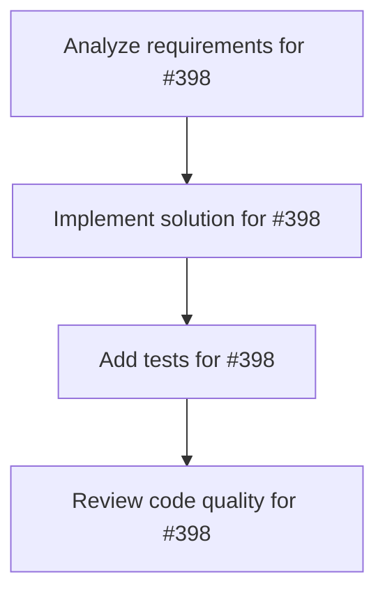

# Plans for Issue #398

**Title**: 📄 [Sub-Issue #396] Phase 1: SWE-bench Pro公式評価環境の構築

**URL**: https://github.com/customer-cloud/miyabi-private/issues/398

---

## 📋 Summary

- **Total Tasks**: 4
- **Estimated Duration**: 60 minutes
- **Execution Levels**: 4
- **Has Cycles**: ✅ No

## 📝 Task Breakdown

### 1. Analyze requirements for #398

- **ID**: `task-398-analysis`
- **Type**: Docs
- **Assigned Agent**: IssueAgent
- **Priority**: 0
- **Estimated Duration**: 5 min

**Description**: Analyze issue requirements and create detailed specification

### 2. Implement solution for #398

- **ID**: `task-398-impl`
- **Type**: Deployment
- **Assigned Agent**: CodeGenAgent
- **Priority**: 1
- **Estimated Duration**: 30 min
- **Dependencies**: task-398-analysis

**Description**: ## 🎯 目的

**SWE-bench Pro公式の評価環境を完全に再現し、Miyabi評価の基盤を構築する**

**親Issue**: #396 - SWE-bench Pro評価実装

---

## 📋 タスク

### 1. Docker環境構築

```bash
# 公式Dockerイメージ取得
docker pull scaleai/swebench-pro:latest

# 動作確認
docker run --rm scaleai/swebench-pro:latest --version
```

**検証項目**:
- [ ] Dockerイメージが正常にpull可能
- [ ] コンテナが起動可能
- [ ] 必要なツールがインストール済み（git, python, etc）

---

### 2. Modal環境構築

```bash
# Modalインストール
pip install modal

# Modal認証
modal setup

# 認証情報確認
cat ~/.modal.toml
```

**検証項目**:
- [ ] Modalがインストール完了
- [ ] 認証情報が`~/.modal.toml`に保存
- [ ] Modalトークンが有効

---

### 3. Python環境構築

```bash
# SWE-bench Proリポジトリクローン
git clone https://github.com/scaleapi/SWE-bench_Pro-os.git
cd SWE-bench_Pro-os

# Python依存関係インストール
pip install -r requirements.txt
pip install datasets
```

**検証項目**:
- [ ] リポジトリクローン成功
- [ ] 依存関係インストール成功
- [ ] `datasets`パッケージがインストール済み

---

### 4. サンプル評価実行（公式gold patchで検証）

```bash
# gold patchで評価実行
python swe_bench_pro_eval.py \
  --raw_sample_path=external_hf_v2.csv \
  --patch_path=gold_patches.json \
  --output_dir=results/gold_test/ \
  --num_workers=10
```

**期待結果**:
- ✅ 公式gold patchで**100%の解決率**を達成
- ✅ Dockerコンテナが正常に動作
- ✅ Modalで並列実行が成功

**検証項目**:
- [ ] 評価スクリプトが正常に実行
- [ ] Dockerコンテナ内でテストが実行される
- [ ] `results/gold_test/evaluation_results.json`が生成される
- [ ] Resolve Rate = 100%

---

### 5. 環境構築ドキュメント作成

```markdown
# docs/EVALUATION_ENVIRONMENT_SETUP.md

## 必須要件
- Docker 20.10+
- Modal latest
- Python 3.8+
- Storage: 20GB+
- Memory: 16GB+

## セットアップ手順
1. Docker環境構築
2. Modal環境構築
3. Python環境構築
4. 動作検証

## トラブルシューティング
...
```

**検証項目**:
- [ ] セットアップ手順が完全にドキュメント化
- [ ] トラブルシューティングセクション追加
- [ ] 他の開発者が再現可能

---

## 📦 成果物

- [ ] `docs/EVALUATION_ENVIRONMENT_SETUP.md` - 環境構築手順
- [ ] `docker-compose.yml` - Docker構成ファイル
- [ ] `scripts/verify_environment.sh` - 環境検証スクリプト
- [ ] `results/gold_test/evaluation_results.json` - gold patch評価結果

---

## ✅ 成功基準

### 必達
- [ ] Docker環境が正常に動作
- [ ] Modal認証が完了
- [ ] 公式評価スクリプトがエラーなく実行
- [ ] gold patchで100%の解決率

### 推奨
- [ ] 環境構築が30分以内に完了
- [ ] ドキュメントが完全
- [ ] 自動検証スクリプトが動作

---

## ⏱️ 期間

**期間**: 1週間
**期限**: 2025-10-29

---

## 🏷️ Label

- `✨ type:feature`
- `🏗️ phase:implementation`
- `🤖 agent:deployment`
- `📊 priority:P2-Medium`

---

## 📚 関連リソース

- **公式リポジトリ**: https://github.com/scaleapi/SWE-bench_Pro-os
- **Docker Hub**: https://hub.docker.com/r/scaleai/swebench-pro
- **Modal公式ドキュメント**: https://modal.com/docs

---

**親Issue**: #396 - SWE-bench Pro評価実装

### 3. Add tests for #398

- **ID**: `task-398-test`
- **Type**: Test
- **Assigned Agent**: CodeGenAgent
- **Priority**: 2
- **Estimated Duration**: 15 min
- **Dependencies**: task-398-impl

**Description**: Create comprehensive test coverage

### 4. Review code quality for #398

- **ID**: `task-398-review`
- **Type**: Refactor
- **Assigned Agent**: ReviewAgent
- **Priority**: 3
- **Estimated Duration**: 10 min
- **Dependencies**: task-398-test

**Description**: Run quality checks and code review

## 🔄 Execution Plan (DAG Levels)

Tasks can be executed in parallel within each level:

### Level 0 (Parallel Execution)

- `task-398-analysis` - Analyze requirements for #398

### Level 1 (Parallel Execution)

- `task-398-impl` - Implement solution for #398

### Level 2 (Parallel Execution)

- `task-398-test` - Add tests for #398

### Level 3 (Parallel Execution)

- `task-398-review` - Review code quality for #398

## 📊 Dependency Graph



## ⏱️ Timeline Estimation

- **Sequential Execution**: 60 minutes (1.0 hours)
- **Parallel Execution (Critical Path)**: 10 minutes (0.2 hours)
- **Estimated Speedup**: 6.0x

---

*Generated by CoordinatorAgent on 2025-10-30 17:47:20 UTC*
