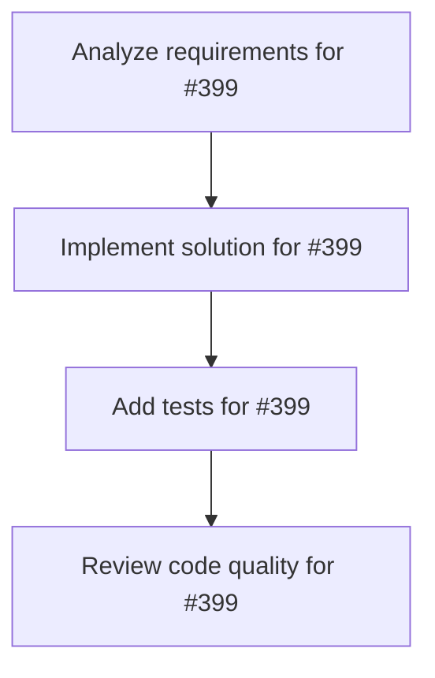

# Plans for Issue #399

**Title**: 📄 [Sub-Issue #396] Phase 2: データセット統合とMiyabi型定義

**URL**: https://github.com/customer-cloud/miyabi-private/issues/399

---

## 📋 Summary

- **Total Tasks**: 4
- **Estimated Duration**: 60 minutes
- **Execution Levels**: 4
- **Has Cycles**: ✅ No

## 📝 Task Breakdown

### 1. Analyze requirements for #399

- **ID**: `task-399-analysis`
- **Type**: Docs
- **Assigned Agent**: IssueAgent
- **Priority**: 0
- **Estimated Duration**: 5 min

**Description**: Analyze issue requirements and create detailed specification

### 2. Implement solution for #399

- **ID**: `task-399-impl`
- **Type**: Feature
- **Assigned Agent**: CodeGenAgent
- **Priority**: 1
- **Estimated Duration**: 30 min
- **Dependencies**: task-399-analysis

**Description**: ## 🎯 目的

**HuggingFaceからSWE-bench Proデータセットを取得し、Miyabi形式に変換する**

**親Issue**: #396 - SWE-bench Pro評価実装
**依存**: #398 (Phase 1) - 環境構築完了後に実施

---

## 📋 タスク

### 1. HuggingFace Datasets API統合

```python
# データセット取得スクリプト
from datasets import load_dataset

# SWE-bench Pro公式データセット
swebench_pro = load_dataset('ScaleAI/SWE-bench_Pro', split='test')

print(f"Total instances: {len(swebench_pro)}")  # 期待: 731
print(f"Keys: {swebench_pro[0].keys()}")
```

**検証項目**:
- [ ] 731インスタンスすべてをロード可能
- [ ] データ欠損0件
- [ ] 各フィールドが正しく取得できる

---

### 2. Rust型定義作成

```rust
// crates/miyabi-types/src/benchmark.rs

use serde::{Deserialize, Serialize};

#[derive(Serialize, Deserialize, Debug, Clone)]
pub struct SWEBenchInstance {
    /// 公式インスタンスID（変更禁止）
    pub instance_id: String,
    
    /// リポジトリ名
    pub repo: String,
    
    /// ベースコミット（40文字のハッシュ）
    pub base_commit: String,
    
    /// 問題文（Issue説明）
    pub problem_statement: String,
    
    /// 正解パッチ（検証用）
    pub patch: String,
    
    /// テストパッチ
    pub test_patch: String,
    
    /// 成功すべきテスト
    pub fail_to_pass: Vec<String>,
    
    /// 維持すべきテスト
    pub pass_to_pass: Vec<String>,
    
    /// メタデータ
    pub repo_language: Option<String>,
    pub requirements: Option<String>,
}

#[derive(Serialize, Deserialize, Debug, Clone)]
pub struct PatchOutput {
    /// インスタンスID
    pub instance_id: String,
    
    /// 生成されたパッチ（unified diff形式）
    pub model_patch: String,
    
    /// モデル名
    pub model_name_or_path: String,
}
```

**検証項目**:
- [ ] すべてのフィールドが公式フォーマットと一致
- [ ] Serdeでシリアライズ/デシリアライズ可能
- [ ] 型安全性が保証される

---

### 3. データローダー実装

```rust
// crates/miyabi-benchmark/src/dataset.rs

use miyabi_types::benchmark::SWEBenchInstance;
use anyhow::Result;

pub struct SWEBenchDataset {
    instances: Vec<SWEBenchInstance>,
}

impl SWEBenchDataset {
    /// HuggingFaceからデータセットをロード
    pub fn load() -> Result<Self> {
        // Python経由でHuggingFaceデータセット取得
        // またはJSON形式でエクスポートしたものをロード
        todo!()
    }
    
    /// インスタンス数を取得
    pub fn len(&self) -> usize {
        self.instances.len()
    }
    
    /// 特定のインスタンスを取得
    pub fn get(&self, index: usize) -> Option<&SWEBenchInstance> {
        self.instances.get(index)
    }
    
    /// instance_idでフィルタ
    pub fn filter_by_ids(&self, ids: &[String]) -> Vec<&SWEBenchInstance> {
        self.instances.iter()
            .filter(|inst| ids.contains(&inst.instance_id))
            .collect()
    }
    
    /// 言語でフィルタ
    pub fn filter_by_language(&self, lang: &str) -> Vec<&SWEBenchInstance> {
        self.instances.iter()
            .filter(|inst| inst.repo_language.as_deref() == Some(lang))
            .collect()
    }
}
```

**検証項目**:
- [ ] 731インスタンスすべてをロード可能
- [ ] instance_idでフィルタリング可能
- [ ] 言語でフィルタリング可能
- [ ] エラーハンドリングが適切

---

### 4. テストデータ作成

```bash
# 10インスタンスをサンプルとして抽出
# tests/fixtures/swebench_sample.json

# 言語バランス考慮:
# - Python: 5インスタンス
# - Go: 3インスタンス
# - JavaScript/TypeScript: 2インスタンス
```

**検証項目**:
- [ ] サンプルデータが正しくロード可能
- [ ] 各フィールドが正しく解析される
- [ ] 単体テストで検証済み

---

### 5. データ構造マッピング検証

| HuggingFaceフィールド | Miyabi型フィールド | 検証 |
|---------------------|-------------------|------|
| `instance_id` | `instance_id` | ✅ |
| `repo` | `repo` | ✅ |
| `base_commit` | `base_commit` | ✅ |
| `problem_statement` | `problem_statement` | ✅ |
| `patch` | `patch` | ✅ |
| `test_patch` | `test_patch` | ✅ |
| `fail_to_pass` | `fail_to_pass` | ✅ |
| `pass_to_pass` | `pass_to_pass` | ✅ |

---

## 📦 成果物

- [ ] `crates/miyabi-types/src/benchmark.rs` - Rust型定義
- [ ] `crates/miyabi-benchmark/src/dataset.rs` - データローダー
- [ ] `crates/miyabi-benchmark/Cargo.toml` - 依存関係定義
- [ ] `tests/fixtures/swebench_sample.json` - テストデータ
- [ ] `crates/miyabi-benchmark/tests/dataset_test.rs` - 単体テスト

---

## ✅ 成功基準

### 必達
- [ ] 731インスタンスすべてをロード可能
- [ ] instance_idが公式と完全一致
- [ ] データ欠損0件
- [ ] 単体テストが全てパス

### 推奨
- [ ] 言語別フィルタリングが動作
- [ ] メモリ効率が良い（遅延ロード等）
- [ ] エラーメッセージが明確

---

## ⏱️ 期間

**期間**: 1週間
**期限**: 2025-11-05

---

## 🏷️ Label

- `✨ type:feature`
- `🏗️ phase:implementation`
- `🤖 agent:codegen`
- `📊 priority:P2-Medium`

---

## 📚 関連リソース

- **HuggingFaceデータセット**: https://huggingface.co/datasets/ScaleAI/SWE-bench_Pro
- **Rust Serde**: https://serde.rs/

---

**親Issue**: #396 - SWE-bench Pro評価実装
**依存**: #398 (Phase 1)

### 3. Add tests for #399

- **ID**: `task-399-test`
- **Type**: Test
- **Assigned Agent**: CodeGenAgent
- **Priority**: 2
- **Estimated Duration**: 15 min
- **Dependencies**: task-399-impl

**Description**: Create comprehensive test coverage

### 4. Review code quality for #399

- **ID**: `task-399-review`
- **Type**: Refactor
- **Assigned Agent**: ReviewAgent
- **Priority**: 3
- **Estimated Duration**: 10 min
- **Dependencies**: task-399-test

**Description**: Run quality checks and code review

## 🔄 Execution Plan (DAG Levels)

Tasks can be executed in parallel within each level:

### Level 0 (Parallel Execution)

- `task-399-analysis` - Analyze requirements for #399

### Level 1 (Parallel Execution)

- `task-399-impl` - Implement solution for #399

### Level 2 (Parallel Execution)

- `task-399-test` - Add tests for #399

### Level 3 (Parallel Execution)

- `task-399-review` - Review code quality for #399

## 📊 Dependency Graph



## ⏱️ Timeline Estimation

- **Sequential Execution**: 60 minutes (1.0 hours)
- **Parallel Execution (Critical Path)**: 10 minutes (0.2 hours)
- **Estimated Speedup**: 6.0x

---

*Generated by CoordinatorAgent on 2025-10-30 17:47:20 UTC*
