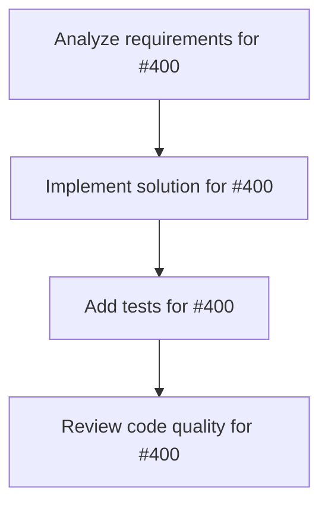

# Plans for Issue #400

**Title**: 📄 [Sub-Issue #396] Phase 3: Miyabi評価ラッパーとパッチ生成システム実装

**URL**: https://github.com/customer-cloud/miyabi-private/issues/400

---

## 📋 Summary

- **Total Tasks**: 4
- **Estimated Duration**: 60 minutes
- **Execution Levels**: 4
- **Has Cycles**: ✅ No

## 📝 Task Breakdown

### 1. Analyze requirements for #400

- **ID**: `task-400-analysis`
- **Type**: Docs
- **Assigned Agent**: IssueAgent
- **Priority**: 0
- **Estimated Duration**: 5 min

**Description**: Analyze issue requirements and create detailed specification

### 2. Implement solution for #400

- **ID**: `task-400-impl`
- **Type**: Feature
- **Assigned Agent**: CodeGenAgent
- **Priority**: 1
- **Estimated Duration**: 30 min
- **Dependencies**: task-400-analysis

**Description**: ## 🎯 目的

**Miyabiで各インスタンスを処理し、公式フォーマット準拠のパッチを生成する評価ラッパーを実装**

**親Issue**: #396 - SWE-bench Pro評価実装
**依存**: #399 (Phase 2) - データセット統合完了後に実施

---

## 📋 タスク

### 1. `miyabi-benchmark` crate作成

```bash
# 新規crateの作成
cargo new --lib crates/miyabi-benchmark

# Cargo.tomlに追加
[workspace]
members = [
    "crates/miyabi-benchmark",
    # ... 既存のcrates
]
```

**検証項目**:
- [ ] crateが正常に作成される
- [ ] workspaceに追加される
- [ ] `cargo build`が成功

---

### 2. `SWEBenchProEvaluator` struct実装

```rust
// crates/miyabi-benchmark/src/evaluator.rs

use miyabi_agents::CoordinatorAgent;
use miyabi_worktree::WorktreeManager;
use miyabi_types::benchmark::{SWEBenchInstance, PatchOutput};
use anyhow::Result;
use std::time::Duration;

pub struct SWEBenchProEvaluator {
    coordinator: CoordinatorAgent,
    worktree_manager: WorktreeManager,
    config: BenchmarkConfig,
}

#[derive(Debug, Clone)]
pub struct BenchmarkConfig {
    /// タイムアウト時間（秒）
    pub timeout: Duration,
    
    /// 並列実行数
    pub concurrency: usize,
    
    /// Worktreeベースディレクトリ
    pub worktree_base: String,
}

impl SWEBenchProEvaluator {
    pub fn new(config: BenchmarkConfig) -> Result<Self> {
        Ok(Self {
            coordinator: CoordinatorAgent::new()?,
            worktree_manager: WorktreeManager::new(&config.worktree_base)?,
            config,
        })
    }
    
    /// 単一インスタンスの評価
    pub async fn evaluate_instance(&self, instance: &SWEBenchInstance) -> Result<PatchOutput> {
        // 1. Worktree作成（base_commitでcheckout）
        let wt = self.worktree_manager.create(
            &instance.repo,
            &instance.base_commit,
        )?;
        
        // 2. 実行コンテキスト作成
        let context = self.create_execution_context(instance)?;
        wt.write_context(&context)?;
        
        // 3. CoordinatorAgent実行（Claude Code経由）
        let result = tokio::time::timeout(
            self.config.timeout,
            self.coordinator.execute_in_worktree(&wt, &instance.problem_statement)
        ).await??;
        
        // 4. git diffでパッチ生成（公式フォーマット）
        let patch = self.generate_official_patch(&wt, &instance.base_commit)?;
        
        // 5. Worktreeクリーンアップ
        self.worktree_manager.remove(&wt)?;
        
        // 6. 公式JSON形式で出力
        Ok(PatchOutput {
            instance_id: instance.instance_id.clone(),
            model_patch: patch,
            model_name_or_path: "miyabi-v1.0.0".to_string(),
        })
    }
    
    /// 複数インスタンスの並列評価
    pub async fn evaluate_batch(&self, instances: &[SWEBenchInstance]) -> Result<Vec<PatchOutput>> {
        use futures::stream::{self, StreamExt};
        
        let results = stream::iter(instances)
            .map(|inst| self.evaluate_instance(inst))
            .buffer_unordered(self.config.concurrency)
            .collect::<Vec<_>>()
            .await;
        
        results.into_iter().collect()
    }
}
```

**検証項目**:
- [ ] Worktree作成が正常に動作
- [ ] タイムアウトが正しく機能
- [ ] 並列実行が安定
- [ ] エラーハンドリングが適切

---

### 3. パッチ生成関数実装

```rust
// crates/miyabi-benchmark/src/patch.rs

use std::process::Command;
use anyhow::{Result, Context};

/// 公式フォーマット準拠のパッチ生成
pub fn generate_official_patch(
    worktree_path: &str,
    base_commit: &str,
) -> Result<String> {
    // unified diff形式（--unified=3）
    let output = Command::new("git")
        .args(&[
            "diff",
            "--unified=3",  // 公式フォーマット
            base_commit,
            "HEAD",
        ])
        .current_dir(worktree_path)
        .output()
        .context("Failed to execute git diff")?;
    
    if !output.status.success() {
        anyhow::bail!(
            "git diff failed: {}",
            String::from_utf8_lossy(&output.stderr)
        );
    }
    
    let patch = String::from_utf8(output.stdout)
        .context("Invalid UTF-8 in git diff output")?;
    
    // パッチフォーマット検証
    validate_patch_format(&patch)?;
    
    Ok(patch)
}

/// パッチフォーマット検証
pub fn validate_patch_format(patch: &str) -> Result<()> {
    // unified diff形式の検証
    if !patch.starts_with("diff --git") {
        anyhow::bail!("Invalid patch format: must start with 'diff --git'");
    }
    
    // チャンク定義の存在確認
    if !patch.contains("@@") {
        anyhow::bail!("Invalid patch format: missing chunk markers '@@'");
    }
    
    Ok(())
}

/// JSON出力
pub fn write_patches_json(
    patches: &[PatchOutput],
    output_path: &str,
) -> Result<()> {
    use std::fs::File;
    use std::io::BufWriter;
    
    let file = File::create(output_path)?;
    let writer = BufWriter::new(file);
    
    serde_json::to_writer_pretty(writer, patches)?;
    
    Ok(())
}
```

**検証項目**:
- [ ] unified diff形式で出力
- [ ] パッチが公式フォーマットに準拠
- [ ] JSON出力が正しい
- [ ] エラーハンドリングが適切

---

### 4. CLIコマンド実装

```rust
// crates/miyabi-cli/src/commands/benchmark.rs

use clap::{Args, Subcommand};

#[derive(Args)]
pub struct BenchmarkArgs {
    #[command(subcommand)]
    pub command: BenchmarkCommand,
}

#[derive(Subcommand)]
pub enum BenchmarkCommand {
    /// SWE-bench Pro評価を実行
    Run {
        /// データセット名
        #[arg(long, default_value = "swebench_pro")]
        dataset: String,
        
        /// 評価するインスタンス数（デバッグ用）
        #[arg(long)]
        instances: Option<usize>,
        
        /// 出力ファイルパス
        #[arg(long, default_value = "results/patches.json")]
        output: String,
        
        /// 並列実行数
        #[arg(long, default_value = "5")]
        concurrency: usize,
        
        /// タイムアウト（秒）
        #[arg(long, default_value = "1800")]
        timeout: u64,
    },
    
    /// 結果を分析
    Analyze {
        /// 評価結果ファイル
        #[arg(long)]
        results: String,
    },
}
```

**使用例**:
```bash
# パイロット評価（10インスタンス）
miyabi benchmark run --instances 10 --output results/pilot.json

# フルスケール評価
miyabi benchmark run --output results/full.json --concurrency 5

# 結果分析
miyabi benchmark analyze --results results/full/evaluation_results.json
```

**検証項目**:
- [ ] CLIコマンドが動作
- [ ] 引数が正しく解析される
- [ ] ヘルプメッセージが明確

---

## 📦 成果物

- [ ] `crates/miyabi-benchmark/src/evaluator.rs` - 評価ラッパー
- [ ] `crates/miyabi-benchmark/src/patch.rs` - パッチ生成
- [ ] `crates/miyabi-benchmark/src/lib.rs` - ライブラリエントリポイント
- [ ] `crates/miyabi-cli/src/commands/benchmark.rs` - CLIコマンド
- [ ] `crates/miyabi-benchmark/tests/evaluator_test.rs` - 単体テスト
- [ ] `crates/miyabi-benchmark/tests/patch_test.rs` - パッチ生成テスト

---

## ✅ 成功基準

### 必達
- [ ] パッチが公式フォーマットと完全一致
- [ ] JSON出力が公式スキーマに準拠
- [ ] 10インスタンスで正常動作
- [ ] タイムアウトが正しく機能

### 推奨
- [ ] 並列実行が安定（クラッシュ0件）
- [ ] エラーメッセージが明確
- [ ] 単体テストカバレッジ80%以上

---

## ⏱️ 期間

**期間**: 2週間
**期限**: 2025-11-19

---

## 🏷️ Label

- `✨ type:feature`
- `🏗️ phase:implementation`
- `🤖 agent:codegen`
- `⚠️ priority:P1-High`

---

**親Issue**: #396 - SWE-bench Pro評価実装
**依存**: #399 (Phase 2)

### 3. Add tests for #400

- **ID**: `task-400-test`
- **Type**: Test
- **Assigned Agent**: CodeGenAgent
- **Priority**: 2
- **Estimated Duration**: 15 min
- **Dependencies**: task-400-impl

**Description**: Create comprehensive test coverage

### 4. Review code quality for #400

- **ID**: `task-400-review`
- **Type**: Refactor
- **Assigned Agent**: ReviewAgent
- **Priority**: 3
- **Estimated Duration**: 10 min
- **Dependencies**: task-400-test

**Description**: Run quality checks and code review

## 🔄 Execution Plan (DAG Levels)

Tasks can be executed in parallel within each level:

### Level 0 (Parallel Execution)

- `task-400-analysis` - Analyze requirements for #400

### Level 1 (Parallel Execution)

- `task-400-impl` - Implement solution for #400

### Level 2 (Parallel Execution)

- `task-400-test` - Add tests for #400

### Level 3 (Parallel Execution)

- `task-400-review` - Review code quality for #400

## 📊 Dependency Graph



## ⏱️ Timeline Estimation

- **Sequential Execution**: 60 minutes (1.0 hours)
- **Parallel Execution (Critical Path)**: 10 minutes (0.2 hours)
- **Estimated Speedup**: 6.0x

---

*Generated by CoordinatorAgent on 2025-11-01 06:15:52 UTC*
