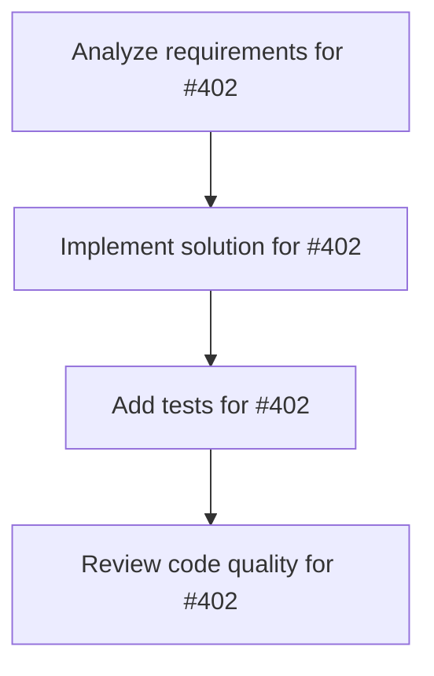

# Plans for Issue #402

**Title**: 📄 [Sub-Issue #396] Phase 5: フルスケール評価（731インスタンス全評価）

**URL**: https://github.com/customer-cloud/miyabi-private/issues/402

---

## 📋 Summary

- **Total Tasks**: 4
- **Estimated Duration**: 60 minutes
- **Execution Levels**: 4
- **Has Cycles**: ✅ No

## 📝 Task Breakdown

### 1. Analyze requirements for #402

- **ID**: `task-402-analysis`
- **Type**: Docs
- **Assigned Agent**: IssueAgent
- **Priority**: 0
- **Estimated Duration**: 5 min

**Description**: Analyze issue requirements and create detailed specification

### 2. Implement solution for #402

- **ID**: `task-402-impl`
- **Type**: Deployment
- **Assigned Agent**: CodeGenAgent
- **Priority**: 1
- **Estimated Duration**: 30 min
- **Dependencies**: task-402-analysis

**Description**: ## 🎯 目的

**731インスタンス全体で評価を実行し、世界標準プロトコルに完全準拠した評価を完了する**

**親Issue**: #396 - SWE-bench Pro評価実装
**依存**: #401 (Phase 4) - パイロット評価完了・問題修正後に実施

---

## 📋 タスク

### 1. 並列実行最適化

```rust
// crates/miyabi-benchmark/src/evaluator.rs

pub struct ParallelConfig {
    /// 並列実行数
    pub concurrency: usize,
    
    /// チャンクサイズ（一度に処理するインスタンス数）
    pub chunk_size: usize,
    
    /// チェックポイント間隔
    pub checkpoint_interval: usize,
}

impl SWEBenchProEvaluator {
    /// 並列実行でバッチ評価
    pub async fn evaluate_parallel(
        &self,
        instances: &[SWEBenchInstance],
        config: ParallelConfig,
    ) -> Result<Vec<PatchOutput>> {
        let mut all_results = Vec::new();
        
        for (chunk_idx, chunk) in instances.chunks(config.chunk_size).enumerate() {
            println!("Processing chunk {}/{}", chunk_idx + 1, instances.len() / config.chunk_size);
            
            // 並列実行
            let results = self.evaluate_batch(chunk).await?;
            all_results.extend(results);
            
            // チェックポイント保存
            if (chunk_idx + 1) % config.checkpoint_interval == 0 {
                self.save_checkpoint(&all_results, chunk_idx)?;
            }
        }
        
        Ok(all_results)
    }
    
    /// チェックポイント保存
    fn save_checkpoint(&self, results: &[PatchOutput], chunk_idx: usize) -> Result<()> {
        let checkpoint_path = format!("results/checkpoints/checkpoint_{}.json", chunk_idx);
        write_patches_json(results, &checkpoint_path)?;
        println!("✅ Checkpoint saved: {}", checkpoint_path);
        Ok(())
    }
}
```

**検証項目**:
- [ ] 並列度5で安定動作
- [ ] チェックポイントが正常に保存される
- [ ] メモリリークがない

---

### 2. 進捗モニタリング

```rust
// crates/miyabi-benchmark/src/progress.rs

use indicatif::{ProgressBar, ProgressStyle};

pub struct ProgressTracker {
    bar: ProgressBar,
    start_time: std::time::Instant,
}

impl ProgressTracker {
    pub fn new(total: usize) -> Self {
        let bar = ProgressBar::new(total as u64);
        bar.set_style(
            ProgressStyle::default_bar()
                .template("[{elapsed_precise}] [{bar:40.cyan/blue}] {pos}/{len} ({eta})")
                .progress_chars("#>-")
        );
        
        Self {
            bar,
            start_time: std::time::Instant::now(),
        }
    }
    
    pub fn inc(&self) {
        self.bar.inc(1);
    }
    
    pub fn finish(&self) {
        let elapsed = self.start_time.elapsed();
        println!("✅ Evaluation complete in {:?}", elapsed);
        self.bar.finish();
    }
}
```

**検証項目**:
- [ ] プログレスバーが正常に表示
- [ ] 経過時間・残り時間が表示
- [ ] 完了時に統計情報が表示

---

### 3. フルスケール評価実行

```bash
# Step 1: Miyabiでパッチ生成（731インスタンス）
cargo run --release --bin miyabi -- benchmark run \
  --dataset swebench_pro \
  --output results/full_patches.json \
  --concurrency 5 \
  --timeout 1800 \
  --checkpoint-interval 100

# 期待される実行時間:
# - 731インスタンス × 30分/インスタンス = 365時間
# - 並列度5で約73時間（3日間）

# Step 2: 公式評価スクリプト実行
cd SWE-bench_Pro-os

python swe_bench_pro_eval.py \
  --raw_sample_path=external_hf_v2.csv \
  --patch_path=../results/full_patches.json \
  --output_dir=../results/full/ \
  --num_workers=50 \
  --dockerhub_username=jefzda

# 期待される実行時間: 約6-12時間
```

**検証項目**:
- [ ] 731インスタンスすべてが評価完了
- [ ] チェックポイントが100インスタンスごとに保存
- [ ] エラーログが記録される
- [ ] 公式評価スクリプトがエラーなく実行

---

### 4. エラーリカバリー強化

```rust
// crates/miyabi-benchmark/src/recovery.rs

pub struct RecoveryManager {
    checkpoint_dir: String,
}

impl RecoveryManager {
    /// 最新のチェックポイントから再開
    pub fn resume_from_checkpoint(&self) -> Result<(Vec<PatchOutput>, usize)> {
        // 最新のチェックポイントを検索
        let latest_checkpoint = self.find_latest_checkpoint()?;
        
        // チェックポイントから結果をロード
        let results = self.load_checkpoint(&latest_checkpoint)?;
        
        // 再開位置を返す
        Ok((results, results.len()))
    }
    
    /// エラーが発生したインスタンスを再試行
    pub async fn retry_failed(&self, instance: &SWEBenchInstance) -> Result<PatchOutput> {
        const MAX_RETRIES: usize = 3;
        
        for attempt in 1..=MAX_RETRIES {
            match self.evaluate(instance).await {
                Ok(patch) => return Ok(patch),
                Err(e) => {
                    eprintln!("Attempt {}/{} failed: {}", attempt, MAX_RETRIES, e);
                    if attempt == MAX_RETRIES {
                        return Err(e);
                    }
                }
            }
        }
        
        unreachable!()
    }
}
```

**検証項目**:
- [ ] チェックポイントから再開可能
- [ ] 失敗したインスタンスの再試行
- [ ] エラーログが詳細

---

### 5. リアルタイムダッシュボード（オプション）

```bash
# リアルタイム統計表示
watch -n 10 'cargo run --bin miyabi -- benchmark status'

# 出力例:
# ━━━━━━━━━━━━━━━━━━━━━━━━━━━━━━━━━━━━━━━━━
# Miyabi SWE-bench Pro Evaluation Status
# ━━━━━━━━━━━━━━━━━━━━━━━━━━━━━━━━━━━━━━━━━
# Progress: 350/731 (47.9%)
# Elapsed: 36h 15m
# Estimated remaining: 39h 45m
# 
# Success: 45 (12.9%)
# Failed: 25 (7.1%)
# In Progress: 5
# 
# Last 5 completed:
# ✅ repo__issue-123 (15m 23s)
# ❌ repo__issue-456 (timeout)
# ✅ repo__issue-789 (22m 10s)
# ...
```

---

## 📦 成果物

- [ ] `results/full_patches.json` - Miyabi生成パッチ（731件）
- [ ] `results/full/evaluation_results.json` - 公式評価結果
- [ ] `results/checkpoints/checkpoint_*.json` - 中間チェックポイント
- [ ] `logs/benchmark_YYYY-MM-DD.log` - 実行ログ
- [ ] `evaluation_protocol.yml` - 評価プロトコル定義

---

## 📊 計算リソース

### 時間
- **Miyabi評価**: 731インスタンス × 30分 = 365時間
- **並列度5**: 約**73時間（3日間）**
- **公式評価**: 約6-12時間
- **合計**: 約**79-85時間**

### ストレージ
- Worktree: 約10GB（並列度5 × 2GB/worktree）
- ログ: 約5GB
- Docker: 約5GB
- **合計**: 約**20GB**

### メモリ
- Miyabi実行: 約8GB
- Docker: 約8GB
- **合計**: 約**16GB**

### コスト
- **API料金**: $0（ローカルClaude Code実行）
- **計算リソース**: ローカルマシンのみ
- **合計**: **$0**

---

## ✅ 成功基準

### 必達
- [ ] **731インスタンス100%評価完了**
- [ ] 公式評価スクリプトでエラー0件
- [ ] **Resolve Rate ≥ 10%**（73インスタンス以上成功）
- [ ] チェックポイントが正常に動作

### 推奨
- [ ] **Resolve Rate 15-20%**（110-146インスタンス成功）
- [ ] 実行時間が予測範囲内（73±10時間）
- [ ] メモリリークなし

### 理想
- [ ] **Resolve Rate ≥ 25%**（183インスタンス以上成功）
- [ ] 実行時間が60時間以内
- [ ] クラッシュ0件

---

## ⚠️ リスクと対策

### リスク1: 長時間実行による不安定性
**対策**:
- [ ] 100インスタンスごとにチェックポイント
- [ ] Worktreeの定期クリーンアップ
- [ ] メモリ使用量のモニタリング

### リスク2: ネットワーク障害
**対策**:
- [ ] ローカル実行（ネットワーク依存最小化）
- [ ] タイムアウトの適切な設定
- [ ] 自動リトライ機構

### リスク3: ディスク容量不足
**対策**:
- [ ] 事前に30GB以上の空き容量確保
- [ ] Worktreeの定期削除
- [ ] ログローテーション

---

## ⏱️ 期間

**期間**: 4週間
**期限**: 2025-12-24

**内訳**:
- 並列実行最適化: 1週間
- フルスケール評価実行: 3日間（73時間）
- 公式評価実行: 1日間
- 問題修正・再評価: 2週間
- 結果検証: 1週間

---

## 🏷️ Label

- `✨ type:feature`
- `🚀 phase:deployment`
- `🤖 agent:deployment`
- `🔥 priority:P0-Critical`

---

## 📚 関連リソース

- **公式評価スクリプト**: https://github.com/scaleapi/SWE-bench_Pro-os
- **HuggingFaceデータセット**: https://huggingface.co/datasets/ScaleAI/SWE-bench_Pro

---

**親Issue**: #396 - SWE-bench Pro評価実装
**依存**: #401 (Phase 4)

**⚠️ 注意**: このPhaseは3日間の連続実行が必要です。実行前に十分な計算リソースとストレージを確保してください。

### 3. Add tests for #402

- **ID**: `task-402-test`
- **Type**: Test
- **Assigned Agent**: CodeGenAgent
- **Priority**: 2
- **Estimated Duration**: 15 min
- **Dependencies**: task-402-impl

**Description**: Create comprehensive test coverage

### 4. Review code quality for #402

- **ID**: `task-402-review`
- **Type**: Refactor
- **Assigned Agent**: ReviewAgent
- **Priority**: 3
- **Estimated Duration**: 10 min
- **Dependencies**: task-402-test

**Description**: Run quality checks and code review

## 🔄 Execution Plan (DAG Levels)

Tasks can be executed in parallel within each level:

### Level 0 (Parallel Execution)

- `task-402-analysis` - Analyze requirements for #402

### Level 1 (Parallel Execution)

- `task-402-impl` - Implement solution for #402

### Level 2 (Parallel Execution)

- `task-402-test` - Add tests for #402

### Level 3 (Parallel Execution)

- `task-402-review` - Review code quality for #402

## 📊 Dependency Graph



## ⏱️ Timeline Estimation

- **Sequential Execution**: 60 minutes (1.0 hours)
- **Parallel Execution (Critical Path)**: 10 minutes (0.2 hours)
- **Estimated Speedup**: 6.0x

---

*Generated by CoordinatorAgent on 2025-10-30 17:46:20 UTC*
