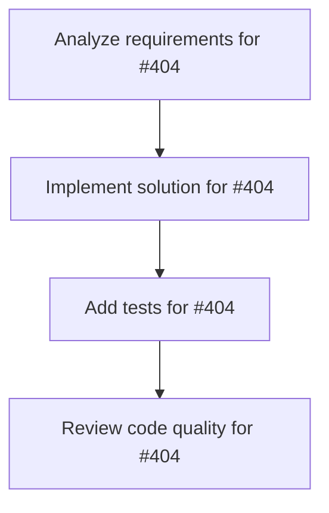

# Plans for Issue #404

**Title**: 📄 [Sub-Issue #397] Phase 1: AgentBench評価（8環境）

**URL**: https://github.com/customer-cloud/miyabi-private/issues/404

---

## 📋 Summary

- **Total Tasks**: 4
- **Estimated Duration**: 60 minutes
- **Execution Levels**: 4
- **Has Cycles**: ✅ No

## 📝 Task Breakdown

### 1. Analyze requirements for #404

- **ID**: `task-404-analysis`
- **Type**: Docs
- **Assigned Agent**: IssueAgent
- **Priority**: 0
- **Estimated Duration**: 5 min

**Description**: Analyze issue requirements and create detailed specification

### 2. Implement solution for #404

- **ID**: `task-404-impl`
- **Type**: Feature
- **Assigned Agent**: CodeGenAgent
- **Priority**: 1
- **Estimated Duration**: 30 min
- **Dependencies**: task-404-analysis

**Description**: ## 🎯 目的

**AgentBench（THUDM）の8つの環境でMiyabiを評価し、汎用エージェント性能を測定**

**親Issue**: #397 - エージェントベンチマーク評価実装

---

## 📊 AgentBench概要

**公式リソース**:
- GitHub: https://github.com/THUDM/AgentBench
- 論文: https://arxiv.org/abs/2308.03688
- リーダーボード: https://llmbench.ai/agent

**8つの評価環境**:
1. **Operating System (OS)** - Linux環境でのコマンド実行
2. **Database (DB)** - SQLクエリとデータベース操作
3. **Knowledge Graph (KG)** - グラフデータベースクエリ
4. **Digital Card Game (DCG)** - ゲームAI
5. **Lateral Thinking Puzzles (LTP)** - 論理パズル解決
6. **House-Holding** - 家庭環境タスク（ALFWorld）
7. **Web Shopping** - ECサイトでの購買（WebShop）
8. **Web Browsing** - Webナビゲーション（Mind2Web）

**データセット規模**:
- **Dev**: 約4,000回の生成
- **Test**: 約13,000回の生成

---

## 📋 タスク

### 1. AgentBench環境構築

```bash
# リポジトリクローン
git clone https://github.com/THUDM/AgentBench.git
cd AgentBench

# Python依存関係インストール
pip install -r requirements.txt

# Docker環境構築（一部の環境で必要）
docker pull agentbench/webshop:latest
docker pull agentbench/mind2web:latest
```

**リソース消費量**（単一ワーカー）:

| 環境 | 起動速度 | メモリ |
|------|---------|--------|
| webshop | ~3分 | ~15GB |
| mind2web | ~5分 | ~1GB |
| db | ~20秒 | <500MB |
| os/kg/その他 | ~5秒 | <500MB |

**検証項目**:
- [ ] 8つの環境すべてがセットアップ完了
- [ ] サンプルタスクで動作確認
- [ ] リソース要件を満たしている

---

### 2. Miyabiエージェント統合

```rust
// crates/miyabi-benchmark/src/agentbench.rs

use miyabi_agents::CoordinatorAgent;
use anyhow::Result;

#[derive(Debug)]
pub enum Environment {
    OS,
    DB,
    KG,
    DCG,
    LTP,
    HouseHolding,
    WebShopping,
    WebBrowsing,
}

pub struct AgentBenchEvaluator {
    coordinator: CoordinatorAgent,
}

impl AgentBenchEvaluator {
    pub async fn evaluate_task(
        &self,
        env: Environment,
        task: Task,
    ) -> Result<EvaluationResult> {
        match env {
            Environment::OS => self.evaluate_os_task(&task).await,
            Environment::DB => self.evaluate_db_task(&task).await,
            Environment::KG => self.evaluate_kg_task(&task).await,
            // ... 他の環境
        }
    }
    
    /// OS環境の評価
    async fn evaluate_os_task(&self, task: &Task) -> Result<EvaluationResult> {
        // 1. タスク分析
        let analysis = self.coordinator.analyze_task(task).await?;
        
        // 2. Bashコマンド生成
        let commands = self.coordinator.generate_commands(&analysis).await?;
        
        // 3. マルチターンインタラクション
        for cmd in commands {
            let result = self.execute_command(&cmd).await?;
            // 次のアクション決定
        }
        
        Ok(EvaluationResult::success())
    }
}
```

**検証項目**:
- [ ] Coordinatorエージェントと統合
- [ ] マルチターンインタラクションをサポート
- [ ] 8環境すべてに対応

---

### 3. 8環境の個別実装

#### 3.1 OS環境

```rust
// Bashコマンド実行
async fn evaluate_os_task(&self, task: &Task) -> Result<EvaluationResult> {
    // ファイル操作、プロセス管理等
    let commands = vec![
        "ls -la",
        "grep 'pattern' file.txt",
        "ps aux | grep process",
    ];
    
    for cmd in commands {
        let output = Command::new("bash")
            .args(&["-c", cmd])
            .output()?;
        
        // 出力を解析して次のアクションを決定
    }
}
```

#### 3.2 DB環境

```rust
// SQLクエリ生成・実行
async fn evaluate_db_task(&self, task: &Task) -> Result<EvaluationResult> {
    let query = self.coordinator.generate_sql_query(task).await?;
    
    let results = self.execute_sql(&query).await?;
    
    // 結果を解析して回答生成
}
```

#### 3.3 KG環境

```rust
// グラフクエリ生成・実行
async fn evaluate_kg_task(&self, task: &Task) -> Result<EvaluationResult> {
    let cypher = self.coordinator.generate_cypher_query(task).await?;
    
    let results = self.execute_cypher(&cypher).await?;
}
```

#### 3.4 その他の環境

- [ ] DCG: ゲームAI戦略生成
- [ ] LTP: 論理推論エンジン
- [ ] House-Holding: タスクプランニング
- [ ] Web Shopping: ECサイトナビゲーション
- [ ] Web Browsing: Webインタラクション

---

### 4. Dev split評価（約4,000回生成）

```bash
# AgentBenchタスクサーバー起動
python -m src.start_task -a

# Miyabi評価実行
python -m src.assigner

# 期待される実行時間:
# - 4,000タスク × 平均5分 = 20,000分（約333時間）
# - 並列度10で約33時間（1.4日）
```

**検証項目**:
- [ ] 4,000タスクすべてが評価完了
- [ ] 各環境の成功率が記録される
- [ ] エラーログが詳細

---

### 5. Test split評価（約13,000回生成）

```bash
# Test split評価実行
# 期待される実行時間:
# - 13,000タスク × 平均5分 = 65,000分（約1,083時間）
# - 並列度10で約108時間（4.5日）
```

**検証項目**:
- [ ] 13,000タスクすべてが評価完了
- [ ] 総合スコアが計算される
- [ ] 8環境すべての結果が揃う

---

### 6. 結果提出

```
宛先: agentbench_fc@googlegroups.com
件名: AgentBench Evaluation Results - Miyabi Framework

本文:
Dear AgentBench Team,

I am submitting evaluation results for the Miyabi autonomous development framework.

Model Information:
- Name: Miyabi
- Version: v1.0.0
- Type: Autonomous Development Framework

Evaluation Results:
- Dev Split: XX.X% (8環境平均)
- Test Split: XX.X% (8環境平均)

Attachments:
- dev_results.json
- test_results.json

Best regards,
[Your Name]
```

**検証項目**:
- [ ] メール送信完了
- [ ] 添付ファイル準備完了
- [ ] リーダーボード掲載待ち

---

## 📦 成果物

- [ ] `crates/miyabi-benchmark/src/agentbench/` - AgentBench統合
- [ ] `results/agentbench/dev_results.json` - Dev評価結果
- [ ] `results/agentbench/test_results.json` - Test評価結果
- [ ] `docs/AGENTBENCH_EVALUATION_REPORT.md` - 評価レポート

---

## ✅ 成功基準

### 必達
- [ ] **総合スコア ≥ 20%**（8環境平均）
- [ ] 8環境すべてで評価完了
- [ ] Dev + Test両方で評価完了
- [ ] リーダーボード提出完了

### 推奨
- [ ] **総合スコア 25-30%**
- [ ] 構造化タスク（OS/DB/KG）で30%以上
- [ ] エラー率5%以下

### 理想
- [ ] **総合スコア ≥ 35%**
- [ ] トップ10入り
- [ ] 特定の環境でトップ5

---

## 📊 計算リソース

### 時間
- **Dev**: 約33時間（並列度10）
- **Test**: 約108時間（並列度10）
- **合計**: 約**141時間（約6日間）**

### メモリ
- **WebShop**: 15GB
- **その他**: 各500MB-1GB
- **合計**: 約**20GB**

### ストレージ
- ログ: 約10GB
- Docker: 約20GB
- **合計**: 約**30GB**

---

## ⏱️ 期間

**期間**: 4週間
**期限**: 2026-01-28

---

## 🏷️ Label

- `✨ type:feature`
- `🏗️ phase:implementation`
- `🤖 agent:coordinator`
- `⚠️ priority:P1-High`

---

## 📚 関連リソース

- **GitHub**: https://github.com/THUDM/AgentBench
- **論文**: https://arxiv.org/abs/2308.03688
- **リーダーボード**: https://llmbench.ai/agent

---

**親Issue**: #397 - エージェントベンチマーク評価実装

### 3. Add tests for #404

- **ID**: `task-404-test`
- **Type**: Test
- **Assigned Agent**: CodeGenAgent
- **Priority**: 2
- **Estimated Duration**: 15 min
- **Dependencies**: task-404-impl

**Description**: Create comprehensive test coverage

### 4. Review code quality for #404

- **ID**: `task-404-review`
- **Type**: Refactor
- **Assigned Agent**: ReviewAgent
- **Priority**: 3
- **Estimated Duration**: 10 min
- **Dependencies**: task-404-test

**Description**: Run quality checks and code review

## 🔄 Execution Plan (DAG Levels)

Tasks can be executed in parallel within each level:

### Level 0 (Parallel Execution)

- `task-404-analysis` - Analyze requirements for #404

### Level 1 (Parallel Execution)

- `task-404-impl` - Implement solution for #404

### Level 2 (Parallel Execution)

- `task-404-test` - Add tests for #404

### Level 3 (Parallel Execution)

- `task-404-review` - Review code quality for #404

## 📊 Dependency Graph



## ⏱️ Timeline Estimation

- **Sequential Execution**: 60 minutes (1.0 hours)
- **Parallel Execution (Critical Path)**: 10 minutes (0.2 hours)
- **Estimated Speedup**: 6.0x

---

*Generated by CoordinatorAgent on 2025-11-01 11:17:43 UTC*
