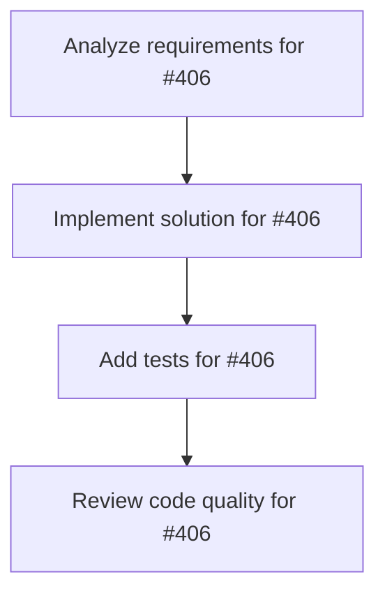

# Plans for Issue #406

**Title**: 📄 [Sub-Issue #397] Phase 3: Galileo Agent Leaderboard v2評価（エンタープライズ）

**URL**: https://github.com/customer-cloud/miyabi-private/issues/406

---

## 📋 Summary

- **Total Tasks**: 4
- **Estimated Duration**: 60 minutes
- **Execution Levels**: 4
- **Has Cycles**: ✅ No

## 📝 Task Breakdown

### 1. Analyze requirements for #406

- **ID**: `task-406-analysis`
- **Type**: Docs
- **Assigned Agent**: IssueAgent
- **Priority**: 0
- **Estimated Duration**: 5 min

**Description**: Analyze issue requirements and create detailed specification

### 2. Implement solution for #406

- **ID**: `task-406-impl`
- **Type**: Feature
- **Assigned Agent**: CodeGenAgent
- **Priority**: 1
- **Estimated Duration**: 30 min
- **Dependencies**: task-406-analysis

**Description**: ## 🎯 目的

**Galileo Agent Leaderboard v2でMiyabiを評価し、エンタープライズシナリオでの性能を測定**

**親Issue**: #397 - エージェントベンチマーク評価実装
**依存**: #405 (Phase 2) - HAL評価完了後に実施

---

## 📊 Galileo Agent Leaderboard v2概要

**公式リソース**:
- Website: https://galileo.ai/blog/agent-leaderboard-v2
- リーダーボード: https://galileo.ai/leaderboard

**5つの業界 × 100シナリオ = 500評価**:

| 業界 | シナリオ数 | 評価指標 |
|------|----------|---------|
| **Banking** | 100 | Action Completion |
| **Healthcare** | 100 | Action Completion |
| **Investment** | 100 | Action Completion |
| **Telecom** | 100 | Action Completion |
| **Insurance** | 100 | Action Completion |

**現在のトップモデル（2025年7月時点）**:
- **GPT-4.1**: 平均62% Action Completion

**評価メトリクス**:
- **Action Completion**: タスク完了率
- **Accuracy**: 回答精度
- **Latency**: 応答時間
- **Cost**: 実行コスト

---

## 📋 タスク

### 1. Galileo AIプラットフォーム統合

```bash
# Galileo AI SDK インストール
pip install galileo-ai

# API認証
galileo auth login
```

**検証項目**:
- [ ] Galileo AI SDKがインストール完了
- [ ] API認証が成功
- [ ] サンプルシナリオで動作確認

---

### 2. 5業界のシナリオ実装

#### 2.1 Banking（銀行業務）

```rust
// crates/miyabi-benchmark/src/galileo/banking.rs

pub struct BankingScenario {
    pub scenario_id: String,
    pub customer_query: String,
    pub context: BankingContext,
}

pub struct BankingContext {
    pub account_balance: f64,
    pub recent_transactions: Vec<Transaction>,
    pub customer_info: CustomerInfo,
}

pub async fn handle_banking_scenario(scenario: &BankingScenario) -> Result<ActionResult> {
    match scenario.customer_query.as_str() {
        query if query.contains("balance") => {
            // 残高照会
            check_balance(&scenario.context).await
        },
        query if query.contains("transfer") => {
            // 送金処理
            process_transfer(&scenario.context).await
        },
        query if query.contains("history") => {
            // 取引履歴照会
            get_transaction_history(&scenario.context).await
        },
        _ => {
            // 汎用的な対応
            handle_generic_query(query).await
        }
    }
}
```

**シナリオ例**:
- 口座残高照会
- 送金処理
- 取引履歴確認
- クレジットカード申請
- ローン情報照会

#### 2.2 Healthcare（医療）

```rust
// crates/miyabi-benchmark/src/galileo/healthcare.rs

pub struct HealthcareScenario {
    pub scenario_id: String,
    pub patient_query: String,
    pub context: HealthcareContext,
}

pub struct HealthcareContext {
    pub patient_records: Vec<MedicalRecord>,
    pub appointments: Vec<Appointment>,
    pub prescriptions: Vec<Prescription>,
}

pub async fn handle_healthcare_scenario(scenario: &HealthcareScenario) -> Result<ActionResult> {
    match scenario.patient_query.as_str() {
        query if query.contains("appointment") => {
            // 予約管理
            manage_appointment(&scenario.context).await
        },
        query if query.contains("prescription") => {
            // 処方箋照会
            check_prescription(&scenario.context).await
        },
        query if query.contains("medical record") => {
            // 診療記録照会
            get_medical_record(&scenario.context).await
        },
        _ => {
            handle_generic_query(query).await
        }
    }
}
```

**シナリオ例**:
- 予約変更・キャンセル
- 診療記録照会
- 処方箋確認
- 検査結果照会
- 医療費問い合わせ

#### 2.3 Investment（投資）

```rust
// crates/miyabi-benchmark/src/galileo/investment.rs

pub struct InvestmentScenario {
    pub scenario_id: String,
    pub investor_query: String,
    pub context: InvestmentContext,
}

pub struct InvestmentContext {
    pub portfolio: Vec<Holding>,
    pub market_data: MarketData,
    pub transaction_history: Vec<Trade>,
}

pub async fn handle_investment_scenario(scenario: &InvestmentScenario) -> Result<ActionResult> {
    match scenario.investor_query.as_str() {
        query if query.contains("portfolio") => {
            // ポートフォリオ管理
            manage_portfolio(&scenario.context).await
        },
        query if query.contains("trade") => {
            // 取引実行
            execute_trade(&scenario.context).await
        },
        query if query.contains("market") => {
            // 市場情報照会
            get_market_info(&scenario.context).await
        },
        _ => {
            handle_generic_query(query).await
        }
    }
}
```

**シナリオ例**:
- ポートフォリオ照会
- 株式購入・売却
- 市場情報確認
- 投資戦略相談
- リスク分析

#### 2.4 Telecom（通信）

```rust
// crates/miyabi-benchmark/src/galileo/telecom.rs

pub struct TelecomScenario {
    pub scenario_id: String,
    pub customer_query: String,
    pub context: TelecomContext,
}

pub struct TelecomContext {
    pub contract: ServiceContract,
    pub usage: UsageData,
    pub billing: BillingInfo,
}

pub async fn handle_telecom_scenario(scenario: &TelecomScenario) -> Result<ActionResult> {
    match scenario.customer_query.as_str() {
        query if query.contains("plan") => {
            // プラン変更
            change_plan(&scenario.context).await
        },
        query if query.contains("billing") => {
            // 請求情報照会
            check_billing(&scenario.context).await
        },
        query if query.contains("trouble") => {
            // トラブルシューティング
            troubleshoot(&scenario.context).await
        },
        _ => {
            handle_generic_query(query).await
        }
    }
}
```

**シナリオ例**:
- 契約プラン変更
- 請求情報確認
- 通信障害対応
- データ使用量確認
- 追加サービス申込

#### 2.5 Insurance（保険）

```rust
// crates/miyabi-benchmark/src/galileo/insurance.rs

pub struct InsuranceScenario {
    pub scenario_id: String,
    pub policyholder_query: String,
    pub context: InsuranceContext,
}

pub struct InsuranceContext {
    pub policies: Vec<Policy>,
    pub claims: Vec<Claim>,
    pub coverage: CoverageInfo,
}

pub async fn handle_insurance_scenario(scenario: &InsuranceScenario) -> Result<ActionResult> {
    match scenario.policyholder_query.as_str() {
        query if query.contains("claim") => {
            // 請求処理
            process_claim(&scenario.context).await
        },
        query if query.contains("coverage") => {
            // 補償範囲照会
            check_coverage(&scenario.context).await
        },
        query if query.contains("policy") => {
            // 保険契約照会
            get_policy_info(&scenario.context).await
        },
        _ => {
            handle_generic_query(query).await
        }
    }
}
```

**シナリオ例**:
- 保険請求処理
- 補償範囲確認
- 保険料照会
- 契約内容変更
- 事故報告

---

### 3. 500シナリオ評価実行

```bash
# 各業界100シナリオずつ評価
cargo run --release --bin miyabi -- benchmark galileo \
  --industry banking \
  --scenarios 100 \
  --output results/galileo/banking.json

cargo run --release --bin miyabi -- benchmark galileo \
  --industry healthcare \
  --scenarios 100 \
  --output results/galileo/healthcare.json

# ... 他の業界
```

**検証項目**:
- [ ] 500シナリオすべてが評価完了
- [ ] Action Completion率が計算される
- [ ] レイテンシー・コストが記録される

---

### 4. Action Completion率の測定

```rust
// crates/miyabi-benchmark/src/galileo/metrics.rs

pub struct ActionCompletionMetrics {
    pub total_scenarios: usize,
    pub completed_actions: usize,
    pub completion_rate: f64,
    pub average_latency: Duration,
    pub total_cost: f64,
}

impl ActionCompletionMetrics {
    pub fn calculate(results: &[ScenarioResult]) -> Self {
        let total = results.len();
        let completed = results.iter()
            .filter(|r| r.action_completed)
            .count();
        
        let rate = (completed as f64) / (total as f64);
        
        let avg_latency = results.iter()
            .map(|r| r.latency)
            .sum::<Duration>() / total as u32;
        
        Self {
            total_scenarios: total,
            completed_actions: completed,
            completion_rate: rate,
            average_latency: avg_latency,
            total_cost: 0.0,  // ローカル実行
        }
    }
}
```

---

### 5. リーダーボード提出

```bash
# Galileo AIプラットフォーム経由で提出
galileo submit \
  --model miyabi-v1.0.0 \
  --results results/galileo/*.json
```

**検証項目**:
- [ ] 提出完了
- [ ] リーダーボードに反映
- [ ] ランキング確認

---

## 📦 成果物

- [ ] `crates/miyabi-benchmark/src/galileo/` - 5業界実装
- [ ] `results/galileo/*.json` - 500シナリオ結果
- [ ] `docs/GALILEO_EVALUATION_REPORT.md` - 評価レポート

---

## ✅ 成功基準

### 必達
- [ ] **Action Completion ≥ 40%**
- [ ] 500シナリオすべてで評価完了
- [ ] リーダーボード提出完了

### 推奨
- [ ] **Action Completion 45-50%**
- [ ] 少なくとも1業界で50%以上
- [ ] 平均レイテンシー < 30秒

### 理想
- [ ] **Action Completion ≥ 55%**
- [ ] すべての業界で50%以上
- [ ] トップ10入り

---

## ⏱️ 期間

**期間**: 4週間
**期限**: 2026-04-08

---

## 🏷️ Label

- `✨ type:feature`
- `🏗️ phase:implementation`
- `🤖 agent:coordinator`
- `📊 priority:P2-Medium`

---

**親Issue**: #397 - エージェントベンチマーク評価実装
**依存**: #405 (Phase 2)

### 3. Add tests for #406

- **ID**: `task-406-test`
- **Type**: Test
- **Assigned Agent**: CodeGenAgent
- **Priority**: 2
- **Estimated Duration**: 15 min
- **Dependencies**: task-406-impl

**Description**: Create comprehensive test coverage

### 4. Review code quality for #406

- **ID**: `task-406-review`
- **Type**: Refactor
- **Assigned Agent**: ReviewAgent
- **Priority**: 3
- **Estimated Duration**: 10 min
- **Dependencies**: task-406-test

**Description**: Run quality checks and code review

## 🔄 Execution Plan (DAG Levels)

Tasks can be executed in parallel within each level:

### Level 0 (Parallel Execution)

- `task-406-analysis` - Analyze requirements for #406

### Level 1 (Parallel Execution)

- `task-406-impl` - Implement solution for #406

### Level 2 (Parallel Execution)

- `task-406-test` - Add tests for #406

### Level 3 (Parallel Execution)

- `task-406-review` - Review code quality for #406

## 📊 Dependency Graph



## ⏱️ Timeline Estimation

- **Sequential Execution**: 60 minutes (1.0 hours)
- **Parallel Execution (Critical Path)**: 10 minutes (0.2 hours)
- **Estimated Speedup**: 6.0x

---

*Generated by CoordinatorAgent on 2025-10-30 17:47:22 UTC*
