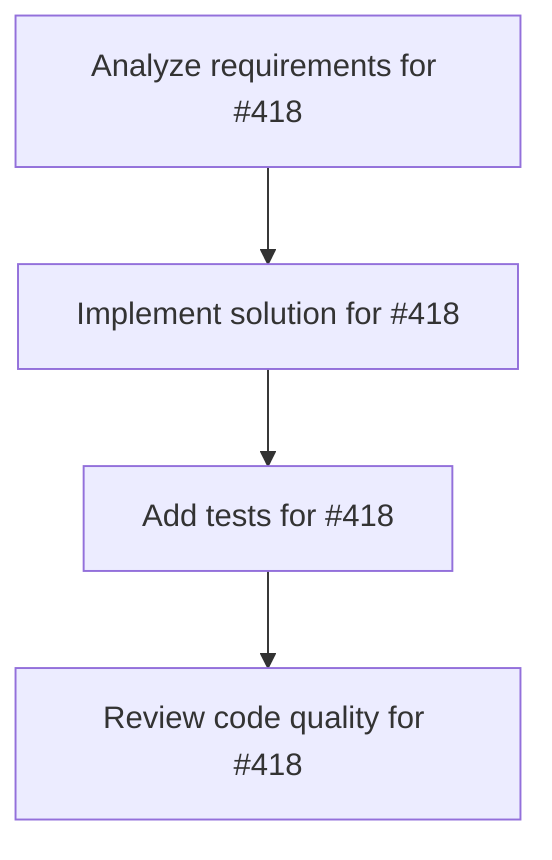

# Plans for Issue #418

**Title**: 🧪 test: Expand integration test coverage from 30% to 60%+

**URL**: https://github.com/customer-cloud/miyabi-private/issues/418

---

## 📋 Summary

- **Total Tasks**: 4
- **Estimated Duration**: 60 minutes
- **Execution Levels**: 4
- **Has Cycles**: ✅ No

## 📝 Task Breakdown

### 1. Analyze requirements for #418

- **ID**: `task-418-analysis`
- **Type**: Docs
- **Assigned Agent**: IssueAgent
- **Priority**: 0
- **Estimated Duration**: 5 min

**Description**: Analyze issue requirements and create detailed specification

### 2. Implement solution for #418

- **ID**: `task-418-impl`
- **Type**: Feature
- **Assigned Agent**: CodeGenAgent
- **Priority**: 1
- **Estimated Duration**: 30 min
- **Dependencies**: task-418-analysis

**Description**: ## 📊 背景
単体テストは80%以上のカバレッジを達成していますが、統合テストは30%にとどまっています。

**現状**:
- ✅ 単体テスト: 80%以上（327テスト）
- ⚠️ 統合テスト: 30%（20テスト）
- **Total**: 347テスト

**問題点**:
- ❌ クレート間の統合動作が未検証
- ❌ Worktree並列実行のテストが不足
- ❌ E2Eシナリオテストが不足
- ❌ エラーハンドリングのテストが不足

## 🎯 目標
統合テストカバレッジを30% → 60%以上に引き上げ、システム全体の品質を保証する。

## ✅ 実施内容

### Phase 1: テストインフラ整備（1週間）
- [ ] 統合テスト用のテストフィクスチャ作成
- [ ] モックGitHub APIサーバー構築
- [ ] テストデータベース（SQLite）セットアップ
- [ ] CI/CD統合テストパイプライン構築

### Phase 2: クレート間統合テスト（2週間）
- [ ] types ↔ core 統合テスト（10テスト）
- [ ] core ↔ github 統合テスト（15テスト）
- [ ] core ↔ worktree 統合テスト（10テスト）
- [ ] agent-core ↔ agents 統合テスト（20テスト）
- [ ] cli ↔ agents 統合テスト（15テスト）

### Phase 3: E2Eシナリオテスト（2週間）
- [ ] Issue作成 → Task分解 → Agent実行 → PR作成（5シナリオ）
- [ ] Worktree並列実行（3 Issues同時処理）（3シナリオ）
- [ ] LLMプロバイダー切り替え（Groq/vLLM/Ollama）（3シナリオ）
- [ ] デプロイパイプライン（Firebase/Vercel/AWS）（3シナリオ）
- [ ] エラーリカバリー（失敗→再試行→成功）（5シナリオ）

### Phase 4: パフォーマンステスト（1週間）
- [ ] ビルド時間測定（目標: 8分以下）
- [ ] Agent実行時間測定（Issue処理: 5分以内）
- [ ] メモリ使用量測定（100MB以下/Agent）
- [ ] 並列実行スケーラビリティ（concurrency=10まで）

## 📈 成功基準
- ✅ 統合テストカバレッジ60%以上
- ✅ E2Eシナリオテスト20個以上
- ✅ パフォーマンステスト10個以上
- ✅ すべてのテストがパス（500テスト以上）
- ✅ CI/CDで自動実行

## 📅 Timeline
- **Priority**: 🔥 P1-High
- **開始**: 2025-10-23
- **完了予定**: 2025-11-20（4週間）

## 📚 関連ドキュメント
- [INTEGRATION_VISUALIZATION.md](crates/INTEGRATION_VISUALIZATION.md)
- [WORKTREE_PROTOCOL.md](docs/WORKTREE_PROTOCOL.md)

### 3. Add tests for #418

- **ID**: `task-418-test`
- **Type**: Test
- **Assigned Agent**: CodeGenAgent
- **Priority**: 2
- **Estimated Duration**: 15 min
- **Dependencies**: task-418-impl

**Description**: Create comprehensive test coverage

### 4. Review code quality for #418

- **ID**: `task-418-review`
- **Type**: Refactor
- **Assigned Agent**: ReviewAgent
- **Priority**: 3
- **Estimated Duration**: 10 min
- **Dependencies**: task-418-test

**Description**: Run quality checks and code review

## 🔄 Execution Plan (DAG Levels)

Tasks can be executed in parallel within each level:

### Level 0 (Parallel Execution)

- `task-418-analysis` - Analyze requirements for #418

### Level 1 (Parallel Execution)

- `task-418-impl` - Implement solution for #418

### Level 2 (Parallel Execution)

- `task-418-test` - Add tests for #418

### Level 3 (Parallel Execution)

- `task-418-review` - Review code quality for #418

## 📊 Dependency Graph

## ⏱️ Timeline Estimation

- **Sequential Execution**: 60 minutes (1.0 hours)
- **Parallel Execution (Critical Path)**: 10 minutes (0.2 hours)
- **Estimated Speedup**: 6.0x

---

*Generated by CoordinatorAgent on 2025-10-30 17:47:28 UTC*
