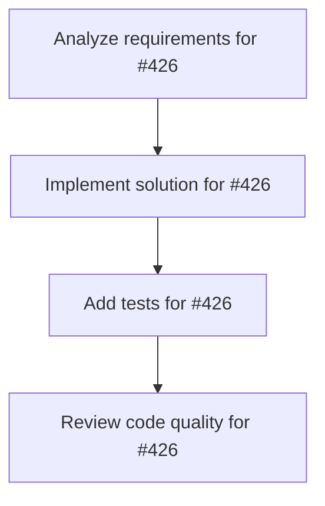

# Plans for Issue #426

**Title**: 【Phase 1】Web基盤 - GitHub OAuth認証とダッシュボード実装

**URL**: https://github.com/customer-cloud/miyabi-private/issues/426

---

## 📋 Summary

- **Total Tasks**: 4
- **Estimated Duration**: 60 minutes
- **Execution Levels**: 4
- **Has Cycles**: ✅ No

## 📝 Task Breakdown

### 1. Analyze requirements for #426

- **ID**: `task-426-analysis`
- **Type**: Docs
- **Assigned Agent**: IssueAgent
- **Priority**: 0
- **Estimated Duration**: 5 min

**Description**: Analyze issue requirements and create detailed specification

### 2. Implement solution for #426

- **ID**: `task-426-impl`
- **Type**: Feature
- **Assigned Agent**: CodeGenAgent
- **Priority**: 1
- **Estimated Duration**: 30 min
- **Dependencies**: task-426-analysis

**Description**: ## 概要

Week 3-6で実施するWeb基盤フェーズ。GitHub OAuth認証、ダッシュボード、Issue一覧表示を実装。

## タスク一覧

### 1.1 認証機能
- [ ] GitHub OAuth実装（Rust）
- [ ] JWTトークン生成/検証
- [ ] 認証ミドルウェア実装
- [ ] ログイン画面実装（React）
- [ ] 認証状態管理（Zustand）

### 1.2 ダッシュボード（ホーム画面）
- [ ] ダッシュボードレイアウト実装
- [ ] ヘッダー/サイドバー実装
- [ ] サマリーカード実装（実行中/完了/エラー数）
- [ ] 最近のAgent実行履歴一覧
- [ ] ダッシュボードAPI実装（Rust）

### 1.3 Issue一覧画面
- [ ] リポジトリ選択機能
- [ ] Issue一覧テーブル表示
- [ ] ステータスフィルター（open/closed）
- [ ] ラベルフィルター
- [ ] 検索・ソート機能
- [ ] Issue詳細モーダル
- [ ] GitHub API統合（Rust）

## 実装ファイル

**フロントエンド**:
- `app/login/page.tsx` - ログイン画面
- `app/dashboard/page.tsx` - ダッシュボード
- `app/dashboard/layout.tsx` - レイアウト
- `hooks/useAuth.ts` - 認証フック
- `stores/authStore.ts` - Zustand store

**バックエンド**:
- `miyabi-web-api/src/handlers/auth.rs` - 認証ハンドラ
- `miyabi-web-api/src/handlers/dashboard.rs` - ダッシュボードAPI
- `miyabi-web-api/src/handlers/repositories.rs` - リポジトリAPI

## 成功基準

- [ ] GitHub OAuthでログイン可能
- [ ] ダッシュボードでサマリー表示
- [ ] Issue一覧表示・フィルター動作
- [ ] Vercelにデプロイ完了
- [ ] AWS Lambdaにデプロイ完了

## 期限

Week 6完了（2025年12月中旬）

## 関連ドキュメント

- `docs/TECHNICAL_REQUIREMENTS.md` - Phase 1詳細
- `docs/UI_REFERENCES.md` - 参考UIデザイン

### 3. Add tests for #426

- **ID**: `task-426-test`
- **Type**: Test
- **Assigned Agent**: CodeGenAgent
- **Priority**: 2
- **Estimated Duration**: 15 min
- **Dependencies**: task-426-impl

**Description**: Create comprehensive test coverage

### 4. Review code quality for #426

- **ID**: `task-426-review`
- **Type**: Refactor
- **Assigned Agent**: ReviewAgent
- **Priority**: 3
- **Estimated Duration**: 10 min
- **Dependencies**: task-426-test

**Description**: Run quality checks and code review

## 🔄 Execution Plan (DAG Levels)

Tasks can be executed in parallel within each level:

### Level 0 (Parallel Execution)

- `task-426-analysis` - Analyze requirements for #426

### Level 1 (Parallel Execution)

- `task-426-impl` - Implement solution for #426

### Level 2 (Parallel Execution)

- `task-426-test` - Add tests for #426

### Level 3 (Parallel Execution)

- `task-426-review` - Review code quality for #426

## 📊 Dependency Graph

## ⏱️ Timeline Estimation

- **Sequential Execution**: 60 minutes (1.0 hours)
- **Parallel Execution (Critical Path)**: 10 minutes (0.2 hours)
- **Estimated Speedup**: 6.0x

---

*Generated by CoordinatorAgent on 2025-11-01 11:17:47 UTC*
