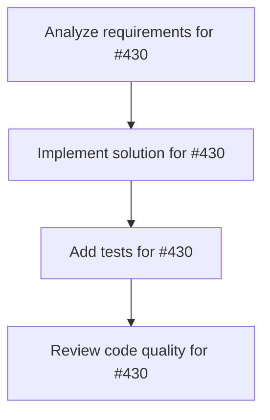

# Plans for Issue #430

**Title**: 【Phase 5】モバイル対応 - レスポンシブデザインとPWA化

**URL**: https://github.com/customer-cloud/miyabi-private/issues/430

---

## 📋 Summary

- **Total Tasks**: 4
- **Estimated Duration**: 60 minutes
- **Execution Levels**: 4
- **Has Cycles**: ✅ No

## 📝 Task Breakdown

### 1. Analyze requirements for #430

- **ID**: `task-430-analysis`
- **Type**: Docs
- **Assigned Agent**: IssueAgent
- **Priority**: 0
- **Estimated Duration**: 5 min

**Description**: Analyze issue requirements and create detailed specification

### 2. Implement solution for #430

- **ID**: `task-430-impl`
- **Type**: Feature
- **Assigned Agent**: CodeGenAgent
- **Priority**: 1
- **Estimated Duration**: 30 min
- **Dependencies**: task-430-analysis

**Description**: ## 概要

Week 15-16で実施するモバイル対応フェーズ。レスポンシブデザイン、PWA化、プッシュ通知を実装。

## タスク一覧

### 5.1 レスポンシブデザイン
- [ ] 全ページでTailwindブレークポイント対応
  - [ ] `sm:` (640px)
  - [ ] `md:` (768px)
  - [ ] `lg:` (1024px)
  - [ ] `xl:` (1280px)
- [ ] モバイルナビゲーション実装（ハンバーガーメニュー）
- [ ] タブレット対応
- [ ] タッチジェスチャー対応

### 5.2 PWA対応
- [ ] `next-pwa` インストール・統合
- [ ] Service Worker設定
- [ ] `manifest.json` 作成
  - [ ] アプリ名、アイコン、テーマカラー
  - [ ] スタンドアローンモード設定
- [ ] オフライン対応
- [ ] キャッシュ戦略実装

### 5.3 プッシュ通知
- [ ] Web Push API統合
- [ ] 通知許可リクエスト
- [ ] Agent完了通知
- [ ] Agent失敗通知
- [ ] 通知設定画面

## 実装ファイル

**設定ファイル**:
- `next.config.js` - next-pwa設定
- `public/manifest.json` - PWA Manifest
- `public/sw.js` - Service Worker

**フロントエンド**:
- `components/layout/MobileNav.tsx` - モバイルナビ
- `hooks/usePushNotification.ts` - プッシュ通知フック
- `app/settings/notifications/page.tsx` - 通知設定

## 成功基準

- [ ] スマートフォンで全機能動作
- [ ] ホーム画面に追加可能
- [ ] オフラインでも一部機能動作
- [ ] プッシュ通知受信可能
- [ ] **Web UI完全版リリース準備完了** ✅

## 期限

**Week 16完了（2026年2月中旬）** - 🎯 **Web UI Complete Milestone**

## 関連ドキュメント

- `docs/TECHNICAL_REQUIREMENTS.md` - Phase 5詳細
- `docs/NO_CODE_UI_STRATEGY.md` - モバイルファースト戦略

### 3. Add tests for #430

- **ID**: `task-430-test`
- **Type**: Test
- **Assigned Agent**: CodeGenAgent
- **Priority**: 2
- **Estimated Duration**: 15 min
- **Dependencies**: task-430-impl

**Description**: Create comprehensive test coverage

### 4. Review code quality for #430

- **ID**: `task-430-review`
- **Type**: Refactor
- **Assigned Agent**: ReviewAgent
- **Priority**: 3
- **Estimated Duration**: 10 min
- **Dependencies**: task-430-test

**Description**: Run quality checks and code review

## 🔄 Execution Plan (DAG Levels)

Tasks can be executed in parallel within each level:

### Level 0 (Parallel Execution)

- `task-430-analysis` - Analyze requirements for #430

### Level 1 (Parallel Execution)

- `task-430-impl` - Implement solution for #430

### Level 2 (Parallel Execution)

- `task-430-test` - Add tests for #430

### Level 3 (Parallel Execution)

- `task-430-review` - Review code quality for #430

## 📊 Dependency Graph

## ⏱️ Timeline Estimation

- **Sequential Execution**: 60 minutes (1.0 hours)
- **Parallel Execution (Critical Path)**: 10 minutes (0.2 hours)
- **Estimated Speedup**: 6.0x

---

*Generated by CoordinatorAgent on 2025-10-30 17:47:22 UTC*
