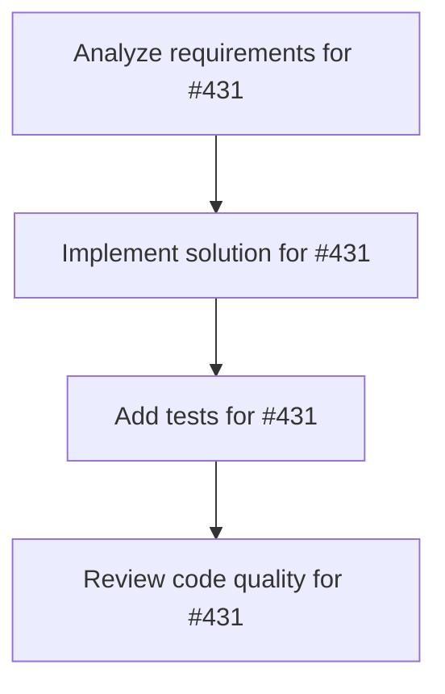

# Plans for Issue #431

**Title**: 【Phase 6】LINE Bot統合 - 自然言語処理とプッシュ通知（Full Release）

**URL**: https://github.com/customer-cloud/miyabi-private/issues/431

---

## 📋 Summary

- **Total Tasks**: 4
- **Estimated Duration**: 60 minutes
- **Execution Levels**: 4
- **Has Cycles**: ✅ No

## 📝 Task Breakdown

### 1. Analyze requirements for #431

- **ID**: `task-431-analysis`
- **Type**: Docs
- **Assigned Agent**: IssueAgent
- **Priority**: 0
- **Estimated Duration**: 5 min

**Description**: Analyze issue requirements and create detailed specification

### 2. Implement solution for #431

- **ID**: `task-431-impl`
- **Type**: Feature
- **Assigned Agent**: CodeGenAgent
- **Priority**: 1
- **Estimated Duration**: 30 min
- **Dependencies**: task-431-analysis

**Description**: ## 概要

Week 17-18で実施するLINE Bot統合フェーズ。LINE Messaging API統合、GPT-4自然言語処理、リッチメニュー実装。**日本市場向け独自機能完成、70%コンバージョン率達成**。

## タスク一覧

### 6.1 LINE Messaging API統合
- [ ] LINE Developersアカウント作成
- [ ] Messaging API Channel作成
- [ ] Channel Access Token取得
- [ ] Webhook URL設定（`https://api.miyabi.dev/line/webhook`）
- [ ] LINE署名検証実装

### 6.2 LINE Webhook実装（Rust）
- [ ] `POST /line/webhook` エンドポイント実装
- [ ] メッセージイベント処理
- [ ] ポストバックイベント処理
- [ ] LINE返信API実装
  - [ ] テキストメッセージ送信
  - [ ] Flex Message送信
  - [ ] プッシュメッセージ送信

### 6.3 GPT-4自然言語処理統合
- [ ] OpenAI APIクライアント実装（`openai.rs`）
- [ ] GPT-4プロンプト設計
  - [ ] システムプロンプト（開発タスク分析アシスタント）
  - [ ] ユーザーメッセージ解析
- [ ] 自然言語→構造化Issue変換
  - [ ] タイトル生成
  - [ ] 詳細説明生成（Markdown形式）
  - [ ] Agent自動選択（Coordinator, CodeGen, Review等）
  - [ ] 優先度自動判定（P0-P3）

### 6.4 リッチメニュー実装
- [ ] リッチメニューデザイン作成（6ボタン）
  - [ ] Agent一覧
  - [ ] 実行状況確認
  - [ ] 設定
  - [ ] ヘルプ
  - [ ] GitHub連携
  - [ ] マイページ
- [ ] LINE Developers管理画面で設定
- [ ] ポストバックアクション設定

### 6.5 ユーザーフロー実装
```
User: 「ログイン機能にGoogle OAuth追加して」 (via LINE)
  ↓
Miyabi Bot: 「Issue #280を作成し、しきるんで処理開始」
  ↓ (5 minutes later)
Miyabi Bot: 「✅ 完了！品質スコア95点、PR #145作成」
```

- [ ] LINE→GitHub Issue自動作成
- [ ] Agent自動実行
- [ ] 進捗通知（開始、50%, 100%）
- [ ] 完了通知（PR番号、品質スコア）

## 実装ファイル

**バックエンド**:
- `miyabi-web-api/src/integrations/line.rs` - LINE API Client
- `miyabi-web-api/src/integrations/openai.rs` - OpenAI API Client
- `miyabi-web-api/src/handlers/line.rs` - LINE Webhook Handler

## 成功基準

- [ ] LINEからメッセージ送信でIssue自動作成
- [ ] GPT-4で自然言語解析動作
- [ ] Agent自動実行動作
- [ ] リッチメニュー表示
- [ ] プッシュ通知動作
- [ ] **LINE Bot公開 🚀**
- [ ] **70%コンバージョン率達成** ✅
- [ ] **Year 1 ¥1.65M profit達成** ✅

## ビジネスインパクト

| 指標 | Web UI only | Web UI + LINE Bot | 改善率 |
|------|-------------|-------------------|--------|
| **コンバージョン率** | 50% | 70% | +40% |
| **契約数** | 6社 | 9社 | +50% |
| **売上** | ¥8.25M | ¥11.55M | +40% |
| **利益（Year 1）** | -¥0.47M (赤字) | **¥1.65M (黒字)** ✅ | 黒転 |

## 期限

**Week 18完了（2026年2月下旬）** - 🚀 **LINE Bot Release / Full Release Milestone**

## 関連ドキュメント

- `docs/TECHNICAL_REQUIREMENTS.md` - Phase 6詳細
- `docs/NO_CODE_UI_STRATEGY.md` - LINE Bot戦略（v1.1 Phase 6）
- `docs/INTEGRATED_EXECUTION_PLAN.md` - 財務計画・ROI分析

### 3. Add tests for #431

- **ID**: `task-431-test`
- **Type**: Test
- **Assigned Agent**: CodeGenAgent
- **Priority**: 2
- **Estimated Duration**: 15 min
- **Dependencies**: task-431-impl

**Description**: Create comprehensive test coverage

### 4. Review code quality for #431

- **ID**: `task-431-review`
- **Type**: Refactor
- **Assigned Agent**: ReviewAgent
- **Priority**: 3
- **Estimated Duration**: 10 min
- **Dependencies**: task-431-test

**Description**: Run quality checks and code review

## 🔄 Execution Plan (DAG Levels)

Tasks can be executed in parallel within each level:

### Level 0 (Parallel Execution)

- `task-431-analysis` - Analyze requirements for #431

### Level 1 (Parallel Execution)

- `task-431-impl` - Implement solution for #431

### Level 2 (Parallel Execution)

- `task-431-test` - Add tests for #431

### Level 3 (Parallel Execution)

- `task-431-review` - Review code quality for #431

## 📊 Dependency Graph



## ⏱️ Timeline Estimation

- **Sequential Execution**: 60 minutes (1.0 hours)
- **Parallel Execution (Critical Path)**: 10 minutes (0.2 hours)
- **Estimated Speedup**: 6.0x

---

*Generated by CoordinatorAgent on 2025-11-01 11:17:47 UTC*
