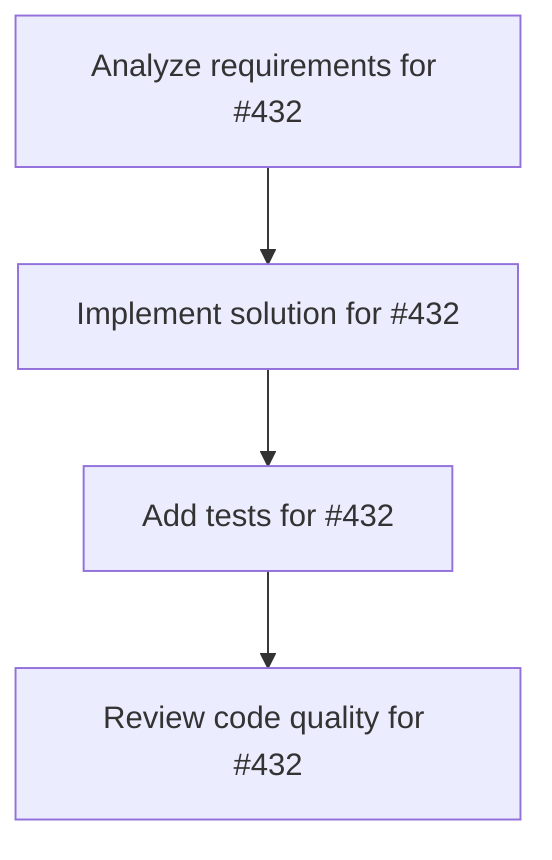

# Plans for Issue #432

**Title**: 【Feature】miyabi-knowledge: 増分インデックス化（Incremental Indexing） - Phase 2

**URL**: https://github.com/customer-cloud/miyabi-private/issues/432

---

## 📋 Summary

- **Total Tasks**: 4
- **Estimated Duration**: 60 minutes
- **Execution Levels**: 4
- **Has Cycles**: ✅ No

## 📝 Task Breakdown

### 1. Analyze requirements for #432

- **ID**: `task-432-analysis`
- **Type**: Docs
- **Assigned Agent**: IssueAgent
- **Priority**: 0
- **Estimated Duration**: 5 min

**Description**: Analyze issue requirements and create detailed specification

### 2. Implement solution for #432

- **ID**: `task-432-impl`
- **Type**: Feature
- **Assigned Agent**: CodeGenAgent
- **Priority**: 1
- **Estimated Duration**: 30 min
- **Dependencies**: task-432-analysis

**Description**: ## 📋 概要

既にインデックス済みのログをスキップし、新規ログのみを処理する増分インデックス化機能を実装します。

**親Issue**: #421 (Phase 2)
**依存Issue**: #422 (Phase 1完了 ✅)

## 🎯 目的

- 2回目以降のインデックス化を**10倍以上高速化**
- 変更されたログのみを自動検出して再インデックス化
- ストレージI/O負荷を削減

## 🔧 実装内容

### 1. インデックス済みログ追跡

**ファイル**: `crates/miyabi-knowledge/src/cache.rs` (新規作成)

```rust
use std::collections::HashMap;
use std::path::PathBuf;
use serde::{Serialize, Deserialize};

#[derive(Debug, Clone, Serialize, Deserialize)]
pub struct IndexCache {
    /// ログファイルパス → SHA256ハッシュ
    pub indexed_files: HashMap<PathBuf, String>,
    
    /// 最終インデックス化タイムスタンプ
    pub last_indexed_at: chrono::DateTime<chrono::Utc>,
    
    /// ワークスペース名
    pub workspace: String,
}

impl IndexCache {
    pub fn load_or_default(workspace: &str) -> Result<Self>;
    pub fn save(&self) -> Result<()>;
    pub fn is_indexed(&self, path: &PathBuf, hash: &str) -> bool;
    pub fn mark_indexed(&mut self, path: PathBuf, hash: String);
}
```

**キャッシュファイルパス**: `~/.cache/miyabi/knowledge/{workspace}.json`

### 2. ファイルハッシュ計算

**ファイル**: `crates/miyabi-knowledge/src/hasher.rs` (新規作成)

```rust
use sha2::{Sha256, Digest};
use std::path::Path;

pub fn hash_file<P: AsRef<Path>>(path: P) -> Result<String> {
    let content = std::fs::read(path)?;
    let mut hasher = Sha256::new();
    hasher.update(&content);
    Ok(format!("{:x}", hasher.finalize()))
}
```

### 3. 差分検出ロジック

**ファイル**: `crates/miyabi-knowledge/src/indexer.rs` (拡張)

```rust
impl KnowledgeIndexer {
    /// 増分インデックス化（変更されたログのみ）
    pub async fn index_workspace_incremental(
        &self,
        workspace: &str,
    ) -> Result<IndexStats> {
        let cache = IndexCache::load_or_default(workspace)?;
        let log_files = self.collect_log_files()?;
        
        let mut to_index = Vec::new();
        for file in log_files {
            let hash = hash_file(&file)?;
            if !cache.is_indexed(&file, &hash) {
                to_index.push(file);
            }
        }
        
        tracing::info!(
            "Incremental index: {} of {} files need indexing",
            to_index.len(),
            log_files.len()
        );
        
        // 変更されたファイルのみインデックス化
        self.index_files(to_index).await
    }
}
```

### 4. CLI拡張

**ファイル**: `crates/miyabi-cli/src/commands/knowledge.rs` (拡張)

```rust
#[derive(Subcommand)]
pub enum KnowledgeCommand {
    // 既存コマンド
    Search { ... },
    Stats { ... },
    Config { ... },
    
    // 拡張
    Index {
        workspace: String,
        
        /// 増分インデックス化（デフォルト）
        #[arg(long, default_value = "true")]
        incremental: bool,
        
        /// 全ログ再インデックス化
        #[arg(long)]
        full: bool,
    },
    
    /// インデックスキャッシュをクリア
    ClearCache {
        /// ワークスペース（省略時は全ワークスペース）
        workspace: Option<String>,
    },
}
```

**使用例**:
```bash
# 増分インデックス化（デフォルト）
miyabi knowledge index my-workspace

# 全ログ再インデックス化
miyabi knowledge index my-workspace --full

# キャッシュクリア
miyabi knowledge clear-cache
miyabi knowledge clear-cache my-workspace
```

### 5. 統計情報拡張

**ファイル**: `crates/miyabi-knowledge/src/types.rs` (拡張)

```rust
#[derive(Debug, Clone, Serialize, Deserialize)]
pub struct IndexStats {
    pub total_files: usize,
    pub indexed_files: usize,
    pub skipped_files: usize,  // 新規追加
    pub success: usize,
    pub failed: usize,
    pub duration_secs: f64,
}
```

## ✅ 成功基準

- [ ] 2回目以降のインデックス化が10倍以上高速化
  - 初回: 100ファイル → 30秒
  - 2回目: 100ファイル（変更なし） → 3秒以内
- [ ] 100ログ中1ログ変更時、99ログはスキップされる
- [ ] キャッシュ破損時も正常動作（フルインデックスにフォールバック）
- [ ] `miyabi knowledge stats`にスキップ統計が表示される

## 🧪 テスト項目

### 単体テスト (`crates/miyabi-knowledge/tests/cache_tests.rs`)

- [ ] `test_index_cache_load_or_default()`
- [ ] `test_index_cache_save()`
- [ ] `test_index_cache_is_indexed()`
- [ ] `test_hash_file()`
- [ ] `test_hash_file_consistency()`

### 統合テスト (`crates/miyabi-knowledge/tests/incremental_tests.rs`)

- [ ] `test_incremental_index_no_changes()` - 変更なし時のスキップ
- [ ] `test_incremental_index_one_change()` - 1ファイル変更時
- [ ] `test_incremental_index_cache_corruption()` - キャッシュ破損時のフォールバック
- [ ] `test_incremental_index_new_workspace()` - 新規ワークスペース

### パフォーマンステスト

- [ ] 1000ファイル初回インデックス: 5分以内
- [ ] 1000ファイル2回目（変更なし）: 30秒以内
- [ ] 1000ファイル中10ファイル変更: 1分以内

## 📊 推定工数

- **設計**: 0.5日
- **実装**: 3日
  - キャッシュシステム: 1日
  - 差分検出ロジック: 1日
  - CLI拡張: 0.5日
  - 統計拡張: 0.5日
- **テスト作成**: 1日
- **ドキュメント更新**: 0.5日

**合計**: 5日

## 🔗 関連ファイル

- **新規作成**:
  - `crates/miyabi-knowledge/src/cache.rs`
  - `crates/miyabi-knowledge/src/hasher.rs`
  - `crates/miyabi-knowledge/tests/cache_tests.rs`
  - `crates/miyabi-knowledge/tests/incremental_tests.rs`

- **拡張**:
  - `crates/miyabi-knowledge/src/indexer.rs`
  - `crates/miyabi-knowledge/src/types.rs`
  - `crates/miyabi-cli/src/commands/knowledge.rs`
  - `crates/miyabi-knowledge/USER_GUIDE.md`

## 📝 注意事項

1. **キャッシュファイル形式**: JSON（人間可読、デバッグ容易）
2. **ハッシュアルゴリズム**: SHA256（衝突耐性、標準ライブラリ）
3. **エラーハンドリング**: キャッシュ破損時は`tracing::warn!()`でフルインデックスにフォールバック
4. **並行実行**: 複数プロセスでの同時インデックス化は未サポート（Phase 3で対応）

---

**Parent Issue**: #421
**Phase**: Phase 2 - 増分インデックス化
**Priority**: 🔥 P0-Critical
**Estimated**: 5日

### 3. Add tests for #432

- **ID**: `task-432-test`
- **Type**: Test
- **Assigned Agent**: CodeGenAgent
- **Priority**: 2
- **Estimated Duration**: 15 min
- **Dependencies**: task-432-impl

**Description**: Create comprehensive test coverage

### 4. Review code quality for #432

- **ID**: `task-432-review`
- **Type**: Refactor
- **Assigned Agent**: ReviewAgent
- **Priority**: 3
- **Estimated Duration**: 10 min
- **Dependencies**: task-432-test

**Description**: Run quality checks and code review

## 🔄 Execution Plan (DAG Levels)

Tasks can be executed in parallel within each level:

### Level 0 (Parallel Execution)

- `task-432-analysis` - Analyze requirements for #432

### Level 1 (Parallel Execution)

- `task-432-impl` - Implement solution for #432

### Level 2 (Parallel Execution)

- `task-432-test` - Add tests for #432

### Level 3 (Parallel Execution)

- `task-432-review` - Review code quality for #432

## 📊 Dependency Graph



## ⏱️ Timeline Estimation

- **Sequential Execution**: 60 minutes (1.0 hours)
- **Parallel Execution (Critical Path)**: 10 minutes (0.2 hours)
- **Estimated Speedup**: 6.0x

---

*Generated by CoordinatorAgent on 2025-11-01 11:17:48 UTC*
