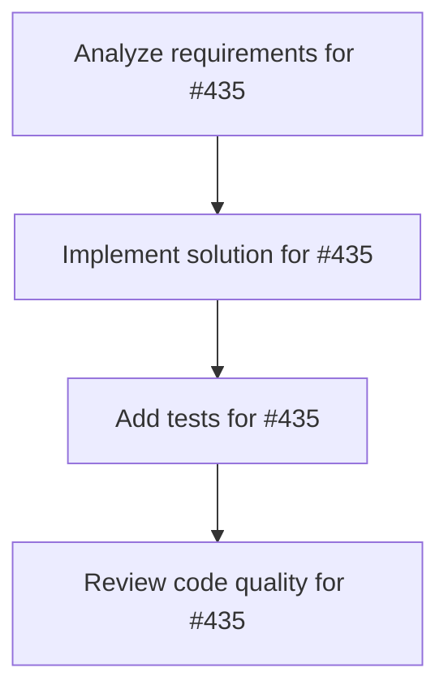

# Plans for Issue #435

**Title**: feat(dashboard): Add animation enhancements to Vector Space Universe TaskStars

**URL**: https://github.com/customer-cloud/miyabi-private/issues/435

---

## 📋 Summary

- **Total Tasks**: 4
- **Estimated Duration**: 60 minutes
- **Execution Levels**: 4
- **Has Cycles**: ✅ No

## 📝 Task Breakdown

### 1. Analyze requirements for #435

- **ID**: `task-435-analysis`
- **Type**: Docs
- **Assigned Agent**: IssueAgent
- **Priority**: 0
- **Estimated Duration**: 5 min

**Description**: Analyze issue requirements and create detailed specification

### 2. Implement solution for #435

- **ID**: `task-435-impl`
- **Type**: Feature
- **Assigned Agent**: CodeGenAgent
- **Priority**: 1
- **Estimated Duration**: 30 min
- **Dependencies**: task-435-analysis

**Description**: ## 🎯 Objective
Enhance TaskStar visualizations with smooth animations: rotation, pulsing for working tasks, and transitions.

## 📋 Requirements
- [ ] Add `useFrame` hook for continuous animation
- [ ] Implement slow rotation for all TaskStars (Y-axis)
- [ ] Add pulsing animation for `working` status tasks
- [ ] Add smooth scale transitions on hover
- [ ] Add particle effects for completed tasks
- [ ] Implement fade-in animation on mount
- [ ] Add camera auto-rotation toggle

## 🎨 Design
```tsx
import { useFrame } from '@react-three/fiber';

function TaskStar({ taskVector }: { taskVector: TaskVector }) {
  const meshRef = useRef<THREE.Mesh>(null);
  
  useFrame((state, delta) => {
    if (meshRef.current) {
      // Slow rotation
      meshRef.current.rotation.y += delta * 0.2;
      
      // Pulsing for working tasks
      if (task.status === 'working') {
        const scale = 1 + Math.sin(state.clock.elapsedTime * 2) * 0.1;
        meshRef.current.scale.setScalar(scale);
      }
    }
  });
  
  return (
    <mesh ref={meshRef}>
      {/* ... */}
    </mesh>
  );
}
```

## 📁 Files
- `crates/miyabi-a2a/dashboard/src/components/vector-space-universe.tsx`

## 🔗 Related
- Part of Vector Space Universe Infinity Mode
- Enhances user engagement

## ✅ Acceptance Criteria
- Rotation is smooth (no jank)
- Pulsing is visible but not distracting
- Animations do not impact performance (60 FPS)
- Camera auto-rotation can be toggled

### 3. Add tests for #435

- **ID**: `task-435-test`
- **Type**: Test
- **Assigned Agent**: CodeGenAgent
- **Priority**: 2
- **Estimated Duration**: 15 min
- **Dependencies**: task-435-impl

**Description**: Create comprehensive test coverage

### 4. Review code quality for #435

- **ID**: `task-435-review`
- **Type**: Refactor
- **Assigned Agent**: ReviewAgent
- **Priority**: 3
- **Estimated Duration**: 10 min
- **Dependencies**: task-435-test

**Description**: Run quality checks and code review

## 🔄 Execution Plan (DAG Levels)

Tasks can be executed in parallel within each level:

### Level 0 (Parallel Execution)

- `task-435-analysis` - Analyze requirements for #435

### Level 1 (Parallel Execution)

- `task-435-impl` - Implement solution for #435

### Level 2 (Parallel Execution)

- `task-435-test` - Add tests for #435

### Level 3 (Parallel Execution)

- `task-435-review` - Review code quality for #435

## 📊 Dependency Graph



## ⏱️ Timeline Estimation

- **Sequential Execution**: 60 minutes (1.0 hours)
- **Parallel Execution (Critical Path)**: 10 minutes (0.2 hours)
- **Estimated Speedup**: 6.0x

---

*Generated by CoordinatorAgent on 2025-10-30 17:47:29 UTC*
