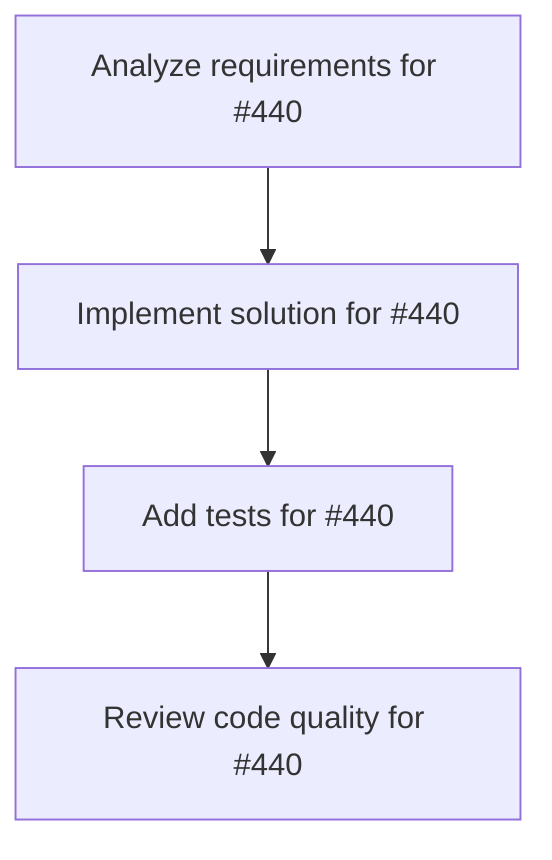

# Plans for Issue #440

**Title**: chore(deps): Bump sqlx from 0.7.4 to 0.8.6

**URL**: https://github.com/customer-cloud/miyabi-private/pull/440

---

## 📋 Summary

- **Total Tasks**: 4
- **Estimated Duration**: 60 minutes
- **Execution Levels**: 4
- **Has Cycles**: ✅ No

## 📝 Task Breakdown

### 1. Analyze requirements for #440

- **ID**: `task-440-analysis`
- **Type**: Docs
- **Assigned Agent**: IssueAgent
- **Priority**: 0
- **Estimated Duration**: 5 min

**Description**: Analyze issue requirements and create detailed specification

### 2. Implement solution for #440

- **ID**: `task-440-impl`
- **Type**: Feature
- **Assigned Agent**: CodeGenAgent
- **Priority**: 1
- **Estimated Duration**: 30 min
- **Dependencies**: task-440-analysis

**Description**: Bumps [sqlx](https://github.com/launchbadge/sqlx) from 0.7.4 to 0.8.6.

Changelog

<em>Sourced from <a href="https://github.com/launchbadge/sqlx/blob/main/CHANGELOG.md">sqlx's changelog</a>.</em>

<blockquote>
<h2>0.8.6 - 2025-05-19</h2>

9 pull requests were merged this release cycle.

<h3>Added</h3>
<ul>
<li>[<a href="https://redirect.github.com/launchbadge/sqlx/issues/3849">#3849</a>]: Add color and wrapping to cli help text [[<a href="https://github.com/joshka"><code>@​joshka</code></a>]]</li>
</ul>
<h3>Changed</h3>
<ul>
<li>[<a href="https://redirect.github.com/launchbadge/sqlx/issues/3830">#3830</a>]: build: drop unused <code>tempfile</code> dependency [[<a href="https://github.com/paolobarbolini"><code>@​paolobarbolini</code></a>]]</li>
<li>[<a href="https://redirect.github.com/launchbadge/sqlx/issues/3845">#3845</a>]: chore: clean up no longer used imports [[<a href="https://github.com/tisonkun"><code>@​tisonkun</code></a>]]</li>
<li>[<a href="https://redirect.github.com/launchbadge/sqlx/issues/3863">#3863</a>]: Use unnamed statement in pg when not persistent [[<a href="https://github.com/ThomWright"><code>@​ThomWright</code></a>]]</li>
<li>[<a href="https://redirect.github.com/launchbadge/sqlx/issues/3866">#3866</a>]: chore(doc): clarify compile-time verification and case conversion behavior [[<a href="https://github.com/duhby"><code>@​duhby</code></a>]]</li>
</ul>
<h3>Fixed</h3>
<ul>
<li>[<a href="https://redirect.github.com/launchbadge/sqlx/issues/3840">#3840</a>]: Fix docs.rs build of sqlx-sqlite [[<a href="https://github.com/gferon"><code>@​gferon</code></a>]]</li>
<li>[<a href="https://redirect.github.com/launchbadge/sqlx/issues/3848">#3848</a>]: fix(macros): don't mutate environment variables [[<a href="https://github.com/joeydewaal"><code>@​joeydewaal</code></a>]]</li>
<li>[<a href="https://redirect.github.com/launchbadge/sqlx/issues/3855">#3855</a>]: fix <code>attrubute</code> typo in doc [[<a href="https://github.com/kujeger"><code>@​kujeger</code></a>]]</li>
<li>[<a href="https://redirect.github.com/launchbadge/sqlx/issues/3856">#3856</a>]: fix(macros): slightly improve unsupported type error message [[<a href="https://github.com/dyc3"><code>@​dyc3</code></a>]]</li>
</ul>

<a href="https://redirect.github.com/launchbadge/sqlx/issues/3830">#3830</a>: <a href="https://redirect.github.com/launchbadge/sqlx/pull/3830">launchbadge/sqlx#3830</a>
<a href="https://redirect.github.com/launchbadge/sqlx/issues/3840">#3840</a>: <a href="https://redirect.github.com/launchbadge/sqlx/pull/3840">launchbadge/sqlx#3840</a>
<a href="https://redirect.github.com/launchbadge/sqlx/issues/3845">#3845</a>: <a href="https://redirect.github.com/launchbadge/sqlx/pull/3845">launchbadge/sqlx#3845</a>
<a href="https://redirect.github.com/launchbadge/sqlx/issues/3848">#3848</a>: <a href="https://redirect.github.com/launchbadge/sqlx/pull/3848">launchbadge/sqlx#3848</a>
<a href="https://redirect.github.com/launchbadge/sqlx/issues/3849">#3849</a>: <a href="https://redirect.github.com/launchbadge/sqlx/pull/3849">launchbadge/sqlx#3849</a>
<a href="https://redirect.github.com/launchbadge/sqlx/issues/3855">#3855</a>: <a href="https://redirect.github.com/launchbadge/sqlx/pull/3855">launchbadge/sqlx#3855</a>
<a href="https://redirect.github.com/launchbadge/sqlx/issues/3856">#3856</a>: <a href="https://redirect.github.com/launchbadge/sqlx/pull/3856">launchbadge/sqlx#3856</a>
<a href="https://redirect.github.com/launchbadge/sqlx/issues/3863">#3863</a>: <a href="https://redirect.github.com/launchbadge/sqlx/pull/3863">launchbadge/sqlx#3863</a>
<a href="https://redirect.github.com/launchbadge/sqlx/issues/3866">#3866</a>: <a href="https://redirect.github.com/launchbadge/sqlx/pull/3866">launchbadge/sqlx#3866</a>

<h2>0.8.5 - 2025-04-14</h2>

Hotfix release to address two new issues:

<ul>
<li>[<a href="https://redirect.github.com/launchbadge/sqlx/issues/3823">#3823</a>]: <code>sqlx-cli@0.8.4</code> broke <code>.env</code> default resolution mechanism</li>
<li>[<a href="https://redirect.github.com/launchbadge/sqlx/issues/3825">#3825</a>]: <code>sqlx@0.8.4</code> broke test fixture setup</li>
</ul>

The <code>0.8.4</code> release will be yanked as of publishing this one.

<h3>Added</h3>
<ul>
<li>In release PR: <code>sqlx-cli</code> now accepts <code>--no-dotenv</code> in subcommand arguments.</li>
<li>In release PR: added functionality tests for <code>sqlx-cli</code> to CI.</li>
<li>In release PR: test <code>#[sqlx::test]</code> twice in CI to cover cleanup.</li>
</ul>
<h3>Fixed</h3>
<ul>
<li>In release PR: <code>sqlx-cli</code> correctly reads <code>.env</code> files by default again.
<ul>
<li>Addresses [<a href="https://redirect.github.com/launchbadge/sqlx/issues/3823">#3823</a>].</li>
</ul>
</li>
<li>In release PR: fix bugs in MySQL implementation of <code>#[sqlx::test]</code>.
<ul>
<li>Addresses [<a href="https://redirect.github.com/launchbadge/sqlx/issues/3825">#3825</a>].</li>
</ul>
</li>
</ul>

<a href="https://redirect.github.com/launchbadge/sqlx/issues/3823">#3823</a>: <a href="https://redirect.github.com/launchbadge/sqlx/issues/3823">launchbadge/sqlx#3823</a>
<a href="https://redirect.github.com/launchbadge/sqlx/issues/3825">#3825</a>: <a href="https://redirect.github.com/launchbadge/sqlx/issues/3825">launchbadge/sqlx#3825</a>

<!-- raw HTML omitted -->
</blockquote>

... (truncated)

Commits

<ul>
<li><a href="https://github.com/launchbadge/sqlx/commit/bab1b022bd56a64f9a08b46b36b97c5cff19d77e"><code>bab1b02</code></a> 0.8.6 release (<a href="https://redirect.github.com/launchbadge/sqlx/issues/3870">#3870</a>)</li>
<li><a href="https://github.com/launchbadge/sqlx/commit/b27b47ce5350d1110e2a32e54809da1d32ec1d88"><code>b27b47c</code></a> Pick default features to fix docs.rs build of sqlx-sqlite (<a href="https://redirect.github.com/launchbadge/sqlx/issues/3840">#3840</a>)</li>
<li><a href="https://github.com/launchbadge/sqlx/commit/d335f782cf4a607fd2667c04ede5e10db694f5fd"><code>d335f78</code></a> Use unnamed statement in pg when not persistent (<a href="https://redirect.github.com/launchbadge/sqlx/issues/3863">#3863</a>)</li>
<li><a href="https://github.com/launchbadge/sqlx/commit/760b3953ba3942f686fdfbb98af5f29a3918045d"><code>760b395</code></a> fix(macros): don't mutate environment variables (<a href="https://redirect.github.com/launchbadge/sqlx/issues/3848">#3848</a>)</li>
<li><a href="https://github.com/launchbadge/sqlx/commit/4259862adf91d42ea50e3651070ada5f45af3689"><code>4259862</code></a> fix(macros): slightly improve unsupported type error message (<a href="https://redirect.github.com/launchbadge/sqlx/issues/3856">#3856</a>)</li>
<li><a href="https://github.com/launchbadge/sqlx/commit/1b94e1d07d7db5bd8b8f48564a17d40c03fff6fe"><code>1b94e1d</code></a> chore(doc): clarify compile-time verification and case conversion behavior (#...</li>
<li><a href="https://github.com/launchbadge/sqlx/commit/92c384595264eae9e57a599079d44e5ce3b9e5c1"><code>92c3845</code></a> fix <code>attrubute</code> typo in doc (<a href="https://redirect.github.com/launchbadge/sqlx/issues/3855">#3855</a>)</li>
<li><a href="https://github.com/launchbadge/sqlx/commit/3edc6199db2793de98623b07ce3345d9564271ff"><code>3edc619</code></a> build: drop unused <code>tempfile</code> dependency (<a href="https://redirect.github.com/launchbadge/sqlx/issues/3830">#3830</a>)</li>
<li><a href="https://github.com/launchbadge/sqlx/commit/6b2e0247d47d020d91dc6f7402d42e4e6131af11"><code>6b2e024</code></a> Add color and wrapping to cli help text (<a href="https://redirect.github.com/launchbadge/sqlx/issues/3849">#3849</a>)</li>
<li><a href="https://github.com/launchbadge/sqlx/commit/5736ab6c212480acf7704534cb212b03fca8a3de"><code>5736ab6</code></a> chore: clean up no longer used imports (<a href="https://redirect.github.com/launchbadge/sqlx/issues/3845">#3845</a>)</li>
<li>Additional commits viewable in <a href="https://github.com/launchbadge/sqlx/compare/v0.7.4...v0.8.6">compare view</a></li>
</ul>

 

Dependabot will resolve any conflicts with this PR as long as you don't alter it yourself. You can also trigger a rebase manually by commenting `@dependabot rebase`.

[//]: # (dependabot-automerge-start)
[//]: # (dependabot-automerge-end)

---

Dependabot commands and options

 

You can trigger Dependabot actions by commenting on this PR:
- `@dependabot rebase` will rebase this PR
- `@dependabot recreate` will recreate this PR, overwriting any edits that have been made to it
- `@dependabot merge` will merge this PR after your CI passes on it
- `@dependabot squash and merge` will squash and merge this PR after your CI passes on it
- `@dependabot cancel merge` will cancel a previously requested merge and block automerging
- `@dependabot reopen` will reopen this PR if it is closed
- `@dependabot close` will close this PR and stop Dependabot recreating it. You can achieve the same result by closing it manually
- `@dependabot show <dependency name> ignore conditions` will show all of the ignore conditions of the specified dependency
- `@dependabot ignore this major version` will close this PR and stop Dependabot creating any more for this major version (unless you reopen the PR or upgrade to it yourself)
- `@dependabot ignore this minor version` will close this PR and stop Dependabot creating any more for this minor version (unless you reopen the PR or upgrade to it yourself)
- `@dependabot ignore this dependency` will close this PR and stop Dependabot creating any more for this dependency (unless you reopen the PR or upgrade to it yourself)

### 3. Add tests for #440

- **ID**: `task-440-test`
- **Type**: Test
- **Assigned Agent**: CodeGenAgent
- **Priority**: 2
- **Estimated Duration**: 15 min
- **Dependencies**: task-440-impl

**Description**: Create comprehensive test coverage

### 4. Review code quality for #440

- **ID**: `task-440-review`
- **Type**: Refactor
- **Assigned Agent**: ReviewAgent
- **Priority**: 3
- **Estimated Duration**: 10 min
- **Dependencies**: task-440-test

**Description**: Run quality checks and code review

## 🔄 Execution Plan (DAG Levels)

Tasks can be executed in parallel within each level:

### Level 0 (Parallel Execution)

- `task-440-analysis` - Analyze requirements for #440

### Level 1 (Parallel Execution)

- `task-440-impl` - Implement solution for #440

### Level 2 (Parallel Execution)

- `task-440-test` - Add tests for #440

### Level 3 (Parallel Execution)

- `task-440-review` - Review code quality for #440

## 📊 Dependency Graph

## ⏱️ Timeline Estimation

- **Sequential Execution**: 60 minutes (1.0 hours)
- **Parallel Execution (Critical Path)**: 10 minutes (0.2 hours)
- **Estimated Speedup**: 6.0x

---

*Generated by CoordinatorAgent on 2025-11-01 11:25:15 UTC*
