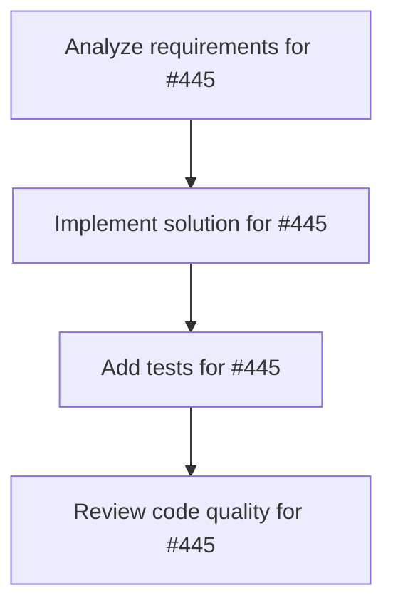

# Plans for Issue #445

**Title**: [P1-002] miyabi-agent-codegen コンパイルエラー修正

**URL**: https://github.com/customer-cloud/miyabi-private/issues/445

---

## 📋 Summary

- **Total Tasks**: 4
- **Estimated Duration**: 60 minutes
- **Execution Levels**: 4
- **Has Cycles**: ✅ No

## 📝 Task Breakdown

### 1. Analyze requirements for #445

- **ID**: `task-445-analysis`
- **Type**: Docs
- **Assigned Agent**: IssueAgent
- **Priority**: 0
- **Estimated Duration**: 5 min

**Description**: Analyze issue requirements and create detailed specification

### 2. Implement solution for #445

- **ID**: `task-445-impl`
- **Type**: Refactor
- **Assigned Agent**: CodeGenAgent
- **Priority**: 1
- **Estimated Duration**: 30 min
- **Dependencies**: task-445-analysis

**Description**: ## 📋 タスク概要

**タスクID**: P1-002
**Phase**: Phase 1 - 緊急対応・基盤安定化
**優先度**: **P0 - Critical**
**推定工数**: 1h
**担当Agent**: @codegen-agent

## 🎯 目的

miyabi-agent-codegenクレートのテストがtonic crateの欠落により7箇所でコンパイルエラーを起こしている問題を修正する。

## 🔍 現状分析

**エラー箇所**: 7箇所
**影響範囲**: テストファイル

## 📝 作業内容

\`\`\`toml
# crates/miyabi-agent-codegen/Cargo.toml
[dev-dependencies]
tonic = "0.10"
\`\`\`

\`\`\`bash
cd crates/miyabi-agent-codegen
cargo test --no-run
cargo test --all
\`\`\`

## ✅ 完了条件

- [ ] tonic依存関係追加
- [ ] 7箇所のエラー解消
- [ ] テストコンパイル成功

**Phase**: 1/5 | **期限**: 1日以内

### 3. Add tests for #445

- **ID**: `task-445-test`
- **Type**: Test
- **Assigned Agent**: CodeGenAgent
- **Priority**: 2
- **Estimated Duration**: 15 min
- **Dependencies**: task-445-impl

**Description**: Create comprehensive test coverage

### 4. Review code quality for #445

- **ID**: `task-445-review`
- **Type**: Refactor
- **Assigned Agent**: ReviewAgent
- **Priority**: 3
- **Estimated Duration**: 10 min
- **Dependencies**: task-445-test

**Description**: Run quality checks and code review

## 🔄 Execution Plan (DAG Levels)

Tasks can be executed in parallel within each level:

### Level 0 (Parallel Execution)

- `task-445-analysis` - Analyze requirements for #445

### Level 1 (Parallel Execution)

- `task-445-impl` - Implement solution for #445

### Level 2 (Parallel Execution)

- `task-445-test` - Add tests for #445

### Level 3 (Parallel Execution)

- `task-445-review` - Review code quality for #445

## 📊 Dependency Graph

## ⏱️ Timeline Estimation

- **Sequential Execution**: 60 minutes (1.0 hours)
- **Parallel Execution (Critical Path)**: 10 minutes (0.2 hours)
- **Estimated Speedup**: 6.0x

---

*Generated by CoordinatorAgent on 2025-11-01 11:25:17 UTC*
