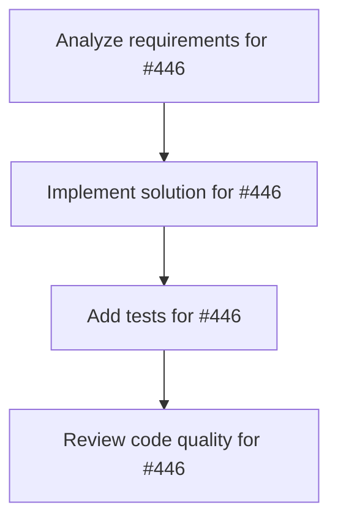

# Plans for Issue #446

**Title**: [P1-003] discord-mcp-server twilight v0.16 API対応

**URL**: https://github.com/customer-cloud/miyabi-private/issues/446

---

## 📋 Summary

- **Total Tasks**: 4
- **Estimated Duration**: 60 minutes
- **Execution Levels**: 4
- **Has Cycles**: ✅ No

## 📝 Task Breakdown

### 1. Analyze requirements for #446

- **ID**: `task-446-analysis`
- **Type**: Docs
- **Assigned Agent**: IssueAgent
- **Priority**: 0
- **Estimated Duration**: 5 min

**Description**: Analyze issue requirements and create detailed specification

### 2. Implement solution for #446

- **ID**: `task-446-impl`
- **Type**: Refactor
- **Assigned Agent**: CodeGenAgent
- **Priority**: 1
- **Estimated Duration**: 30 min
- **Dependencies**: task-446-analysis

**Description**: ## 📋 タスク概要

**タスクID**: P1-003
**Phase**: Phase 1 - 緊急対応・基盤安定化
**優先度**: **P1 - High**
**推定工数**: 8h
**担当Agent**: @codegen-agent

## 🎯 目的

discord-mcp-serverをワークスペースに復帰させ、twilight v0.16の破壊的変更に対応する。

### 3. Add tests for #446

- **ID**: `task-446-test`
- **Type**: Test
- **Assigned Agent**: CodeGenAgent
- **Priority**: 2
- **Estimated Duration**: 15 min
- **Dependencies**: task-446-impl

**Description**: Create comprehensive test coverage

### 4. Review code quality for #446

- **ID**: `task-446-review`
- **Type**: Refactor
- **Assigned Agent**: ReviewAgent
- **Priority**: 3
- **Estimated Duration**: 10 min
- **Dependencies**: task-446-test

**Description**: Run quality checks and code review

## 🔄 Execution Plan (DAG Levels)

Tasks can be executed in parallel within each level:

### Level 0 (Parallel Execution)

- `task-446-analysis` - Analyze requirements for #446

### Level 1 (Parallel Execution)

- `task-446-impl` - Implement solution for #446

### Level 2 (Parallel Execution)

- `task-446-test` - Add tests for #446

### Level 3 (Parallel Execution)

- `task-446-review` - Review code quality for #446

## 📊 Dependency Graph

## ⏱️ Timeline Estimation

- **Sequential Execution**: 60 minutes (1.0 hours)
- **Parallel Execution (Critical Path)**: 10 minutes (0.2 hours)
- **Estimated Speedup**: 6.0x

---

*Generated by CoordinatorAgent on 2025-11-01 11:25:17 UTC*
