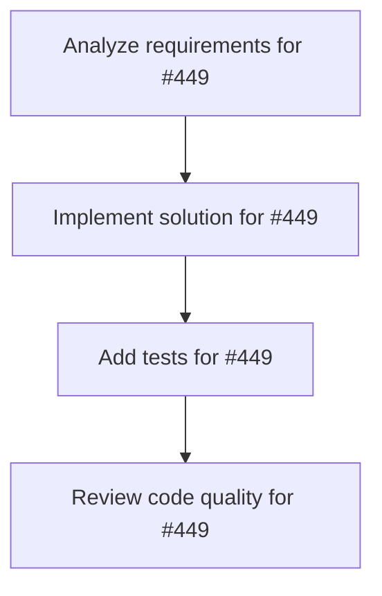

# Plans for Issue #449

**Title**: [P1-006] cargo clippy CI統合

**URL**: https://github.com/customer-cloud/miyabi-private/issues/449

---

## 📋 Summary

- **Total Tasks**: 4
- **Estimated Duration**: 60 minutes
- **Execution Levels**: 4
- **Has Cycles**: ✅ No

## 📝 Task Breakdown

### 1. Analyze requirements for #449

- **ID**: `task-449-analysis`
- **Type**: Docs
- **Assigned Agent**: IssueAgent
- **Priority**: 0
- **Estimated Duration**: 5 min

**Description**: Analyze issue requirements and create detailed specification

### 2. Implement solution for #449

- **ID**: `task-449-impl`
- **Type**: Refactor
- **Assigned Agent**: CodeGenAgent
- **Priority**: 1
- **Estimated Duration**: 30 min
- **Dependencies**: task-449-analysis

**Description**: ## 📋 タスク概要
**タスクID**: P1-006
**Phase**: Phase 1
**優先度**: **P1 - High**
**推定工数**: 2h
**担当Agent**: @deployment-agent

## 🎯 目的
Clippy警告0件を強制するCI/CDパイプラインを構築する。

## ✅ 完了条件
- [ ] Clippy CI作成
- [ ] 警告が出たらPR失敗
- [ ] 現在の警告0件を維持

**Phase**: 1/5 | **期限**: 2日以内

### 3. Add tests for #449

- **ID**: `task-449-test`
- **Type**: Test
- **Assigned Agent**: CodeGenAgent
- **Priority**: 2
- **Estimated Duration**: 15 min
- **Dependencies**: task-449-impl

**Description**: Create comprehensive test coverage

### 4. Review code quality for #449

- **ID**: `task-449-review`
- **Type**: Refactor
- **Assigned Agent**: ReviewAgent
- **Priority**: 3
- **Estimated Duration**: 10 min
- **Dependencies**: task-449-test

**Description**: Run quality checks and code review

## 🔄 Execution Plan (DAG Levels)

Tasks can be executed in parallel within each level:

### Level 0 (Parallel Execution)

- `task-449-analysis` - Analyze requirements for #449

### Level 1 (Parallel Execution)

- `task-449-impl` - Implement solution for #449

### Level 2 (Parallel Execution)

- `task-449-test` - Add tests for #449

### Level 3 (Parallel Execution)

- `task-449-review` - Review code quality for #449

## 📊 Dependency Graph

## ⏱️ Timeline Estimation

- **Sequential Execution**: 60 minutes (1.0 hours)
- **Parallel Execution (Critical Path)**: 10 minutes (0.2 hours)
- **Estimated Speedup**: 6.0x

---

*Generated by CoordinatorAgent on 2025-10-23 07:44:08 UTC*
