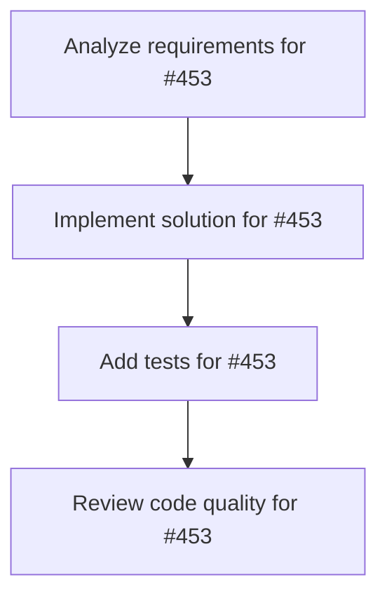

# Plans for Issue #453

**Title**: [TEST] Miyabi統合テストIssue - フルワークフロー検証

**URL**: https://github.com/customer-cloud/miyabi-private/issues/453

---

## 📋 Summary

- **Total Tasks**: 4
- **Estimated Duration**: 60 minutes
- **Execution Levels**: 4
- **Has Cycles**: ✅ No

## 📝 Task Breakdown

### 1. Analyze requirements for #453

- **ID**: `task-453-analysis`
- **Type**: Docs
- **Assigned Agent**: IssueAgent
- **Priority**: 0
- **Estimated Duration**: 5 min

**Description**: Analyze issue requirements and create detailed specification

### 2. Implement solution for #453

- **ID**: `task-453-impl`
- **Type**: Test
- **Assigned Agent**: CodeGenAgent
- **Priority**: 1
- **Estimated Duration**: 30 min
- **Dependencies**: task-453-analysis

**Description**: ## 📋 テスト概要
**目的**: Miyabiのフルワークフロー統合テスト

## 🎯 テスト項目
- [ ] CoordinatorAgentによるタスク分解
- [ ] Worktree作成と分離環境
- [ ] Agent連携（Coordinator→CodeGen→Review）
- [ ] GitHub統合（Label更新、コメント追加）
- [ ] Plans.md生成
- [ ] エラーハンドリング

## ✅ 期待結果
- 4つのタスクに分解される
- 各タスクに適切なAgentが割り当てられる
- DAGに循環がない
- Plans.mdが生成される

**Phase**: 統合テスト | **期限**: 即時

### 3. Add tests for #453

- **ID**: `task-453-test`
- **Type**: Test
- **Assigned Agent**: CodeGenAgent
- **Priority**: 2
- **Estimated Duration**: 15 min
- **Dependencies**: task-453-impl

**Description**: Create comprehensive test coverage

### 4. Review code quality for #453

- **ID**: `task-453-review`
- **Type**: Refactor
- **Assigned Agent**: ReviewAgent
- **Priority**: 3
- **Estimated Duration**: 10 min
- **Dependencies**: task-453-test

**Description**: Run quality checks and code review

## 🔄 Execution Plan (DAG Levels)

Tasks can be executed in parallel within each level:

### Level 0 (Parallel Execution)

- `task-453-analysis` - Analyze requirements for #453

### Level 1 (Parallel Execution)

- `task-453-impl` - Implement solution for #453

### Level 2 (Parallel Execution)

- `task-453-test` - Add tests for #453

### Level 3 (Parallel Execution)

- `task-453-review` - Review code quality for #453

## 📊 Dependency Graph

## ⏱️ Timeline Estimation

- **Sequential Execution**: 60 minutes (1.0 hours)
- **Parallel Execution (Critical Path)**: 10 minutes (0.2 hours)
- **Estimated Speedup**: 6.0x

---

*Generated by CoordinatorAgent on 2025-11-01 11:25:19 UTC*
