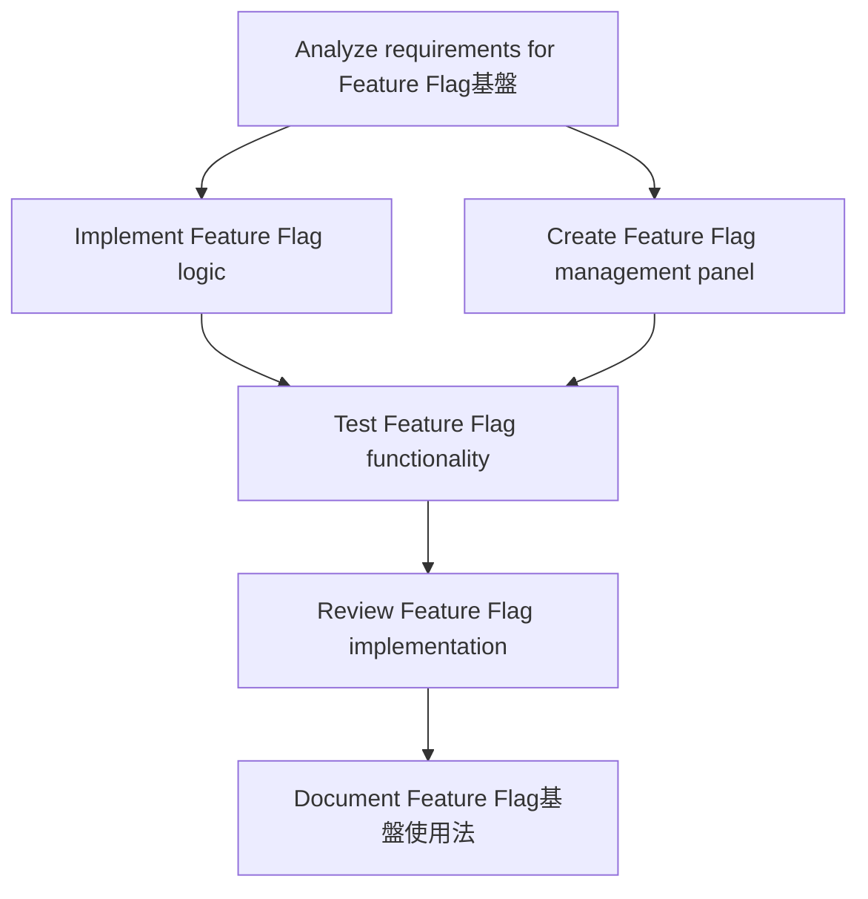

# Plans for Issue #485

**Title**: [P5-008] Feature Flag基盤構築

**URL**: https://github.com/customer-cloud/miyabi-private/issues/485

---

## Summary

- **Total Tasks**: 6
- **Estimated Duration**: 175 minutes
- **Execution Levels**: 5
- **Has Cycles**: ✅ No

## Task Breakdown

### 1. Analyze requirements for Feature Flag基盤

- **ID**: `task-485-analysis`
- **Type**: Docs
- **Assigned Agent**: IssueAgent
- **Priority**: 0
- **Estimated Duration**: 10 min

**Description**: Analyze and clarify requirements for building the Feature Flag infrastructure to enable gradual feature rollouts.

### 2. Implement Feature Flag logic

- **ID**: `task-485-impl-feature-flags`
- **Type**: Feature
- **Assigned Agent**: CodeGenAgent
- **Priority**: 2
- **Estimated Duration**: 40 min
- **Dependencies**: task-485-analysis

**Description**: Develop the logic to switch architectures based on feature flag status.

### 3. Create Feature Flag management panel

- **ID**: `task-485-impl-admin-panel`
- **Type**: Feature
- **Assigned Agent**: CodeGenAgent
- **Priority**: 3
- **Estimated Duration**: 60 min
- **Dependencies**: task-485-analysis

**Description**: Develop an admin panel for managing feature flags.

### 4. Test Feature Flag functionality

- **ID**: `task-485-test`
- **Type**: Test
- **Assigned Agent**: CodeGenAgent
- **Priority**: 4
- **Estimated Duration**: 30 min
- **Dependencies**: task-485-impl-feature-flags, task-485-impl-admin-panel

**Description**: Conduct tests to verify that the feature flags and their management panel function as expected.

### 5. Review Feature Flag implementation

- **ID**: `task-485-review`
- **Type**: Feature
- **Assigned Agent**: ReviewAgent
- **Priority**: 5
- **Estimated Duration**: 15 min
- **Dependencies**: task-485-test

**Description**: Conduct a code and functionality review of the feature flag implementation.

### 6. Document Feature Flag基盤使用法

- **ID**: `task-485-docs`
- **Type**: Docs
- **Assigned Agent**: CodeGenAgent
- **Priority**: 6
- **Estimated Duration**: 20 min
- **Dependencies**: task-485-review

**Description**: Create documentation explaining the usage and setup of the feature flags and admin panel.

## Execution Plan

Tasks can be executed in parallel within each level:

### Level 0 (Parallel Execution)

- `task-485-analysis` - Analyze requirements for Feature Flag基盤

### Level 1 (Parallel Execution)

- `task-485-impl-admin-panel` - Create Feature Flag management panel
- `task-485-impl-feature-flags` - Implement Feature Flag logic

### Level 2 (Parallel Execution)

- `task-485-test` - Test Feature Flag functionality

### Level 3 (Parallel Execution)

- `task-485-review` - Review Feature Flag implementation

### Level 4 (Parallel Execution)

- `task-485-docs` - Document Feature Flag基盤使用法

## Dependencies

## ⏱️ Timeline Estimation

- **Sequential Execution**: 175 minutes (2.9 hours)
- **Parallel Execution (Critical Path)**: 100 minutes (1.7 hours)
- **Estimated Speedup**: 1.8x

---

*Generated by CoordinatorAgent on 2025-10-25 03:44:49 UTC*
