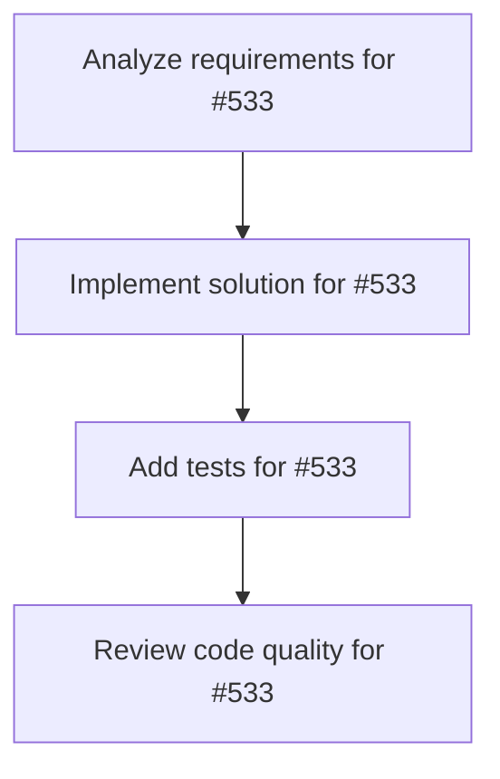

# Plans for Issue #533

**Title**: Task: RAGパイプライン構築（歴史資料→Vector DB）

**URL**: https://github.com/customer-cloud/miyabi-private/issues/533

---

## 📋 Summary

- **Total Tasks**: 4
- **Estimated Duration**: 60 minutes
- **Execution Levels**: 4
- **Has Cycles**: ✅ No

## 📝 Task Breakdown

### 1. Analyze requirements for #533

- **ID**: `task-533-analysis`
- **Type**: Docs
- **Assigned Agent**: IssueAgent
- **Priority**: 0
- **Estimated Duration**: 5 min

**Description**: Analyze issue requirements and create detailed specification

### 2. Implement solution for #533

- **ID**: `task-533-impl`
- **Type**: Feature
- **Assigned Agent**: CodeGenAgent
- **Priority**: 1
- **Estimated Duration**: 30 min
- **Dependencies**: task-533-analysis

**Description**: # Task: RAGパイプライン構築

**親Issue**: #532
**優先度**: P0
**期限**: 2日以内
**担当Agent**: CodeGenAgent

---

## 🎯 目的

歴史資料（Wikipedia, 青空文庫等）をVector DBに格納し、偉人AIが参照できるRAGシステムを構築する。

---

## 📋 実装内容

### 1. データ収集スクリプト
```rust
// crates/miyabi-historical-ai/src/data_collection.rs
- Wikipedia APIから偉人記事取得
- 青空文庫から関連書籍取得
- テキスト前処理（クリーニング、チャンク分割）
```

### 2. Embedding生成
```rust
// crates/miyabi-historical-ai/src/embedding.rs
- text-embedding-3-small (OpenAI) 使用
- チャンクサイズ: 512 tokens
- オーバーラップ: 50 tokens
```

### 3. Qdrant統合
```rust
// crates/miyabi-historical-ai/src/vector_store.rs
- Qdrant Cloudセットアップ
- Collection作成（historical_figures）
- Insert/Search API実装
```

### 4. 検索API
```rust
// crates/miyabi-historical-ai/src/retrieval.rs
pub async fn search_knowledge(
    query: &str,
    figure: &str,
    top_k: usize,
) -> Result<Vec<Document>>
```

---

## ✅ 完了条件

- [ ] Wikipediaから織田信長データ取得成功
- [ ] Qdrantに1000+チャンク格納
- [ ] 検索クエリ「織田信長の経営戦略」で関連文書取得
- [ ] 検索速度 <100ms

---

## 🔗 関連Issue
- #532 (親Epic)

---

🤖 Generated with [Claude Code](https://claude.com/claude-code)

### 3. Add tests for #533

- **ID**: `task-533-test`
- **Type**: Test
- **Assigned Agent**: CodeGenAgent
- **Priority**: 2
- **Estimated Duration**: 15 min
- **Dependencies**: task-533-impl

**Description**: Create comprehensive test coverage

### 4. Review code quality for #533

- **ID**: `task-533-review`
- **Type**: Refactor
- **Assigned Agent**: ReviewAgent
- **Priority**: 3
- **Estimated Duration**: 10 min
- **Dependencies**: task-533-test

**Description**: Run quality checks and code review

## 🔄 Execution Plan (DAG Levels)

Tasks can be executed in parallel within each level:

### Level 0 (Parallel Execution)

- `task-533-analysis` - Analyze requirements for #533

### Level 1 (Parallel Execution)

- `task-533-impl` - Implement solution for #533

### Level 2 (Parallel Execution)

- `task-533-test` - Add tests for #533

### Level 3 (Parallel Execution)

- `task-533-review` - Review code quality for #533

## 📊 Dependency Graph



## ⏱️ Timeline Estimation

- **Sequential Execution**: 60 minutes (1.0 hours)
- **Parallel Execution (Critical Path)**: 10 minutes (0.2 hours)
- **Estimated Speedup**: 6.0x

---

*Generated by CoordinatorAgent on 2025-11-01 11:06:45 UTC*
