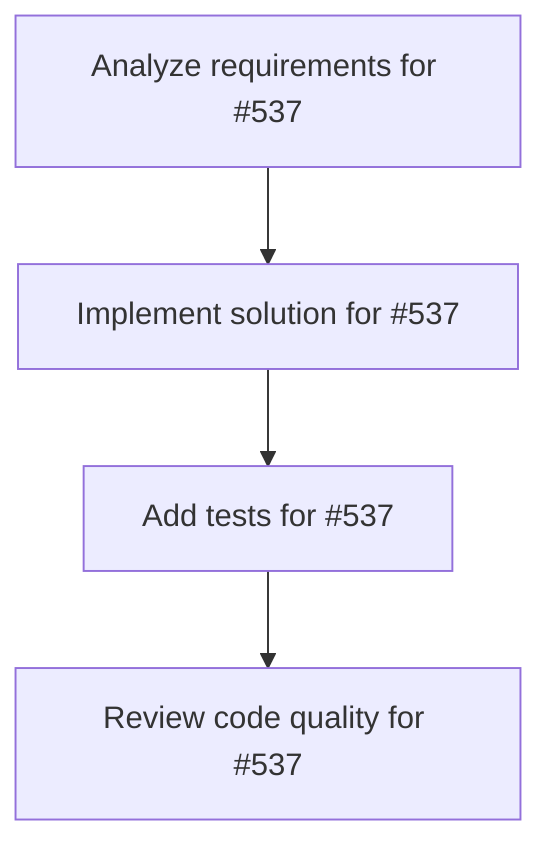

# Plans for Issue #537

**Title**: Task: ビジネスモデル設計（価格・プラン）

**URL**: https://github.com/customer-cloud/miyabi-private/issues/537

---

## 📋 Summary

- **Total Tasks**: 4
- **Estimated Duration**: 60 minutes
- **Execution Levels**: 4
- **Has Cycles**: ✅ No

## 📝 Task Breakdown

### 1. Analyze requirements for #537

- **ID**: `task-537-analysis`
- **Type**: Docs
- **Assigned Agent**: IssueAgent
- **Priority**: 0
- **Estimated Duration**: 5 min

**Description**: Analyze issue requirements and create detailed specification

### 2. Implement solution for #537

- **ID**: `task-537-impl`
- **Type**: Feature
- **Assigned Agent**: CodeGenAgent
- **Priority**: 1
- **Estimated Duration**: 30 min
- **Dependencies**: task-537-analysis

**Description**: # Task: ビジネスモデル設計

**親Issue**: #532
**優先度**: P1
**期限**: 1日以内
**担当Agent**: ProductConceptAgent

---

## 🎯 目的

収益化モデルと価格体系を設計する。

---

## 📋 プラン案

### Free Plan
- 月10メッセージ
- 3偉人アクセス
- 履歴7日間保存

### Pro Plan ($9.99/mo)
- 月500メッセージ
- 全偉人アクセス（10名）
- 履歴無制限
- 音声合成対応

### Enterprise ($99/mo)
- 無制限メッセージ
- API提供
- カスタム偉人作成
- 専用サポート

---

## 💰 収益予測

### Year 1
- Free: 1,000 users
- Pro: 100 users → $1,000/mo
- Enterprise: 5 users → $500/mo
- **MRR: $1,500**

---

🤖 Generated with [Claude Code](https://claude.com/claude-code)

### 3. Add tests for #537

- **ID**: `task-537-test`
- **Type**: Test
- **Assigned Agent**: CodeGenAgent
- **Priority**: 2
- **Estimated Duration**: 15 min
- **Dependencies**: task-537-impl

**Description**: Create comprehensive test coverage

### 4. Review code quality for #537

- **ID**: `task-537-review`
- **Type**: Refactor
- **Assigned Agent**: ReviewAgent
- **Priority**: 3
- **Estimated Duration**: 10 min
- **Dependencies**: task-537-test

**Description**: Run quality checks and code review

## 🔄 Execution Plan (DAG Levels)

Tasks can be executed in parallel within each level:

### Level 0 (Parallel Execution)

- `task-537-analysis` - Analyze requirements for #537

### Level 1 (Parallel Execution)

- `task-537-impl` - Implement solution for #537

### Level 2 (Parallel Execution)

- `task-537-test` - Add tests for #537

### Level 3 (Parallel Execution)

- `task-537-review` - Review code quality for #537

## 📊 Dependency Graph

## ⏱️ Timeline Estimation

- **Sequential Execution**: 60 minutes (1.0 hours)
- **Parallel Execution (Critical Path)**: 10 minutes (0.2 hours)
- **Estimated Speedup**: 6.0x

---

*Generated by CoordinatorAgent on 2025-11-01 11:06:38 UTC*
