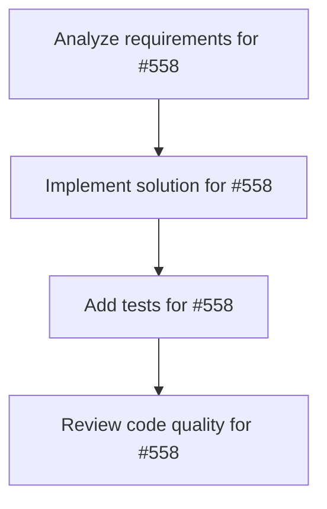

# Plans for Issue #558

**Title**: 🏗️ [Week 3-4] Create Rust FFI Bridge using NAPI for SDK Integration

**URL**: https://github.com/customer-cloud/miyabi-private/issues/558

---

## 📋 Summary

- **Total Tasks**: 4
- **Estimated Duration**: 60 minutes
- **Execution Levels**: 4
- **Has Cycles**: ✅ No

## 📝 Task Breakdown

### 1. Analyze requirements for #558

- **ID**: `task-558-analysis`
- **Type**: Docs
- **Assigned Agent**: IssueAgent
- **Priority**: 0
- **Estimated Duration**: 5 min

**Description**: Analyze issue requirements and create detailed specification

### 2. Implement solution for #558

- **ID**: `task-558-impl`
- **Type**: Feature
- **Assigned Agent**: CodeGenAgent
- **Priority**: 1
- **Estimated Duration**: 30 min
- **Dependencies**: task-558-analysis

**Description**: ## Task: Rust ↔ TypeScript Bridge via NAPI

**Priority**: Medium
**Estimated Time**: 8-12 hours (Week 3-4)
**Dependencies**: Week 2 complete

---

## Background

Enable direct TypeScript SDK calls from Rust code without subprocess overhead.

**Current** (Week 2): Rust → subprocess(npm run d2) → Node.js → TypeScript
**Target** (Week 3-4): Rust → NAPI FFI → TypeScript

**Performance Gain**: 10x faster (no subprocess creation)

---

## Requirements

**New Crate**: `crates/miyabi-agent-sdk`

```rust
use napi_derive::napi;

#[napi]
pub async fn check_complexity(issue_number: u32) -> Result<ComplexityResult> {
    // Call TypeScript SDK via FFI
}
```

---

## Success Criteria

- [ ] NAPI bridge working for D2
- [ ] Rust can call TypeScript directly
- [ ] 10x performance improvement
- [ ] Migration guide written


### 3. Add tests for #558

- **ID**: `task-558-test`
- **Type**: Test
- **Assigned Agent**: CodeGenAgent
- **Priority**: 2
- **Estimated Duration**: 15 min
- **Dependencies**: task-558-impl

**Description**: Create comprehensive test coverage

### 4. Review code quality for #558

- **ID**: `task-558-review`
- **Type**: Refactor
- **Assigned Agent**: ReviewAgent
- **Priority**: 3
- **Estimated Duration**: 10 min
- **Dependencies**: task-558-test

**Description**: Run quality checks and code review

## 🔄 Execution Plan (DAG Levels)

Tasks can be executed in parallel within each level:

### Level 0 (Parallel Execution)

- `task-558-analysis` - Analyze requirements for #558

### Level 1 (Parallel Execution)

- `task-558-impl` - Implement solution for #558

### Level 2 (Parallel Execution)

- `task-558-test` - Add tests for #558

### Level 3 (Parallel Execution)

- `task-558-review` - Review code quality for #558

## 📊 Dependency Graph



## ⏱️ Timeline Estimation

- **Sequential Execution**: 60 minutes (1.0 hours)
- **Parallel Execution (Critical Path)**: 10 minutes (0.2 hours)
- **Estimated Speedup**: 6.0x

---

*Generated by CoordinatorAgent on 2025-11-01 11:05:18 UTC*
