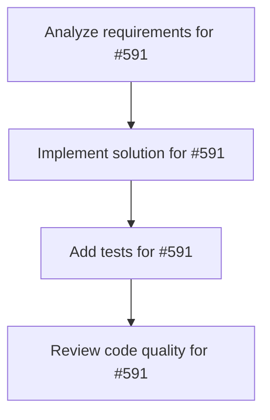

# Plans for Issue #591

**Title**: test: Small complexity test for autonomous workflow validation

**URL**: https://github.com/customer-cloud/miyabi-private/issues/591

---

## 📋 Summary

- **Total Tasks**: 4
- **Estimated Duration**: 60 minutes
- **Execution Levels**: 4
- **Has Cycles**: ✅ No

## 📝 Task Breakdown

### 1. Analyze requirements for #591

- **ID**: `task-591-analysis`
- **Type**: Docs
- **Assigned Agent**: IssueAgent
- **Priority**: 0
- **Estimated Duration**: 5 min

**Description**: Analyze issue requirements and create detailed specification

### 2. Implement solution for #591

- **ID**: `task-591-impl`
- **Type**: Feature
- **Assigned Agent**: CodeGenAgent
- **Priority**: 1
- **Estimated Duration**: 30 min
- **Dependencies**: task-591-analysis

**Description**: ## 🎯 Test Description

This is a **small complexity test** (target: < 3.0) for validating the complete Miyabi autonomous workflow from Issue creation to PR auto-merge.

## 📋 Expected Behavior

### Phase Execution Targets
- **Complexity Score**: < 3.0 (auto-approved)
- **Total Time**: < 45 minutes (Issue → PR merge)
- **Auto-Merge**: Enabled (no human intervention)

### Phase Timeline

| Phase | Target Time | Description |
|-------|-------------|-------------|
| Phase 1 | < 2 min | Issue Analysis & Auto-Label |
| Phase 2 | < 5 min | Task Decomposition & DAG |
| Phase 3 | < 2 min | Worktree Creation |
| Phase 4 | < 10 min | Claude Code Execution (5-Worlds) |
| Phase 6 | < 3 min | Quality Check & Auto-Fix |
| Phase 7 | < 1 min | PR Creation |
| Phase 8 | < 5 min | Code Review |
| Phase 9 | < 3 min | Auto-Merge & Deployment |

**Total Target**: < 31 minutes (with buffer: 45 minutes)

## ✅ Test Checklist

- [ ] **Phase 1**: Issue Analysis complete, labels applied
- [ ] **Phase 2**: Tasks decomposed, DAG created
- [ ] **Phase 3**: Worktree created successfully
- [ ] **Phase 4**: Code generated via Claude Code
- [ ] **Phase 6**: Quality check passed (score >= 80)
- [ ] **Phase 7**: PR created with Conventional Commits format
- [ ] **Phase 8**: Code review complete (score >= 80)
- [ ] **Phase 9**: PR auto-merged successfully

## 📊 Performance Metrics

**Start Time**: (Webhook received timestamp)
**End Time**: (PR merged timestamp)
**Total Duration**: (calculated)

## 🔍 Test Task

**Objective**: Add a simple utility function to demonstrate workflow

**Requirements**:
1. Create a new file: \`crates/miyabi-core/src/utils/test_helper.rs\`
2. Implement a simple function:
   \`\`\`rust
   /// Test helper function to validate workflow
   pub fn generate_test_message(prefix: &str) -> String {
       format!("{}: Miyabi autonomous workflow test", prefix)
   }

   #[cfg(test)]
   mod tests {
       use super::*;

       #[test]
       fn test_generate_test_message() {
           let msg = generate_test_message("INFO");
           assert!(msg.contains("INFO"));
           assert!(msg.contains("Miyabi"));
       }
   }
   \`\`\`
3. Export the module in \`crates/miyabi-core/src/utils/mod.rs\`
4. All tests must pass
5. Code must pass clippy and fmt checks

## 🎯 Success Criteria

1. ✅ **Complexity < 3.0**: Auto-approved without human intervention
2. ✅ **All phases complete**: Phase 1-9 executed successfully
3. ✅ **Time < 45 min**: Total duration from webhook to PR merge
4. ✅ **Quality >= 80**: Both quality check and code review scores
5. ✅ **Auto-merge**: PR merged automatically without human approval
6. ✅ **Tests pass**: All cargo tests pass (100%)

## 📝 Notes

- This is an automated test Issue for production validation
- Expected workflow: **fully autonomous** (no human intervention)
- Monitor logs: \`tail -f logs/miyabi-orchestrator.log\`
- Webhook events: All 18+ event types should trigger correctly

---

🤖 Generated with [Claude Code](https://claude.com/claude-code)

Co-Authored-By: Claude <noreply@anthropic.com>

### 3. Add tests for #591

- **ID**: `task-591-test`
- **Type**: Test
- **Assigned Agent**: CodeGenAgent
- **Priority**: 2
- **Estimated Duration**: 15 min
- **Dependencies**: task-591-impl

**Description**: Create comprehensive test coverage

### 4. Review code quality for #591

- **ID**: `task-591-review`
- **Type**: Refactor
- **Assigned Agent**: ReviewAgent
- **Priority**: 3
- **Estimated Duration**: 10 min
- **Dependencies**: task-591-test

**Description**: Run quality checks and code review

## 🔄 Execution Plan (DAG Levels)

Tasks can be executed in parallel within each level:

### Level 0 (Parallel Execution)

- `task-591-analysis` - Analyze requirements for #591

### Level 1 (Parallel Execution)

- `task-591-impl` - Implement solution for #591

### Level 2 (Parallel Execution)

- `task-591-test` - Add tests for #591

### Level 3 (Parallel Execution)

- `task-591-review` - Review code quality for #591

## 📊 Dependency Graph

## ⏱️ Timeline Estimation

- **Sequential Execution**: 60 minutes (1.0 hours)
- **Parallel Execution (Critical Path)**: 10 minutes (0.2 hours)
- **Estimated Speedup**: 6.0x

---

*Generated by CoordinatorAgent on 2025-10-27 17:01:15 UTC*
