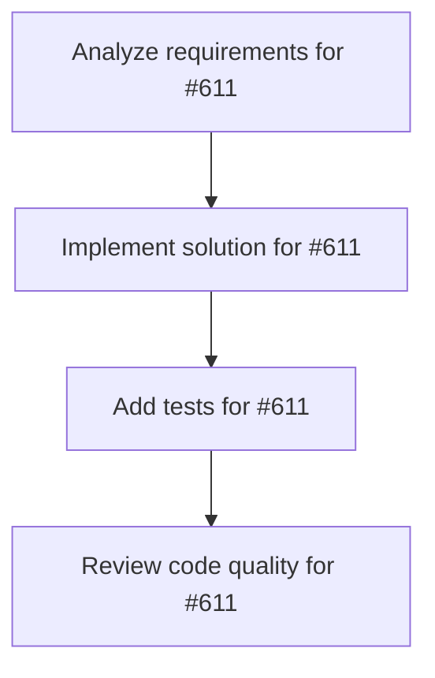

# Plans for Issue #611

**Title**: Spike: AI control plane & metrics dashboard

**URL**: https://github.com/customer-cloud/miyabi-private/issues/611

---

## 📋 Summary

- **Total Tasks**: 4
- **Estimated Duration**: 60 minutes
- **Execution Levels**: 4
- **Has Cycles**: ✅ No

## 📝 Task Breakdown

### 1. Analyze requirements for #611

- **ID**: `task-611-analysis`
- **Type**: Docs
- **Assigned Agent**: IssueAgent
- **Priority**: 0
- **Estimated Duration**: 5 min

**Description**: Analyze issue requirements and create detailed specification

### 2. Implement solution for #611

- **ID**: `task-611-impl`
- **Type**: Feature
- **Assigned Agent**: CodeGenAgent
- **Priority**: 1
- **Estimated Duration**: 30 min
- **Dependencies**: task-611-analysis

**Description**: ## Summary
Design an AI control plane for Miyabi that centralizes access policies, agent governance, and usage metrics—mirroring GitHub Agent HQ’s control plane plus Copilot dashboard.

## Goals
- Inventory current logging/metrics sources (.ai/logs, 📊 Project Status

Miyabi Installation:
  ✅ Miyabi is installed
    ✓ .claude/agents
    ✓ .github/workflows
    ✓ logs
    ✓ reports

Environment:
  ❌ GITHUB_TOKEN is not set
    Run: export GITHUB_TOKEN=ghp_xxx
  ✅ DEVICE_IDENTIFIER: Pixel 9 Pro XL

Git Repository:
  ✅ Git repository detected
    Branch: main
    Remote: https://github.com/customer-cloud/miyabi-private.git
    ⚠ 17 uncommitted change(s)

Worktrees:
  2 active worktree(s)
    1. /Users/shunsuke/Dev/miyabi-private/.worktrees/claude-x-issue-537  10f9b80 [feat/claude-x-issue-537]
    2. /Users/shunsuke/Dev/miyabi-private/.worktrees/codex-x-issue-535   10f9b80 [feat/codex-x-issue-535]

Recent Activity:
  4 log file(s) in logs/
  0 report file(s) in reports/, MCP data) and identify gaps.
- Define policy management model (per-agent permissions, model access, audit logs) and how it fits into existing CLI/Web interfaces.
- Explore visualization options for real-time agent activity, success/failure rates, and productivity metrics.

## Deliverables
- Architecture brief covering data pipeline, storage, and UI surfaces.
- Task breakdown for implementation phases (data collection, policy engine, dashboards).
- Risk/complexity analysis (performance, data retention, multi-agent concurrency).

## References
- TODO.md Roadmap "AI Control Plane & メトリクスダッシュボード" entry.
- GitHub Agent HQ control plane and Copilot metrics announcement (Universe 2025).

### 3. Add tests for #611

- **ID**: `task-611-test`
- **Type**: Test
- **Assigned Agent**: CodeGenAgent
- **Priority**: 2
- **Estimated Duration**: 15 min
- **Dependencies**: task-611-impl

**Description**: Create comprehensive test coverage

### 4. Review code quality for #611

- **ID**: `task-611-review`
- **Type**: Refactor
- **Assigned Agent**: ReviewAgent
- **Priority**: 3
- **Estimated Duration**: 10 min
- **Dependencies**: task-611-test

**Description**: Run quality checks and code review

## 🔄 Execution Plan (DAG Levels)

Tasks can be executed in parallel within each level:

### Level 0 (Parallel Execution)

- `task-611-analysis` - Analyze requirements for #611

### Level 1 (Parallel Execution)

- `task-611-impl` - Implement solution for #611

### Level 2 (Parallel Execution)

- `task-611-test` - Add tests for #611

### Level 3 (Parallel Execution)

- `task-611-review` - Review code quality for #611

## 📊 Dependency Graph

## ⏱️ Timeline Estimation

- **Sequential Execution**: 60 minutes (1.0 hours)
- **Parallel Execution (Critical Path)**: 10 minutes (0.2 hours)
- **Estimated Speedup**: 6.0x

---

*Generated by CoordinatorAgent on 2025-11-01 10:45:14 UTC*
