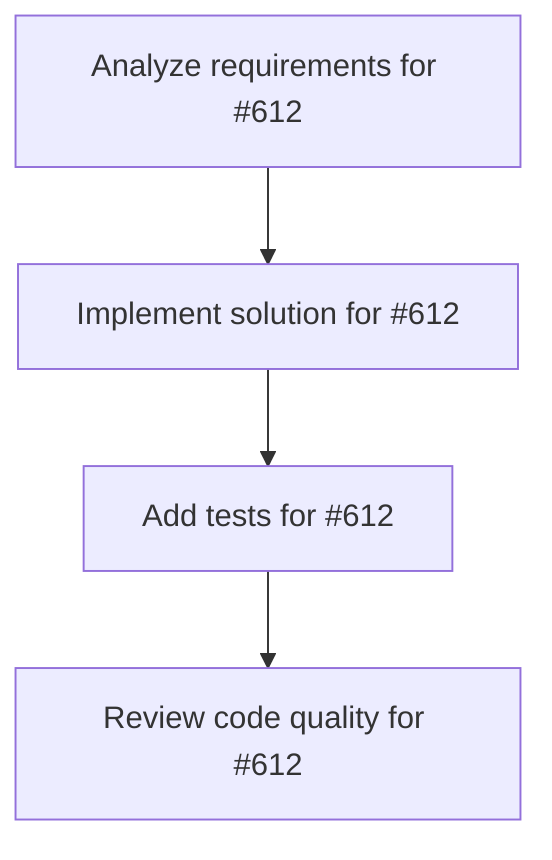

# Plans for Issue #612

**Title**: Epic: KAMUI 4D設計パターン統合 - Worktree可視化とAgent管理の強化

**URL**: https://github.com/customer-cloud/miyabi-private/issues/612

---

## 📋 Summary

- **Total Tasks**: 4
- **Estimated Duration**: 60 minutes
- **Execution Levels**: 4
- **Has Cycles**: ✅ No

## 📝 Task Breakdown

### 1. Analyze requirements for #612

- **ID**: `task-612-analysis`
- **Type**: Docs
- **Assigned Agent**: IssueAgent
- **Priority**: 0
- **Estimated Duration**: 5 min

**Description**: Analyze issue requirements and create detailed specification

### 2. Implement solution for #612

- **ID**: `task-612-impl`
- **Type**: Feature
- **Assigned Agent**: CodeGenAgent
- **Priority**: 1
- **Estimated Duration**: 30 min
- **Dependencies**: task-612-analysis

**Description**: # Epic: KAMUI 4D設計パターン統合

## 📋 概要

KAMUI 4Dアプリケーションの優れた設計パターンをMiyabiに統合し、Git Worktree可視化、Agent管理、タスクメタデータ管理を強化する。

**参考プロジェクト**: KAMUI 4D v1.5.13 (Electron製4次元タスク管理アプリ)
**分析日**: 2025-10-29
**関連ドキュメント**: KAMUI 4D vs Miyabi 比較分析レポート

## 🎯 目標

1. **Git Worktree統合表示**: 複数Worktreeの状態を視覚的に管理
2. **Agent設定管理**: 21個のAgentを統一的に管理する仕組み
3. **タスクメタデータ永続化**: 実行履歴、成功/失敗、実行時間の記録
4. **可視化**: TUI版からWeb Dashboard 3Dまで段階的に実装

## 📊 Phase別実装計画

### Phase 1: 基盤整備 (優先度: ⭐⭐⭐⭐⭐)
**期間**: 1-2週間

- [ ] #TBD タスクメタデータ永続化システムの実装
- [ ] #TBD Agent設定管理CLIの実装  
- [ ] #TBD Worktree状態管理の強化

**目標成果物**:
- `.miyabi/tasks/*.json` でタスクメタデータ永続化
- `miyabi agent list/config/edit` コマンド実装
- Worktree状態追跡の強化

### Phase 2: 可視化 (優先度: ⭐⭐⭐⭐)
**期間**: 2-3週間

- [ ] #TBD TUI版Worktree状態表示の実装
- [ ] #TBD Git履歴グラフ描画機能
- [ ] #TBD Agent実行状態リアルタイム表示

**目標成果物**:
- `miyabi status --tui` でリッチなWorktree表示
- Git履歴グラフ（ratatui使用）
- Agent実行中のライブモニタリング

### Phase 3: KAMUI 4D統合 (優先度: ⭐⭐⭐)
**期間**: 3-4週間

- [ ] #TBD miyabi-kamui-bridge crateの作成
- [ ] #TBD KAMUI 4D APIエンドポイント拡張
- [ ] #TBD Web Dashboard 3D可視化

**目標成果物**:
- MiyabiとKAMUI 4Dの双方向連携
- Miyabi実行状況のKAMUI 4Dでの3D可視化
- Web Dashboard (`miyabi-dashboard/`) での3D表示

## 🔗 参考リソース

### KAMUI 4Dから学ぶべき設計

1. **Git Worktree統合設計** (⭐⭐⭐⭐⭐)
   - `docs/git-worktree-task-system-design.md` (32KB)
   - タスクカードとWorktreeの1:1対応
   - `.worktrees/task-{id}/` 配置パターン

2. **Agent設定管理** (⭐⭐⭐⭐⭐)
   - `src/main/agent-config-service.js`
   - 環境変数・ディレクトリ・設定ファイルの自動検出
   - 複数AIツールの統一管理

3. **タスクメタデータ** (⭐⭐⭐⭐⭐)
   - タスクID、Worktree path、ブランチ名、実行状態
   - `data/tasks-state.json` での永続化

4. **3D可視化** (⭐⭐⭐⭐)
   - Three.js + 3D Force Graph
   - 複数の描画モード（通常/メディア/リファクタリング）

### Miyabi既存コンポーネント

- `.claude/context/worktree.md` - Worktreeプロトコル
- `.claude/context/agents.md` - Agent仕様
- `crates/miyabi-worktree/` - Worktree実装
- `crates/miyabi-agents/` - Agent実装

## 📐 アーキテクチャ比較

| 項目 | KAMUI 4D | Miyabi (現状) | Miyabi (目標) |
|-----|----------|--------------|--------------|
| **Worktree管理** | ✅ タスクカード連動 | ✅ Issue連動 | ✅ + 可視化 |
| **Agent管理** | ✅ 4種類統一管理 | ⚠️ 21種類分散 | ✅ 統一CLI |
| **可視化** | ✅ 3D Force Graph | ❌ なし | ✅ TUI + Web |
| **メタデータ** | ✅ JSON永続化 | ⚠️ 一時的 | ✅ 永続化 |

## 🎯 成功条件

### Phase 1完了条件
- [ ] `.miyabi/tasks/*.json` でタスク履歴が記録される
- [ ] `miyabi agent list` で全21個のAgentが一覧表示される
- [ ] `miyabi agent config <name>` で設定が確認できる
- [ ] Worktree状態が正確に追跡される

### Phase 2完了条件
- [ ] `miyabi status --tui` でWorktree状態が視覚的に表示される
- [ ] Git履歴グラフで複数ブランチが表示される
- [ ] Agent実行中のリアルタイムモニタリングが動作する

### Phase 3完了条件
- [ ] KAMUI 4Dと連携してMiyabiタスクが3D表示される
- [ ] Web Dashboardで3D可視化が動作する
- [ ] 双方向データ同期が正常に機能する

## 📊 期待される効果

1. **開発効率向上**: Worktree状態の可視化により並列作業が容易に
2. **Agent管理の効率化**: 21個のAgentを統一的に管理
3. **実行履歴の追跡**: タスクの成功/失敗、実行時間の記録
4. **チーム協働の準備**: KAMUI 4D連携でチーム作業の基盤

## 🔄 Dependencies

このEpicは以下の既存Issueと関連します：

- Worktree管理の既存実装
- Agent実装（21個）
- `.ai/logs/` ロギングシステム

## 📝 Notes

- **段階的実装**: Phase 1 → Phase 2 → Phase 3 の順で実装
- **後方互換性**: 既存のCLI機能は維持
- **パフォーマンス**: TUI表示でもパフォーマンスを重視
- **ドキュメント**: 各Phase完了時にドキュメント更新

---

🤖 Generated with [Claude Code](https://claude.com/claude-code)

### 3. Add tests for #612

- **ID**: `task-612-test`
- **Type**: Test
- **Assigned Agent**: CodeGenAgent
- **Priority**: 2
- **Estimated Duration**: 15 min
- **Dependencies**: task-612-impl

**Description**: Create comprehensive test coverage

### 4. Review code quality for #612

- **ID**: `task-612-review`
- **Type**: Refactor
- **Assigned Agent**: ReviewAgent
- **Priority**: 3
- **Estimated Duration**: 10 min
- **Dependencies**: task-612-test

**Description**: Run quality checks and code review

## 🔄 Execution Plan (DAG Levels)

Tasks can be executed in parallel within each level:

### Level 0 (Parallel Execution)

- `task-612-analysis` - Analyze requirements for #612

### Level 1 (Parallel Execution)

- `task-612-impl` - Implement solution for #612

### Level 2 (Parallel Execution)

- `task-612-test` - Add tests for #612

### Level 3 (Parallel Execution)

- `task-612-review` - Review code quality for #612

## 📊 Dependency Graph

## ⏱️ Timeline Estimation

- **Sequential Execution**: 60 minutes (1.0 hours)
- **Parallel Execution (Critical Path)**: 10 minutes (0.2 hours)
- **Estimated Speedup**: 6.0x

---

*Generated by CoordinatorAgent on 2025-11-01 10:43:46 UTC*
