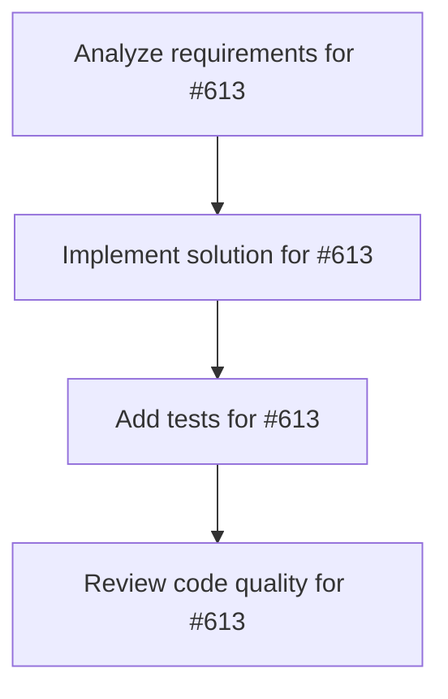

# Plans for Issue #613

**Title**: feat: タスクメタデータ永続化システムの実装 (.miyabi/tasks/*.json)

**URL**: https://github.com/customer-cloud/miyabi-private/issues/613

---

## 📋 Summary

- **Total Tasks**: 4
- **Estimated Duration**: 60 minutes
- **Execution Levels**: 4
- **Has Cycles**: ✅ No

## 📝 Task Breakdown

### 1. Analyze requirements for #613

- **ID**: `task-613-analysis`
- **Type**: Docs
- **Assigned Agent**: IssueAgent
- **Priority**: 0
- **Estimated Duration**: 5 min

**Description**: Analyze issue requirements and create detailed specification

### 2. Implement solution for #613

- **ID**: `task-613-impl`
- **Type**: Feature
- **Assigned Agent**: CodeGenAgent
- **Priority**: 1
- **Estimated Duration**: 30 min
- **Dependencies**: task-613-analysis

**Description**: # タスクメタデータ永続化システムの実装

**Parent Issue**: #612 (Epic: KAMUI 4D設計パターン統合)
**Phase**: Phase 1 - 基盤整備
**Priority**: ⚠️ P1-High
**Estimated Time**: 3-5 days

## 📋 概要

タスクの実行履歴、成功/失敗、実行時間を永続化するシステムを実装する。KAMUI 4Dの`data/tasks-state.json`設計を参考に、Miyabi独自の`.miyabi/tasks/*.json`構造を構築する。

## 🎯 目標

`.miyabi/tasks/`ディレクトリに各Issue/Worktreeのメタデータを記録し、以下が可能になる：

- タスク実行履歴の追跡
- 成功/失敗の統計
- 実行時間の分析
- Agent割り当ての記録
- Worktreeパスとブランチ名の永続化

## 📊 要件

### 必須要件

- [ ] `.miyabi/tasks/` ディレクトリ構造の設計
- [ ] `TaskMetadata` 構造体の定義（Rust）
- [ ] JSON シリアライゼーション/デシリアライゼーション実装
- [ ] タスク作成時の自動メタデータ生成
- [ ] タスク完了時のメタデータ更新
- [ ] タスク履歴の読み込み機能
- [ ] `miyabi history` コマンドの実装

## 🛠️ 技術スタック

- **言語**: Rust 2021 Edition
- **Crate**: `miyabi-core` (新規 or 既存拡張)
- **依存**: `serde`, `serde_json`, `chrono`

## 📐 設計

### TaskMetadata構造体

```rust
#[derive(Debug, Clone, Serialize, Deserialize)]
pub struct TaskMetadata {
    pub id: String,
    pub issue_number: Option<u64>,
    pub title: String,
    pub project_root: PathBuf,
    pub worktree_path: Option<PathBuf>,
    pub branch_name: Option<String>,
    pub base_branch: String,
    pub status: TaskStatus,
    pub agent: Option<String>,
    pub created_at: DateTime<Utc>,
    pub started_at: Option<DateTime<Utc>>,
    pub completed_at: Option<DateTime<Utc>>,
    pub duration: Option<Duration>,
    pub success: Option<bool>,
}
```

## 📊 成功条件

- [ ] `.miyabi/tasks/*.json` が正しく生成される
- [ ] `miyabi history` でタスク履歴が表示される
- [ ] 全テストケースが通過する
- [ ] ドキュメントが更新される

---

🤖 Generated with [Claude Code](https://claude.com/claude-code)

### 3. Add tests for #613

- **ID**: `task-613-test`
- **Type**: Test
- **Assigned Agent**: CodeGenAgent
- **Priority**: 2
- **Estimated Duration**: 15 min
- **Dependencies**: task-613-impl

**Description**: Create comprehensive test coverage

### 4. Review code quality for #613

- **ID**: `task-613-review`
- **Type**: Refactor
- **Assigned Agent**: ReviewAgent
- **Priority**: 3
- **Estimated Duration**: 10 min
- **Dependencies**: task-613-test

**Description**: Run quality checks and code review

## 🔄 Execution Plan (DAG Levels)

Tasks can be executed in parallel within each level:

### Level 0 (Parallel Execution)

- `task-613-analysis` - Analyze requirements for #613

### Level 1 (Parallel Execution)

- `task-613-impl` - Implement solution for #613

### Level 2 (Parallel Execution)

- `task-613-test` - Add tests for #613

### Level 3 (Parallel Execution)

- `task-613-review` - Review code quality for #613

## 📊 Dependency Graph



## ⏱️ Timeline Estimation

- **Sequential Execution**: 60 minutes (1.0 hours)
- **Parallel Execution (Critical Path)**: 10 minutes (0.2 hours)
- **Estimated Speedup**: 6.0x

---

*Generated by CoordinatorAgent on 2025-10-30 17:46:30 UTC*
