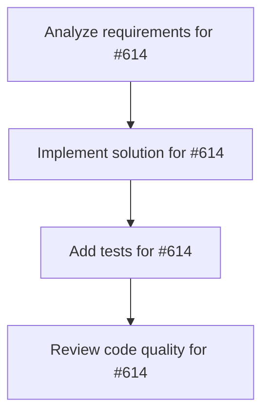

# Plans for Issue #614

**Title**: feat: Agent設定管理CLIの実装 (miyabi agent list/config/edit)

**URL**: https://github.com/customer-cloud/miyabi-private/issues/614

---

## 📋 Summary

- **Total Tasks**: 4
- **Estimated Duration**: 60 minutes
- **Execution Levels**: 4
- **Has Cycles**: ✅ No

## 📝 Task Breakdown

### 1. Analyze requirements for #614

- **ID**: `task-614-analysis`
- **Type**: Docs
- **Assigned Agent**: IssueAgent
- **Priority**: 0
- **Estimated Duration**: 5 min

**Description**: Analyze issue requirements and create detailed specification

### 2. Implement solution for #614

- **ID**: `task-614-impl`
- **Type**: Feature
- **Assigned Agent**: CodeGenAgent
- **Priority**: 1
- **Estimated Duration**: 30 min
- **Dependencies**: task-614-analysis

**Description**: # Agent設定管理CLIの実装

**Parent Issue**: #612 (Epic: KAMUI 4D設計パターン統合)
**Phase**: Phase 1 - 基盤整備
**Priority**: ⚠️ P1-High
**Estimated Time**: 3-5 days

## 📋 概要

21個のMiyabi Agent（Coding 7 + Business 14）を統一的に管理するCLIコマンドを実装する。KAMUI 4Dの`agent-config-service.js`の設計を参考に、Agent一覧表示、設定確認、設定編集機能を提供する。

## 🎯 目標

以下のコマンドで全Agentを効率的に管理できるようにする：

```bash
miyabi agent list                        # Agent一覧表示
miyabi agent config CoordinatorAgent     # 設定確認
miyabi agent edit CoordinatorAgent       # 設定編集
miyabi agent create MyCustomAgent        # カスタムAgent作成
```

## 📊 要件

### 必須要件

- [ ] `miyabi agent list` - 全21個のAgent一覧表示
- [ ] `miyabi agent config <name>` - Agent設定表示
- [ ] `miyabi agent edit <name>` - Agent設定編集（エディタ起動）
- [ ] Agent設定ファイルの自動検出
  - `.miyabi/agents/*.toml`
  - `~/.config/miyabi/agents/*.toml`
  - 環境変数 `MIYABI_AGENT_CONFIG_PATH`
- [ ] Agent状態の表示（有効/無効）
- [ ] Agent依存関係の表示

### オプション要件

- [ ] `miyabi agent create` - カスタムAgent作成
- [ ] `miyabi agent validate` - 設定検証
- [ ] `miyabi agent export` - 設定エクスポート
- [ ] `miyabi agent import` - 設定インポート

## 🛠️ 技術スタック

- **言語**: Rust 2021 Edition
- **Crate**: `miyabi-cli`, `miyabi-agents`
- **依存**: `clap`, `toml`, `serde`, `dirs`

## 📐 設計

### Agent設定ファイル構造

```toml
# .miyabi/agents/CoordinatorAgent.toml

[agent]
name = "CoordinatorAgent"
type = "coordinator"
enabled = true
model = "claude-sonnet-4"
description = "タスク統括・DAG分解Agent"

[parameters]
max_tasks = 10
timeout = 3600
max_retries = 3

[skills]
rust-development = { enabled = true }
git-workflow = { enabled = true }
debugging-troubleshooting = { enabled = false }

[dependencies]
requires = []
provides = ["task-coordination", "dag-decomposition"]
```

### CLI出力イメージ

#### `miyabi agent list`

```
Miyabi Agent List (21 agents)

Coding Agents (7):
  ✅ CoordinatorAgent       - タスク統括・DAG分解
  ✅ CodeGenAgent           - コード生成（Claude Sonnet 4）
  ✅ ReviewAgent            - 品質レビュー（100点満点）
  ✅ IssueAgent             - Issue分析・ラベル付与
  ✅ PRAgent                - Pull Request作成
  ✅ DeploymentAgent        - CI/CDデプロイ
  ⚠️  RefresherAgent        - Issue状態監視（未設定）

Business Agents (14):
  ✅ AIEntrepreneurAgent    - AI起業家支援
  ✅ ProductConceptAgent    - プロダクトコンセプト設計
  ✅ ProductDesignAgent     - サービス詳細設計
  ...

Custom Agents (0):
  (カスタムAgentなし)

Legend: ✅ Active | ⚠️ Not Configured | ❌ Disabled
```

#### `miyabi agent config CoordinatorAgent`

```
Agent Configuration: CoordinatorAgent

Name:         CoordinatorAgent
Type:         coordinator
Status:       ✅ Active
Model:        claude-sonnet-4
Config File:  .miyabi/agents/CoordinatorAgent.toml

Parameters:
  max_tasks:    10
  timeout:      3600s
  max_retries:  3

Skills:
  ✅ rust-development
  ✅ git-workflow
  ❌ debugging-troubleshooting

Dependencies:
  Requires:     (none)
  Provides:     task-coordination, dag-decomposition

Edit: miyabi agent edit CoordinatorAgent
```

### Rust実装

```rust
// crates/miyabi-cli/src/commands/agent.rs

#[derive(Debug, clap::Parser)]
pub struct AgentCommand {
    #[command(subcommand)]
    subcommand: AgentSubcommand,
}

#[derive(Debug, clap::Subcommand)]
pub enum AgentSubcommand {
    /// List all agents
    List {
        #[arg(long)]
        json: bool,
    },
    /// Show agent configuration
    Config {
        agent_name: String,
    },
    /// Edit agent configuration
    Edit {
        agent_name: String,
        #[arg(long, default_value = "vi")]
        editor: String,
    },
    /// Create custom agent
    Create {
        agent_name: String,
        #[arg(long)]
        template: Option<String>,
    },
}

impl AgentCommand {
    pub async fn execute(&self) -> Result<()> {
        match &self.subcommand {
            AgentSubcommand::List { json } => self.list_agents(*json).await,
            AgentSubcommand::Config { agent_name } => self.show_config(agent_name).await,
            AgentSubcommand::Edit { agent_name, editor } => self.edit_config(agent_name, editor).await,
            AgentSubcommand::Create { agent_name, template } => self.create_agent(agent_name, template).await,
        }
    }
}
```

```rust
// crates/miyabi-agents/src/config.rs

#[derive(Debug, Clone, Serialize, Deserialize)]
pub struct AgentConfig {
    pub agent: AgentMetadata,
    pub parameters: HashMap<String, serde_json::Value>,
    pub skills: HashMap<String, SkillConfig>,
    pub dependencies: AgentDependencies,
}

#[derive(Debug, Clone, Serialize, Deserialize)]
pub struct AgentMetadata {
    pub name: String,
    pub agent_type: AgentType,
    pub enabled: bool,
    pub model: String,
    pub description: String,
}

pub struct AgentConfigManager {
    config_dirs: Vec<PathBuf>,
}

impl AgentConfigManager {
    pub fn new() -> Result<Self>;
    pub fn list_agents(&self) -> Result<Vec<AgentInfo>>;
    pub fn load_config(&self, name: &str) -> Result<AgentConfig>;
    pub fn save_config(&self, name: &str, config: &AgentConfig) -> Result<()>;
    pub fn find_config_file(&self, name: &str) -> Result<Option<PathBuf>>;
}
```

## 🧪 テストケース

```rust
#[cfg(test)]
mod tests {
    #[test]
    fn test_list_agents() {
        // 全Agent一覧取得
    }

    #[test]
    fn test_load_agent_config() {
        // Agent設定読み込み
    }

    #[test]
    fn test_save_agent_config() {
        // Agent設定保存
    }

    #[test]
    fn test_agent_config_validation() {
        // 設定検証
    }
}
```

## 🔗 参考リソース

### KAMUI 4D実装

```javascript
// agent-config-service.js
const AGENT_DEFINITIONS = [
  {
    id: 'codex',
    name: 'Codex CLI',
    envKeys: ['CODEX_CONFIG_PATH'],
    directories: [
      ({ home }) => path.join(home, '.config', 'codex'),
      ({ home }) => path.join(home, '.codex')
    ]
  },
  // ...
];
```

### Miyabi既存実装

- `.claude/agents/specs/` - 21個のAgent仕様
- `.claude/agents/prompts/` - Agent実行プロンプト

## 📊 成功条件

- [ ] `miyabi agent list` で全21個のAgentが表示される
- [ ] `miyabi agent config <name>` で設定が表示される
- [ ] `miyabi agent edit <name>` でエディタが起動する
- [ ] 設定ファイルの自動検出が動作する
- [ ] 全テストケースが通過する
- [ ] ドキュメントが更新される

---

🤖 Generated with [Claude Code](https://claude.com/claude-code)

### 3. Add tests for #614

- **ID**: `task-614-test`
- **Type**: Test
- **Assigned Agent**: CodeGenAgent
- **Priority**: 2
- **Estimated Duration**: 15 min
- **Dependencies**: task-614-impl

**Description**: Create comprehensive test coverage

### 4. Review code quality for #614

- **ID**: `task-614-review`
- **Type**: Refactor
- **Assigned Agent**: ReviewAgent
- **Priority**: 3
- **Estimated Duration**: 10 min
- **Dependencies**: task-614-test

**Description**: Run quality checks and code review

## 🔄 Execution Plan (DAG Levels)

Tasks can be executed in parallel within each level:

### Level 0 (Parallel Execution)

- `task-614-analysis` - Analyze requirements for #614

### Level 1 (Parallel Execution)

- `task-614-impl` - Implement solution for #614

### Level 2 (Parallel Execution)

- `task-614-test` - Add tests for #614

### Level 3 (Parallel Execution)

- `task-614-review` - Review code quality for #614

## 📊 Dependency Graph



## ⏱️ Timeline Estimation

- **Sequential Execution**: 60 minutes (1.0 hours)
- **Parallel Execution (Critical Path)**: 10 minutes (0.2 hours)
- **Estimated Speedup**: 6.0x

---

*Generated by CoordinatorAgent on 2025-10-29 23:11:09 UTC*
