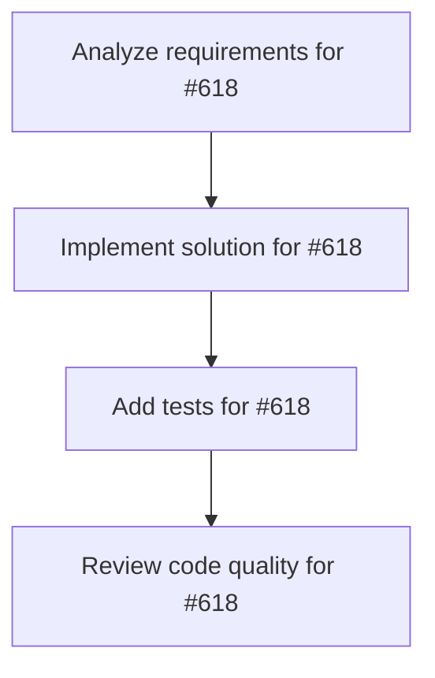

# Plans for Issue #618

**Title**: feat: Agent実行状態リアルタイム表示 - ライブモニタリングTUI

**URL**: https://github.com/customer-cloud/miyabi-private/issues/618

---

## 📋 Summary

- **Total Tasks**: 4
- **Estimated Duration**: 60 minutes
- **Execution Levels**: 4
- **Has Cycles**: ✅ No

## 📝 Task Breakdown

### 1. Analyze requirements for #618

- **ID**: `task-618-analysis`
- **Type**: Docs
- **Assigned Agent**: IssueAgent
- **Priority**: 0
- **Estimated Duration**: 5 min

**Description**: Analyze issue requirements and create detailed specification

### 2. Implement solution for #618

- **ID**: `task-618-impl`
- **Type**: Feature
- **Assigned Agent**: CodeGenAgent
- **Priority**: 1
- **Estimated Duration**: 30 min
- **Dependencies**: task-618-analysis

**Description**: # Agent実行状態リアルタイム表示

**Parent Issue**: #612 (Epic: KAMUI 4D設計パターン統合)
**Phase**: Phase 2 - 可視化
**Priority**: 📊 P2-Medium
**Estimated Time**: 5-7 days

## 📋 概要

実行中のAgentの状態をリアルタイムでモニタリングするTUIを実装する。21個のAgentの実行状況、進捗、ログ出力を視覚的に追跡し、並列実行の効率を最大化する。

## 🎯 目標

`miyabi agent monitor` コマンドで以下を実現：

- 全Agent（21個）の実行状態を一覧表示
- 実行中Agentのリアルタイム進捗
- ログ出力のストリーミング表示
- CPU/メモリ使用率の監視
- Agent間の依存関係の可視化

## 📊 要件

### 必須要件

- [ ] Agent状態モニタリング
  - 21個のAgent状態（Idle/Running/Completed/Failed）
  - 実行時間、進捗率
  - 割り当てられたIssue番号
- [ ] リアルタイム更新（0.5秒間隔）
- [ ] ログストリーミング
  - 選択したAgentのログをリアルタイム表示
  - ログレベルフィルタ（Info/Warn/Error）
  - スクロール可能
- [ ] リソース監視
  - CPU使用率
  - メモリ使用量
  - ディスクI/O
- [ ] キーボード操作
  - `↑↓` - Agent選択
  - `Enter` - ログ表示
  - `k` - Agent停止（kill）
  - `r` - Agent再起動
  - `q` - 終了

### オプション要件

- [ ] Agent依存関係グラフ
- [ ] パフォーマンス履歴グラフ
- [ ] アラート通知（エラー発生時）
- [ ] ログエクスポート

## 🛠️ 技術スタック

- **言語**: Rust 2021 Edition
- **依存**:
  - `ratatui` - TUI描画
  - `tokio` - 非同期処理
  - `sysinfo` - システム情報取得
  - `tracing` - ログ管理

## 📐 設計

### TUIレイアウト

```
┌───────────────────────────────────────────────────────────────┐
│ Miyabi Agent Monitor (Press 'q' to quit)         CPU: 45%    │
├───────────────────────────────────────────────────────────────┤
│ Coding Agents (7):                                            │
│ ✅ CoordinatorAgent    │ issue-270 │ Running │ 15m 32s │ 2.1GB│
│ ✅ CodeGenAgent        │ issue-271 │ Running │  8m 45s │ 1.8GB│
│ ⏸️  ReviewAgent         │ -         │ Idle    │    -    │   -  │
│ ⏸️  IssueAgent          │ -         │ Idle    │    -    │   -  │
│ ⏸️  PRAgent             │ -         │ Idle    │    -    │   -  │
│ ⏸️  DeploymentAgent     │ -         │ Idle    │    -    │   -  │
│ ⏸️  RefresherAgent      │ -         │ Idle    │    -    │   -  │
│                                                               │
│ Business Agents (14):                                         │
│ ⏸️  AIEntrepreneurAgent │ -         │ Idle    │    -    │   -  │
│ ... (collapsed, press 'e' to expand)                          │
│                                                               │
├───────────────────────────────────────────────────────────────┤
│ Agent Logs: CoordinatorAgent (issue-270)                      │
│ [INFO ] 10:30:15 - Starting task decomposition...            │
│ [INFO ] 10:30:17 - Analyzing dependencies...                 │
│ [INFO ] 10:30:20 - Created 3 sub-tasks                       │
│ [DEBUG] 10:30:21 - Assigned to: CodeGenAgent, ReviewAgent    │
│ [INFO ] 10:30:25 - Monitoring sub-task progress...           │
│ [WARN ] 10:30:30 - CodeGenAgent: high memory usage           │
│ [INFO ] 10:30:32 - Sub-task 1/3 completed                    │
│ ▼ (scrollable)                                                │
├───────────────────────────────────────────────────────────────┤
│ [↑↓] Select | [Enter] Logs | [k] Kill | [r] Restart | [q] Quit│
└───────────────────────────────────────────────────────────────┘
```

### Agent状態データ構造

```rust
// crates/miyabi-agents/src/monitor.rs

#[derive(Debug, Clone)]
pub struct AgentStatus {
    pub name: String,
    pub agent_type: AgentType,
    pub state: AgentState,
    pub issue_number: Option<u64>,
    pub started_at: Option<DateTime<Utc>>,
    pub elapsed: Option<Duration>,
    pub memory_usage: u64,
    pub cpu_usage: f32,
    pub progress: Option<f32>,  // 0.0 - 1.0
    pub last_log: Option<String>,
}

#[derive(Debug, Clone, Copy, PartialEq, Eq)]
pub enum AgentState {
    Idle,
    Running,
    Waiting,     // 依存関係待ち
    Completed,
    Failed,
    Killed,
}

#[derive(Debug, Clone, Copy)]
pub enum AgentType {
    Coordinator,
    CodeGen,
    Review,
    Issue,
    PR,
    Deployment,
    Refresher,
    // Business Agents
    AIEntrepreneur,
    ProductConcept,
    // ...
}

pub struct AgentMonitor {
    statuses: HashMap<String, AgentStatus>,
    log_buffer: Arc<Mutex<Vec<LogEntry>>>,
}

impl AgentMonitor {
    pub fn new() -> Self;
    
    /// 全Agent状態を取得
    pub async fn get_all_statuses(&self) -> Vec<AgentStatus>;
    
    /// 特定Agentのログを取得
    pub async fn get_agent_logs(&self, agent_name: &str, limit: usize) -> Vec<LogEntry>;
    
    /// Agent状態を更新（内部）
    pub(crate) async fn update_status(&self, agent_name: &str, status: AgentStatus);
    
    /// Agentを停止
    pub async fn kill_agent(&self, agent_name: &str) -> Result<()>;
    
    /// Agentを再起動
    pub async fn restart_agent(&self, agent_name: &str) -> Result<()>;
}

#[derive(Debug, Clone)]
pub struct LogEntry {
    pub timestamp: DateTime<Utc>,
    pub level: LogLevel,
    pub message: String,
    pub agent_name: String,
}

#[derive(Debug, Clone, Copy, PartialEq, Eq)]
pub enum LogLevel {
    Debug,
    Info,
    Warn,
    Error,
}
```

### TUI実装

```rust
// crates/miyabi-cli/src/tui/agent_monitor.rs

pub struct AgentMonitorTui {
    monitor: Arc<AgentMonitor>,
    selected_index: usize,
    selected_agent: Option<String>,
    log_scroll_offset: usize,
    show_business_agents: bool,
}

impl AgentMonitorTui {
    pub async fn run(&mut self) -> Result<()> {
        enable_raw_mode()?;
        let mut terminal = Terminal::new(CrosstermBackend::new(io::stdout()))?;

        loop {
            terminal.draw(|f| self.ui(f))?;
            
            if self.handle_events().await? {
                break;
            }
            
            tokio::time::sleep(Duration::from_millis(500)).await;
        }

        Ok(())
    }

    fn ui(&self, f: &mut Frame) {
        let chunks = Layout::default()
            .direction(Direction::Vertical)
            .constraints([
                Constraint::Length(3),      // ヘッダー
                Constraint::Percentage(40), // Agent一覧
                Constraint::Percentage(50), // ログパネル
                Constraint::Length(3),      // フッター
            ])
            .split(f.area());

        // ヘッダー
        let cpu_usage = self.get_system_cpu_usage();
        let header = Paragraph::new(format!("Miyabi Agent Monitor (CPU: {:.1}%)", cpu_usage))
            .block(Block::bordered());
        f.render_widget(header, chunks[0]);

        // Agent一覧
        let statuses = self.monitor.get_all_statuses().await;
        let agent_items: Vec<ListItem> = statuses
            .iter()
            .filter(|s| {
                if !self.show_business_agents {
                    matches!(s.agent_type, AgentType::Coordinator | /* other coding agents */)
                } else {
                    true
                }
            })
            .map(|status| {
                let icon = match status.state {
                    AgentState::Running => "✅",
                    AgentState::Idle => "⏸️",
                    AgentState::Failed => "❌",
                    AgentState::Completed => "✔️",
                    _ => "❓",
                };
                let content = format!(
                    "{} {:20} │ {:9} │ {:8} │ {:7} │ {}",
                    icon,
                    status.name,
                    status.issue_number.map_or("-".to_string(), |n| format!("issue-{}", n)),
                    format!("{:?}", status.state),
                    status.elapsed.map_or("-".to_string(), |d| format_duration(d)),
                    format_bytes(status.memory_usage)
                );
                ListItem::new(content)
            })
            .collect();

        let agent_list = List::new(agent_items)
            .block(Block::bordered().title("Agents"))
            .highlight_style(Style::default().bg(Color::DarkGray));
        f.render_widget(agent_list, chunks[1]);

        // ログパネル
        if let Some(agent_name) = &self.selected_agent {
            let logs = self.monitor.get_agent_logs(agent_name, 100).await;
            let log_items: Vec<ListItem> = logs
                .iter()
                .skip(self.log_scroll_offset)
                .take(chunks[2].height as usize)
                .map(|log| {
                    let color = match log.level {
                        LogLevel::Error => Color::Red,
                        LogLevel::Warn => Color::Yellow,
                        LogLevel::Info => Color::Green,
                        LogLevel::Debug => Color::Gray,
                    };
                    let content = format!(
                        "[{:5}] {} - {}",
                        format!("{:?}", log.level).to_uppercase(),
                        log.timestamp.format("%H:%M:%S"),
                        log.message
                    );
                    ListItem::new(content).style(Style::default().fg(color))
                })
                .collect();

            let log_list = List::new(log_items)
                .block(Block::bordered().title(format!("Agent Logs: {}", agent_name)));
            f.render_widget(log_list, chunks[2]);
        }

        // フッター
        let footer = Paragraph::new("[↑↓] Select | [Enter] Logs | [k] Kill | [r] Restart | [q] Quit")
            .block(Block::bordered());
        f.render_widget(footer, chunks[3]);
    }
}
```

## 🧪 テストケース

```rust
#[cfg(test)]
mod tests {
    #[test]
    fn test_agent_status_tracking() {
        // Agent状態追跡
    }

    #[test]
    fn test_log_streaming() {
        // ログストリーミング
    }

    #[test]
    fn test_agent_kill() {
        // Agent停止
    }
}
```

## 📊 成功条件

- [ ] `miyabi agent monitor` でAgent状態が表示される
- [ ] リアルタイム更新が動作する（0.5秒間隔）
- [ ] ログストリーミングが動作する
- [ ] Agent停止/再起動が動作する
- [ ] ドキュメントが更新される

## 🔄 Dependencies

- **Depends on**: #616 (TUI基盤)

---

🤖 Generated with [Claude Code](https://claude.com/claude-code)

### 3. Add tests for #618

- **ID**: `task-618-test`
- **Type**: Test
- **Assigned Agent**: CodeGenAgent
- **Priority**: 2
- **Estimated Duration**: 15 min
- **Dependencies**: task-618-impl

**Description**: Create comprehensive test coverage

### 4. Review code quality for #618

- **ID**: `task-618-review`
- **Type**: Refactor
- **Assigned Agent**: ReviewAgent
- **Priority**: 3
- **Estimated Duration**: 10 min
- **Dependencies**: task-618-test

**Description**: Run quality checks and code review

## 🔄 Execution Plan (DAG Levels)

Tasks can be executed in parallel within each level:

### Level 0 (Parallel Execution)

- `task-618-analysis` - Analyze requirements for #618

### Level 1 (Parallel Execution)

- `task-618-impl` - Implement solution for #618

### Level 2 (Parallel Execution)

- `task-618-test` - Add tests for #618

### Level 3 (Parallel Execution)

- `task-618-review` - Review code quality for #618

## 📊 Dependency Graph



## ⏱️ Timeline Estimation

- **Sequential Execution**: 60 minutes (1.0 hours)
- **Parallel Execution (Critical Path)**: 10 minutes (0.2 hours)
- **Estimated Speedup**: 6.0x

---

*Generated by CoordinatorAgent on 2025-11-01 06:25:51 UTC*
