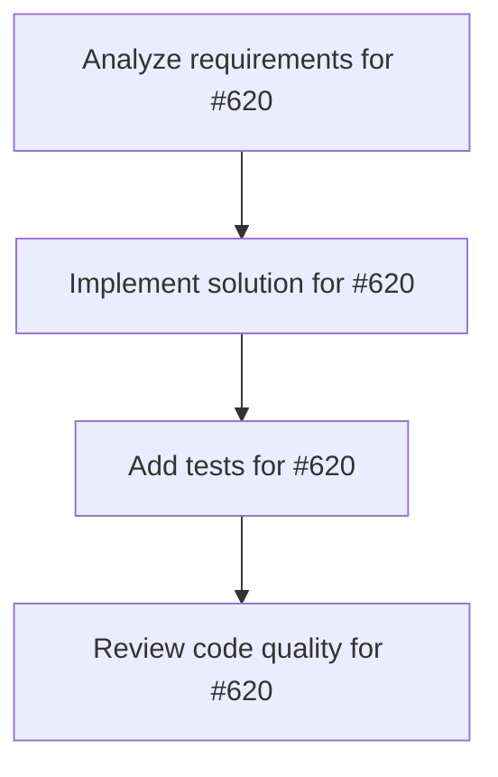

# Plans for Issue #620

**Title**: feat: KAMUI 4D APIエンドポイント拡張 - Miyabi統合API

**URL**: https://github.com/customer-cloud/miyabi-private/issues/620

---

## 📋 Summary

- **Total Tasks**: 4
- **Estimated Duration**: 60 minutes
- **Execution Levels**: 4
- **Has Cycles**: ✅ No

## 📝 Task Breakdown

### 1. Analyze requirements for #620

- **ID**: `task-620-analysis`
- **Type**: Docs
- **Assigned Agent**: IssueAgent
- **Priority**: 0
- **Estimated Duration**: 5 min

**Description**: Analyze issue requirements and create detailed specification

### 2. Implement solution for #620

- **ID**: `task-620-impl`
- **Type**: Feature
- **Assigned Agent**: CodeGenAgent
- **Priority**: 1
- **Estimated Duration**: 30 min
- **Dependencies**: task-620-analysis

**Description**: # KAMUI 4D APIエンドポイント拡張

**Parent Issue**: #612 (Epic: KAMUI 4D設計パターン統合)
**Phase**: Phase 3 - KAMUI 4D統合
**Priority**: 📝 P3-Low
**Estimated Time**: 5-7 days

## 📋 概要

KAMUI 4DアプリケーションにMiyabi専用のAPIエンドポイントを追加し、Miyabiからのタスク情報、Worktree状態、Agent実行状況を受信・表示できるようにする。

**注意**: このIssueはKAMUI 4Dリポジトリでの作業です（Miyabiリポジトリではありません）

## 🎯 目標

KAMUI 4Dに以下のAPIを追加：

- Miyabiタスク情報の受信・表示
- Worktree状態の3D可視化
- Agent実行状況の統合表示
- WebSocketによるリアルタイム更新

## 📊 要件

### 必須要件（KAMUI 4D側）

- [ ] `/api/miyabi/tasks` エンドポイント
  - `POST` - タスク作成・更新
  - `GET` - タスク一覧取得
  - `DELETE` - タスク削除
- [ ] `/api/miyabi/worktrees` エンドポイント
  - `POST` - Worktree状態更新
  - `GET` - Worktree一覧取得
- [ ] `/api/miyabi/agents` エンドポイント
  - `POST` - Agent状態更新
  - `GET` - Agent一覧取得
- [ ] `/ws/miyabi` WebSocketエンドポイント
  - イベントストリーミング
- [ ] UI統合
  - Miyabiタスクを専用パネルに表示
  - 3Dグラフに Worktree状態を反映

### オプション要件

- [ ] Miyabiコマンド送信機能
- [ ] 認証・セキュリティ
- [ ] ログ表示パネル

## 🛠️ 技術スタック

- **言語**: JavaScript/TypeScript (Electron)
- **Framework**: Express.js
- **実装場所**: `KAMUI-4D/src/main/api/`

## 📐 設計

### APIエンドポイント実装

```javascript
// KAMUI-4D/src/main/api/miyabi-api.js

const express = require('express');
const router = express.Router();

// グローバルストア（Miyabiタスク保存）
const miyabiTaskStore = {
  tasks: new Map(),
  worktrees: new Map(),
  agents: new Map(),
};

// タスク作成・更新
router.post('/api/miyabi/tasks', (req, res) => {
  const task = req.body;
  
  miyabiTaskStore.tasks.set(task.id, {
    ...task,
    updatedAt: new Date().toISOString(),
  });
  
  // WebSocketでリアルタイム通知
  broadcastMiyabiUpdate('task-updated', task);
  
  res.json({ success: true, task });
});

// タスク一覧取得
router.get('/api/miyabi/tasks', (req, res) => {
  const tasks = Array.from(miyabiTaskStore.tasks.values());
  res.json({ tasks });
});

// タスク削除
router.delete('/api/miyabi/tasks/:id', (req, res) => {
  const { id } = req.params;
  miyabiTaskStore.tasks.delete(id);
  
  broadcastMiyabiUpdate('task-deleted', { id });
  
  res.json({ success: true });
});

// Worktree状態更新
router.post('/api/miyabi/worktrees', (req, res) => {
  const worktree = req.body;
  
  miyabiTaskStore.worktrees.set(worktree.path, {
    ...worktree,
    updatedAt: new Date().toISOString(),
  });
  
  broadcastMiyabiUpdate('worktree-updated', worktree);
  
  res.json({ success: true });
});

// Agent状態更新
router.post('/api/miyabi/agents', (req, res) => {
  const agent = req.body;
  
  miyabiTaskStore.agents.set(agent.name, {
    ...agent,
    updatedAt: new Date().toISOString(),
  });
  
  broadcastMiyabiUpdate('agent-updated', agent);
  
  res.json({ success: true });
});

module.exports = router;
```

### WebSocket統合

```javascript
// KAMUI-4D/src/main/websocket/miyabi-ws.js

const WebSocket = require('ws');

let miyabiWsClients = [];

function setupMiyabiWebSocket(wss) {
  wss.on('connection', (ws, req) => {
    if (req.url === '/ws/miyabi') {
      console.log('[Miyabi] WebSocket client connected');
      miyabiWsClients.push(ws);
      
      ws.on('close', () => {
        miyabiWsClients = miyabiWsClients.filter(client => client !== ws);
        console.log('[Miyabi] WebSocket client disconnected');
      });
      
      ws.on('message', (message) => {
        const event = JSON.parse(message);
        handleMiyabiEvent(event);
      });
    }
  });
}

function broadcastMiyabiUpdate(eventType, data) {
  const payload = JSON.stringify({ type: eventType, data });
  
  miyabiWsClients.forEach(client => {
    if (client.readyState === WebSocket.OPEN) {
      client.send(payload);
    }
  });
}

function handleMiyabiEvent(event) {
  console.log('[Miyabi] Event received:', event);
  
  switch (event.type) {
    case 'task-status-request':
      // タスク状態をMiyabiへ送信
      break;
    case 'worktree-command':
      // Worktreeコマンド実行
      break;
  }
}

module.exports = {
  setupMiyabiWebSocket,
  broadcastMiyabiUpdate,
};
```

### UI統合（React）

```javascript
// KAMUI-4D/src/renderer/components/MiyabiPanel.jsx

import React, { useEffect, useState } from 'react';

function MiyabiPanel() {
  const [tasks, setTasks] = useState([]);
  const [worktrees, setWorktrees] = useState([]);

  useEffect(() => {
    // Miyabiタスク取得
    fetch('/api/miyabi/tasks')
      .then(res => res.json())
      .then(data => setTasks(data.tasks));

    // WebSocket接続
    const ws = new WebSocket('ws://localhost:3000/ws/miyabi');
    
    ws.onmessage = (event) => {
      const message = JSON.parse(event.data);
      
      if (message.type === 'task-updated') {
        setTasks(prev => {
          const index = prev.findIndex(t => t.id === message.data.id);
          if (index >= 0) {
            const updated = [...prev];
            updated[index] = message.data;
            return updated;
          }
          return [...prev, message.data];
        });
      }
    };

    return () => ws.close();
  }, []);

  return (
    <div className="miyabi-panel">
      <h2>Miyabi Tasks</h2>
      <div className="task-list">
        {tasks.map(task => (
          <div key={task.id} className="task-card">
            <div className="task-status">{task.status}</div>
            <div className="task-title">{task.title}</div>
            <div className="task-agent">{task.agent || 'N/A'}</div>
            <div className="task-progress">
              <progress value={task.progress || 0} max="1" />
            </div>
          </div>
        ))}
      </div>
    </div>
  );
}

export default MiyabiPanel;
```

## 🧪 テストケース

```javascript
// KAMUI-4D/tests/miyabi-api.test.js

describe('Miyabi API', () => {
  test('POST /api/miyabi/tasks should create task', async () => {
    const task = {
      id: 'issue-270',
      title: 'Test task',
      status: 'running',
    };
    
    const response = await fetch('/api/miyabi/tasks', {
      method: 'POST',
      headers: { 'Content-Type': 'application/json' },
      body: JSON.stringify(task),
    });
    
    const data = await response.json();
    expect(data.success).toBe(true);
  });

  test('WebSocket should broadcast updates', (done) => {
    const ws = new WebSocket('ws://localhost:3000/ws/miyabi');
    
    ws.onmessage = (event) => {
      const message = JSON.parse(event.data);
      expect(message.type).toBe('task-updated');
      done();
    };
  });
});
```

## 📊 成功条件

- [ ] APIエンドポイントが正しく動作する
- [ ] WebSocketでリアルタイム更新される
- [ ] KAMUI 4D UIにMiyabiタスクが表示される
- [ ] 3DグラフにWorktree状態が反映される
- [ ] ドキュメントが更新される

## 🔄 Dependencies

- **Depends on**: なし（独立して実装可能）
- **Related**: #619 (miyabi-kamui-bridge)

---

🤖 Generated with [Claude Code](https://claude.com/claude-code)

**Note**: このIssueはKAMUI 4Dリポジトリ (`kamui4d-editor`) で実装してください。

### 3. Add tests for #620

- **ID**: `task-620-test`
- **Type**: Test
- **Assigned Agent**: CodeGenAgent
- **Priority**: 2
- **Estimated Duration**: 15 min
- **Dependencies**: task-620-impl

**Description**: Create comprehensive test coverage

### 4. Review code quality for #620

- **ID**: `task-620-review`
- **Type**: Refactor
- **Assigned Agent**: ReviewAgent
- **Priority**: 3
- **Estimated Duration**: 10 min
- **Dependencies**: task-620-test

**Description**: Run quality checks and code review

## 🔄 Execution Plan (DAG Levels)

Tasks can be executed in parallel within each level:

### Level 0 (Parallel Execution)

- `task-620-analysis` - Analyze requirements for #620

### Level 1 (Parallel Execution)

- `task-620-impl` - Implement solution for #620

### Level 2 (Parallel Execution)

- `task-620-test` - Add tests for #620

### Level 3 (Parallel Execution)

- `task-620-review` - Review code quality for #620

## 📊 Dependency Graph



## ⏱️ Timeline Estimation

- **Sequential Execution**: 60 minutes (1.0 hours)
- **Parallel Execution (Critical Path)**: 10 minutes (0.2 hours)
- **Estimated Speedup**: 6.0x

---

*Generated by CoordinatorAgent on 2025-10-30 17:47:31 UTC*
