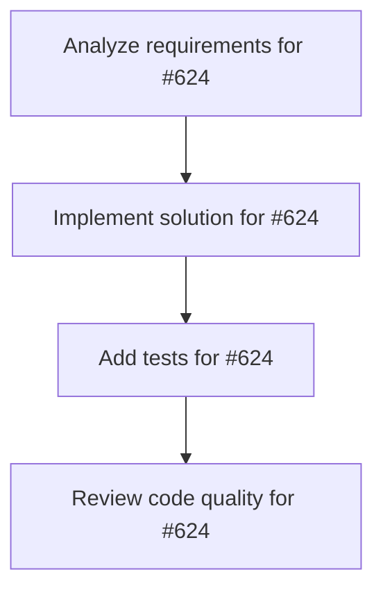

# Plans for Issue #624

**Title**: feat: TUI版Worktree状態表示の実装 (Phase 2-1)

**URL**: https://github.com/customer-cloud/miyabi-private/issues/624

---

## 📋 Summary

- **Total Tasks**: 4
- **Estimated Duration**: 60 minutes
- **Execution Levels**: 4
- **Has Cycles**: ✅ No

## 📝 Task Breakdown

### 1. Analyze requirements for #624

- **ID**: `task-624-analysis`
- **Type**: Docs
- **Assigned Agent**: IssueAgent
- **Priority**: 0
- **Estimated Duration**: 5 min

**Description**: Analyze issue requirements and create detailed specification

### 2. Implement solution for #624

- **ID**: `task-624-impl`
- **Type**: Feature
- **Assigned Agent**: CodeGenAgent
- **Priority**: 1
- **Estimated Duration**: 30 min
- **Dependencies**: task-624-analysis

**Description**: # TUI版Worktree状態表示の実装

**Parent Epic**: #612 (KAMUI 4D設計パターン統合)
**Phase**: Phase 2 - 可視化
**Priority**: ⚠️ P1-High
**Estimated Time**: 3-5 days

## 📋 概要

ratatuiを使用したリッチなターミナルUI実装で、Worktree状態をリアルタイムに可視化する。

## 🎯 目標

- リアルタイムWorktree状態表示
- Agent実行状態のライブモニタリング  
- インタラクティブなキーボード操作
- 自動更新・リフレッシュ機能

## 📊 要件

### 必須要件

- [ ] ratatui統合 (TUI基盤構築)
- [ ] Worktree状態表示 (色分け、プログレスバー)
- [ ] Agent実行状態表示 (リアルタイム更新)
- [ ] インタラクティブ操作 (キーボードナビゲーション)

## 🛠️ 技術スタック

- ratatui 0.26+
- crossterm 0.27+
- miyabi-worktree, miyabi-core

## 📐 TUIレイアウト

\`\`\`
┌─────────────────────────────────────────┐
│ Miyabi Worktree Monitor    [Status: OK] │
├─────────────────────────────────────────┤
│ Worktree List (8 worktrees)             │
│ ✅ .worktrees/issue-270 Active [1.2GB]  │
│ ⏸️  .worktrees/issue-269 Idle   [1.5GB]  │
├─────────────────────────────────────────┤
│ Agent Status (2 running)                │
│ CoordinatorAgent [████████░░] 80%       │
├─────────────────────────────────────────┤
│ Logs                                    │
│ [INFO] Planning task...                 │
├─────────────────────────────────────────┤
│ [q] Quit [r] Refresh [↑↓] Navigate     │
└─────────────────────────────────────────┘
\`\`\`

## 📝 実装計画

1. 新規crate: `crates/miyabi-tui/`
2. ratatui基盤実装
3. Worktree表示UI
4. Agent監視機能  
5. キーボード操作

## 📊 成功条件

- [ ] `miyabi status --tui` 起動
- [ ] Worktree状態色分け表示
- [ ] リアルタイム更新動作
- [ ] キーボード操作正常動作

## 🔄 Dependencies

Depends on: #613, #614, #615

---

🤖 Generated with [Claude Code](https://claude.com/claude-code)

### 3. Add tests for #624

- **ID**: `task-624-test`
- **Type**: Test
- **Assigned Agent**: CodeGenAgent
- **Priority**: 2
- **Estimated Duration**: 15 min
- **Dependencies**: task-624-impl

**Description**: Create comprehensive test coverage

### 4. Review code quality for #624

- **ID**: `task-624-review`
- **Type**: Refactor
- **Assigned Agent**: ReviewAgent
- **Priority**: 3
- **Estimated Duration**: 10 min
- **Dependencies**: task-624-test

**Description**: Run quality checks and code review

## 🔄 Execution Plan (DAG Levels)

Tasks can be executed in parallel within each level:

### Level 0 (Parallel Execution)

- `task-624-analysis` - Analyze requirements for #624

### Level 1 (Parallel Execution)

- `task-624-impl` - Implement solution for #624

### Level 2 (Parallel Execution)

- `task-624-test` - Add tests for #624

### Level 3 (Parallel Execution)

- `task-624-review` - Review code quality for #624

## 📊 Dependency Graph

## ⏱️ Timeline Estimation

- **Sequential Execution**: 60 minutes (1.0 hours)
- **Parallel Execution (Critical Path)**: 10 minutes (0.2 hours)
- **Estimated Speedup**: 6.0x

---

*Generated by CoordinatorAgent on 2025-11-01 11:02:10 UTC*
