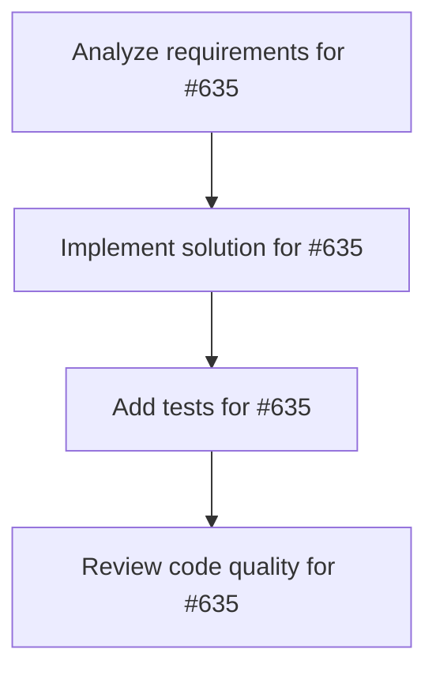

# Plans for Issue #635

**Title**: feat(desktop): Initialize Miyabi Desktop App with Tauri + React + TypeScript

**URL**: https://github.com/customer-cloud/miyabi-private/issues/635

---

## 📋 Summary

- **Total Tasks**: 4
- **Estimated Duration**: 60 minutes
- **Execution Levels**: 4
- **Has Cycles**: ✅ No

## 📝 Task Breakdown

### 1. Analyze requirements for #635

- **ID**: `task-635-analysis`
- **Type**: Docs
- **Assigned Agent**: IssueAgent
- **Priority**: 0
- **Estimated Duration**: 5 min

**Description**: Analyze issue requirements and create detailed specification

### 2. Implement solution for #635

- **ID**: `task-635-impl`
- **Type**: Feature
- **Assigned Agent**: CodeGenAgent
- **Priority**: 1
- **Estimated Duration**: 30 min
- **Dependencies**: task-635-analysis

**Description**: ## 🎯 Objective

Create a beautiful, intuitive desktop application for Miyabi's agent system using Tauri, eliminating CLI friction and providing visual workflows.

## 📋 Tasks

### Phase 1: Project Setup
- [ ] Initialize Tauri project with React + TypeScript template
- [ ] Configure Vite bundler with optimizations
- [ ] Setup shadcn/ui component library
- [ ] Configure Tailwind CSS with Miyabi theme
- [ ] Setup project structure (see ARCHITECTURE.md)

### Phase 2: Tauri Backend (Rust)
- [ ] Implement IPC commands for agent execution
- [ ] Create process manager for terminal sessions
- [ ] Integrate GitHub API client
- [ ] Add VOICEVOX engine control
- [ ] Setup configuration manager with secure storage

### Phase 3: Core UI Components
- [ ] Build navigation sidebar with icons
- [ ] Create main content area layout
- [ ] Implement status bar with system metrics
- [ ] Setup dark mode theme (Miyabi palette)

### Phase 4: Terminal Emulator
- [ ] Integrate xterm.js with Tauri PTY
- [ ] Implement ANSI color support
- [ ] Add copy/paste functionality
- [ ] Create multi-tab terminal interface
- [ ] Add search within terminal

### Phase 5: Agent Execution UI
- [ ] Build agent selection interface
- [ ] Create live output display
- [ ] Implement execution controls (start, stop, pause)
- [ ] Add real-time status updates
- [ ] Show execution metrics (duration, CPU, memory)

### Phase 6: Workflow DAG Viewer
- [ ] Integrate React Flow for graph visualization
- [ ] Create custom agent nodes with type colors
- [ ] Implement interactive positioning (drag, zoom, pan)
- [ ] Add real-time status updates on nodes
- [ ] Enable node click for detailed logs
- [ ] Add minimap navigation
- [ ] Implement export as SVG/PNG

### Phase 7: VOICEVOX Narration Player
- [ ] Create waveform visualization with Canvas
- [ ] Implement playback controls (play, pause, seek)
- [ ] Add speed adjustment slider (0.5x - 2.0x)
- [ ] Display synchronized subtitles
- [ ] Build narration history list
- [ ] Add export audio feature

### Phase 8: GitHub Issue Dashboard
- [ ] Implement Kanban board with React DnD
- [ ] Create issue cards with label chips
- [ ] Add drag & drop status updates
- [ ] Build label filtering (57-label system)
- [ ] Implement issue search & sorting
- [ ] Add bulk operations (multi-select)
- [ ] Create issue from template
- [ ] Quick agent assignment

### Phase 9: Settings UI
- [ ] Build configuration panel
- [ ] Add GitHub token management (secure storage)
- [ ] Configure VOICEVOX speaker selection
- [ ] Setup agent preferences
- [ ] Add theme customization
- [ ] Implement keyboard shortcuts configuration

### Phase 10: Polish & Testing
- [ ] Performance optimization (code splitting, lazy loading)
- [ ] Error handling & user-friendly messages
- [ ] Add loading states & skeletons
- [ ] Write comprehensive tests
- [ ] Create user documentation
- [ ] Package for macOS, Linux, Windows

## 📚 Technical Specs

**Architecture Document**: `miyabi-desktop/ARCHITECTURE.md`

**Tech Stack**:
- **Framework**: Tauri (Rust backend + Web frontend)
- **Frontend**: React 18 + TypeScript
- **State**: Zustand
- **Styling**: Tailwind CSS + shadcn/ui
- **Terminal**: xterm.js
- **Workflow**: React Flow
- **Audio**: Web Audio API
- **Icons**: Lucide React
- **Build**: Vite

**Color Palette** (Miyabi Theme):
```css
--miyabi-primary: #6366f1;      /* Indigo */
--agent-coordinator: #ef4444;   /* Red */
--agent-codegen: #10b981;       /* Green */
--agent-review: #3b82f6;        /* Blue */
--agent-deployment: #f59e0b;    /* Amber */
--agent-pr: #8b5cf6;            /* Purple */
--agent-issue: #06b6d4;         /* Cyan */
--agent-refresher: #6b7280;     /* Gray */
```

**Key Features**:
1. ✅ Live terminal with agent execution
2. ✅ Visual agent workflow DAG
3. ✅ VOICEVOX narration player with waveform
4. ✅ GitHub issue dashboard (Kanban board)

## 🎯 Success Criteria

- ✅ App launches successfully on macOS/Linux/Windows
- ✅ Terminal emulator works with ANSI colors
- ✅ Can execute Miyabi agents via GUI
- ✅ Workflow DAG visualizes agent dependencies
- ✅ VOICEVOX narration plays automatically
- ✅ Issue dashboard syncs with GitHub
- ✅ Settings persist across sessions
- ✅ Bundle size < 50 MB (macOS/Linux)
- ✅ Startup time < 2 seconds

## 📖 References

- Tauri Docs: https://tauri.app/
- React Flow: https://reactflow.dev/
- xterm.js: https://xtermjs.org/
- shadcn/ui: https://ui.shadcn.com/
- Miyabi Agents: `.claude/agents/specs/`

## 🏷️ Labels

- `enhancement` - New desktop application
- `🤖 agent:codegen` - Requires CodeGenAgent
- `📥 state:pending` - Awaiting triage

🤖 Generated with [Claude Code](https://claude.com/claude-code)

Co-Authored-By: Claude <noreply@anthropic.com>

### 3. Add tests for #635

- **ID**: `task-635-test`
- **Type**: Test
- **Assigned Agent**: CodeGenAgent
- **Priority**: 2
- **Estimated Duration**: 15 min
- **Dependencies**: task-635-impl

**Description**: Create comprehensive test coverage

### 4. Review code quality for #635

- **ID**: `task-635-review`
- **Type**: Refactor
- **Assigned Agent**: ReviewAgent
- **Priority**: 3
- **Estimated Duration**: 10 min
- **Dependencies**: task-635-test

**Description**: Run quality checks and code review

## 🔄 Execution Plan (DAG Levels)

Tasks can be executed in parallel within each level:

### Level 0 (Parallel Execution)

- `task-635-analysis` - Analyze requirements for #635

### Level 1 (Parallel Execution)

- `task-635-impl` - Implement solution for #635

### Level 2 (Parallel Execution)

- `task-635-test` - Add tests for #635

### Level 3 (Parallel Execution)

- `task-635-review` - Review code quality for #635

## 📊 Dependency Graph



## ⏱️ Timeline Estimation

- **Sequential Execution**: 60 minutes (1.0 hours)
- **Parallel Execution (Critical Path)**: 10 minutes (0.2 hours)
- **Estimated Speedup**: 6.0x

---

*Generated by CoordinatorAgent on 2025-11-01 11:02:10 UTC*
