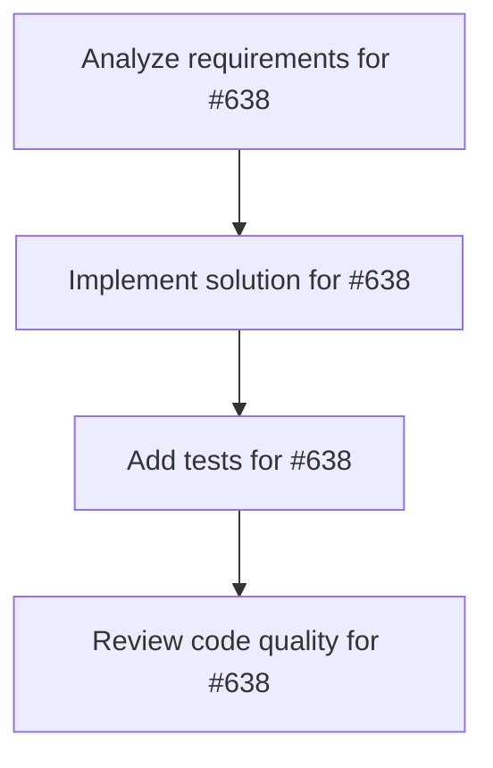

# Plans for Issue #638

**Title**: [Phase 1.3] リアルタイムログストリーミング - E2Eテスト追加

**URL**: https://github.com/customer-cloud/miyabi-private/issues/638

---

## 📋 Summary

- **Total Tasks**: 4
- **Estimated Duration**: 60 minutes
- **Execution Levels**: 4
- **Has Cycles**: ✅ No

## 📝 Task Breakdown

### 1. Analyze requirements for #638

- **ID**: `task-638-analysis`
- **Type**: Docs
- **Assigned Agent**: IssueAgent
- **Priority**: 0
- **Estimated Duration**: 5 min

**Description**: Analyze issue requirements and create detailed specification

### 2. Implement solution for #638

- **ID**: `task-638-impl`
- **Type**: Test
- **Assigned Agent**: CodeGenAgent
- **Priority**: 1
- **Estimated Duration**: 30 min
- **Dependencies**: task-638-analysis

**Description**: ## 📋 タスク概要

リアルタイムログストリーミング機能のE2Eテストスイートを実装する。

## 🎯 目的

手動テストを自動化し、リグレッションを防止する。

## 📝 実装内容

### テストフレームワーク

**Playwright** を使用

```bash
# インストール
pnpm add -D @playwright/test
pnpm exec playwright install
```

### テストケース

#### Test 1: 基本的なリアルタイムログ表示
```typescript
test('should display logs in real-time', async ({ page }) => {
  await page.goto('http://localhost:1420');
  
  // CoordinatorAgent選択
  await page.click('text=しきるん');
  
  // Issue選択
  await page.selectOption('[data-testid="issue-select"]', '270');
  
  // Execute Agent
  await page.click('text=Execute Agent');
  
  // ログが順次表示されることを確認
  const firstLog = page.locator('[data-testid="log-line"]').first();
  await expect(firstLog).toBeVisible({ timeout: 5000 });
  
  // 2行目も表示されることを確認
  const secondLog = page.locator('[data-testid="log-line"]').nth(1);
  await expect(secondLog).toBeVisible({ timeout: 2000 });
});
```

#### Test 2: 自動スクロール
```typescript
test('should auto-scroll to latest log', async ({ page }) => {
  await page.goto('http://localhost:1420');
  
  // エージェント実行
  await executeAgent(page);
  
  // 最新ログが表示されていることを確認
  const logContainer = page.locator('[data-testid="log-container"]');
  const isScrolledToBottom = await logContainer.evaluate((el) => {
    return el.scrollHeight - el.scrollTop === el.clientHeight;
  });
  
  expect(isScrolledToBottom).toBe(true);
});
```

#### Test 3: パフォーマンス
```typescript
test('should handle 1000+ log lines without freezing', async ({ page }) => {
  await page.goto('http://localhost:1420');
  
  // 大量のログを出力するエージェント実行
  await executeAgent(page);
  
  // UIが応答することを確認
  const button = page.locator('text=Stop Execution');
  await expect(button).toBeEnabled({ timeout: 5000 });
});
```

## 📁 ファイル構成

```
miyabi-desktop/
├── e2e/
│   ├── realtime-logs.spec.ts    # E2Eテスト
│   └── fixtures/                # テストフィクスチャ
├── playwright.config.ts         # Playwright設定
└── package.json                 # 更新
```

## ✅ 成功基準

- [ ] 3つのテストケースが実装されている
- [ ] 全てのテストがPass
- [ ] CI/CDに統合されている (GitHub Actions)

## 📊 成果物

- `e2e/realtime-logs.spec.ts`
- `playwright.config.ts`
- 更新された `.github/workflows/test.yml`

## 🔗 関連ドキュメント

- 実装計画: `docs/IMPLEMENTATION_PLAN.md` (Phase 1, Task 1.3)
- Playwright: https://playwright.dev/

## ⏱️ 見積もり時間

**2日**

---

🤖 Generated with Claude Code

### 3. Add tests for #638

- **ID**: `task-638-test`
- **Type**: Test
- **Assigned Agent**: CodeGenAgent
- **Priority**: 2
- **Estimated Duration**: 15 min
- **Dependencies**: task-638-impl

**Description**: Create comprehensive test coverage

### 4. Review code quality for #638

- **ID**: `task-638-review`
- **Type**: Refactor
- **Assigned Agent**: ReviewAgent
- **Priority**: 3
- **Estimated Duration**: 10 min
- **Dependencies**: task-638-test

**Description**: Run quality checks and code review

## 🔄 Execution Plan (DAG Levels)

Tasks can be executed in parallel within each level:

### Level 0 (Parallel Execution)

- `task-638-analysis` - Analyze requirements for #638

### Level 1 (Parallel Execution)

- `task-638-impl` - Implement solution for #638

### Level 2 (Parallel Execution)

- `task-638-test` - Add tests for #638

### Level 3 (Parallel Execution)

- `task-638-review` - Review code quality for #638

## 📊 Dependency Graph



## ⏱️ Timeline Estimation

- **Sequential Execution**: 60 minutes (1.0 hours)
- **Parallel Execution (Critical Path)**: 10 minutes (0.2 hours)
- **Estimated Speedup**: 6.0x

---

*Generated by CoordinatorAgent on 2025-11-01 06:23:18 UTC*
