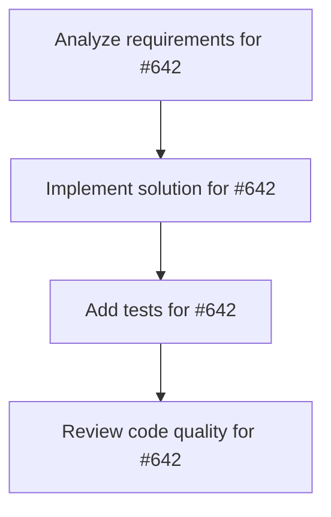

# Plans for Issue #642

**Title**: [Phase 2.3] ビジネスエージェントUI統合 - カテゴリアイコン統一

**URL**: https://github.com/customer-cloud/miyabi-private/issues/642

---

## 📋 Summary

- **Total Tasks**: 4
- **Estimated Duration**: 60 minutes
- **Execution Levels**: 4
- **Has Cycles**: ✅ No

## 📝 Task Breakdown

### 1. Analyze requirements for #642

- **ID**: `task-642-analysis`
- **Type**: Docs
- **Assigned Agent**: IssueAgent
- **Priority**: 0
- **Estimated Duration**: 5 min

**Description**: Analyze issue requirements and create detailed specification

### 2. Implement solution for #642

- **ID**: `task-642-impl`
- **Type**: Feature
- **Assigned Agent**: CodeGenAgent
- **Priority**: 1
- **Estimated Duration**: 30 min
- **Dependencies**: task-642-analysis

**Description**: ## 📋 タスク概要

各カテゴリに統一されたアイコンを設定し、視覚的な一貫性を確保する。

## 🎯 目的

ユーザーがカテゴリを素早く識別できるようにする。

## 📝 実装内容

### アイコンライブラリ

**lucide-react** を使用（既にインストール済み）

```bash
# 確認
pnpm list lucide-react
```

### アイコンマッピング

```typescript
import {
  Code,           // Coding
  Briefcase,      // Strategy & Planning
  TrendingUp,     // Marketing & Content
  Users,          // Sales & CRM
  Lightbulb,      // AI Entrepreneur
  Search,         // Market Research
  Target,         // Persona
  Package,        // Product Concept
  Layout,         // Product Design
  Filter,         // Funnel Design
  Video,          // YouTube
  Share2,         // SNS Strategy
  FileText,       // Content Creation
  DollarSign,     // Sales
  Heart,          // CRM
  BarChart3,      // Analytics
  User,           // Self Analysis
} from "lucide-react";

const categoryIcons = {
  "coding": <Code className="w-5 h-5" />,
  "business-strategy": <Briefcase className="w-5 h-5" />,
  "business-marketing": <TrendingUp className="w-5 h-5" />,
  "business-sales": <Users className="w-5 h-5" />,
};

const agentIcons = {
  "coordinator_agent": <Code className="w-5 h-5" />,
  "ai_entrepreneur_agent": <Lightbulb className="w-5 h-5" />,
  "market_research_agent": <Search className="w-5 h-5" />,
  "persona_agent": <Target className="w-5 h-5" />,
  // ... 全21個のエージェント
};
```

### アイコンコンポーネント

```tsx
const AgentIcon = ({ type, category }: { type: string; category?: string }) => {
  const icon = agentIcons[type] || categoryIcons[category || "coding"];
  
  return (
    <div className="p-2 rounded-full bg-gray-100 dark:bg-gray-800">
      {icon}
    </div>
  );
};
```

## ✅ 成功基準

- [ ] 全カテゴリにアイコンが設定されている
- [ ] 全エージェントにアイコンが設定されている
- [ ] アイコンのサイズとスタイルが統一されている
- [ ] ダークモード対応

## 📊 成果物

- アイコンマッピング定義
- `AgentIcon` コンポーネント

## 🔗 関連ドキュメント

- 実装計画: `docs/IMPLEMENTATION_PLAN.md` (Phase 2, Task 2.3)
- lucide-react: https://lucide.dev/

## ⏱️ 見積もり時間

**1日**

---

🤖 Generated with Claude Code

### 3. Add tests for #642

- **ID**: `task-642-test`
- **Type**: Test
- **Assigned Agent**: CodeGenAgent
- **Priority**: 2
- **Estimated Duration**: 15 min
- **Dependencies**: task-642-impl

**Description**: Create comprehensive test coverage

### 4. Review code quality for #642

- **ID**: `task-642-review`
- **Type**: Refactor
- **Assigned Agent**: ReviewAgent
- **Priority**: 3
- **Estimated Duration**: 10 min
- **Dependencies**: task-642-test

**Description**: Run quality checks and code review

## 🔄 Execution Plan (DAG Levels)

Tasks can be executed in parallel within each level:

### Level 0 (Parallel Execution)

- `task-642-analysis` - Analyze requirements for #642

### Level 1 (Parallel Execution)

- `task-642-impl` - Implement solution for #642

### Level 2 (Parallel Execution)

- `task-642-test` - Add tests for #642

### Level 3 (Parallel Execution)

- `task-642-review` - Review code quality for #642

## 📊 Dependency Graph



## ⏱️ Timeline Estimation

- **Sequential Execution**: 60 minutes (1.0 hours)
- **Parallel Execution (Critical Path)**: 10 minutes (0.2 hours)
- **Estimated Speedup**: 6.0x

---

*Generated by CoordinatorAgent on 2025-11-01 11:00:35 UTC*
