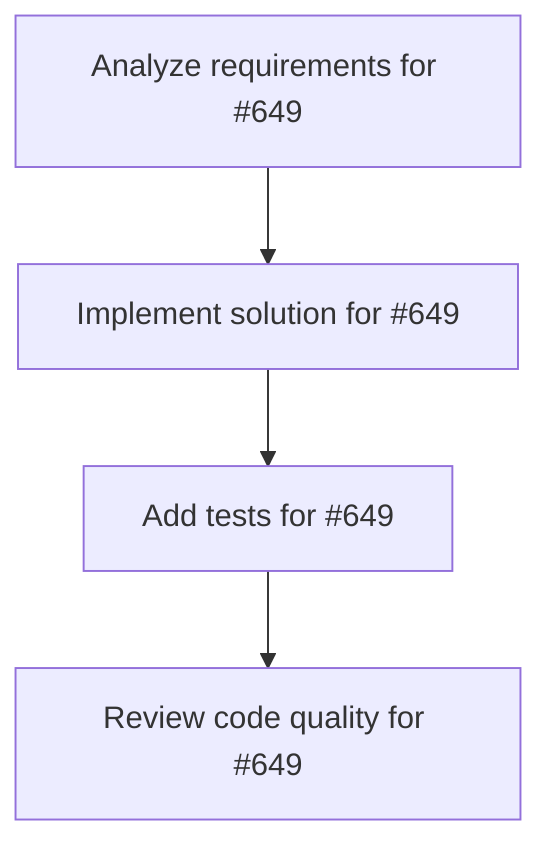

# Plans for Issue #649

**Title**: [Phase 4] ワークフローDAGリアルタイム更新 - 実装

**URL**: https://github.com/customer-cloud/miyabi-private/issues/649

---

## 📋 Summary

- **Total Tasks**: 4
- **Estimated Duration**: 60 minutes
- **Execution Levels**: 4
- **Has Cycles**: ✅ No

## 📝 Task Breakdown

### 1. Analyze requirements for #649

- **ID**: `task-649-analysis`
- **Type**: Docs
- **Assigned Agent**: IssueAgent
- **Priority**: 0
- **Estimated Duration**: 5 min

**Description**: Analyze issue requirements and create detailed specification

### 2. Implement solution for #649

- **ID**: `task-649-impl`
- **Type**: Feature
- **Assigned Agent**: CodeGenAgent
- **Priority**: 1
- **Estimated Duration**: 30 min
- **Dependencies**: task-649-analysis

**Description**: ## 📋 タスク概要

ワークフローDAGビューアーにリアルタイム更新機能を実装する。

## 🎯 目的

エージェント実行状況をDAG可視化でリアルタイム表示する。

## 📝 実装内容

### Zustand State Management

```bash
pnpm add zustand
```

```typescript
// src/stores/workflowStore.ts
import { create } from 'zustand';

interface WorkflowNode {
  id: string;
  type: 'agent';
  data: {
    label: string;
    status: 'pending' | 'running' | 'completed' | 'failed';
    agent: string;
    startTime?: string;
    endTime?: string;
  };
  position: { x: number; y: number };
}

interface WorkflowStore {
  nodes: WorkflowNode[];
  edges: Array<{ id: string; source: string; target: string }>;
  addNode: (node: WorkflowNode) => void;
  updateNodeStatus: (id: string, status: string, endTime?: string) => void;
  addEdge: (source: string, target: string) => void;
  clearWorkflow: () => void;
}

export const useWorkflowStore = create<WorkflowStore>((set) => ({
  nodes: [],
  edges: [],
  addNode: (node) => set((state) => ({ nodes: [...state.nodes, node] })),
  updateNodeStatus: (id, status, endTime) =>
    set((state) => ({
      nodes: state.nodes.map((n) =>
        n.id === id ? { ...n, data: { ...n.data, status, endTime } } : n
      ),
    })),
  addEdge: (source, target) =>
    set((state) => ({
      edges: [...state.edges, { id: `${source}-${target}`, source, target }],
    })),
  clearWorkflow: () => set({ nodes: [], edges: [] }),
}));
```

### WorkflowDAGViewer更新

```tsx
import { useWorkflowStore } from '../stores/workflowStore';

const WorkflowDAGViewer = () => {
  const { nodes, edges } = useWorkflowStore();

  const nodeTypes = {
    agent: ({ data }: { data: WorkflowNode['data'] }) => {
      const statusColors = {
        pending: 'bg-gray-200',
        running: 'bg-blue-500 animate-pulse',
        completed: 'bg-green-500',
        failed: 'bg-red-500',
      };

      return (
        <div className={`px-4 py-2 rounded ${statusColors[data.status]}`}>
          <div className="font-medium">{data.label}</div>
          <div className="text-xs">{data.status}</div>
        </div>
      );
    },
  };

  return (
    <ReactFlow
      nodes={nodes}
      edges={edges}
      nodeTypes={nodeTypes}
      fitView
    >
      <Background />
      <Controls />
    </ReactFlow>
  );
};
```

### Event Listener統合

```typescript
// AgentExecutionPanel.tsx
import { useWorkflowStore } from '../stores/workflowStore';

const AgentExecutionPanel = () => {
  const { addNode, updateNodeStatus } = useWorkflowStore();

  useEffect(() => {
    if (!activeExecution?.executionId) return;

    // エージェント開始時
    addNode({
      id: activeExecution.executionId,
      type: 'agent',
      data: {
        label: selectedAgent.displayName,
        status: 'running',
        agent: selectedAgent.type,
        startTime: new Date().toISOString(),
      },
      position: { x: 100, y: 100 },
    });

    // エージェント完了時
    const unlisten = listenToAgentComplete(
      activeExecution.executionId,
      (result) => {
        updateNodeStatus(
          activeExecution.executionId,
          result.success ? 'completed' : 'failed',
          new Date().toISOString()
        );
      }
    );

    return () => unlisten();
  }, [activeExecution]);
};
```

### 自動レイアウト

```bash
pnpm add dagre
```

```typescript
import dagre from 'dagre';

const getLayoutedElements = (nodes: WorkflowNode[], edges: Edge[]) => {
  const dagreGraph = new dagre.graphlib.Graph();
  dagreGraph.setDefaultEdgeLabel(() => ({}));
  dagreGraph.setGraph({ rankdir: 'LR' });

  nodes.forEach((node) => {
    dagreGraph.setNode(node.id, { width: 150, height: 50 });
  });

  edges.forEach((edge) => {
    dagreGraph.setEdge(edge.source, edge.target);
  });

  dagre.layout(dagreGraph);

  return nodes.map((node) => {
    const nodeWithPosition = dagreGraph.node(node.id);
    return {
      ...node,
      position: {
        x: nodeWithPosition.x,
        y: nodeWithPosition.y,
      },
    };
  });
};
```

## ✅ 成功基準

- [ ] Zustand storeが実装されている
- [ ] DAGがリアルタイム更新される
- [ ] ノードステータスが色で表現される
- [ ] 自動レイアウトが機能する

## 📊 成果物

- `workflowStore.ts`
- 更新された `WorkflowDAGViewer.tsx`
- 更新された `AgentExecutionPanel.tsx`

## 🔗 関連ドキュメント

- 実装計画: `docs/IMPLEMENTATION_PLAN.md` (Phase 4)

## ⏱️ 見積もり時間

**5-6日**

---

🤖 Generated with Claude Code

### 3. Add tests for #649

- **ID**: `task-649-test`
- **Type**: Test
- **Assigned Agent**: CodeGenAgent
- **Priority**: 2
- **Estimated Duration**: 15 min
- **Dependencies**: task-649-impl

**Description**: Create comprehensive test coverage

### 4. Review code quality for #649

- **ID**: `task-649-review`
- **Type**: Refactor
- **Assigned Agent**: ReviewAgent
- **Priority**: 3
- **Estimated Duration**: 10 min
- **Dependencies**: task-649-test

**Description**: Run quality checks and code review

## 🔄 Execution Plan (DAG Levels)

Tasks can be executed in parallel within each level:

### Level 0 (Parallel Execution)

- `task-649-analysis` - Analyze requirements for #649

### Level 1 (Parallel Execution)

- `task-649-impl` - Implement solution for #649

### Level 2 (Parallel Execution)

- `task-649-test` - Add tests for #649

### Level 3 (Parallel Execution)

- `task-649-review` - Review code quality for #649

## 📊 Dependency Graph



## ⏱️ Timeline Estimation

- **Sequential Execution**: 60 minutes (1.0 hours)
- **Parallel Execution (Critical Path)**: 10 minutes (0.2 hours)
- **Estimated Speedup**: 6.0x

---

*Generated by CoordinatorAgent on 2025-11-01 11:25:34 UTC*
