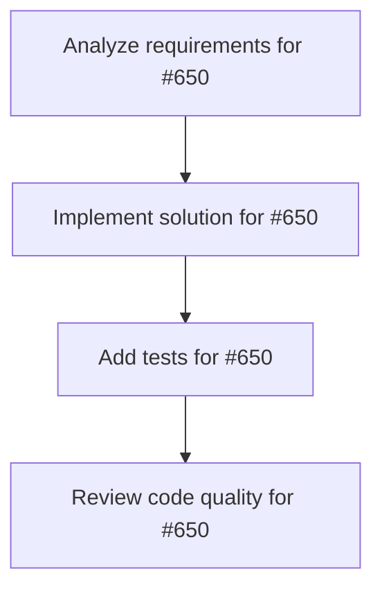

# Plans for Issue #650

**Title**: [Phase 5] エラーハンドリング改善 - 実装

**URL**: https://github.com/customer-cloud/miyabi-private/issues/650

---

## 📋 Summary

- **Total Tasks**: 4
- **Estimated Duration**: 60 minutes
- **Execution Levels**: 4
- **Has Cycles**: ✅ No

## 📝 Task Breakdown

### 1. Analyze requirements for #650

- **ID**: `task-650-analysis`
- **Type**: Docs
- **Assigned Agent**: IssueAgent
- **Priority**: 0
- **Estimated Duration**: 5 min

**Description**: Analyze issue requirements and create detailed specification

### 2. Implement solution for #650

- **ID**: `task-650-impl`
- **Type**: Feature
- **Assigned Agent**: CodeGenAgent
- **Priority**: 1
- **Estimated Duration**: 30 min
- **Dependencies**: task-650-analysis

**Description**: ## 📋 タスク概要

ユーザーフレンドリーなエラーメッセージとエラーモーダルを実装する。

## 🎯 目的

エラー発生時に明確な原因と解決方法を提示する。

## 📝 実装内容

### エラーメッセージ定義

```typescript
// src/lib/error-messages.ts
interface ErrorInfo {
  title: string;
  message: string;
  actions: string[];
  severity: 'error' | 'warning' | 'info';
}

export const ERROR_MESSAGES: Record<string, ErrorInfo> = {
  "github_token_invalid": {
    title: "GitHub Token が無効です",
    message: "入力されたGitHub Personal Access Tokenが無効、または期限切れの可能性があります。",
    actions: [
      "Settings → GitHub Tokenを確認してください",
      "新しいTokenを生成してください: https://github.com/settings/tokens",
      "必要な権限 (repo, workflow) が付与されているか確認してください",
    ],
    severity: "error",
  },
  "github_api_rate_limit": {
    title: "GitHub API レート制限",
    message: "GitHub APIの利用上限に達しました。1時間後に再試行してください。",
    actions: [
      "1時間待機してください",
      "Personal Access Tokenを使用すると制限が緩和されます",
    ],
    severity: "warning",
  },
  "agent_execution_failed": {
    title: "エージェント実行失敗",
    message: "エージェントの実行中にエラーが発生しました。",
    actions: [
      "ログを確認してください",
      "Issue番号が正しいか確認してください",
      "リポジトリへのアクセス権限を確認してください",
    ],
    severity: "error",
  },
  // ... 10+ エラータイプ
};
```

### エラーモーダルコンポーネント

```tsx
interface ErrorModalProps {
  error: ErrorInfo;
  onClose: () => void;
  onRetry?: () => void;
}

const ErrorModal = ({ error, onClose, onRetry }: ErrorModalProps) => {
  const severityColors = {
    error: "bg-red-50 border-red-200",
    warning: "bg-yellow-50 border-yellow-200",
    info: "bg-blue-50 border-blue-200",
  };

  const severityIcons = {
    error: <AlertCircle className="w-6 h-6 text-red-600" />,
    warning: <AlertTriangle className="w-6 h-6 text-yellow-600" />,
    info: <Info className="w-6 h-6 text-blue-600" />,
  };

  return (
    <div className="fixed inset-0 bg-black bg-opacity-50 flex items-center justify-center z-50">
      <div className="bg-white rounded-lg max-w-md w-full p-6 shadow-2xl">
        <div className="flex items-start gap-4 mb-4">
          {severityIcons[error.severity]}
          <div className="flex-1">
            <h2 className="text-xl font-bold mb-2">{error.title}</h2>
            <p className="text-gray-600">{error.message}</p>
          </div>
        </div>

        <div className={`p-4 rounded-lg border ${severityColors[error.severity]}`}>
          <h3 className="font-medium mb-2">解決方法:</h3>
          <ul className="space-y-1 text-sm">
            {error.actions.map((action, idx) => (
              <li key={idx} className="flex gap-2">
                <span>→</span>
                <span>{action}</span>
              </li>
            ))}
          </ul>
        </div>

        <div className="flex gap-2 mt-6">
          {onRetry && (
            <button
              onClick={onRetry}
              className="flex-1 py-2 bg-black text-white rounded-lg hover:bg-gray-800"
            >
              Retry
            </button>
          )}
          <button
            onClick={onClose}
            className="flex-1 py-2 border border-gray-300 rounded-lg hover:bg-gray-50"
          >
            Close
          </button>
        </div>
      </div>
    </div>
  );
};
```

### エラーハンドリング統合

```typescript
const handleExecuteAgent = async () => {
  try {
    await executeAgent(selectedAgent.type, selectedIssue?.number);
  } catch (error) {
    const errorCode = extractErrorCode(error);
    const errorInfo = ERROR_MESSAGES[errorCode] || ERROR_MESSAGES["unknown_error"];
    setShowErrorModal(errorInfo);
  }
};
```

## ✅ 成功基準

- [ ] 10種類以上のエラーメッセージが定義されている
- [ ] エラーモーダルが実装されている
- [ ] 全エージェント実行時のエラーハンドリング
- [ ] Retry機能が動作する

## 📊 成果物

- `error-messages.ts`
- `ErrorModal.tsx`
- 統合されたエラーハンドリング

## 🔗 関連ドキュメント

- 実装計画: `docs/IMPLEMENTATION_PLAN.md` (Phase 5)

## ⏱️ 見積もり時間

**2日**

---

🤖 Generated with Claude Code

### 3. Add tests for #650

- **ID**: `task-650-test`
- **Type**: Test
- **Assigned Agent**: CodeGenAgent
- **Priority**: 2
- **Estimated Duration**: 15 min
- **Dependencies**: task-650-impl

**Description**: Create comprehensive test coverage

### 4. Review code quality for #650

- **ID**: `task-650-review`
- **Type**: Refactor
- **Assigned Agent**: ReviewAgent
- **Priority**: 3
- **Estimated Duration**: 10 min
- **Dependencies**: task-650-test

**Description**: Run quality checks and code review

## 🔄 Execution Plan (DAG Levels)

Tasks can be executed in parallel within each level:

### Level 0 (Parallel Execution)

- `task-650-analysis` - Analyze requirements for #650

### Level 1 (Parallel Execution)

- `task-650-impl` - Implement solution for #650

### Level 2 (Parallel Execution)

- `task-650-test` - Add tests for #650

### Level 3 (Parallel Execution)

- `task-650-review` - Review code quality for #650

## 📊 Dependency Graph



## ⏱️ Timeline Estimation

- **Sequential Execution**: 60 minutes (1.0 hours)
- **Parallel Execution (Critical Path)**: 10 minutes (0.2 hours)
- **Estimated Speedup**: 6.0x

---

*Generated by CoordinatorAgent on 2025-11-01 11:25:34 UTC*
