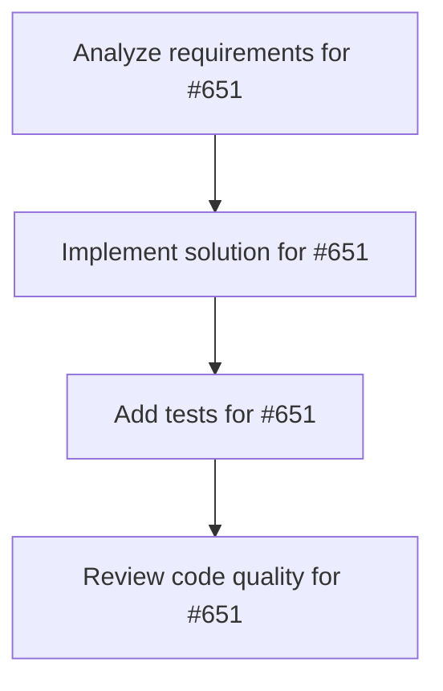

# Plans for Issue #651

**Title**: [Phase 6] 並列実行プログレスバー - 実装

**URL**: https://github.com/customer-cloud/miyabi-private/issues/651

---

## 📋 Summary

- **Total Tasks**: 4
- **Estimated Duration**: 60 minutes
- **Execution Levels**: 4
- **Has Cycles**: ✅ No

## 📝 Task Breakdown

### 1. Analyze requirements for #651

- **ID**: `task-651-analysis`
- **Type**: Docs
- **Assigned Agent**: IssueAgent
- **Priority**: 0
- **Estimated Duration**: 5 min

**Description**: Analyze issue requirements and create detailed specification

### 2. Implement solution for #651

- **ID**: `task-651-impl`
- **Type**: Feature
- **Assigned Agent**: CodeGenAgent
- **Priority**: 1
- **Estimated Duration**: 30 min
- **Dependencies**: task-651-analysis

**Description**: ## 📋 タスク概要

並列実行時の進捗状況を可視化するプログレスバーを実装する。

## 🎯 目的

複数のエージェント並列実行時の進捗を一目で把握できるようにする。

## 📝 実装内容

### プログレスバーコンポーネント

```tsx
interface ParallelProgressProps {
  total: number;
  completed: number;
  running: number;
  failed: number;
}

const ParallelProgressBar = ({ total, completed, running, failed }: ParallelProgressProps) => {
  const completedPercent = (completed / total) * 100;
  const runningPercent = (running / total) * 100;
  const failedPercent = (failed / total) * 100;

  return (
    <div className="space-y-2">
      <div className="flex justify-between text-sm font-medium">
        <span>Parallel Execution Progress</span>
        <span>{completed} / {total} completed</span>
      </div>

      <div className="relative h-4 bg-gray-100 rounded-full overflow-hidden">
        <div
          className="absolute left-0 top-0 h-full bg-green-500 transition-all duration-300"
          style={{ width: `${completedPercent}%` }}
        />
        <div
          className="absolute h-full bg-blue-500 animate-pulse transition-all duration-300"
          style={{
            left: `${completedPercent}%`,
            width: `${runningPercent}%`,
          }}
        />
        <div
          className="absolute h-full bg-red-500 transition-all duration-300"
          style={{
            left: `${completedPercent + runningPercent}%`,
            width: `${failedPercent}%`,
          }}
        />
      </div>

      <div className="flex gap-4 text-xs">
        <div className="flex items-center gap-1">
          <div className="w-3 h-3 bg-green-500 rounded-full" />
          <span>Completed: {completed}</span>
        </div>
        <div className="flex items-center gap-1">
          <div className="w-3 h-3 bg-blue-500 rounded-full animate-pulse" />
          <span>Running: {running}</span>
        </div>
        <div className="flex items-center gap-1">
          <div className="w-3 h-3 bg-red-500 rounded-full" />
          <span>Failed: {failed}</span>
        </div>
        <div className="flex items-center gap-1">
          <div className="w-3 h-3 bg-gray-300 rounded-full" />
          <span>Pending: {total - completed - running - failed}</span>
        </div>
      </div>
    </div>
  );
};
```

### 個別タスクステータス表示

```tsx
interface TaskStatus {
  id: string;
  agentType: string;
  issueNumber: number;
  status: 'pending' | 'running' | 'completed' | 'failed';
  startTime?: string;
  endTime?: string;
  logs?: string[];
}

const ParallelTaskList = ({ tasks }: { tasks: TaskStatus[] }) => {
  return (
    <div className="space-y-2 max-h-96 overflow-y-auto">
      {tasks.map((task) => (
        <div
          key={task.id}
          className="p-3 border rounded-lg flex items-center justify-between"
        >
          <div className="flex items-center gap-3">
            {task.status === 'running' && <Loader className="w-4 h-4 animate-spin" />}
            {task.status === 'completed' && <CheckCircle className="w-4 h-4 text-green-500" />}
            {task.status === 'failed' && <AlertCircle className="w-4 h-4 text-red-500" />}
            {task.status === 'pending' && <Clock className="w-4 h-4 text-gray-400" />}
            
            <div>
              <div className="font-medium">{task.agentType}</div>
              <div className="text-xs text-gray-500">Issue #{task.issueNumber}</div>
            </div>
          </div>

          {task.status === 'running' && task.startTime && (
            <div className="text-xs text-gray-400">
              {formatDuration(Date.now() - new Date(task.startTime).getTime())}
            </div>
          )}
        </div>
      ))}
    </div>
  );
};
```

### 並列実行統合

```tsx
const ParallelExecutionView = () => {
  const [tasks, setTasks] = useState<TaskStatus[]>([]);

  const stats = useMemo(() => {
    return {
      total: tasks.length,
      completed: tasks.filter((t) => t.status === 'completed').length,
      running: tasks.filter((t) => t.status === 'running').length,
      failed: tasks.filter((t) => t.status === 'failed').length,
    };
  }, [tasks]);

  return (
    <div className="space-y-4">
      <ParallelProgressBar {...stats} />
      <ParallelTaskList tasks={tasks} />
    </div>
  );
};
```

## ✅ 成功基準

- [ ] プログレスバーが実装されている
- [ ] 各タスクのステータスが表示される
- [ ] リアルタイム更新が機能する
- [ ] 完了/実行中/失敗のカウントが正確

## 📊 成果物

- `ParallelProgressBar.tsx`
- `ParallelTaskList.tsx`
- `ParallelExecutionView.tsx`

## 🔗 関連ドキュメント

- 実装計画: `docs/IMPLEMENTATION_PLAN.md` (Phase 6)

## ⏱️ 見積もり時間

**2日**

---

🤖 Generated with Claude Code

### 3. Add tests for #651

- **ID**: `task-651-test`
- **Type**: Test
- **Assigned Agent**: CodeGenAgent
- **Priority**: 2
- **Estimated Duration**: 15 min
- **Dependencies**: task-651-impl

**Description**: Create comprehensive test coverage

### 4. Review code quality for #651

- **ID**: `task-651-review`
- **Type**: Refactor
- **Assigned Agent**: ReviewAgent
- **Priority**: 3
- **Estimated Duration**: 10 min
- **Dependencies**: task-651-test

**Description**: Run quality checks and code review

## 🔄 Execution Plan (DAG Levels)

Tasks can be executed in parallel within each level:

### Level 0 (Parallel Execution)

- `task-651-analysis` - Analyze requirements for #651

### Level 1 (Parallel Execution)

- `task-651-impl` - Implement solution for #651

### Level 2 (Parallel Execution)

- `task-651-test` - Add tests for #651

### Level 3 (Parallel Execution)

- `task-651-review` - Review code quality for #651

## 📊 Dependency Graph



## ⏱️ Timeline Estimation

- **Sequential Execution**: 60 minutes (1.0 hours)
- **Parallel Execution (Critical Path)**: 10 minutes (0.2 hours)
- **Estimated Speedup**: 6.0x

---

*Generated by CoordinatorAgent on 2025-11-01 15:27:06 UTC*
