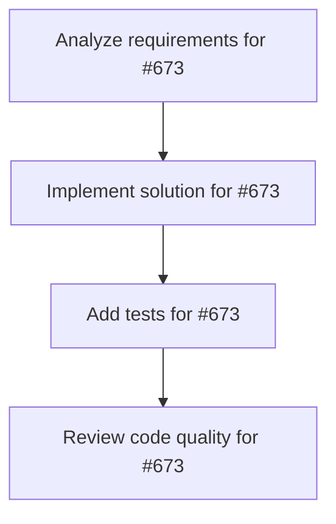

# Plans for Issue #673

**Title**: feat: Integrate @humanu/orchestra (gwr) into miyabi-desktop

**URL**: https://github.com/customer-cloud/miyabi-private/issues/673

---

## 📋 Summary

- **Total Tasks**: 4
- **Estimated Duration**: 60 minutes
- **Execution Levels**: 4
- **Has Cycles**: ✅ No

## 📝 Task Breakdown

### 1. Analyze requirements for #673

- **ID**: `task-673-analysis`
- **Type**: Docs
- **Assigned Agent**: IssueAgent
- **Priority**: 0
- **Estimated Duration**: 5 min

**Description**: Analyze issue requirements and create detailed specification

### 2. Implement solution for #673

- **ID**: `task-673-impl`
- **Type**: Feature
- **Assigned Agent**: CodeGenAgent
- **Priority**: 1
- **Estimated Duration**: 30 min
- **Dependencies**: task-673-analysis

**Description**: ## 🎯 Overview

Integrate `@humanu/orchestra` (gwr) Git Worktree + tmux management functionality into miyabi-desktop to provide a consistent development experience across all execution patterns.

## 📋 Goals

1. **Worktree Visualization** - Display all worktrees in a tree view
2. **tmux Session Integration** - Link tmux sessions to worktrees
3. **AI-powered Naming** - Automatic naming using Anthropic API
4. **Real-time Git Status** - Instant visualization of changes
5. **Interactive Operations** - Support for keyboard/mouse interactions

## 🎯 Five Execution Patterns

1. **CLI TUI Mode** (`miyabi tui`) - Direct gwr wrapper
2. **Desktop GUI Mode** - Tauri + React integration
3. **Agent Execution Mode** - Automatic worktree + tmux management
4. **Parallel Execution Mode** - Multiple worktree parallel execution
5. **Infinity Mode** - Automatic processing of all issues

## 🏗️ Architecture

### Frontend (React + TypeScript)
- `WorktreeManagerPanel.tsx` - Main panel
- `WorktreeTreeView.tsx` - Interactive tree view (react-arborist)
- `WorktreeDetailPanel.tsx` - Detail panel
- `AINamingInput.tsx` - AI naming UI
- `GitStatusBadges.tsx` - Real-time Git status

### Backend (Rust + Tauri)
- `worktree.rs` - Worktree management
- `ai_naming.rs` - Anthropic API integration
- `tmux.rs` (enhanced) - Worktree ↔ tmux linking

## 📅 Implementation Roadmap (3 weeks)

### Phase 1: Foundation (Week 1, Days 1-3) ⭐
- [ ] Add Cargo dependencies
- [ ] Implement `worktree.rs`
- [ ] Implement `ai_naming.rs`
- [ ] Register Tauri commands
- [ ] Write unit tests

### Phase 2-8: See detailed plan

## 📖 Detailed Plan

See: `.ai/plans/701/Plans-latest.md`

## 🔗 Related

- gwr: @humanu/orchestra
- TMUX_INTEGRATION_DESIGN.md
- .claude/context/worktree.md

🤖 Generated with [Claude Code](https://claude.com/claude-code)

Co-Authored-By: Claude <noreply@anthropic.com>

### 3. Add tests for #673

- **ID**: `task-673-test`
- **Type**: Test
- **Assigned Agent**: CodeGenAgent
- **Priority**: 2
- **Estimated Duration**: 15 min
- **Dependencies**: task-673-impl

**Description**: Create comprehensive test coverage

### 4. Review code quality for #673

- **ID**: `task-673-review`
- **Type**: Refactor
- **Assigned Agent**: ReviewAgent
- **Priority**: 3
- **Estimated Duration**: 10 min
- **Dependencies**: task-673-test

**Description**: Run quality checks and code review

## 🔄 Execution Plan (DAG Levels)

Tasks can be executed in parallel within each level:

### Level 0 (Parallel Execution)

- `task-673-analysis` - Analyze requirements for #673

### Level 1 (Parallel Execution)

- `task-673-impl` - Implement solution for #673

### Level 2 (Parallel Execution)

- `task-673-test` - Add tests for #673

### Level 3 (Parallel Execution)

- `task-673-review` - Review code quality for #673

## 📊 Dependency Graph

## ⏱️ Timeline Estimation

- **Sequential Execution**: 60 minutes (1.0 hours)
- **Parallel Execution (Critical Path)**: 10 minutes (0.2 hours)
- **Estimated Speedup**: 6.0x

---

*Generated by CoordinatorAgent on 2025-11-03 03:20:57 UTC*
