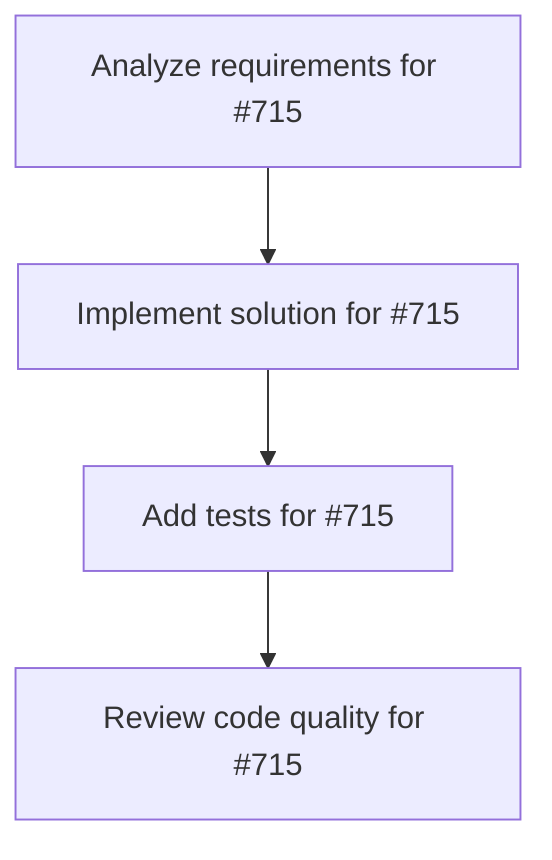

# Plans for Issue #715

**Title**: Epic: Full Rust Agentic Framework - Mastra + Codex + Claude Code in Rust

**URL**: https://github.com/customer-cloud/miyabi-private/issues/715

---

## 📋 Summary

- **Total Tasks**: 4
- **Estimated Duration**: 60 minutes
- **Execution Levels**: 4
- **Has Cycles**: ✅ No

## 📝 Task Breakdown

### 1. Analyze requirements for #715

- **ID**: `task-715-analysis`
- **Type**: Docs
- **Assigned Agent**: IssueAgent
- **Priority**: 0
- **Estimated Duration**: 5 min

**Description**: Analyze issue requirements and create detailed specification

### 2. Implement solution for #715

- **ID**: `task-715-impl`
- **Type**: Feature
- **Assigned Agent**: CodeGenAgent
- **Priority**: 1
- **Estimated Duration**: 30 min
- **Dependencies**: task-715-analysis

**Description**: ## 🎯 Vision

Create the **definitive Rust-native AI Agent framework** by combining the best features of:
- **Mastra** (TypeScript) - Workflow orchestration, multi-provider routing
- **OpenAI Codex** (Rust) - Local CLI agent, MCP integration
- **Claude Code** (TypeScript) - Git workflows, codebase understanding

**Result**: Miyabi becomes the "Full Rust Mastra" - the most powerful, performant, and production-ready AI agent framework in the Rust ecosystem.

## 📊 Current Status

**Miyabi Completeness**: 70%

✅ **Already Implemented**:
- 21 specialized agents (7 Coding + 14 Business)
- LLM routing (OpenAI, Anthropic, Ollama)
- CLI interface + MCP server
- Git worktree parallel execution
- RAG (Qdrant) + AST context (tree-sitter)
- GitHub integration + Issue management
- Docker + Cloud deployment

⚠️ **Missing Features**:
- Workflow DSL (`.then()`, `.branch()`, `.parallel()`)
- Human-in-the-Loop (suspend/resume)
- 40+ LLM providers
- Evaluation framework
- Web framework integration (Leptos/Axum)
- Persistent working memory

## 🗺️ Roadmap to Completion

### Phase 1: Workflow DSL (2-3 weeks) ⭐ P0-Critical

**Status**: 🚧 In Progress - Sub-Issues created

**Create**: `miyabi-workflow` crate

```rust
use miyabi_workflow::Workflow;

let workflow = Workflow::new("issue-resolution")
    .step("analyze", IssueAgent)
    .then("implement", CodeGenAgent)
    .branch("review", |result| {
        if result.quality > 0.8 { "deploy" } else { "fix" }
    })
    .parallel(vec!["test", "lint", "security"])
    .then("deploy", DeploymentAgent);

workflow.execute().await?;
```

**Sub-Issues** (✅ Created 2025-11-03):
- [ ] #716: Implement WorkflowBuilder API with `.then()`, `.branch()`, `.parallel()` methods
- [ ] #717: Implement workflow state persistence (sled/SQLite)
- [ ] #718: Implement conditional branching logic
- [ ] #719: Integrate WorkflowBuilder with CoordinatorAgent

---

### Phase 2: Human-in-the-Loop (1-2 weeks) ⭐ P1-High

**Status**: ⏳ Pending (after Phase 1)

**Create**: `miyabi-approval` crate

```rust
workflow
    .step("generate-code", CodeGenAgent)
    .await_approval("code-review", |ctx| {
        ctx.notify_user("Code ready for review");
        ctx.pause() // Suspend workflow
    })
    .resume_on_approval()
    .then("deploy", DeploymentAgent);
```

**Sub-Issues** (TBD):
- [ ] #720: Add workflow pause/resume capability
- [ ] #721: Implement approval gate API
- [ ] #722: Discord/Slack notification integration
- [ ] #723: Web UI for approval interface

---

### Phase 3: Evaluation Framework (1-2 weeks) ⭐ P1-High

**Status**: ⏳ Pending

**Create**: `miyabi-eval` crate

```rust
use miyabi_eval::Evaluator;

let evaluator = Evaluator::new()
    .add_metric("code_quality", QualityMetric)
    .add_metric("test_coverage", CoverageMetric)
    .add_metric("security_score", SecurityMetric);

let results = evaluator.evaluate(&agent, &test_suite).await?;
```

**Sub-Issues** (TBD):
- [ ] #724: Define evaluation metrics API
- [ ] #725: AgentBench integration (relates to #397)
- [ ] #726: A/B testing framework
- [ ] #727: Evaluation dashboard

---

### Phase 4: Expand Model Support (2-3 weeks) ⭐ P2-Medium

**Status**: ⏳ Pending

**Extend**: `miyabi-llm` (Issue #714)

Add 40+ providers:
- Google (Gemini, PaLM)
- Cohere, Groq, Mistral AI
- Together AI, Replicate, Hugging Face
- AWS Bedrock, Azure OpenAI
- ... (30+ more)

**Sub-Issues**:
- [ ] #714: Publish Rust SDKs for OpenAI, Anthropic, Google
- [ ] #728: Add Cohere, Groq, Mistral
- [ ] #729: Add AWS Bedrock, Azure OpenAI
- [ ] #730: Unified provider discovery API

---

### Phase 5: Web Framework Integration (2 weeks) ⭐ P2-Medium

**Status**: ⏳ Pending

**Create**: `miyabi-web-framework` crate

```rust
// Leptos (Rust SSR) + Axum (backend)
use leptos::*;
use miyabi_web_framework::MastraWorkflow;

#[component]
fn App() -> impl IntoView {
    view! {
        <MastraWorkflow
            workflow={my_workflow}
            on_complete={|result| { /* ... */ }}
        />
    }
}
```

**Sub-Issues** (TBD):
- [ ] #731: Leptos SSR integration
- [ ] #732: Axum streaming middleware
- [ ] #733: WebSocket support
- [ ] #734: React wrapper (NAPI-rs)

---

### Phase 6: Persistent Memory (1 week) ⭐ P3-Low

**Status**: ⏳ Pending

**Extend**: `miyabi-knowledge`

```rust
pub struct PersistentMemory {
    redis_client: RedisClient,
    working_memory: HashMap<String, Value>,
}

// Auto-sync to Redis
memory.set("last_action", action).await?;
```

**Sub-Issues** (TBD):
- [ ] #735: Redis integration
- [ ] #736: Working memory API
- [ ] #737: TTL/eviction policies

---

## 📦 Final Crate Structure

```
miyabi/
├── crates/
│   ├── miyabi-llm-core/           # LLM traits
│   ├── miyabi-llm-{provider}/     # 40+ provider implementations
│   ├── miyabi-llm/                # Unified LLM interface
│   │
│   ├── miyabi-workflow/           # ⭐ NEW: Workflow DSL (#716-719)
│   ├── miyabi-approval/           # ⭐ NEW: Human-in-the-Loop (#720-723)
│   ├── miyabi-eval/               # ⭐ NEW: Evaluation Framework (#724-727)
│   ├── miyabi-web-framework/      # ⭐ NEW: Leptos/Axum (#731-734)
│   │
│   ├── miyabi-agents/             # 21 Agents
│   ├── miyabi-knowledge/          # RAG + Memory
│   ├── miyabi-coordinator/        # DAG orchestration
│   ├── miyabi-github/             # GitHub integration
│   ├── miyabi-worktree/           # Git Worktree
│   │
│   ├── miyabi-core/               # Core utilities
│   ├── miyabi-types/              # Type definitions
│   ├── miyabi-cli/                # CLI
│   ├── miyabi-web-api/            # REST API
│   ├── miyabi-mcp-server/         # MCP integration
│   │
│   ├── miyabi-dashboard/          # React dashboard
│   ├── miyabi-desktop/            # Tauri desktop
│   └── miyabi/                    # Main binary
```

---

## 💰 Competitive Advantages

**Why Rust Miyabi > TypeScript Mastra/Codex/Claude Code**:

| Aspect | TypeScript | Rust Miyabi |
|--------|-----------|-------------|
| **Performance** | Node.js (slow) | Native (10-100x faster) ⚡ |
| **Memory** | V8 GC | Zero-cost abstractions 🧠 |
| **Safety** | Runtime errors | Compile-time checks ✅ |
| **Deployment** | Docker + Node | Single binary 📦 |
| **Concurrency** | async/await | Tokio + rayon 🚀 |
| **Agents** | Generic | 21 specialized 🎯 |

---

## 🎯 Success Criteria

**"Full Rust Mastra" achieved when**:

- [ ] 40+ LLM providers supported
- [ ] Workflow DSL with `.then()`, `.branch()`, `.parallel()`
- [ ] Suspend/resume workflow capability
- [ ] Human-in-the-Loop approval gates
- [ ] Persistent working memory (Redis)
- [ ] Comprehensive evaluation framework
- [ ] Leptos/Axum web framework integration
- [ ] React/Next.js wrapper (NAPI-rs)
- [ ] All 21 agents work with new workflow system
- [ ] Published to crates.io as `miyabi` or `mastra-rs`

---

## 📅 Timeline

| Phase | Duration | Status | Issues |
|-------|----------|--------|--------|
| Phase 1: Workflow DSL | 2-3 weeks | 🚧 In Progress | #716, #717, #718, #719 |
| Phase 2: Human-in-the-Loop | 1-2 weeks | ⏳ Pending | #720-#723 |
| Phase 3: Evaluation | 1-2 weeks | ⏳ Pending | #724-#727 |
| Phase 4: 40+ Providers | 2-3 weeks | ⏳ Pending | #714, #728-#730 |
| Phase 5: Web Framework | 2 weeks | ⏳ Pending | #731-#734 |
| Phase 6: Persistent Memory | 1 week | ⏳ Pending | #735-#737 |

**Total**: 10-13 weeks (2.5-3 months)

---

## 🔗 Related Issues

- #714: Publish Rust SDKs for OpenAI, Anthropic, Google
- #612: KAMUI 4D設計パターン統合
- #397: AgentBench評価実装
- #396: SWE-bench Pro評価実装

---

## 📚 References

- Mastra: https://github.com/mastra-ai/mastra
- OpenAI Codex: https://github.com/openai/codex
- Claude Code: https://github.com/anthropics/claude-code
- Vercel AI SDK: https://github.com/vercel/ai
- Analysis Report: `.ai/reports/mastra-vs-miyabi-analysis.md`

---

## 📝 Progress Log

### 2025-11-03
- ✅ Phase 1 Sub-Issues created (#716-#719)
- ✅ Investigation completed (`.ai/reports/mastra-vs-miyabi-analysis.md`)
- 🚧 Ready to begin Phase 1 implementation

---

🤖 Generated with [Claude Code](https://claude.com/claude-code)

Co-Authored-By: Claude <noreply@anthropic.com>

### 3. Add tests for #715

- **ID**: `task-715-test`
- **Type**: Test
- **Assigned Agent**: CodeGenAgent
- **Priority**: 2
- **Estimated Duration**: 15 min
- **Dependencies**: task-715-impl

**Description**: Create comprehensive test coverage

### 4. Review code quality for #715

- **ID**: `task-715-review`
- **Type**: Refactor
- **Assigned Agent**: ReviewAgent
- **Priority**: 3
- **Estimated Duration**: 10 min
- **Dependencies**: task-715-test

**Description**: Run quality checks and code review

## 🔄 Execution Plan (DAG Levels)

Tasks can be executed in parallel within each level:

### Level 0 (Parallel Execution)

- `task-715-analysis` - Analyze requirements for #715

### Level 1 (Parallel Execution)

- `task-715-impl` - Implement solution for #715

### Level 2 (Parallel Execution)

- `task-715-test` - Add tests for #715

### Level 3 (Parallel Execution)

- `task-715-review` - Review code quality for #715

## 📊 Dependency Graph



## ⏱️ Timeline Estimation

- **Sequential Execution**: 60 minutes (1.0 hours)
- **Parallel Execution (Critical Path)**: 10 minutes (0.2 hours)
- **Estimated Speedup**: 6.0x

---

*Generated by CoordinatorAgent on 2025-11-04 00:28:49 UTC*
