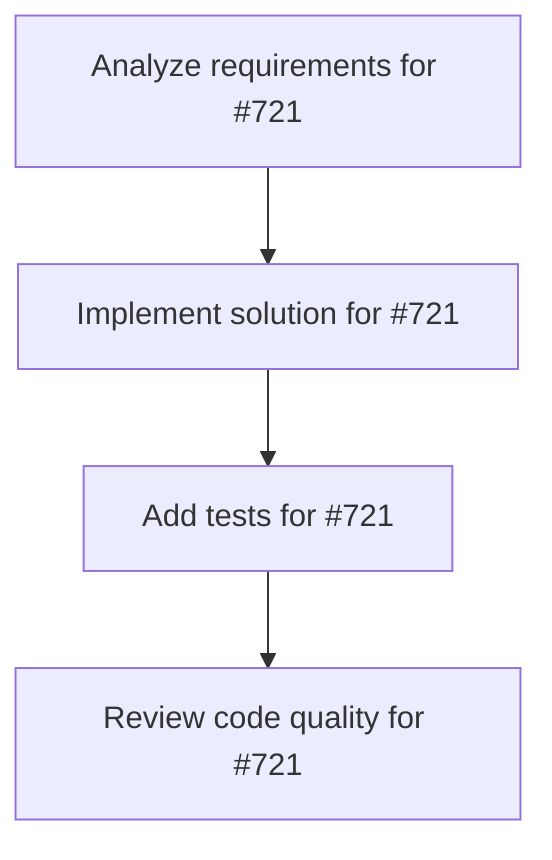

# Plans for Issue #721

**Title**: feat(omega-system): Implement θ₃ Allocation Phase - Code → TaskGraph transformation

**URL**: https://github.com/customer-cloud/miyabi-private/issues/721

---

## 📋 Summary

- **Total Tasks**: 4
- **Estimated Duration**: 60 minutes
- **Execution Levels**: 4
- **Has Cycles**: ✅ No

## 📝 Task Breakdown

### 1. Analyze requirements for #721

- **ID**: `task-721-analysis`
- **Type**: Docs
- **Assigned Agent**: IssueAgent
- **Priority**: 0
- **Estimated Duration**: 5 min

**Description**: Analyze issue requirements and create detailed specification

### 2. Implement solution for #721

- **ID**: `task-721-impl`
- **Type**: Feature
- **Assigned Agent**: CodeGenAgent
- **Priority**: 1
- **Estimated Duration**: 30 min
- **Dependencies**: task-721-analysis

**Description**: ## 📋 Summary

Implement **θ₃ (Allocation Phase)** of the Ω-System execution engine.

**Function**: `θ₃: Code → TaskGraph`
**Purpose**: Decompose generated code into parallel executable tasks represented as a Directed Acyclic Graph (DAG).

---

## 🎯 Objectives

### Core Implementation

1. **Create `miyabi-dag` crate** with DAG construction logic
2. **Implement dependency analysis** to identify file/module dependencies
3. **Implement topological sort** to order tasks by dependencies
4. **Implement parallelization** to group independent tasks
5. **Implement resource allocation** to assign worktrees

### Key Components

**DAGBuilder** (`miyabi-dag/src/builder.rs`):
```rust
pub struct DAGBuilder {
    max_parallelism: usize,
}

impl DAGBuilder {
    pub fn build(&self, code: GeneratedCode) -> Result<TaskGraph> {
        // 1. Analyze dependencies
        let deps = self.analyze_dependencies(&code)?;
        
        // 2. Topological sort
        let sorted = self.topological_sort(&deps)?;
        
        // 3. Create task graph
        let graph = TaskGraph::from_sorted(sorted, self.max_parallelism);
        
        Ok(graph)
    }
}
```

**TaskGraph** (`miyabi-dag/src/graph.rs`):
```rust
pub struct TaskGraph {
    pub nodes: Vec<TaskNode>,
    pub edges: Vec<TaskEdge>,
    pub levels: Vec<TaskLevel>,
}

pub struct TaskNode {
    pub id: TaskId,
    pub task: Task,
    pub dependencies: Vec<TaskId>,
}

pub struct TaskLevel {
    pub level: usize,
    pub tasks: Vec<Task>,
}
```

---

## 🔧 Implementation Details

### 1. Dependency Analysis

**Algorithm**:
- Parse generated code files
- Extract import statements
- Build dependency graph using module relationships
- Detect circular dependencies (error if found)

**Key Functions**:
```rust
fn analyze_dependencies(&self, code: &GeneratedCode) -> Result<DependencyGraph>
fn extract_imports(&self, file: &CodeFile) -> Vec<ModulePath>
fn build_dependency_graph(&self, imports: &[Import]) -> DependencyGraph
```

### 2. Topological Sort

**Algorithm**: Kahn's algorithm
- Start with nodes that have no incoming edges
- Remove processed nodes and their outgoing edges
- Repeat until all nodes processed
- Error if cycle detected

**Key Functions**:
```rust
fn topological_sort(&self, deps: &DependencyGraph) -> Result<Vec<TaskId>>
fn find_zero_indegree_nodes(&self, graph: &DependencyGraph) -> Vec<TaskId>
```

### 3. Task Graph Construction

**Algorithm**:
- Group tasks by dependency levels
- Calculate max parallelism per level
- Assign worktrees to tasks
- Validate graph properties (acyclic, connected)

**Key Functions**:
```rust
fn create_levels(&self, sorted: &[TaskId]) -> Vec<TaskLevel>
fn calculate_max_parallelism(&self, level: &TaskLevel) -> usize
fn assign_worktrees(&self, graph: &TaskGraph) -> Result<()>
```

---

## ✅ Acceptance Criteria

### Functional Requirements

- [ ] DAGBuilder successfully builds TaskGraph from GeneratedCode
- [ ] Dependency analysis correctly identifies all module dependencies
- [ ] Topological sort produces valid execution order
- [ ] Task graph supports parallel execution (max_parallelism parameter)
- [ ] Circular dependency detection works correctly
- [ ] Graph validation ensures acyclic property

### Quality Requirements

- [ ] >= 80% test coverage
- [ ] All tests pass (`cargo test --package miyabi-dag`)
- [ ] No clippy warnings (`cargo clippy --package miyabi-dag -- -D warnings`)
- [ ] Comprehensive documentation with examples
- [ ] Benchmarks for large graphs (>100 nodes)

### Integration Requirements

- [ ] Integrates with θ₂ (Generation Phase) output
- [ ] Provides input for θ₄ (Execution Phase)
- [ ] Compatible with existing Miyabi types (Task, GeneratedCode)

---

## 🧪 Test Cases

### Unit Tests

1. **Empty graph**: Zero tasks → empty TaskGraph
2. **Single task**: One task → graph with one level
3. **Linear dependencies**: A → B → C → sequential execution
4. **Parallel tasks**: A, B, C (no deps) → single level, parallel execution
5. **Diamond pattern**: A → B,C → D → three levels
6. **Circular dependency**: A → B → C → A → error detection
7. **Large graph**: 100+ tasks → performance validation

### Integration Tests

1. **End-to-end**: GeneratedCode → DAGBuilder → TaskGraph → valid
2. **Worktree assignment**: TaskGraph → assigned worktrees → no conflicts
3. **Parallel execution simulation**: TaskGraph → simulated execution → correct order

---

## 📊 Performance Metrics

**Target** (from SWML paper):
- **Average Time**: 0.1 min (6 seconds)
- **Success Rate**: 100%
- **Max Graph Size**: 200 tasks
- **Max Parallelism**: 10 concurrent tasks

**Benchmarks**:
```bash
cargo bench --package miyabi-dag
```

---

## 🔗 Related Issues

- **θ₁ Understanding Phase**: (Not yet created)
- **θ₂ Generation Phase**: (Not yet created)
- **θ₄ Execution Phase**: Partially implemented in `miyabi-worktree`
- **θ₅ Integration Phase**: (Not yet created)
- **θ₆ Learning Phase**: (Not yet created)

---

## 📚 References

- [.claude/context/omega-phases.md](.claude/context/omega-phases.md) - θ₃ specification
- [.claude/context/swml-framework.md](.claude/context/swml-framework.md) - SWML overview
- `crates/miyabi-worktree/` - Existing worktree management
- `crates/miyabi-types/src/task.rs` - Task type definitions

---

## 📝 Implementation Plan

### Phase 1: Crate Setup (30 min)
- Create `miyabi-dag` crate
- Add dependencies (petgraph, serde, thiserror)
- Setup module structure

### Phase 2: Core Implementation (90 min)
- Implement DAGBuilder
- Implement dependency analysis
- Implement topological sort
- Implement TaskGraph construction

### Phase 3: Testing (60 min)
- Write unit tests (>=80% coverage)
- Write integration tests
- Add benchmarks

### Phase 4: Documentation (30 min)
- API documentation
- Usage examples
- Performance notes

**Total Estimated Time**: 210 minutes (3.5 hours)

---

## 🚀 Execution

**Assignee**: ユキ (CoordinatorAgent)
**Priority**: P0-Critical
**Sprint**: Omega System Phase 3
**Epic**: Ω-System Implementation

---

🤖 Generated with [Claude Code](https://claude.com/claude-code)

Co-Authored-By: Claude <noreply@anthropic.com>

### 3. Add tests for #721

- **ID**: `task-721-test`
- **Type**: Test
- **Assigned Agent**: CodeGenAgent
- **Priority**: 2
- **Estimated Duration**: 15 min
- **Dependencies**: task-721-impl

**Description**: Create comprehensive test coverage

### 4. Review code quality for #721

- **ID**: `task-721-review`
- **Type**: Refactor
- **Assigned Agent**: ReviewAgent
- **Priority**: 3
- **Estimated Duration**: 10 min
- **Dependencies**: task-721-test

**Description**: Run quality checks and code review

## 🔄 Execution Plan (DAG Levels)

Tasks can be executed in parallel within each level:

### Level 0 (Parallel Execution)

- `task-721-analysis` - Analyze requirements for #721

### Level 1 (Parallel Execution)

- `task-721-impl` - Implement solution for #721

### Level 2 (Parallel Execution)

- `task-721-test` - Add tests for #721

### Level 3 (Parallel Execution)

- `task-721-review` - Review code quality for #721

## 📊 Dependency Graph



## ⏱️ Timeline Estimation

- **Sequential Execution**: 60 minutes (1.0 hours)
- **Parallel Execution (Critical Path)**: 10 minutes (0.2 hours)
- **Estimated Speedup**: 6.0x

---

*Generated by CoordinatorAgent on 2025-11-03 21:41:28 UTC*
