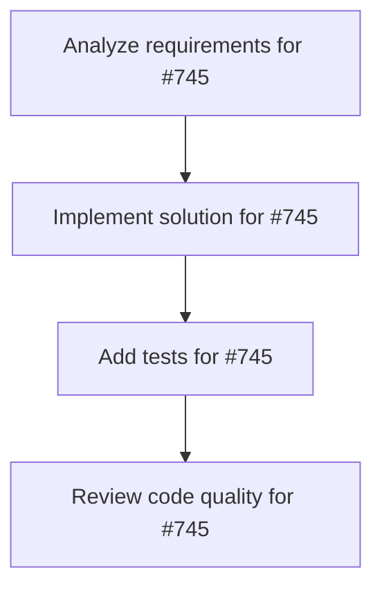

# Plans for Issue #745

**Title**: chore: unify LLM error API across agents

**URL**: https://github.com/customer-cloud/miyabi-private/issues/745

---

## 📋 Summary

- **Total Tasks**: 4
- **Estimated Duration**: 60 minutes
- **Execution Levels**: 4
- **Has Cycles**: ✅ No

## 📝 Task Breakdown

### 1. Analyze requirements for #745

- **ID**: `task-745-analysis`
- **Type**: Docs
- **Assigned Agent**: IssueAgent
- **Priority**: 0
- **Estimated Duration**: 5 min

**Description**: Analyze issue requirements and create detailed specification

### 2. Implement solution for #745

- **ID**: `task-745-impl`
- **Type**: Feature
- **Assigned Agent**: CodeGenAgent
- **Priority**: 1
- **Estimated Duration**: 30 min
- **Dependencies**: task-745-analysis

**Description**: ## Summary
- unify miyabi-llm error/result re-exports so downstream crates use consistent interfaces
- update business agents, coordinator, and other crates to handle new `LLMError` conversions
- re-run `cargo test --package miyabi-agents` and `cargo test --workspace` to confirm

## Acceptance Criteria
- `miyabi-llm` exposes a single public `LLMError`/`Result` API compatible with `miyabi-llm-core`
- all dependent crates compile without manual re-export shims
- `cargo test --package miyabi-agents` passes locally (excluding unrelated env failures)
- follow-up workspace test plan documented in issue comments

### 3. Add tests for #745

- **ID**: `task-745-test`
- **Type**: Test
- **Assigned Agent**: CodeGenAgent
- **Priority**: 2
- **Estimated Duration**: 15 min
- **Dependencies**: task-745-impl

**Description**: Create comprehensive test coverage

### 4. Review code quality for #745

- **ID**: `task-745-review`
- **Type**: Refactor
- **Assigned Agent**: ReviewAgent
- **Priority**: 3
- **Estimated Duration**: 10 min
- **Dependencies**: task-745-test

**Description**: Run quality checks and code review

## 🔄 Execution Plan (DAG Levels)

Tasks can be executed in parallel within each level:

### Level 0 (Parallel Execution)

- `task-745-analysis` - Analyze requirements for #745

### Level 1 (Parallel Execution)

- `task-745-impl` - Implement solution for #745

### Level 2 (Parallel Execution)

- `task-745-test` - Add tests for #745

### Level 3 (Parallel Execution)

- `task-745-review` - Review code quality for #745

## 📊 Dependency Graph

## ⏱️ Timeline Estimation

- **Sequential Execution**: 60 minutes (1.0 hours)
- **Parallel Execution (Critical Path)**: 10 minutes (0.2 hours)
- **Estimated Speedup**: 6.0x

---

*Generated by CoordinatorAgent on 2025-11-04 05:30:31 UTC*
