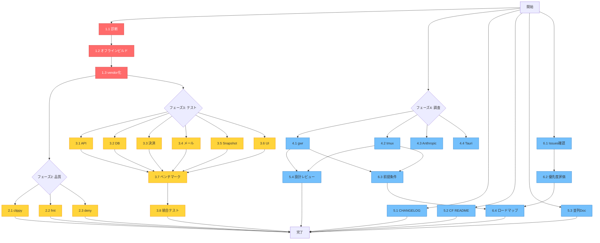

# タスク構造図 - 2025-11-02

## 🌳 タスクツリー（依存関係付き）

```
今日のタスク (26項目)
│
├── 🔴 フェーズ1: 緊急（インフラ修復）[必須] ⭐⭐⭐⭐⭐
│   ├── 1.1 ネットワーク・cargo cache診断 [5分]
│   │    └── 依存: なし（最初に実行）
│   │
│   ├── 1.2 オフラインビルド試行 [10分]
│   │    └── 依存: 1.1完了後
│   │
│   └── 1.3 cargo vendor実行 [15分]
│        └── 依存: 1.2で解決しない場合
│        └── 🚧 ブロッカー解除: すべてのビルド・テストタスク
│
├── 🟡 フェーズ2: 品質チェック [30分] ⭐⭐⭐⭐
│   ├── 2.1 cargo clippy
│   ├── 2.2 cargo fmt
│   └── 2.3 cargo deny
│        └── 依存: フェーズ1完了
│        └── 並列実行可能
│
├── 🟢 フェーズ3: テスト実行 [2-3時間] ⭐⭐⭐⭐
│   │
│   ├── [グループA: ClickFunnels系] 並列可
│   │   ├── 3.1 API統合テスト [30分]
│   │   ├── 3.2 DBリポジトリテスト [30分]
│   │   ├── 3.3 決済統合テスト [20分]
│   │   └── 3.4 メール統合テスト [20分]
│   │        └── 依存: フェーズ1完了
│   │
│   ├── [グループB: Dashboard系] 並列可
│   │   ├── 3.5 Snapshot単体テスト [15分]
│   │   └── 3.6 UI表示確認 [20分]
│   │        └── 依存: フェーズ1完了
│   │
│   └── [グループC: 並列実行系] 順次実行
│       ├── 3.7 ベンチマーク測定 [30分]
│       └── 3.8 統合テスト [30分]
│            └── 依存: 3.7完了後
│
├── 🔵 フェーズ4: 調査 [1-2時間] ⭐⭐⭐
│   │
│   ├── [サブフェーズA: gwr統合準備] 並列可
│   │   ├── 4.1 gwr仕様確認 [30分]
│   │   └── 4.2 tmux統合レビュー [20分]
│   │        └── 依存: なし（並列実行可能）
│   │
│   └── [サブフェーズB: 環境確認] 並列可
│       ├── 4.3 Anthropic API確認 [10分]
│       └── 4.4 Tauri現状確認 [20分]
│            └── 依存: なし（並列実行可能）
│
├── 📝 フェーズ5: ドキュメント [1時間] ⭐⭐⭐
│   ├── 5.1 CHANGELOG更新 [15分]
│   ├── 5.2 ClickFunnels README [20分]
│   ├── 5.3 並列実行ドキュメント [15分]
│   └── 5.4 Issue #673設計レビュー [20分]
│        └── 依存: 4.1, 4.2完了後（設計レビューのみ）
│        └── その他は並列実行可能
│
└── 📋 フェーズ6: 計画・戦略 [1-2時間] ⭐⭐
    ├── 6.1 GitHub Issues確認 [20分]
    ├── 6.2 Issue優先度評価 [30分]
    │    └── 依存: 6.1完了後
    ├── 6.3 Issue #673前提条件 [20分]
    │    └── 依存: 4.1, 4.2完了後
    └── 6.4 今週のロードマップ [30分]
         └── 依存: 6.2, 6.3完了後
```

---

## 📊 並列実行可能性マトリクス

| タスク | 並列グループ | 依存関係 | 優先度 |
|-------|------------|---------|--------|
| 1.1-1.3 | - | 順次実行必須 | Critical |
| 2.1-2.3 | Group1 | フェーズ1後 | High |
| 3.1-3.4 | Group2 | フェーズ1後 | High |
| 3.5-3.6 | Group3 | フェーズ1後 | High |
| 3.7-3.8 | - | 順次実行 | High |
| 4.1-4.4 | Group4 | なし | Medium |
| 5.1-5.3 | Group5 | なし | Medium |
| 5.4 | - | 4.1,4.2後 | Medium |
| 6.1 | - | なし | Medium |
| 6.2 | - | 6.1後 | Medium |
| 6.3 | - | 4.1,4.2後 | Medium |
| 6.4 | - | 6.2,6.3後 | Medium |

---

## ⚡ 最適実行パス（最速完了）

### パターンA: シーケンシャル実行（1人作業）
```
時刻    タスク                      累計時間
00:00 ┌─ 1.1 診断                  0:05
00:05 ├─ 1.2 オフラインビルド      0:15
00:15 ├─ 1.3 vendor化              0:30
      │
00:30 ├─ 2.1-2.3 品質チェック      1:00
      │
01:00 ├─ 3.1-3.4 ClickFunnels      3:00
03:00 ├─ 3.5-3.6 Dashboard         3:35
03:35 ├─ 3.7-3.8 並列実行テスト    4:35
      │
04:35 ├─ 4.1-4.4 調査              5:55
      │
05:55 ├─ 5.1-5.4 ドキュメント      6:55
      │
06:55 └─ 6.1-6.4 計画              8:25

総所要時間: 8時間25分
```

### パターンB: 並列実行（チーム作業）
```
時刻    並列ワーカー1              並列ワーカー2              並列ワーカー3
00:00 ┌─ 1.1-1.3 インフラ修復      [待機]                     [待機]
00:30 │
      ├─ 2.1-2.3 品質チェック      4.1-4.4 調査開始           6.1 Issues確認
01:00 │
      ├─ 3.1-3.2 API/DBテスト      調査継続                   5.1-5.3 ドキュメント
02:00 │
      ├─ 3.3-3.4 決済/メール       調査レポート作成完了       ドキュメント完了
02:30 │                            (4.1-4.4完了)
      │
      ├─ 3.5-3.6 Dashboard         5.4 設計レビュー           6.2 優先度評価
03:00 │
      ├─ 3.7-3.8 並列実行テスト                               6.3 前提条件作成
04:00 │
      └─ 完了                      完了                       6.4 ロードマップ
04:30                                                         完了

総所要時間: 4時間30分（並列度3）
```

---

## 🎯 優先度別実行戦略

### 戦略1: 最小目標達成（60%）
**目的**: ビルドを通す（2時間）
```
1.1 → 1.2 → 1.3 → 2.1 → 3.1
```

### 戦略2: 標準目標達成（80%）
**目的**: 品質保証完了（4時間）
```
フェーズ1 → フェーズ2 → フェーズ3（Group A,B）
```

### 戦略3: 理想目標達成（100%）
**目的**: 全タスク完了（8時間）
```
フェーズ1 → フェーズ2 → フェーズ3 → フェーズ4 → フェーズ5 → フェーズ6
```

---

## 🔄 依存関係グラフ（Mermaid）



---

## 📈 進捗可視化テンプレート

### チェックリスト形式
```
進捗: ████░░░░░░ 40% (10/26タスク完了)

🔴 フェーズ1: [████████████] 100% (3/3)
🟡 フェーズ2: [████████░░░░] 67% (2/3)
🟢 フェーズ3: [███░░░░░░░░░] 25% (2/8)
🔵 フェーズ4: [██░░░░░░░░░░] 25% (1/4)
📝 フェーズ5: [░░░░░░░░░░░░] 0% (0/4)
📋 フェーズ6: [░░░░░░░░░░░░] 0% (0/4)
```

### タイムライン形式
```
08:00 ━━━━━━━━━━━━━━━━━━━━━━━━━━━━━━━━━━━━━━━━ 18:00
      ▲                                        ▲
      開始                                    終了
      │
      ├─ 08:00-09:00 フェーズ1 [完了]
      ├─ 09:00-09:30 フェーズ2 [完了]
      ├─ 09:30-12:00 フェーズ3 [進行中] ◄━━ 現在
      ├─ 12:00-13:00 休憩
      ├─ 13:00-15:00 フェーズ4 [未着手]
      ├─ 15:00-16:00 フェーズ5 [未着手]
      └─ 16:00-18:00 フェーズ6 [未着手]
```

---

## 🎮 実行モード選択

### モード1: フォーカスモード（推奨）
- 1つのフェーズを完全に完了してから次へ
- 集中力維持に最適
- 所要時間: 8時間

### モード2: ラウンドロビンモード
- 各フェーズを少しずつ進める
- 飽きにくい
- 所要時間: 9時間

### モード3: 並列実行モード（複数人）
- 3名で並列作業
- 最速完了
- 所要時間: 4.5時間

---

**作成日**: 2025-11-02
**更新**: リアルタイム
