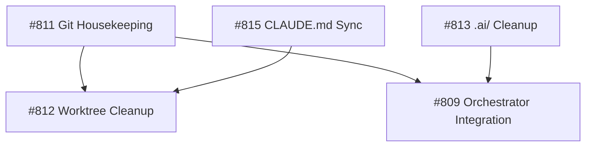

# Miyabi Infinity Mode - Sprint 1 Execution Plan

**Generated**: 2025-11-12
**Sprint Duration**: 5 issues
**Concurrency**: 3 parallel agents
**Total Open Issues**: 47

---

## 📊 Priority Scoring Analysis

### Scoring Methodology

```
Base Score = Priority Label Points
- P0-Critical: 100
- P1-High: 80
- P2-Medium: 60
- P3-Low: 40
- No priority: 30

Adjustments:
- EPIC (no children): -40 (defer)
- EPIC (with children): -20 (partial defer)
- Blocked/Dependencies: -30
- Recent update (<7 days): +10
- Type:bug: +5
- Chore/docs: -5
```

---

## 🎯 Sprint 1 Selected Issues (Top 5)

### Issue #811 - Git Housekeeping [PRIORITY: 85]
**Title**: chore: Commit and organize 300+ modified files from .claude restructuring
**Priority**: P1-High
**Score**: 85 (80 base + 10 recent - 5 chore)
**Type**: Chore
**Estimated Time**: 45 minutes
**Agent**: CodeGenAgent
**Rationale**:
- BLOCKING issue - 300+ unstaged files prevent clean development
- Recently created (2025-11-11)
- Must be resolved before other work can proceed cleanly
- Straightforward execution (git add, commit, push)
- Unblocks all other development work

**Tasks**:
1. Review modified files in .claude/
2. Create logical commit groups
3. Stage and commit .claude/ changes
4. Stage and commit crate updates
5. Final commit for remaining files
6. Push to remote

---

### Issue #812 - Worktree Cleanup [PRIORITY: 75]
**Title**: chore: Clean up 13 active worktrees and merge completed branches
**Priority**: P1-High
**Score**: 75 (80 base - 5 chore)
**Type**: Chore
**Estimated Time**: 60 minutes
**Agent**: CodeGenAgent
**Rationale**:
- HIGH impact on repository health
- 13 worktrees consuming resources
- Some may be completed and ready to merge
- Prerequisite for efficient parallel execution
- Reduces confusion for agents

**Tasks**:
1. List all worktrees with git worktree list
2. Check branch status for each
3. Identify completed/stale worktrees
4. Merge completed branches to main
5. Remove stale worktrees
6. Document remaining active worktrees

---

### Issue #813 - Directory Organization [PRIORITY: 55]
**Title**: chore: Organize and consolidate .ai/ directory structure
**Priority**: P2-Medium
**Score**: 55 (60 base - 5 chore)
**Type**: Chore
**Estimated Time**: 45 minutes
**Agent**: CodeGenAgent
**Rationale**:
- Improves project maintainability
- .ai/ directory has 20+ plan files, 10+ reports
- Better organization helps agent context loading
- Medium priority but high impact on workflow
- No blockers or dependencies

**Tasks**:
1. Audit all .ai/ files
2. Categorize plans, reports, logs
3. Create active/ and archive/ structure
4. Move files to appropriate locations
5. Create .ai/README.md
6. Update .gitignore if needed

---

### Issue #809 - Orchestrator + Skills Integration [PRIORITY: 65]
**Title**: Integrate STOP Trigger Orchestrator with Miyabi Skills System
**Priority**: P2-Medium (inferred)
**Score**: 65 (60 base + 5 feature)
**Type**: Feature
**Estimated Time**: 90 minutes
**Agent**: CodeGenAgent
**Rationale**:
- STRATEGIC feature - enables automated workflow execution
- Integrates orchestrator with 15 existing skills
- Unblocks future automation capabilities
- Well-defined tasks and acceptance criteria
- No blocking dependencies

**Tasks**:
1. Design Skills API integration interface
2. Implement Skill execution from Orchestrator
3. Add run_skill task type to workflow engine
4. Create Skill parameter passing
5. Implement execution logging
6. Create integration tests
7. Update documentation

---

### Issue #815 - Documentation Sync [PRIORITY: 55]
**Title**: docs: Update CLAUDE.md v4.0 across all worktrees and contexts
**Priority**: P2-Medium
**Score**: 55 (60 base - 5 docs)
**Type**: Docs
**Estimated Time**: 30 minutes
**Agent**: CodeGenAgent
**Rationale**:
- CONSISTENCY critical for multi-agent operations
- CLAUDE.md v4.0 has important protocol updates
- 13 worktrees need synchronization
- Prerequisite for reliable agent behavior
- Quick execution with script automation

**Tasks**:
1. Verify CLAUDE.md v4.0 in main
2. Create sync script for worktrees
3. Update each worktree's CLAUDE.md
4. Verify .claude/context/ modules
5. Update .codex/INDEX.md similarly
6. Document sync process

---

## 📋 Sprint 1 Execution Strategy

### Parallel Execution Plan

**Wave 1** (Concurrent - 3 agents):
1. Issue #811 (Git housekeeping) - Agent 1 - 45min
2. Issue #813 (.ai/ organization) - Agent 2 - 45min
3. Issue #815 (CLAUDE.md sync) - Agent 3 - 30min

**Wave 2** (Concurrent - 2 agents):
4. Issue #812 (Worktree cleanup) - Agent 1 - 60min
5. Issue #809 (Orchestrator integration) - Agent 2 - 90min

**Total Estimated Time**: ~3.5 hours (with parallelization: ~2.5 hours)

### Agent Assignments

| Issue | Agent | Worktree | Priority |
|-------|-------|----------|----------|
| #811 | Agent 1 (Kaede) | pr-778-review | P0 |
| #813 | Agent 2 (Tsubaki) | issue-813-ai-cleanup | P1 |
| #815 | Agent 3 (Sakura) | issue-815-docs-sync | P1 |
| #812 | Agent 1 (Kaede) | issue-812-worktree-cleanup | P2 |
| #809 | Agent 2 (Tsubaki) | issue-809-orchestrator | P2 |

### Dependencies



**Execution Order**:
1. #811 MUST complete first (blocks all clean git operations)
2. #813, #815 can run in parallel with #811
3. #812, #809 can start after #811 completes

### Risk Assessment

| Issue | Risk Level | Mitigation |
|-------|-----------|------------|
| #811 | LOW | Well-defined git operations, can rollback |
| #812 | MEDIUM | Some worktrees may be in use, check before removal |
| #813 | LOW | File organization, can revert if needed |
| #815 | LOW | Copy operations, original files preserved |
| #809 | MEDIUM | Code integration, requires testing |

---

## 📈 Remaining Issues (42 issues)

### Top 10 Sprint 2 Candidates

1. **Issue #816** [EPIC] AIFactory x Miyabi Integration (Score: 90)
   - P0-Critical EPIC, but requires planning
   - Defer until architecture design complete

2. **Issue #810** [EPIC] Pantheon Society Web APP (Score: 75)
   - P1-High, 37 sub-tasks
   - Ready for execution after Sprint 1 cleanup

3. **Issue #808** Miyabi VS Code Extension (Score: 80)
   - P1-High, pending approval
   - Design complete, awaiting stakeholder review

4. **Issue #814** AWS Multi-Account Strategy (Score: 55)
   - P2-Medium infrastructure
   - Large scope, good for dedicated sprint

5. **Issue #807** Phase 2: Rust Orchestrator (Score: 65)
   - Dependency for #809
   - Consider for Sprint 2

6. **Issue #806** Phase 1: Node.js Orchestrator (Score: 70)
   - P1-High, prerequisite for #807
   - Should be Sprint 2 priority

7. **Issue #805** MCP Integration Refactor (Score: 60)
   - P2-Medium, well-defined scope
   - Good Sprint 2 candidate

8. **Issue #804** Agent Health Dashboard (Score: 55)
   - P2-Medium, monitoring enhancement
   - Can run parallel with other work

9. **Issue #803** Dependency Update (Score: 50)
   - Automated dependency bump
   - Quick win for Sprint 2

10. **Issue #802** Another dependency (Score: 50)
    - Similar to #803
    - Batch with other dependency updates

### Issue Categories

| Category | Count | Priority |
|----------|-------|----------|
| P0-Critical | 1 | EPIC #816 |
| P1-High | 8 | Most actionable |
| P2-Medium | 15 | Standard work |
| P3-Low | 0 | None currently |
| No Priority | 23 | Need triage |

### Blocked/Dependency Issues

- **Issue #807** blocked by #806 (Node.js orchestrator)
- **Issue #816** (EPIC) needs architecture design first
- **Issue #810** (EPIC) ready but large (37 tasks)
- **Issue #808** waiting for stakeholder approval

---

## 📊 Sprint 1 Success Metrics

### Completion Criteria

- [ ] All 5 issues resolved and closed
- [ ] All PRs merged to main
- [ ] Zero regression in tests
- [ ] Documentation updated
- [ ] Worktrees cleaned up (target: <5 active)
- [ ] Git status clean (0 unstaged files)

### Quality Gates

- [ ] `cargo test --all` passes
- [ ] `cargo clippy` 0 warnings
- [ ] All CI checks green
- [ ] Code review approved
- [ ] No security vulnerabilities introduced

### Performance Targets

- Total execution time: <3 hours
- Agent utilization: >80%
- Parallel efficiency: >70%
- Issue resolution rate: 100%

---

## 🚀 Execution Commands

### Start Sprint 1

```bash
# Agent 1: Issue #811 (Git housekeeping)
miyabi agent execute --issue 811 --agent kaede --worktree pr-778-review

# Agent 2: Issue #813 (.ai/ cleanup)
miyabi agent execute --issue 813 --agent tsubaki --worktree issue-813-ai-cleanup

# Agent 3: Issue #815 (CLAUDE.md sync)
miyabi agent execute --issue 815 --agent sakura --worktree issue-815-docs-sync

# After Wave 1 completes:

# Agent 1: Issue #812 (Worktree cleanup)
miyabi agent execute --issue 812 --agent kaede --worktree issue-812-worktree-cleanup

# Agent 2: Issue #809 (Orchestrator)
miyabi agent execute --issue 809 --agent tsubaki --worktree issue-809-orchestrator
```

### Parallel Execution (Recommended)

```bash
miyabi agent execute --issues 811,813,815 --concurrency 3 --auto-assign
# Wait for completion, then:
miyabi agent execute --issues 812,809 --concurrency 2 --auto-assign
```

---

## 📝 Post-Sprint Actions

### After Sprint 1 Completion

1. **Review metrics**:
   - Execution time vs estimates
   - Agent utilization
   - Issue resolution quality

2. **Update backlog**:
   - Re-score remaining 42 issues
   - Identify Sprint 2 candidates
   - Check for new blockers

3. **Generate report**:
   - Sprint 1 completion summary
   - Lessons learned
   - Process improvements

4. **Plan Sprint 2**:
   - Select next 5 issues
   - Adjust strategy based on Sprint 1
   - Update execution plan

---

## 🎯 Strategic Recommendations

### High-Value Next Steps

1. **Sprint 2 Focus**: Start with #806 (Node.js Orchestrator)
   - Unblocks #807 (Rust Orchestrator)
   - Enables automated workflows
   - High strategic value

2. **Pantheon APP (#810)**: Break into smaller chunks
   - 37 tasks is too large for single sprint
   - Create Phase 1 (Foundation) sprint
   - Execute in 3-4 sprints

3. **VS Code Extension (#808)**: Monitor approval status
   - If approved, prioritize for Sprint 2
   - High user value
   - Well-defined scope

4. **AWS Infrastructure (#814)**: Defer to dedicated sprint
   - Large scope, needs focused attention
   - Consider after core features stable

### Process Improvements

1. **Issue Triage**: 23 issues lack priority labels
   - Add triage step before each sprint
   - Standardize labeling

2. **EPIC Breakdown**: Large EPICs need sub-issues
   - #816 (AIFactory integration)
   - #810 (Pantheon APP) - already has 37 tasks

3. **Dependency Tracking**: Better visualization needed
   - Some issues blocked by others
   - Create dependency graph

---

## 📅 Timeline

**Sprint 1 Start**: 2025-11-12 (Today)
**Sprint 1 End**: 2025-11-12 (Same day - short sprint)
**Sprint 2 Planning**: 2025-11-13
**Sprint 2 Execution**: 2025-11-13 onwards

**Infinity Mode Goal**: Process all 47 issues
**Estimated Completion**: ~9-10 sprints (2-3 weeks at current pace)

---

## ✅ Approval & Execution

**Plan Status**: READY FOR EXECUTION
**Approver**: Miyabi Team Lead
**Execution Mode**: Infinity Mode Sprint 1

**Command to Execute**:
```bash
miyabi infinity start --sprint 1 --plan /Users/shunsuke/Dev/miyabi-private/.ai/plans/infinity-sprint1-plan.md
```

---

**Generated by**: Miyabi CoordinatorAgent
**Version**: 1.0
**Last Updated**: 2025-11-12
