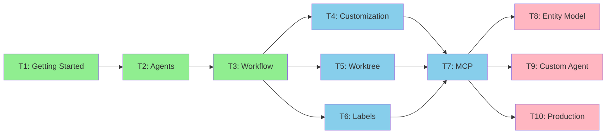
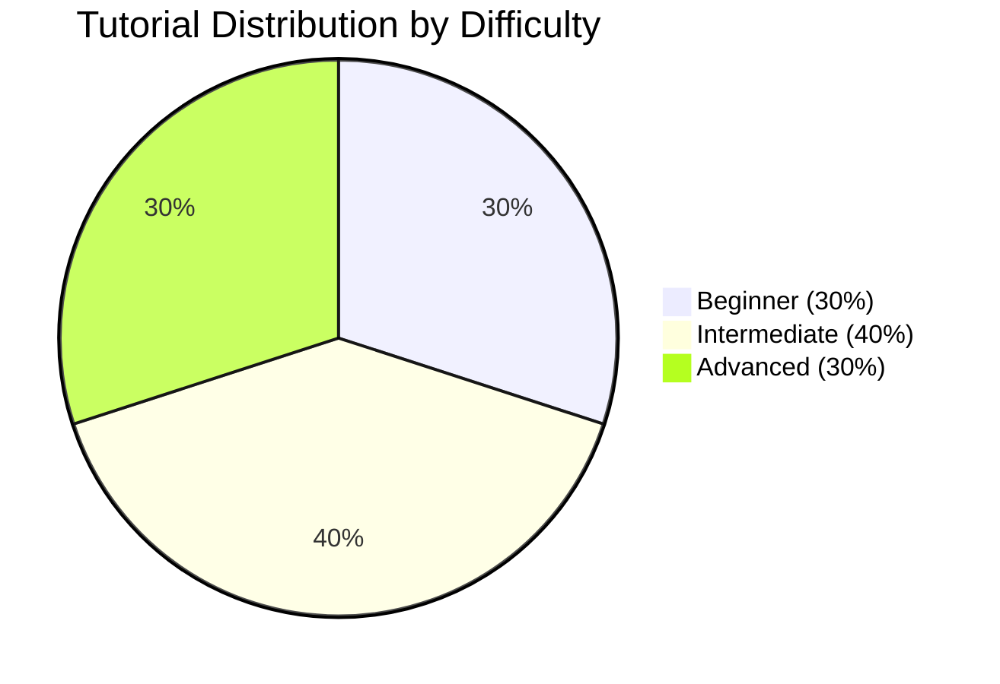
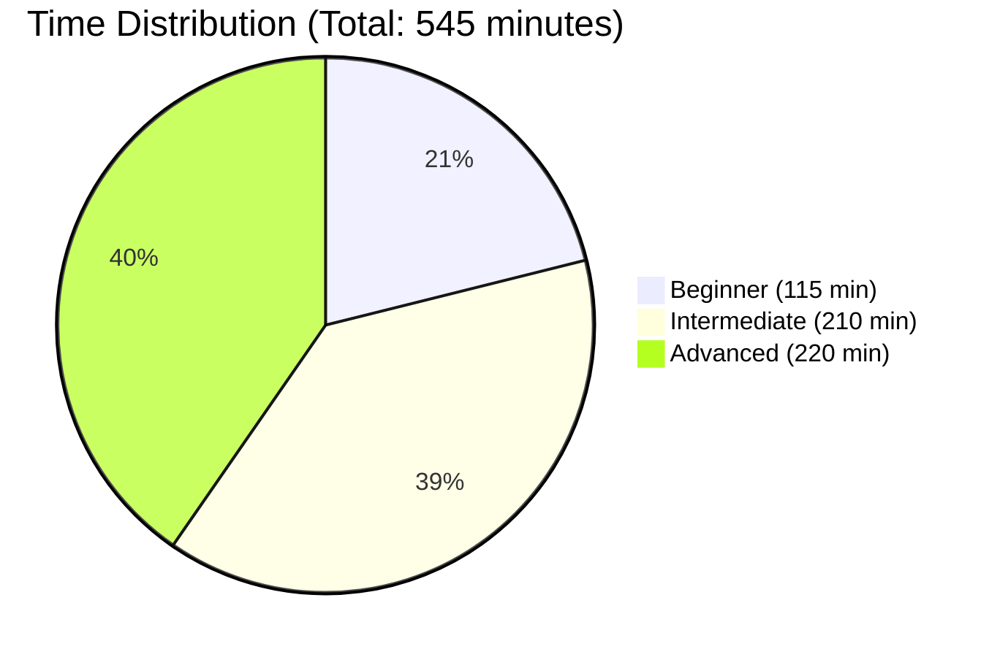
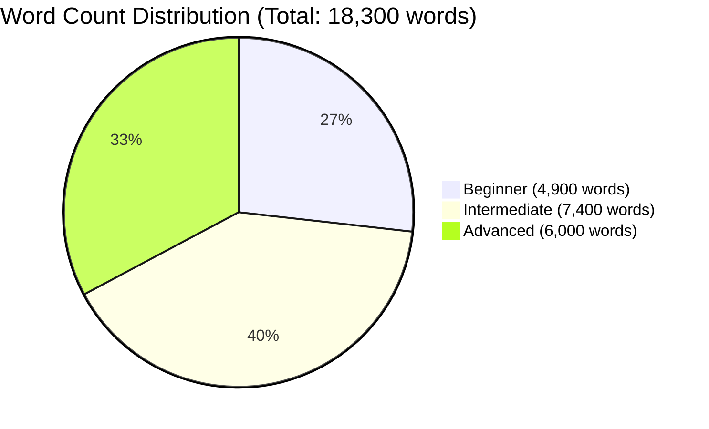
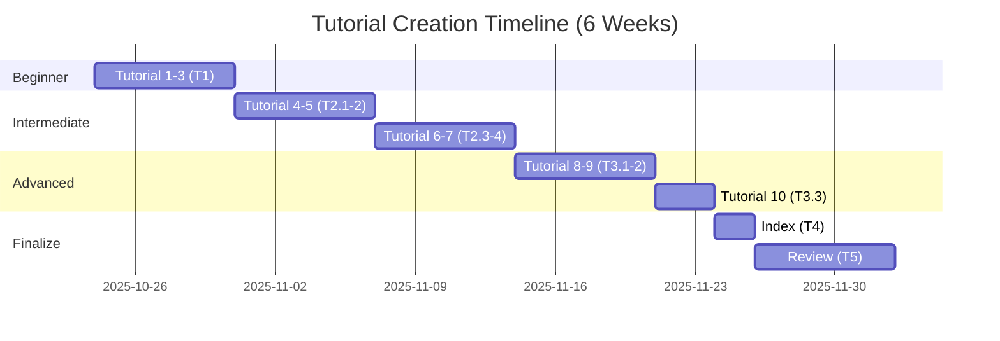
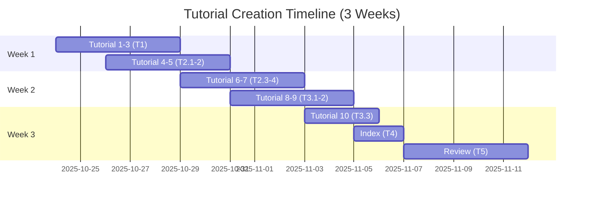

# Tutorial Structure - Visual Guide

**Issue #472**: Create 10 Tutorials
**Generated by**: CoordinatorAgent (しきるん)
**Date**: 2025-10-24

---

## Learning Path Diagram

```mermaid
graph TD
    Start[Start Here] --> T1[Tutorial 1: Getting Started<br/>⭐ Beginner | 30 min]

    T1 --> T2[Tutorial 2: Understanding Agents<br/>⭐ Beginner | 45 min]
    T2 --> T3[Tutorial 3: Issue-to-PR Workflow<br/>⭐ Beginner | 40 min]

    T3 --> IntermediateChoice{Choose Your Path}

    IntermediateChoice --> T4[Tutorial 4: Agent Customization<br/>⭐⭐ Intermediate | 60 min]
    IntermediateChoice --> T5[Tutorial 5: Worktree Parallel Execution<br/>⭐⭐ Intermediate | 50 min]
    IntermediateChoice --> T6[Tutorial 6: Label System Mastery<br/>⭐⭐ Intermediate | 45 min]

    T4 --> T7[Tutorial 7: MCP Integration<br/>⭐⭐ Intermediate | 55 min]
    T5 --> T7
    T6 --> T7

    T7 --> AdvancedChoice{Advanced Topics}

    AdvancedChoice --> T8[Tutorial 8: Entity-Relation Model<br/>⭐⭐⭐ Advanced | 60 min]
    AdvancedChoice --> T9[Tutorial 9: Custom Agent Development<br/>⭐⭐⭐ Advanced | 90 min]
    AdvancedChoice --> T10[Tutorial 10: Production Deployment<br/>⭐⭐⭐ Advanced | 70 min]

    T8 --> Expert[Expert Level Achieved!]
    T9 --> Expert
    T10 --> Expert

    style Start fill:#FFD700,stroke:#333,stroke-width:3px
    style T1 fill:#90EE90,stroke:#333,stroke-width:2px
    style T2 fill:#90EE90,stroke:#333,stroke-width:2px
    style T3 fill:#90EE90,stroke:#333,stroke-width:2px
    style T4 fill:#87CEEB,stroke:#333,stroke-width:2px
    style T5 fill:#87CEEB,stroke:#333,stroke-width:2px
    style T6 fill:#87CEEB,stroke:#333,stroke-width:2px
    style T7 fill:#87CEEB,stroke:#333,stroke-width:2px
    style T8 fill:#FFB6C1,stroke:#333,stroke-width:2px
    style T9 fill:#FFB6C1,stroke:#333,stroke-width:2px
    style T10 fill:#FFB6C1,stroke:#333,stroke-width:2px
    style Expert fill:#9370DB,stroke:#333,stroke-width:3px
    style IntermediateChoice fill:#FFA500,stroke:#333,stroke-width:2px
    style AdvancedChoice fill:#FF6347,stroke:#333,stroke-width:2px
```

---

## Tutorial Dependency Graph



---

## Content Distribution

### By Difficulty Level



### By Estimated Time



### By Word Count



---

## Tutorial Quick Reference

| # | Title | Difficulty | Time | Words | Prerequisites |
|---|-------|-----------|------|-------|---------------|
| **1** | Getting Started | ⭐ | 30m | 1,500 | None |
| **2** | Understanding Agents | ⭐ | 45m | 1,800 | Tutorial 1 |
| **3** | Issue-to-PR Workflow | ⭐ | 40m | 1,600 | Tutorial 1-2 |
| **4** | Agent Customization | ⭐⭐ | 60m | 2,000 | Tutorial 1-3 |
| **5** | Worktree Parallel Execution | ⭐⭐ | 50m | 1,800 | Tutorial 1-4 |
| **6** | Label System Mastery | ⭐⭐ | 45m | 1,700 | Tutorial 1-3 |
| **7** | MCP Integration | ⭐⭐ | 55m | 1,900 | Tutorial 1-4 |
| **8** | Entity-Relation Model | ⭐⭐⭐ | 60m | 2,000 | Tutorial 4-7 |
| **9** | Custom Agent Development | ⭐⭐⭐ | 90m | 2,000 | Tutorial 1-8 |
| **10** | Production Deployment | ⭐⭐⭐ | 70m | 2,000 | Tutorial 1-8 |

**Total**: 545 minutes (9 hours) | 18,300 words

---

## Learning Tracks

### Quick Start Track (3 tutorials)
**Goal**: Get up and running with Miyabi ASAP

```
Tutorial 1 → Tutorial 2 → Tutorial 3
```

**Time**: 115 minutes (2 hours)
**Outcome**: Can create Issues, run Agents, generate PRs

---

### Power User Track (7 tutorials)
**Goal**: Master Miyabi's advanced features

```
Tutorial 1 → Tutorial 2 → Tutorial 3 → Tutorial 4 → Tutorial 5 → Tutorial 6 → Tutorial 7
```

**Time**: 325 minutes (5.5 hours)
**Outcome**: Can customize Agents, run parallel tasks, integrate external tools

---

### Expert Track (All 10 tutorials)
**Goal**: Become a Miyabi expert, build custom Agents

```
Tutorial 1 → ... → Tutorial 10
```

**Time**: 545 minutes (9 hours)
**Outcome**: Can develop custom Agents, deploy to production, understand architecture

---

## Tutorial Topics Coverage

### Core Concepts
- ✅ Installation & Setup (Tutorial 1)
- ✅ Agent System (Tutorial 2)
- ✅ Workflow Automation (Tutorial 3)
- ✅ Entity-Relation Model (Tutorial 8)

### Development Skills
- ✅ Agent Customization (Tutorial 4)
- ✅ Custom Agent Development (Tutorial 9)
- ✅ Rust Programming (Tutorial 9)
- ✅ Git Worktree (Tutorial 5)

### Integration & Tools
- ✅ MCP Integration (Tutorial 7)
- ✅ GitHub Integration (Tutorial 1, 3)
- ✅ CI/CD Pipeline (Tutorial 10)
- ✅ Label System (Tutorial 6)

### Operations
- ✅ Parallel Execution (Tutorial 5)
- ✅ Production Deployment (Tutorial 10)
- ✅ Monitoring & Observability (Tutorial 10)
- ✅ Troubleshooting (All tutorials)

---

## Tutorial Features Matrix

| Tutorial | Code Examples | Diagrams | Exercises | Troubleshooting | Tests |
|----------|--------------|----------|-----------|----------------|-------|
| 1 | ✅ | ✅ | ✅ | ✅ | ✅ |
| 2 | ✅ | ✅ | ✅ | ✅ | ✅ |
| 3 | ✅ | ✅ | ✅ | ✅ | ✅ |
| 4 | ✅ | ✅ | ✅ | ✅ | ✅ |
| 5 | ✅ | ✅ | ✅ | ✅ | ✅ |
| 6 | ✅ | ✅ | ✅ | ✅ | ✅ |
| 7 | ✅ | ✅ | ✅ | ✅ | ✅ |
| 8 | ✅ | ✅ | ✅ | ✅ | ✅ |
| 9 | ✅ | ✅ | ✅ | ✅ | ✅ |
| 10 | ✅ | ✅ | ✅ | ✅ | ✅ |

**All tutorials include**: Step-by-step instructions, success checklists, next steps

---

## Task Execution Timeline

### Sequential Execution (Conservative)



### Parallel Execution (Aggressive)



---

## Success Criteria Summary

### Per Tutorial
- ✅ Word count: 1,000-2,000 words
- ✅ Code examples: All runnable and tested
- ✅ Diagrams: At least 1 Mermaid diagram
- ✅ Exercises: Hands-on, step-by-step
- ✅ Troubleshooting: Common issues covered
- ✅ Success checklist: Clear verification steps
- ✅ Next steps: Recommended follow-up tutorials

### Overall Project
- ✅ 10 tutorials completed
- ✅ Master index created
- ✅ All code tested
- ✅ User testing completed (2-3 users per tutorial)
- ✅ ReviewAgent score: 90+ for all tutorials
- ✅ Documentation quality: Production-ready

---

## Repository Structure

```
tutorials/
├── README.md                           # Master index (T4)
├── 01-getting-started.md               # T1.1
├── 02-understanding-agents.md          # T1.2
├── 03-issue-to-pr-workflow.md          # T1.3
├── 04-agent-customization.md           # T2.1
├── 05-worktree-parallel-execution.md   # T2.2
├── 06-label-system-mastery.md          # T2.3
├── 07-mcp-integration.md               # T2.4
├── 08-entity-relation-model.md         # T3.1
├── 09-custom-agent-development.md      # T3.2
├── 10-production-deployment.md         # T3.3
└── assets/
    ├── images/                         # Screenshots
    └── diagrams/                       # Additional diagrams
```

---

## Key Differentiators

### What Makes These Tutorials Unique?

1. **Hands-On Focus**: Every tutorial includes practical exercises
2. **Real-World Examples**: Production-ready code, not toy examples
3. **Troubleshooting First**: Common issues addressed proactively
4. **Visual Learning**: Mermaid diagrams for complex concepts
5. **Progressive Difficulty**: Clear path from beginner to expert
6. **AI-Powered**: Written by CoordinatorAgent, reviewed by ReviewAgent
7. **Open Source**: Community contributions welcome

---

## Next Steps for ContentCreationAgent

### Task T1 Execution (Week 1)
1. Create `tutorials/` directory
2. Set up template from `.ai/plans/issue-472-plans.md` Appendix
3. Write Tutorial 1: Getting Started
4. Write Tutorial 2: Understanding Agents
5. Write Tutorial 3: Issue-to-PR Workflow
6. Self-review and iterate
7. Submit for ReviewAgent evaluation

**Expected Output**: 3 complete tutorials, ~4,900 words total

---

**Files Generated**:
- ✅ `issue-472-plans.md` - Detailed plan
- ✅ `issue-472-tasks.json` - Task DAG
- ✅ `issue-472-summary.md` - Executive summary
- ✅ `issue-472-tutorial-structure.md` - Visual guide

**Status**: 🟢 Ready for ContentCreationAgent Execution
