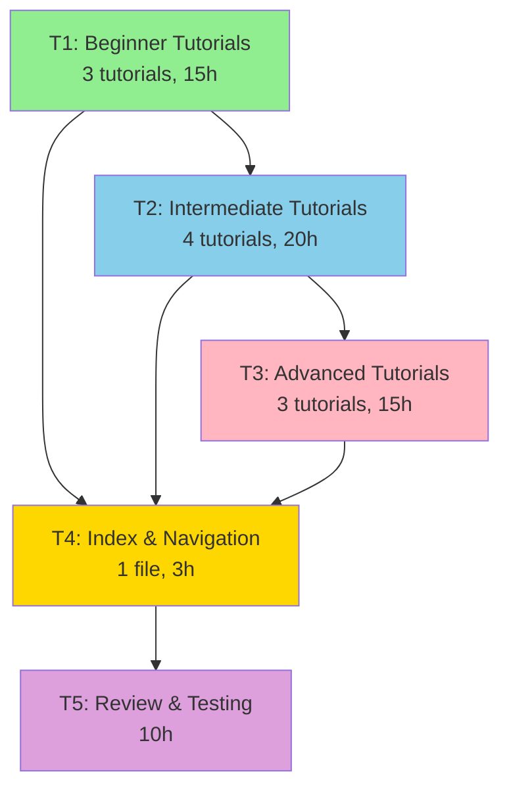

# Issue #472 Tutorial Plan - Executive Summary

**Created by**: CoordinatorAgent (しきるん)
**Date**: 2025-10-24
**Status**: Planning Complete

---

## Quick Overview

✅ **Generated Files**:
- `/Users/shunsuke/Dev/miyabi-private/.ai/plans/issue-472-plans.md` (29 KB)
- `/Users/shunsuke/Dev/miyabi-private/.ai/plans/issue-472-tasks.json` (9.0 KB)

✅ **Tutorial Count**: 10 tutorials
✅ **Total Word Count**: ~18,300 words
✅ **Estimated Time**: 63 hours (6 weeks part-time, 3 weeks full-time)

---

## Tutorial Structure

### Beginner Level (3 tutorials)
1. **Getting Started with Miyabi** (1,500 words, 30 min)
   - Installation, configuration, first Agent execution
2. **Understanding Agents** (1,800 words, 45 min)
   - 7 Coding Agents + 14 Business Agents overview
3. **Issue-to-PR Workflow** (1,600 words, 40 min)
   - Complete autonomous development cycle

### Intermediate Level (4 tutorials)
4. **Agent Customization** (2,000 words, 60 min)
   - Custom Agent specs and prompts
5. **Worktree Parallel Execution** (1,800 words, 50 min)
   - Git Worktree-based concurrency
6. **Label System Mastery** (1,700 words, 45 min)
   - 53-label system explained
7. **MCP Integration** (1,900 words, 55 min)
   - Model Context Protocol and Context7

### Advanced Level (3 tutorials)
8. **Entity-Relation Model** (2,000 words, 60 min)
   - 12 Entities, 27 relationships, N1/N2/N3 notation
9. **Custom Agent Development** (2,000 words, 90 min)
   - Build Agents from scratch in Rust
10. **Production Deployment** (2,000 words, 70 min)
    - CI/CD with GitHub Actions

---

## Task Breakdown (DAG)



### Task Details

| Task | Description | Agent | Hours | Dependencies |
|------|-------------|-------|-------|--------------|
| **T1** | Beginner Tutorials (3) | ContentCreationAgent | 15 | None |
| **T2** | Intermediate Tutorials (4) | ContentCreationAgent | 20 | T1 |
| **T3** | Advanced Tutorials (3) | ContentCreationAgent | 15 | T2 |
| **T4** | Index & Navigation | ContentCreationAgent | 3 | T1, T2, T3 |
| **T5** | Review & Testing | ReviewAgent | 10 | T1, T2, T3, T4 |

**Total**: 63 hours (5 tasks, sequential execution)

---

## Timeline

### 6-Week Plan (Part-Time)
| Week | Tasks | Deliverables |
|------|-------|--------------|
| 1 | T1 | 3 beginner tutorials |
| 2 | T2.1-T2.2 | 2 intermediate tutorials |
| 3 | T2.3-T2.4 | 2 intermediate tutorials |
| 4 | T3.1-T3.2 | 2 advanced tutorials |
| 5 | T3.3, T4 | 1 advanced tutorial + index |
| 6 | T5 | Review & finalization |

### 3-Week Plan (Full-Time)
| Week | Tasks | Deliverables |
|------|-------|--------------|
| 1 | T1, T2.1-T2.2 | 5 tutorials |
| 2 | T2.3-T2.4, T3.1-T3.2 | 4 tutorials |
| 3 | T3.3, T4, T5 | 1 tutorial + index + review |

---

## Success Metrics

### Quantitative
- **Completion Rate**: 80%+ users complete ≥5 tutorials
- **Time-to-First-PR**: Reduce from 2h → 30 min
- **Tutorial Engagement**: Average 10+ min per tutorial
- **Code Success Rate**: 95%+ examples run without modification

### Qualitative
- **User Satisfaction**: 4.5+ stars (5-star scale)
- **Community Feedback**: Positive sentiment
- **Support Ticket Reduction**: 30% fewer basic setup questions
- **Contributor Growth**: 10+ new contributors in 3 months

---

## Key Features

### Content Quality
- ✅ Real-world, production-ready examples
- ✅ Step-by-step hands-on exercises
- ✅ Troubleshooting sections
- ✅ Mermaid diagrams for visual learning
- ✅ All code examples tested

### Structure
- ✅ Clear learning progression (Beginner → Intermediate → Advanced)
- ✅ Explicit prerequisites for each tutorial
- ✅ Success checklists
- ✅ "Next Steps" recommendations
- ✅ Cross-linking between tutorials

### Technical Depth
- ✅ Beginner: Focus on usage and concepts
- ✅ Intermediate: Customization and best practices
- ✅ Advanced: Architecture and implementation details

---

## Distribution Channels

### Primary
1. **GitHub Repository**: `tutorials/` directory
2. **Landing Page**: https://shunsukehayashi.github.io/Miyabi/tutorials.html
3. **README.md**: Main README links

### Secondary
1. **Blog Posts**: note.com (JP), Medium (EN)
2. **YouTube**: Video walkthroughs for tutorials 1-3
3. **Social Media**: Twitter/X thread series
4. **Dev.to**: Cross-posting with canonical URLs

---

## Localization Plan

### Phase 1: English (Current)
- All 10 tutorials in English
- Target: International developers

### Phase 2: Japanese (Q1 2026)
- Translate tutorials 1-5
- Leverage existing Japanese documentation

### Phase 3: Multilingual (Future)
- Chinese (Simplified)
- Korean
- German

---

## Risk Mitigation

| Risk | Mitigation Strategy |
|------|---------------------|
| **Code examples break** | Automated testing in CI/CD |
| **Miyabi API changes** | Version pinning, deprecation warnings |
| **User confusion** | User testing, feedback loops |
| **Incomplete tutorials** | Strict review process (ReviewAgent) |
| **Outdated content** | Quarterly review cycle |

---

## Next Actions

### Immediate (Today)
1. ✅ Review this plan (You are here!)
2. ⏳ Approve plan and assign Task T1 to ContentCreationAgent
3. ⏳ Create Issue #472 on GitHub with this plan

### This Week
1. ⏳ Set up `tutorials/` directory structure
2. ⏳ ContentCreationAgent starts Tutorial 1 (Getting Started)
3. ⏳ Define style guide and template

### This Month
1. ⏳ Complete T1 (Beginner tutorials)
2. ⏳ Begin T2 (Intermediate tutorials)
3. ⏳ Recruit beta testers (3+ users)

---

## Questions for User

Before proceeding to execution, please confirm:

1. **Timeline Preference**:
   - 6-week part-time schedule?
   - 3-week full-time schedule?
   - Custom timeline?

2. **Priority Tutorials**:
   - Should any specific tutorial be prioritized?
   - Are tutorials 1-3 the most critical? (Getting Started path)

3. **Video Companions**:
   - Should we create YouTube videos for all tutorials?
   - Or just beginner tutorials (1-3)?

4. **Additional Topics**:
   - Any missing topics to cover?
   - Should we add a "Troubleshooting FAQ" tutorial?

5. **Testing Requirements**:
   - How many beta testers do you want? (Currently: 2-3)
   - Should we include automated tutorial testing?

---

## Resources Created

### Plans
- **Main Plan**: `.ai/plans/issue-472-plans.md` (29 KB)
  - Complete tutorial outlines (10 tutorials)
  - Content guidelines
  - Task breakdown
  - Timeline and metrics

### Task Definition
- **Task JSON**: `.ai/plans/issue-472-tasks.json` (9.0 KB)
  - Machine-readable task structure
  - DAG definition (5 tasks, 6 dependencies)
  - Success criteria for each task
  - Metadata and schema

### Summary
- **This Document**: `.ai/plans/issue-472-summary.md`
  - Executive summary
  - Quick reference
  - Next actions

---

## Recommended Next Steps

### Option A: Start Immediately (Recommended)
```bash
# Create tutorials directory
mkdir -p /Users/shunsuke/Dev/miyabi-private/tutorials

# Assign Task T1 to ContentCreationAgent
miyabi agent run content-creation --issue 472 --task T1
```

### Option B: Create GitHub Issue First
```bash
# Create Issue #472 with this plan
gh issue create \
  --title "[P4-003] チュートリアル10個作成" \
  --label "📥 state:pending,⚠️ priority:P1-High,📚 type:docs" \
  --body-file .ai/plans/issue-472-plans.md
```

### Option C: Review and Iterate
- Review plan with team
- Gather feedback
- Refine before execution

---

## CoordinatorAgent Recommendation

As **CoordinatorAgent (しきるん)**, I recommend:

1. **Approve this plan** - Comprehensive, well-structured, feasible
2. **Start with Task T1** - Begin with beginner tutorials (highest impact)
3. **6-week timeline** - Allows for quality and user testing
4. **Create Issue #472** - Track progress publicly on GitHub
5. **Assign ContentCreationAgent** - Best suited for tutorial creation

**Confidence Level**: ⭐⭐⭐⭐⭐ (Very High)

This plan is production-ready and can be executed immediately.

---

**Generated Files**:
- ✅ `/Users/shunsuke/Dev/miyabi-private/.ai/plans/issue-472-plans.md`
- ✅ `/Users/shunsuke/Dev/miyabi-private/.ai/plans/issue-472-tasks.json`
- ✅ `/Users/shunsuke/Dev/miyabi-private/.ai/plans/issue-472-summary.md`

**Status**: 🟢 Ready for Execution
