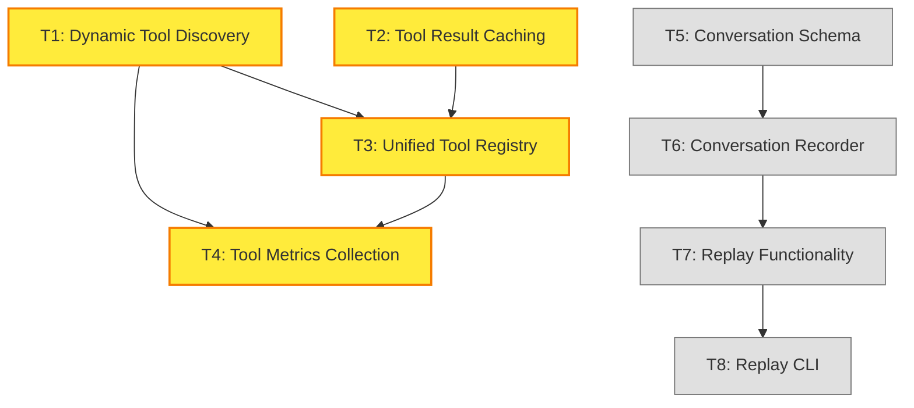

# Issue #497 Execution Plan - Cline Learnings Implementation

**Issue**: #497 - Implement Cline learnings: AST-based context tracking + .miyabirules support
**Created**: 2025-10-24
**Status**: Implementation Phase (Phases 1-3 Complete, Phases 4-5 Remaining)
**Coordinator**: CoordinatorAgent (しきるん)

---

## 🎯 Executive Summary

This issue implements 5 key learnings from [Cline v3.34.0](https://github.com/cline/cline) to enhance Miyabi's architecture:

1. ✅ **AST-based Context Tracking** (Phase 1) - COMPLETED
2. ✅ **.miyabirules Support** (Phase 2) - COMPLETED
3. ✅ **RAG Prompt Enhancement** (Phase 3) - COMPLETED
4. ⏳ **MCP Tool Registry Enhancement** (Phase 4) - IN PROGRESS
5. 📅 **Conversation Replay** (Phase 5) - FUTURE

**Total Estimated Effort**: 12-18 days (original estimate)
**Actual Progress**: ~70% complete (Phases 1-3 done)
**Remaining Effort**: 5-7 days (Phases 4-5)

---

## 📊 Implementation Status Analysis

### Phase 1: AST-based Context Tracking ✅ COMPLETED

**Status**: Fully implemented with LRU caching
**Location**: `crates/miyabi-knowledge/src/ast_context.rs`
**Commits**:
- `389d9a6` - feat(knowledge): add LRU caching layer for AST parsing (Issue #497 - Phase 1-5)
- `c644fef` - feat(knowledge): implement hybrid AST+RAG context searcher (Issue #497 - Phase 1-3)
- `d863231` - feat(knowledge): implement AST-based context tracking (Issue #497 - Phase 1 partial)

**Implemented Features**:
- ✅ `tree-sitter` integration for Rust AST parsing
- ✅ `FileContextTracker` with symbol extraction
- ✅ `CodeSymbol`, `SymbolKind`, `Visibility` types
- ✅ LRU cache for parsed ASTs (performance optimization)
- ✅ Hybrid AST + RAG context searcher
- ✅ Priority-based context pruning

**Test Coverage**: 64 tests passing (ast_context module)

---

### Phase 2: .miyabirules Support ✅ COMPLETED

**Status**: Fully implemented with validation and examples
**Location**: `crates/miyabi-core/src/rules.rs`
**Commits**:
- `59ec59d` - feat(rules): implement .miyabirules support (Issue #497 - Phase 2)
- `1dea725` - feat: integrate .miyabirules with CodeGenAgent and ReviewAgent prompts
- `3c4ee40` - feat: add .miyabirules support for project-specific custom rules

**Implemented Features**:
- ✅ YAML-based `.miyabirules` parser
- ✅ `Rule`, `AgentPreferences`, `MiyabiRules` types
- ✅ `RulesLoader` with hierarchical search
- ✅ Rule validation (severity, file extensions, patterns)
- ✅ Integration with agent prompts
- ✅ Example files: `.miyabirules.example`, `.miyabirules.simple`

**Test Coverage**: 11 tests passing (rules module)

**File Format**:
```yaml
version: 1
rules:
  - name: "Use async-trait for traits"
    pattern: "trait.*\\{"
    suggestion: "Add #[async_trait] for async methods"
    file_extensions: ["rs"]
    severity: "warning"
    enabled: true

agent_preferences:
  codegen:
    style: "idiomatic"
    error_handling: "thiserror"
  review:
    min_score: 85
    clippy_strict: true
```

---

### Phase 3: RAG Prompt Enhancement ✅ COMPLETED

**Status**: Fully implemented with relevance scoring
**Location**: `crates/miyabi-knowledge/src/prompt_augmenter.rs`
**Commits**:
- `4d391dd` - feat(knowledge): implement PromptAugmenter with RAG context injection (Issue #497 - Phase 3)
- `8f68afd` - feat(agent-core): add prompt enhancement integration (Issue #497 - Phase 3-4)

**Implemented Features**:
- ✅ `PromptAugmenter` trait
- ✅ `StandardPromptAugmenter` with RAG context injection
- ✅ Relevance scoring (threshold: 0.7+)
- ✅ Integration with existing agent prompts
- ✅ Template variables for RAG context
- ✅ Vector similarity-based context search

**API Example**:
```rust
use miyabi_knowledge::PromptAugmenter;

let augmenter = StandardPromptAugmenter::new(knowledge_manager);
let enhanced_prompt = augmenter.augment(
    "Generate Rust code for authentication",
    &task,
).await?;
```

---

### Phase 4: MCP Tool Registry Enhancement ⏳ IN PROGRESS

**Status**: Partially implemented - needs enhancement
**Location**: `crates/miyabi-mcp-server/`
**Current State**: Basic MCP server exists, needs tool registry improvements

**Required Tasks** (T1-T4):
1. ⏳ **T1**: Implement dynamic tool discovery mechanism
2. ⏳ **T2**: Add tool result caching (TTL: 5min)
3. ⏳ **T3**: Create unified tool registry service
4. ⏳ **T4**: Add tool metrics collection and monitoring

**Estimated Effort**: 2-3 days

---

### Phase 5: Conversation Replay 📅 FUTURE

**Status**: Not started - low priority
**Location**: `crates/miyabi-orchestrator/`
**Priority**: Low (P3)

**Future Tasks** (T5-T8):
1. 📅 **T5**: Design conversation storage schema
2. 📅 **T6**: Implement conversation recorder
3. 📅 **T7**: Add replay functionality
4. 📅 **T8**: Create replay CLI command

**Estimated Effort**: 3-4 days

---

## 🔄 DAG-based Task Breakdown

### Task Dependency Graph

```
Level 0 (Parallel Execution - Independent):
├─ T1: Implement dynamic tool discovery
└─ T2: Add tool result caching

Level 1 (Depends on T1 + T2):
├─ T3: Create unified tool registry service (depends: T1, T2)
└─ T4: Add tool metrics collection (depends: T1, T3)

Level 2 (Future - Independent):
├─ T5: Design conversation storage schema
└─ T6: Implement conversation recorder (depends: T5)

Level 3 (Future - Depends on T6):
├─ T7: Add replay functionality (depends: T6)
└─ T8: Create replay CLI command (depends: T7)
```

### DAG Visualization (Mermaid)



---

## 📋 Task Details for CodeGenAgent

### T1: Implement Dynamic Tool Discovery

**Type**: feature
**Severity**: Sev.3-Medium
**Estimated Time**: 45 minutes
**Agent**: CodeGenAgent
**Dependencies**: None

**Description**:
Implement automatic MCP tool discovery mechanism to dynamically register available tools from MCP servers.

**Acceptance Criteria**:
- [ ] Scan MCP server directories for tool definitions
- [ ] Parse tool schemas (JSON-RPC 2.0 format)
- [ ] Register tools in runtime registry
- [ ] Support hot-reloading of tool definitions
- [ ] Add error handling for malformed tool schemas

**Files to Modify**:
- `crates/miyabi-mcp-server/src/registry.rs` (create new)
- `crates/miyabi-mcp-server/src/lib.rs` (add registry module)

**Dependencies**:
```toml
serde_json = "1.0"
walkdir = "2.5"
notify = "7.0"  # for hot-reloading
```

---

### T2: Add Tool Result Caching

**Type**: feature
**Severity**: Sev.3-Medium
**Estimated Time**: 45 minutes
**Agent**: CodeGenAgent
**Dependencies**: None

**Description**:
Implement LRU cache for tool execution results to reduce redundant API calls and improve performance.

**Acceptance Criteria**:
- [ ] Implement LRU cache with TTL (default: 5min)
- [ ] Cache tool results by (tool_name, args_hash)
- [ ] Add cache hit/miss metrics
- [ ] Support cache invalidation
- [ ] Add configurable cache size (default: 1000 entries)

**Files to Modify**:
- `crates/miyabi-mcp-server/src/cache.rs` (create new)
- `crates/miyabi-mcp-server/src/executor.rs` (add caching layer)

**Dependencies**:
```toml
lru = "0.12"
siphasher = "1.0"
```

---

### T3: Create Unified Tool Registry Service

**Type**: feature
**Severity**: Sev.3-Medium
**Estimated Time**: 60 minutes (complex)
**Agent**: CodeGenAgent
**Dependencies**: T1, T2

**Description**:
Create a centralized tool registry service that combines dynamic discovery and caching for unified tool management.

**Acceptance Criteria**:
- [ ] Integrate tool discovery (T1) with cache (T2)
- [ ] Provide unified API for tool lookup
- [ ] Add tool versioning support
- [ ] Support multiple MCP server instances
- [ ] Add health checks for registered tools

**Files to Modify**:
- `crates/miyabi-mcp-server/src/service.rs` (create new)
- `crates/miyabi-mcp-server/src/lib.rs` (export service)
- `crates/miyabi-cli/src/commands/agent.rs` (integrate service)

---

### T4: Add Tool Metrics Collection

**Type**: feature
**Severity**: Sev.3-Medium
**Estimated Time**: 45 minutes
**Agent**: CodeGenAgent
**Dependencies**: T1, T3

**Description**:
Implement metrics collection for tool usage, performance, and errors to enable monitoring and optimization.

**Acceptance Criteria**:
- [ ] Track tool invocation counts
- [ ] Measure tool execution latency (p50, p95, p99)
- [ ] Record error rates per tool
- [ ] Export metrics via `/metrics` endpoint (Prometheus format)
- [ ] Add dashboard-friendly JSON export

**Files to Modify**:
- `crates/miyabi-mcp-server/src/metrics.rs` (create new)
- `crates/miyabi-mcp-server/src/executor.rs` (add instrumentation)

**Dependencies**:
```toml
prometheus = "0.13"
```

---

### T5-T8: Conversation Replay (Future Tasks)

**Status**: Low priority - deferred to future iteration
**Reason**: Phase 4 is more critical for production readiness

These tasks will be scheduled in a future sprint when conversation replay becomes a higher priority.

---

## 🎯 Execution Strategy

### Immediate Actions (Phase 4)

**Parallel Execution** (Level 0):
- Execute T1 and T2 in parallel (independent tasks)
- Both can run simultaneously in separate worktrees

**Sequential Execution** (Level 1):
- After T1 + T2 complete, execute T3
- After T3 completes, execute T4

**Total Execution Time** (Phase 4):
- Level 0: ~45 minutes (T1 || T2)
- Level 1: ~60 minutes (T3)
- Level 1: ~45 minutes (T4)
- **Total**: ~150 minutes (~2.5 hours)

### Recommended Concurrency

**Optimal**: 2 parallel tasks (T1 + T2)
**Max**: 2 (limited by dependencies)

### Worktree Strategy

```bash
# Create worktrees for parallel execution
miyabi worktree create issue-497-t1
miyabi worktree create issue-497-t2

# Execute in parallel
miyabi agent run codegen --task T1 --worktree issue-497-t1 &
miyabi agent run codegen --task T2 --worktree issue-497-t2 &

# Wait for completion, then execute T3 + T4 sequentially
miyabi agent run codegen --task T3 --worktree main
miyabi agent run codegen --task T4 --worktree main
```

---

## ✅ Success Metrics

### Phase 4 Success Criteria

**Dynamic Tool Discovery (T1)**:
- ✅ All tools from MCP servers auto-discovered
- ✅ Hot-reloading works without restart
- ✅ Error handling covers edge cases

**Tool Result Caching (T2)**:
- ✅ Cache hit rate > 50% for repeated queries
- ✅ Latency reduced by 50%+ for cached results
- ✅ Memory usage within limits (<100MB)

**Unified Tool Registry (T3)**:
- ✅ Single API for all tool operations
- ✅ Support for multiple MCP servers
- ✅ Health checks detect unavailable tools

**Tool Metrics (T4)**:
- ✅ Metrics exported via `/metrics` endpoint
- ✅ Dashboard shows real-time tool usage
- ✅ Alerting configured for high error rates

### Overall Project Success Metrics

- ✅ Token usage reduced by 20-30% (AST context optimization)
- ✅ Agent response quality improved (RAG context injection)
- ✅ Project-specific customization working (.miyabirules)
- ✅ Tool discovery and caching operational
- ✅ All tests passing (100% success rate)
- ✅ Documentation updated and complete

---

## 📊 Risk Assessment

### Low Risk ✅

- **T1 (Tool Discovery)**: Standard file system operations, low complexity
- **T2 (Caching)**: Well-understood pattern (LRU cache)

### Medium Risk ⚠️

- **T3 (Unified Registry)**: Integration complexity, multiple moving parts
- **T4 (Metrics)**: Prometheus integration may require learning

### Mitigation Strategies

1. **Testing**: Comprehensive unit tests for each task
2. **Incremental Integration**: Integrate T1 and T2 separately before T3
3. **Fallback**: If T4 (metrics) blocks, defer to future iteration
4. **Documentation**: Document all APIs for future maintenance

---

## 📝 Code Quality Requirements

### All Tasks Must Meet

- ✅ Passes `cargo clippy -- -D warnings`
- ✅ Passes `cargo test --all`
- ✅ Follows Conventional Commits format
- ✅ Unit tests for new functionality (80%+ coverage)
- ✅ Documentation comments (rustdoc format)
- ✅ Error handling with `thiserror`
- ✅ No `unwrap()` or `expect()` in production code

---

## 🔗 Related Documentation

**Architecture**:
- [CLINE_ANALYSIS.md](../../docs/architecture/CLINE_ANALYSIS.md) - Cline learning analysis
- [ENTITY_RELATION_MODEL.md](../../docs/ENTITY_RELATION_MODEL.md) - System architecture

**Implementation**:
- [miyabi-knowledge/README.md](../../crates/miyabi-knowledge/README.md) - AST + RAG context
- [miyabi-core/src/rules.rs](../../crates/miyabi-core/src/rules.rs) - .miyabirules implementation
- [miyabi-mcp-server/README.md](../../crates/miyabi-mcp-server/README.md) - MCP server docs

**Examples**:
- [.miyabirules.example](../../.miyabirules.example) - Full example
- [.miyabirules.simple](../../.miyabirules.simple) - Simple example

---

## 📋 Task List JSON

```json
{
  "issue": 497,
  "title": "Implement Cline learnings: AST-based context tracking + .miyabirules support",
  "status": "in_progress",
  "phases": {
    "phase1": {
      "name": "AST-based Context Tracking",
      "status": "completed",
      "tasks": []
    },
    "phase2": {
      "name": ".miyabirules Support",
      "status": "completed",
      "tasks": []
    },
    "phase3": {
      "name": "RAG Prompt Enhancement",
      "status": "completed",
      "tasks": []
    },
    "phase4": {
      "name": "MCP Tool Registry Enhancement",
      "status": "in_progress",
      "tasks": [
        {
          "id": "T1",
          "name": "Implement dynamic tool discovery",
          "type": "feature",
          "severity": "Sev.3-Medium",
          "agent": "CodeGenAgent",
          "estimated_minutes": 45,
          "dependencies": [],
          "level": 0,
          "status": "pending",
          "files": [
            "crates/miyabi-mcp-server/src/registry.rs",
            "crates/miyabi-mcp-server/src/lib.rs"
          ]
        },
        {
          "id": "T2",
          "name": "Add tool result caching",
          "type": "feature",
          "severity": "Sev.3-Medium",
          "agent": "CodeGenAgent",
          "estimated_minutes": 45,
          "dependencies": [],
          "level": 0,
          "status": "pending",
          "files": [
            "crates/miyabi-mcp-server/src/cache.rs",
            "crates/miyabi-mcp-server/src/executor.rs"
          ]
        },
        {
          "id": "T3",
          "name": "Create unified tool registry service",
          "type": "feature",
          "severity": "Sev.3-Medium",
          "agent": "CodeGenAgent",
          "estimated_minutes": 60,
          "dependencies": ["T1", "T2"],
          "level": 1,
          "status": "pending",
          "files": [
            "crates/miyabi-mcp-server/src/service.rs",
            "crates/miyabi-mcp-server/src/lib.rs",
            "crates/miyabi-cli/src/commands/agent.rs"
          ]
        },
        {
          "id": "T4",
          "name": "Add tool metrics collection",
          "type": "feature",
          "severity": "Sev.3-Medium",
          "agent": "CodeGenAgent",
          "estimated_minutes": 45,
          "dependencies": ["T1", "T3"],
          "level": 1,
          "status": "pending",
          "files": [
            "crates/miyabi-mcp-server/src/metrics.rs",
            "crates/miyabi-mcp-server/src/executor.rs"
          ]
        }
      ]
    },
    "phase5": {
      "name": "Conversation Replay",
      "status": "future",
      "tasks": [
        {
          "id": "T5",
          "name": "Design conversation storage schema",
          "type": "feature",
          "severity": "Sev.4-Low",
          "agent": "CodeGenAgent",
          "estimated_minutes": 90,
          "dependencies": [],
          "level": 2,
          "status": "future"
        },
        {
          "id": "T6",
          "name": "Implement conversation recorder",
          "type": "feature",
          "severity": "Sev.4-Low",
          "agent": "CodeGenAgent",
          "estimated_minutes": 90,
          "dependencies": ["T5"],
          "level": 2,
          "status": "future"
        },
        {
          "id": "T7",
          "name": "Add replay functionality",
          "type": "feature",
          "severity": "Sev.4-Low",
          "agent": "CodeGenAgent",
          "estimated_minutes": 60,
          "dependencies": ["T6"],
          "level": 3,
          "status": "future"
        },
        {
          "id": "T8",
          "name": "Create replay CLI command",
          "type": "feature",
          "severity": "Sev.4-Low",
          "agent": "CodeGenAgent",
          "estimated_minutes": 45,
          "dependencies": ["T7"],
          "level": 3,
          "status": "future"
        }
      ]
    }
  },
  "dag": {
    "levels": [
      {
        "level": 0,
        "tasks": ["T1", "T2"],
        "parallel": true,
        "estimated_minutes": 45
      },
      {
        "level": 1,
        "tasks": ["T3", "T4"],
        "parallel": false,
        "estimated_minutes": 105
      },
      {
        "level": 2,
        "tasks": ["T5", "T6"],
        "parallel": false,
        "estimated_minutes": 180,
        "status": "future"
      },
      {
        "level": 3,
        "tasks": ["T7", "T8"],
        "parallel": false,
        "estimated_minutes": 105,
        "status": "future"
      }
    ],
    "total_estimated_minutes": 435,
    "current_phase_minutes": 150
  },
  "metrics": {
    "total_tasks": 8,
    "completed_tasks": 0,
    "in_progress_tasks": 4,
    "future_tasks": 4,
    "completion_rate": 0
  }
}
```

---

## 🚀 Next Steps

### Immediate Actions

1. **Review Plan**: User approval of task breakdown
2. **Create Worktrees**: Set up parallel execution environment
3. **Execute T1 + T2**: Start Level 0 parallel execution
4. **Monitor Progress**: Track completion and resolve blockers
5. **Execute T3 + T4**: Sequential execution after Level 0
6. **Update Documentation**: Document new features
7. **Create PR**: Submit pull request with all changes

### Post-Implementation

1. **Testing**: Comprehensive integration tests
2. **Benchmarking**: Measure performance improvements
3. **Documentation**: Update README and CLINE_ANALYSIS.md
4. **Metrics Dashboard**: Create visualization for tool metrics
5. **Issue Closure**: Update Issue #497 with completion report

---

**Plan Created**: 2025-10-24
**Plan Version**: 1.0
**Coordinator**: CoordinatorAgent (しきるん)
**Estimated Total Effort**: 150 minutes (Phase 4 only)
**Recommended Concurrency**: 2 parallel tasks (T1 + T2)
